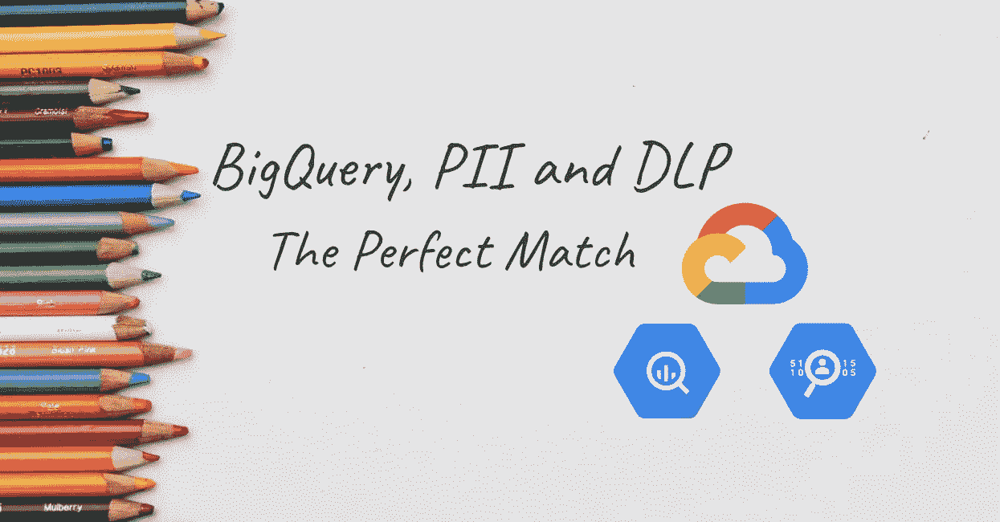
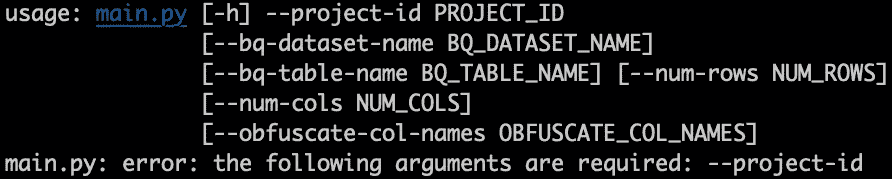
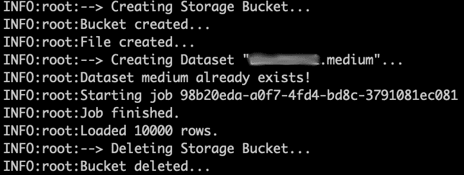
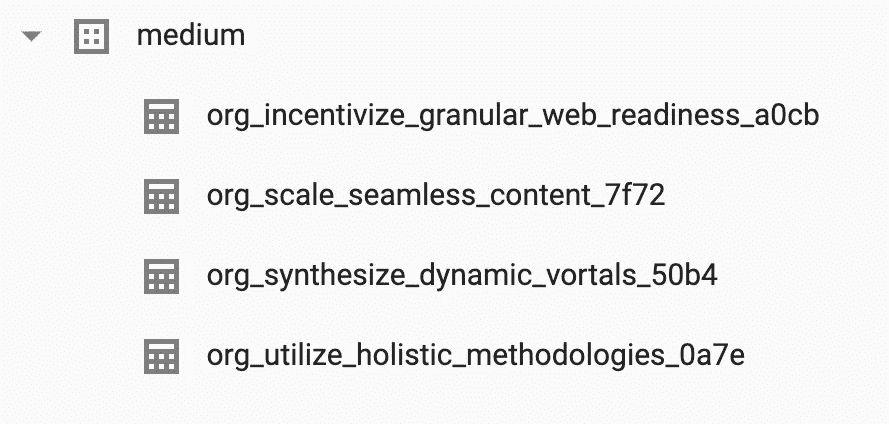
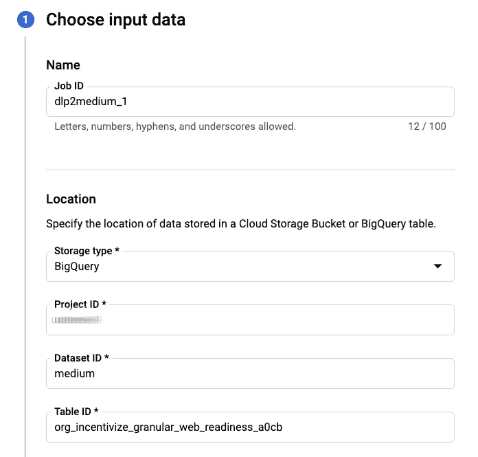
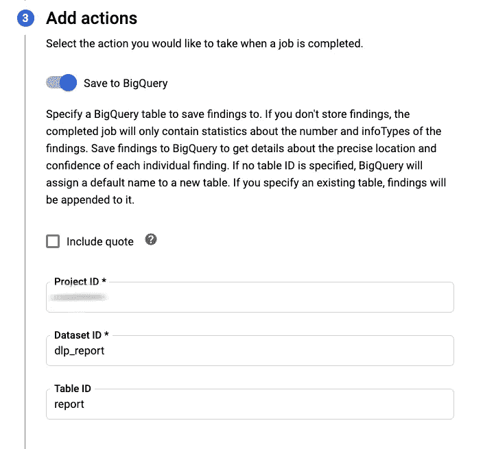
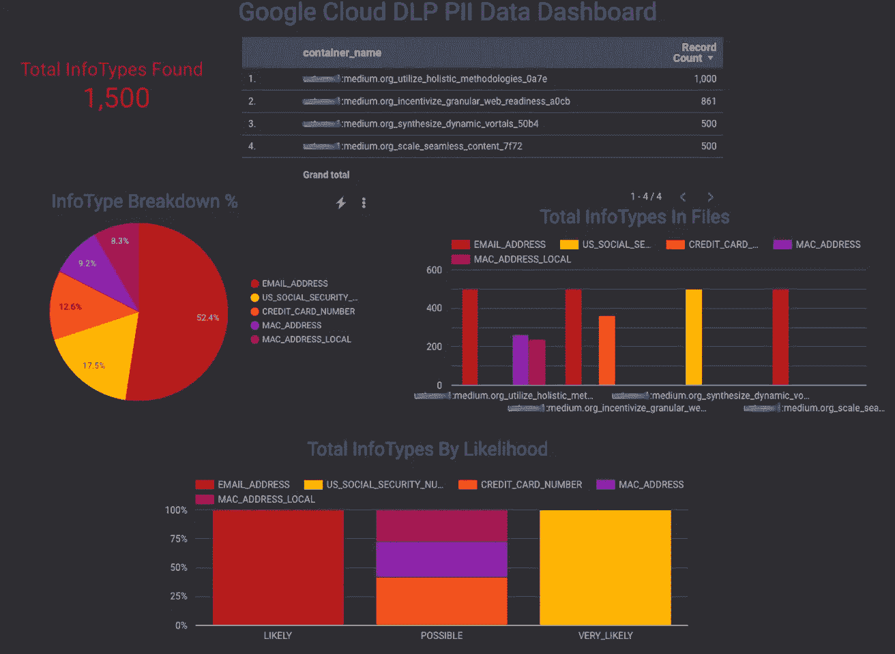
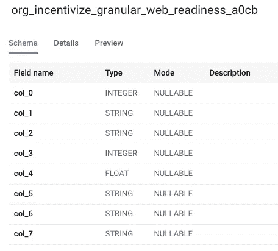
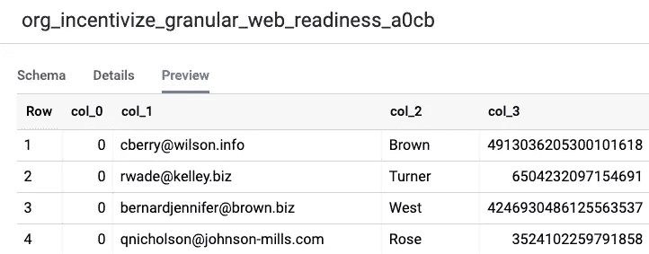
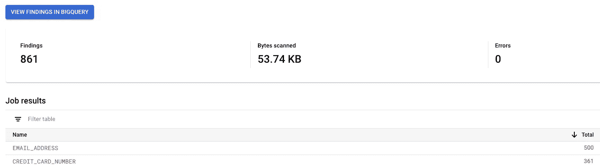

# BigQuery、PII 和 DLP:完美匹配

> 原文：<https://medium.com/google-cloud/bigquery-pii-and-dlp-the-perfect-match-f771bc81a5b7?source=collection_archive---------2----------------------->

## 如何在 BigQuery 中生成随机 PII，在上面运行 DLP 并在 DataStudio 上快速看到结果



背景由[凯丽·唐盖](https://unsplash.com/@kellitungay?utm_source=unsplash&utm_medium=referral&utm_content=creditCopyText)于 [Unsplash](https://unsplash.com/?utm_source=unsplash&utm_medium=referral&utm_content=creditCopyText)

如今，关于信息保护的法规如此之多，如 [CCPA](https://www.caprivacy.org/) 、 [GDPR](https://gdpr-info.eu/) 、 [HIPAA](https://www.hhs.gov/hipaa/index.html) ，而且还有许多新的法规即将出台，因此很难与随之而来的所有法规保持同步。我们不能再忽视它了，因此找到一种处理它的方法是必须的。

[Google Cloud Data Loss Prevention](https://cloud.google.com/dlp/)通过自动发现各处的敏感数据，帮助您了解这些法规的皮毛。

总的来说，数据丢失防护(DLP)是一个广泛的领域，具有许多出色的功能。我们不会在这里讨论 DLP 的细节，但是在其他地方可以找到大量关于它的优秀文献。我们要看的是`Google Cloud DLP`和`BigQuery`的整合。

> **免责声明:所有表达的观点仅代表我个人，不代表除我之外的任何人……**

# 将 PII 数据加载到 BigQuery

首先，我们需要将一些个人身份信息(PII)加载到 BigQuery 中。

为此，我开发了一个依赖于`Faker`库的 Python 脚本来生成随机 PII。

[](https://github.com/mesmacosta/bq-fake-pii-table-creator) [## mesmacosta/bq-fake-pii-table-creator

### 用假 pii 数据创建 BQ 表的库。创建此库的驱动力和用例是当您需要一个…

github.com](https://github.com/mesmacosta/bq-fake-pii-table-creator) 

> 该脚本是在 MIT 许可下授权的，所以可以随意获取并按照说明运行。顺便说一下，欢迎投稿！



命令行参数

这是一个命令行工具，允许用户选择要创建的列数和行数、BigQuery 数据集和表名。

让我们看看主要代码:

为了更好的可读性，隐藏了一些行

*   第 8 行:用提供的参数创建一个包含 PII 的熊猫数据帧；
*   第 12 行:从 DataFrame 表示创建一个 CSV 文件；
*   第 17 行:将 CSV 文件上传到一个临时存储桶；
*   第 22 行:如果 BigQuery 数据集不存在，则创建它；
*   第 23 行:创建一个 BigQuery 加载作业，将上传文件的内容发送到一个新表，并等待它完成；
*   第 24 行:清理临时存储桶；

## 执行脚本

```
# Command line execution
python main.py \
--project-id your_project \
--bq-dataset-name medium \
--num-cols 8 \
--num-rows 10000
```

我们将运行它 4 次，在同一个数据集中创建 4 个 BigQuery 表。如果没有提供`bq-table-name`参数，则使用随机生成的参数。



脚本执行日志

> 您还可以通过传递`obfuscate-col-names`参数来运行`bq-fake-pii-table-creator`脚本，通过利用该标志，我们将在后面看到 DLP 的重要性。



已创建 BigQuery 表

我们可以看到在`medium`数据集中有 4 个新表。

# 执行 DLP

通过转到 [DLP UI](https://console.cloud.google.com/security/dlp) ，我们将创建任务来检查这些表。



DLP UI —输入数据面板

在第一个面板上，我们指定检查的源，这将是新创建的表。



DLP UI —添加动作面板

然后我们指定一个动作，保存到 BigQuery，这样我们以后就可以很容易地在 DataStudio 上看到结果。

> 其他步骤被取消，因为保留了默认值。

最后，我们有 4 个作业，每个表一个，我们可以在[作业页面](https://console.cloud.google.com/security/dlp/landing/main/job)上跟踪结果。我们将等待所有作业进入`done` **状态。**


DLP 用户界面-作业页面

## 调查的结果

所有作业完成后，我们可以查看我们的 DataStudio 控制面板，并直观显示结果:



DataStudio DLP 调查结果仪表板

> 如果您想要克隆这个 DLP 仪表板，我使用了这篇[博客文章](/@zrs233/inspecting-and-reporting-sensitive-data-with-google-cloud-dlp-api-5ec27520c234)中的模板，它就像克隆并指向您的 BigQuery 数据集/表一样简单。你可以相信我，当我说，字面上需要 30 秒来设置它！=)

你还记得`obfuscate-col-names` 国旗*吗？*



包含虚假数据的 BigQuery 表、模式和预览选项卡

该标志创建了非人类可读的列名，使得检查该数据变得非常困难，DLP 自动在`col_1`和`col_3`上找到了`EMAIL_ADDRESS`和`CREDIT_CARD_NUMBER`类型，并且您可以看到并非所有的值都是信用卡号，您能想象手动完成吗？

> 在大型组织中，尤其是在拥有数据字典的情况下，面对非人类可读的列名并不难。



`org_incentivize_granular_web_readiness_a0cb`表的 DLP 结果

请记住，使用 DLP 时，您[要为检查的字节](https://cloud.google.com/dlp/pricing)付费，所以在大量使用 DLP 时，首先采取少量数据采样的策略。

# 结束语

在本文中，我们介绍了如何在 BigQuery 中生成随机 PII，并将其与 DLP 集成，使用户能够使用 Data Studio 快速分析他们的数据。敬请关注展示如何将其他系统与 DLP 集成的新帖子！感谢阅读。干杯！

# 参考

*   **BigQuery 山寨 PII 创作者**:【https://github.com/mesmacosta/bq-fake-pii-table-creator】T4
*   **DLP 官方文件**:[https://cloud.google.com/dlp](https://cloud.google.com/dlp)