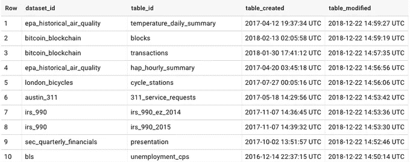
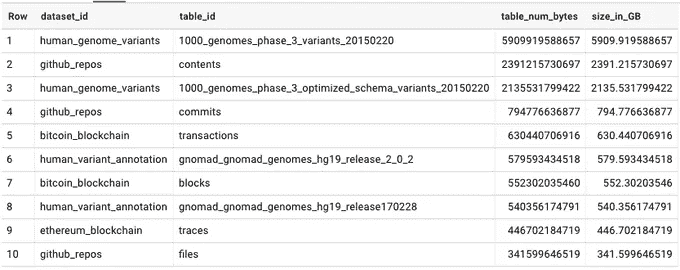
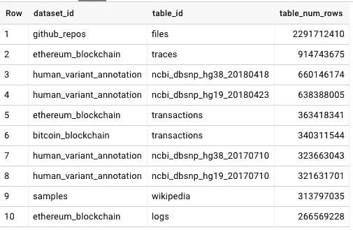

# BigQuery 公共数据集元数据

> 原文：<https://medium.com/google-cloud/bigquery-public-datasets-metadata-788c2c3897b2?source=collection_archive---------0----------------------->

我创建了公共 BigQuery 表，其中包含关于 BigQuery 公共数据集的元数据。众所周知，BigQuery 拥有包含不同性质和大小的数据的公共数据集。例如，有比特币和以太坊交易，来自世界银行的数据，关于专利的数据，各种(主要是美国)机构，如劳动或森林统计的 Bereau 等。由于它们是公开的，这意味着任何拥有谷歌云账户的人都可以查询它们，并且在消耗了 1TB 的免费月配额后，只需为查询的数据量付费。

公共数据集是完美的资源，如果:

-您刚开始使用 BigQuery，没有合适的数据来使用和尝试 BigQuery 功能

-您希望将公共数据集中的数据用于(严肃的)研究还是仅仅为了娱乐

关于 BigQuery 公共数据集的一些资源可以在这里找到:

[https://cloud.google.com/bigquery/public-data/](https://cloud.google.com/bigquery/public-data/)—如何从 BigQuery 和公共数据集开始的一般指南

https://www.reddit.com/r/bigquery/wiki/datasets—公共数据集列表及相关信息(来源)

【https://console.cloud.google.com/marketplace/browse? filter = solution-type:dataset—公共数据集和综合信息的列表，以及一些示例查询。

我写这篇文章的原因是，我正在查看至少每天更新的公共数据集表，但从这些可用的信息中我很难找到。当然，我尝试过在 BigQuery 中随机查看几个表来获取信息，但大多数都没有更新，手动完成需要很长时间。因为每个表都包含一些元数据，如大小、行数、创建/修改日期，所以我编写了简单的 Python 脚本来从公共数据集的表中提取信息，并将其全部放入一个表中。完整代码在 Github[https://Github . com/zde nulo/big query _ public _ datasets _ metadata](https://github.com/zdenulo/bigquery_public_datasets_metadata)上

获取数据的核心代码是这样的:

```
import datetime
import logging

from google.cloud import bigquery

from settings import *

projects = [
    'bigquery-public-data',
]

def get_bq_data():
    """Gets metadata from public BigQuery datasets"""
    data = []
    for project in projects:
        client = bigquery.Client(project=project)
        datasets = client.list_datasets()

        for dataset in datasets:
            dataset_id = dataset.dataset_id
            dataset_ref = client.get_dataset(dataset_id)
            tables = client.list_tables(dataset_id)
            for table in tables:
                full_table_id = table.full_table_id.replace(':', '.')
                table_ref = client.get_table(full_table_id)

                item = {'dataset_id': dataset_id,
                        'project_id': project,
                        'table_id': table_ref.table_id,
                        'dataset_description': dataset_ref.description,
                        'table_modified': table_ref.modified.strftime("%Y-%m-%d %H:%M:%S"),
                        'table_created': table_ref.created.strftime("%Y-%m-%d %H:%M:%S"),
                        'table_description': table_ref.description,
                        'table_num_bytes': table_ref.num_bytes,
                        'table_num_rows': table_ref.num_rows,
                        'table_partitioning_type': table_ref.partitioning_type,
                        'table_type': table_ref.table_type,
                        }
                data.append(item)
    return data
```

因为除了“bigquery-public-data”之外，还有其他 GCP 项目也有公共数据，所以我将遍历项目，然后是数据集，最后是表。当 BigQuery 数据集被公开时，属于该数据集的所有表都是公开的。我正在把信息编入词典。我将在其他文章中描述整个过程。

我的包含带元数据的表的公共数据集在这里:[https://console.cloud.google.com/bigquery?p = GCP 上的冒险&d = big query _ public _ datasets&page = dataset](https://console.cloud.google.com/bigquery?p=adventures-on-gcp&d=bigquery_public_datasets&page=dataset)

有了这些数据，您可以获得一些关于数据集的基本有用信息:

## 获取最新更新的表格

```
SELECT dataset_id, table_id, table_created, table_modified  
FROM `adventures-on-gcp.bigquery_public_datasets.bq_public_metadata`
ORDER BY table_modified DESC
```



## 今天更新的表格

```
SELECT dataset_id, table_id, table_created, table_modified 
FROM `adventures-on-gcp.bigquery_public_datasets.bq_public_metadata`
WHERE CAST(table_modified AS DATE) = CURRENT_DATE()
ORDER BY table_modified DESC
```

今天更新了 1499 个表中的 108 个

## 最大尺寸的桌子

```
SELECT dataset_id, table_id, table_num_bytes,
table_num_bytes / 1000000000 AS size_in_GB
FROM `adventures-on-gcp.bigquery_public_datasets.bq_public_metadata`
ORDER BY table_num_bytes DESC
LIMIT 10
```



## 行数最多的表格

```
SELECT dataset_id, table_id, table_num_rows 
FROM `adventures-on-gcp.bigquery_public_datasets.bq_public_metadata`
ORDER BY table_num_rows DESC
LIMIT 10
```



整个管道是无服务器处理的一个很好的例子，由云调度程序的发布/订阅触发的云功能组成(目前每 4 小时一次)。在云函数中，数据从 BigQuery 中获取，然后以 JSON 格式存储在 Google 云存储中的文件中，最后加载到 BigQuery 中。表格内容每次都会被覆盖。

希望这将为您提供更多关于 BigQuery 公共数据集的见解和信息。