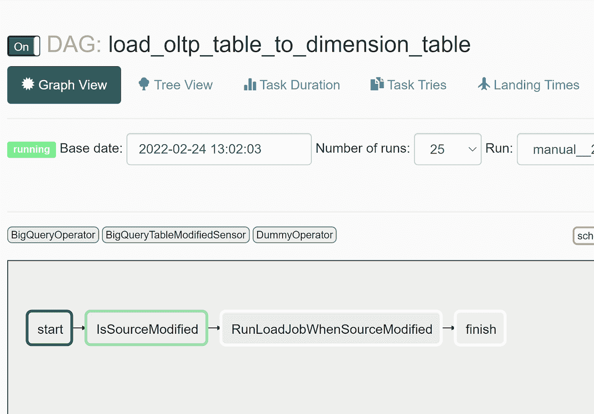
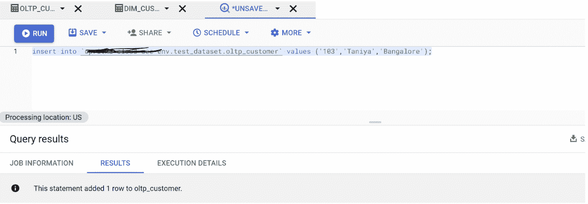
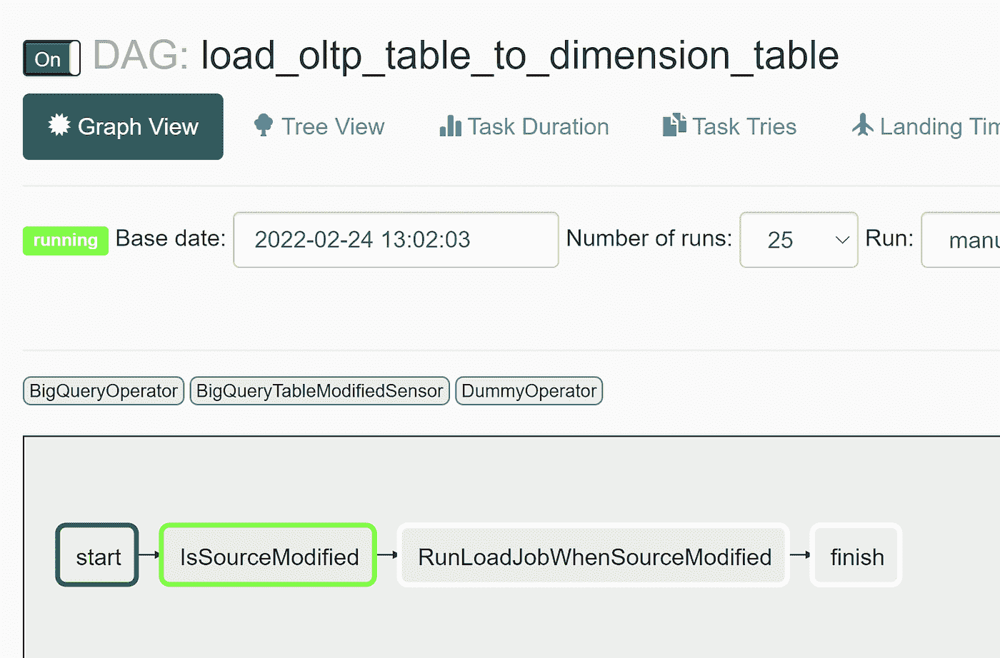
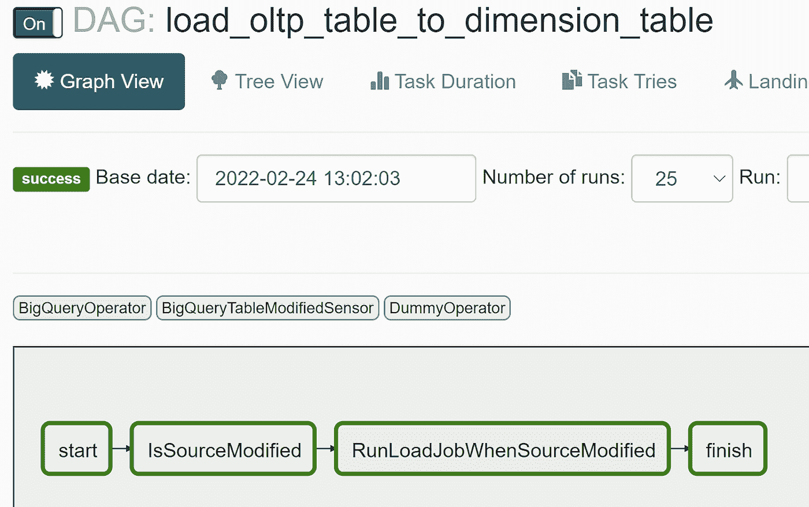

# Composer/用户定义的传感器实现中的 BigQuery 传感器

> 原文：<https://medium.com/google-cloud/bigquery-sensor-in-composer-b526c9a91c26?source=collection_archive---------1----------------------->

想要在源数据库刷新和目标数据库加载作业之间创建依赖关系吗？

想让 OLAP 加载作业一直等到源 OLTP 系统更新吗？继续下去，看看这个教程。


**准备:**可重用性、博客、社区贡献

**假设**

本教程假设您熟悉:

*   Composer，BigQuery，Python

# 示例使用案例:

只有在指定的时间范围(可修改)内更新源表时，才应该执行一些下游任务。

源项目限制了元数据查看器权限，它可以通过 API 调用，但是它们限制了通过 Information_schema 查询元数据。

议程是通过 bigquery API 检查表的 lastmodifiedtime，如果表没有在指定的范围内更新，则重新调度 DAG。

poke 方法将在上述时间间隔后重试，并在源表更新时自动执行下一个任务。

不需要人工干预。

不需要在固定的时间间隔安排 DAG 来检查这一点。

**场景:**有一个 OLTP 源表‘OLTP _ customer’。有一个 OLAP 目标表 dim_customer。只有当源表在这一小时内被修改时，下一个从源表加载维度表的任务才会执行。在修改源表之前，任务将继续被重新调度。

天空颜色表示重新计划的状态。每当更新源表时，DAG 都会自动开始运行以下任务并完成该过程

# **解决方案:**

## 介绍

气流传感器允许您检查是否满足完成标准。

Bigquery Sensor 可以作为气流插件创建，并可以作为 python 模块导入到气流 DAG 中。

该解决方案基于一个基于 BigQuery 客户端的用户自定义传感器。

Airflow 有一个简单的内置插件管理器，可以通过简单地将文件放入$AIRFLOW_HOME/plugins 文件夹中，将外部功能集成到其核心中。

插件文件夹中的 python 模块被导入，宏和 web 视图被集成到 Airflow 的主集合中，可供使用。

## 建筑/设计:

**步骤 1:** 当源表在最后一个小时没有被修改时。DAG 已启动，它检查到源表未更新，因此它重新计划了 DAG。任务 IsModifiedSource 是天空颜色，这意味着它处于重新计划状态。



**第二步:**修改源表。插入一条记录



**步骤 3:** 重新调度的任务“IsSourceModified”开始运行，传感器脚本在每个 poke_interval 之后检查表修改时间，只要与当前小时相匹配，就执行该任务



**步骤 4:**DAG 完成，维度表从 oltp 源表加载



## 使用气流传感器的好处:

传感器是一个操作员**在一段时间间隔内评估是否符合标准/条件。**如果是，则成功，否则重试，直到超时。

气流会带来不同的传感器，以下是最常用的一些传感器:

*   *文件传感器*:等待文件或文件夹进入文件系统。
*   *s3key sensor*:等待一把钥匙出现在 S3 桶里。
*   SqlSensor :重复运行一条 sql 语句，直到满足一个标准。
*   HivePartitionSensor :等待一个分区出现在 Hive 中。
*   *ExternalTaskSensor*:等待不同 DAG 或不同 DAG 中的任务在特定执行日期完成。(挺有用的那个🤓)
*   *datetime sensor*:等待指定的日期时间(用于为您的 Dag 添加一些延迟)

## 根据业务逻辑创建用户定义传感器，即 BigQuery 传感器:

我们还可以根据我们的业务逻辑创建定制的传感器。

该资产基于用户定义的传感器，该传感器基于 BigQuery 客户端表 ModifiedTime。我们可以在多个 Dag 中重用同一个传感器来检查这些先决条件。此外，通过使用该脚本作为模板，我们可以轻松创建具有不同业务逻辑的不同 BigQuery 传感器。

*   这个例子包括如何从 BigQuery API 访问元数据信息
*   该示例还包括使用 Google Secret Manager 来保护服务帐户凭证。

## 脚本:

**1)bigquerytablemodified sensor . py**


```
"""This module contains a Google Bigquery SQL sensor."""
from typing import Optional, Sequence, Union
from airflow.hooks import BaseHook
from airflow.sensors import BaseSensorOperator
from airflow.exceptions import AirflowException
import datetime
from google.cloud import bigquery
from google.oauth2 import service_account
from google.cloud import secretmanager
import pendulum
import logging
import json
class BigQueryTableModifiedSensor(BaseSensorOperator):
"""
Checks for the True or False output in Google Bigquery Query Job output.
:param sql: The query to return True or False as Final output
:type sql: str
:param use_legacy_sql: Option to run legacy SQL
:type use_legacy_sql: Boolean
:param bigquery_conn_id: The connection ID to use when connecting to
Google BigQuery.
:type bigquery_conn_id: str
"""
template_fields = (
'sql',
'use_legacy_sql',
'bigquery_conn_id',
'full_table_identifier',
'secret_manager_project_name',
'secret_name'
)
ui_color = '#f0eee2'
# accept table identifiers from main DAG
def __init__(self,*,bigquery_conn_id: str = 'google_cloud_default',
use_legacy_sql: bool = False,sql: str = None,full_table_identifier,secret_manager_project_name,secret_name,**kwargs) -> None:
super().__init__(**kwargs)
self.bigquery_conn_id = bigquery_conn_id
self.sql = None
self.use_legacy_sql = use_legacy_sql
self.full_table_identifier=full_table_identifier
self.secret_manager_project_name=secret_manager_project_name
self.secret_name=secret_name
def access_secret_version(self,project_id, secret_id, version_id):
# Create the Secret Manager client.
client = secretmanager.SecretManagerServiceClient()
# Build the resource name of the secret version.
name = f"projects/{project_id}/secrets/{secret_id}/versions/{version_id}"
logging.info(name)
logging.info("inside get_table_modified before accessing")
# Access the secret version.
response = client.access_secret_version(name)
payload = response.payload.data.decode("UTF-8")
#logging.info(payload)
return payload
def poke(self,context: dict) -> bool:
full_table_identifier=self.full_table_identifier
secret_manager_project_name=self.secret_manager_project_name
secret_name=self.secret_name
key_content=self.access_secret_version(secret_manager_project_name,
secret_name,"1")
service_account_info = json.loads(key_content,strict=False)
logging.info("returned from gsm function")
logging.info(service_account_info)
credentials=
service_account.Credentials.from_service_account_info(service_account_info)
client = bigquery.Client(credentials=credentials,project=credentials.project_id)
table = client.get_table(full_table_identifier)
logging.info(table.modified)
logging.info(table.modified.date())
logging.info(table.modified.hour)
if table.modified.hour == datetime.datetime.now().hour:
logging.info("IsModifiedThisHour TRUE")
else:
logging.info("IsModifiedThisHour False")
return table.modified.hour == datetime.datetime.now().hour
```

**2)样本 DAG 使用气流插件作为用户定义的传感器**


```
from sensors.BigQueryTableModifiedSensor import BigQueryTableModifiedSensor
import os
import json
import datetime
import airflow
from airflow import DAG
from airflow import models
from airflow.models import Variable
from airflow.operators import DummyOperator
from airflow.operators import BashOperator
from airflow.contrib.operators import bigquery_to_bigquery
from airflow.contrib.operators import bigquery_to_gcs
from airflow.contrib.operators import gcs_to_bq
from airflow.contrib.operators import bigquery_operator
from airflow.providers.google.cloud.operators.bigquery import BigQueryExecuteQueryOperator
import datetime
from google.cloud import bigquery
from google.oauth2 import service_account
from google.cloud import secretmanager
import pendulum
import logging
import re
from airflow.contrib.operators.bigquery_operator import BigQueryOperator
from airflow.providers.google.cloud.operators.bigquery import BigQueryInsertJobOperator
from airflow.contrib.operators.gcs_list_operator import GoogleCloudStorageListOperator
from airflow.contrib.operators.gcs_to_gcs import GoogleCloudStorageToGoogleCloudStorageOperator
from google.cloud import storage
from airflow.providers.google.cloud.operators.bigquery import BigQueryExecuteQueryOperator
from airflow.operators import DummyOperator
from airflow.operators.python_operator import PythonOperator
logger = logging.getLogger("airflow.task")
local_tz = pendulum.timezone("Europe/Amsterdam")
secret_manager_project_name=Variable.get('secret_manager_project')
secret_name=Variable.get('secret_name')
project_name=Variable.get('project_name')
dataset_name=Variable.get('dataset_name')
source_table_name=Variable.get('source_table_name')
full_table_identifier=project_name+'.'+dataset_name+'.'+source_table_name
target_table_name=Variable.get('target_table_name')
#Default args for the DAG execution
default_args = {
'email_on_failure': True,
'email_on_retry': False
}
#DAG initialization
#DAG initialization
with airflow.DAG(
'load_oltp_table_to_dimension_table',
start_date=datetime.datetime(2021, 1, 1),
schedule_interval=None) as dag:
logging.info("inside DAG")
start = DummyOperator(
task_id='start',
dag=dag)
finish = DummyOperator(
task_id='finish',
dag=dag)
check_precondition = BigQueryTableModifiedSensor(
task_id ='IsSourceModified',
bigquery_conn_id = 'bigquery_default',
use_legacy_sql = False,
sql = None,
full_table_identifier=full_table_identifier,
secret_manager_project_name=secret_manager_project_name,
secret_name=secret_name,
poke_interval = 60,
timeout = 3600,
mode = 'reschedule',
dag=dag
)
run_new_job = BigQueryOperator(
task_id='RunLoadJobWhenSourceModified',
sql='insert into `'+project_name+'.'+dataset_name+'.'+target_table_name+'` select generate_uuid(),c.customer_id,c.customer_name,c.customer_city,current_timestamp(),null,"Yes" from `'+project_name+'.'+dataset_name+'.'+source_table_name+'` c;',
use_legacy_sql=False,
bigquery_conn_id='bigquery_default',
dag=dag)
start>>check_precondition>>run_new_job>>finish
```

# 传感器脚本的解释:

所有传感器都继承自 BaseSensorOperator，并具有以下参数:

*   模式:传感器如何工作。有两种模式:
*   戳:这是默认模式。使用 poke 时，传感器会在整个执行时间内占用一个工作插槽，并在两次 poke 之间休眠。
*   重新安排:如果不符合标准，传感器将释放其工作插槽，并重新安排下次检查时间。
*   poke_interval:使用 poke 模式时，这是传感器在再次检查条件之前等待的时间(秒)。默认值为 30 秒。
*   超时:传感器检查状况的最长时间(秒)。如果达到该时间时还没有满足条件，则任务失败。

根据给定的业务逻辑，可以在传感器类的 __init__ 方法中传递可变数量的参数。

然后，可以从任何 DAG 调用传感器来检查是否满足前提条件。

```
check_precondition = BigQueryTableModifiedSensor(
task_id ='IsSourceModified',
bigquery_conn_id = 'bigquery_default',
use_legacy_sql = False,
sql = None,
full_table_identifier=full_table_identifier,
secret_manager_project_name=secret_manager_project_name,
secret_name=secret_name, - - - Only needed if you use Google Secret Manager
poke_interval = 60,
timeout = 3600,
mode = 'reschedule',
dag=dag
)
```

# 如何在 DAG 中使用 BigQuery 传感器脚本

使用第一个脚本 bigquerytablemodifiedssensor . py 创建传感器。

根据业务逻辑修改脚本。

将脚本文件放在气流环境的以下路径中

气流-环境-桶/插件/传感器/bigquerytablemodified sensor**。** py


将 BigQueryTableModifiedSensor 模块导入到您想要使用它的 DAG 中。