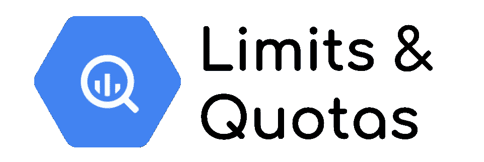
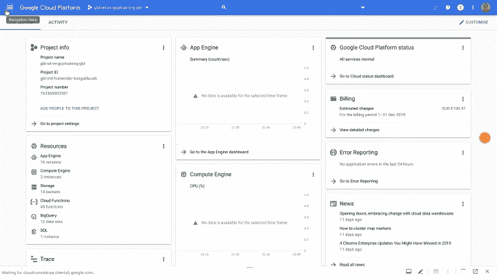
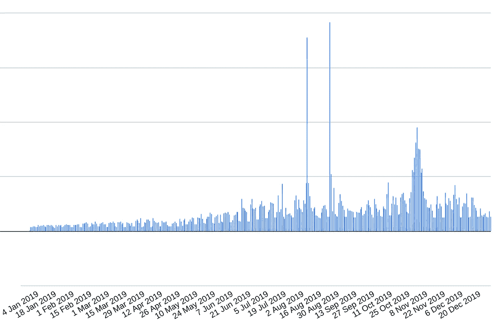
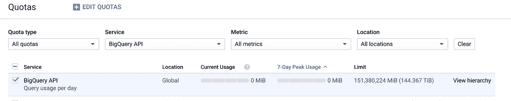

# BigQuery:通过 API 设置限制和自定义配额

> 原文：<https://medium.com/google-cloud/bigquery-set-up-limits-and-custom-quotas-through-api-629f77438b7e?source=collection_archive---------1----------------------->



BigQuery 是 Google 云平台上的**Pb 级数据仓库**。您可以自由轻松地加载大量数据，存储成本非常实惠，90 天后自动切换到冷存储。

当您使用**按需定价时，成本基于查询在查询中扫描的数据量** [(对于更便宜的位置，每 TB 大约 5 美元)](https://cloud.google.com/bigquery/pricing#on_demand_pricing)。当**您拥有太字节或太字节时，它会变得非常昂贵**！

# 成本优化

为了优化数据组织并减少扫描的数据量，**您可以对任何字段** 上的数据进行聚类和/或 [**分区。您还可以在查询的`where`子句中**](/google-cloud/partition-on-any-field-with-bigquery-840f8aa1aaab?source=---------2------------------) **[**要求分区过滤器**](https://cloud.google.com/bigquery/docs/managing-partitioned-tables#require-filter) 。目标是迫使请求者询问自己关于扫描的数据以优化查询。**

然而，**没有任何东西强迫请求者聪明地使用分区字段**或**防止对它的不良使用**。因此，在每个请求中要求分区字段可能是无用的，并且仍然可以扫描整个数据。

# 扫描数据量的自定义配额

为了防止由于缺少分区或分区使用不当而扫描大量数据，Google 允许**为每个用户或每个项目设置** [**自定义数据** **扫描量**。太平洋时间每天午夜，配额重置为 0。](https://cloud.google.com/bigquery/docs/custom-quotas)

设定配额很容易

*   转到[配额页面](https://console.cloud.google.com/iam-admin/quotas)
*   仅选择 BigQuery 服务
*   寻找`Query usage per day per user`或`Query usage per day`并选择它*(点击线路)*
*   点击`Edit Quotas`
*   在右侧设置极限，验证并`Submit`



使用控制台设置自定义配额

> 每台主机都很完美，但如何大规模实现呢？

# 自动化配额限制

我的公司是全球性的(50 多个国家)，有数千个 GCP 项目(3k+)和 BigQuery 表(100k+)，数百个子公司，以及许多不同的内部和外部 IT 团队和数据科学家。与我在总部的同事一起，我们为**培训做了很多工作，帮助和协助用户防止错误和意外成本**。但这还不够。



2019 年 BigQuery 成本

因此，我们决定对所有开发和测试项目设置一个限制，对于生产，只有当负责项目的团队提出要求时才这样做。为此，**我们想要使用** [**服务管理 API**](https://cloud.google.com/service-infrastructure/docs/service-management/reference/rest/) 并且我们尝试了所有记录的端点… **不可能通过 API 更新配额！！**

> 如何更新成千上万的项目？以及如何将这一点自动应用到新的上？

# 未记录的 API 用法

陷入了一个死胡同，我试图理解**API 如何在控制台**中工作，这要感谢 Chrome 的开发者模式，并且**我找到了一个变通办法。**

***重要提示*** *:以下解释未经谷歌文档化，可随时更改或被屏蔽，恕不另行通知。* ***慎用。***

## API 原则

要调用这个 API，请使用这个 URL。*用自己的项目 ID 替换* `*PROJECT_ID*` *。*

```
[https://servicemanagement.googleapis.com/v1/s](https://servicemanagement.googleapis.com/v1/s)ervices/[bigquery-json.googleapis.com/projectSettings/PROJECT_ID?updateMask=quotaSettings.consumerOverrides%5B%22QueryUsagePerDay%22%5D](http://bigquery-json.googleapis.com/projectSettings/gbl-imt-homerider-basguillaueb?updateMask=quotaSettings.consumerOverrides%5B%22QueryUsagePerDay%22%5D&alt=json)
```

*如果您想设置每个用户而不是每个项目的限制*，请用 `*QueryUsagePerUserPerDay*` *替换值* `*QueryUsagePerDay*`

***API 是安全的**，您必须在请求中提供 HTTP 承载访问令牌。调用**使用 HTTP 动词** `**PATCH**`并且您必须呈现`**application/json**` **内容类型主体**。*

*限制以 MB 为单位。在这里，主体将该项目的限制设置为每天 150Tb。*用自己的项目 ID 替换* `*PROJECT_ID*` *。**

```
*{
  "quotaSettings": 
  {
    "adminOverrides":{},
    "consumerOverrides":
    {
      "QueryUsagePerDay":   
      {
        "limit":"151380224"
      }
    },
    "force":true
  },
  "consumerProjectId":"PROJECT_ID",
  "serviceName":"[bigquery-json.googleapis.com](http://bigquery-json.googleapis.com/)"
}*
```

**如果您想设置每个用户而不是每个项目的限制*，请将值 `*QueryUsagePerDay*` *替换为* `*QueryUsagePerUserPerDay*`*

## **把它们放在一起**

**为了试验这个 API，使用`curl`进行调用。创建一个文件名为`data`、内容为前一个主体的文件。然后，运行这个命令(例如在 Cloud Shell 上)。*用自己的项目 ID 替换* `*PROJECT_ID*` *。***

```
**curl -d @data \
  -H "content-type: application/json" \
  -H "Authorization: Bearer $(gcloud auth print-access-token)" \
  -X PATCH \
  "[https://servicemanagement.googleapis.com/v1/s](https://servicemanagement.googleapis.com/v1/s)ervices/[bigquery-json.googleapis.com/projectSettings/PROJECT_ID?updateMask=quotaSettings.consumerOverrides%5B%22QueryUsagePerDay%22%5D](http://bigquery-json.googleapis.com/projectSettings/gbl-imt-homerider-basguillaueb?updateMask=quotaSettings.consumerOverrides%5B%22QueryUsagePerDay%22%5D&alt=json)"**
```

**答案是操作的 ID**

```
**{
  "name": "operations/tmo-quf.9d6e6e04-28fd-4147-8fee-dea59764b5d0"
}**
```

**检查控制台**

****

****太好了，**那个**管用**！**

# **小心使用**

**现在，**您可以编写这个配额 API** 的脚本，并将它包含在您所有的自动化项目创建中，并执行您现有项目的更新。**

**然而，**请记住，这是一种黑客行为，这种解决方案的可行性没有保证**。**