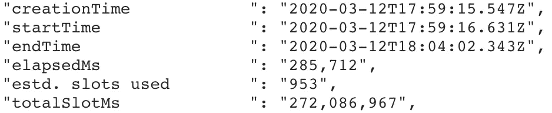
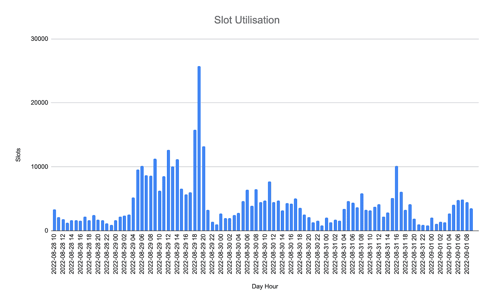
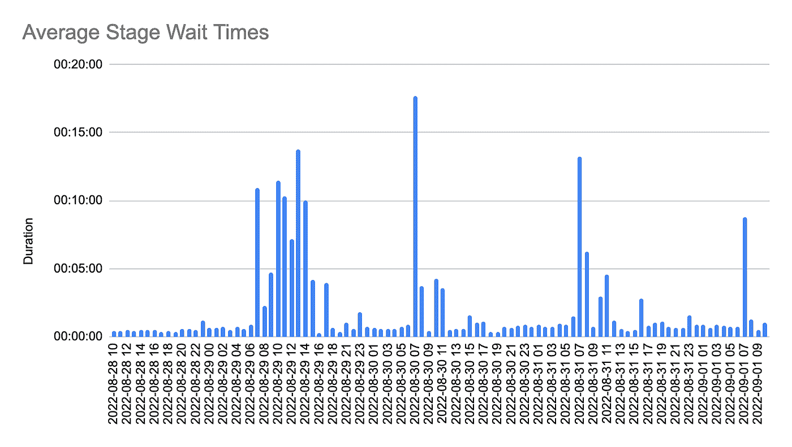

# 大查询插槽挤压

> 原文：<https://medium.com/google-cloud/bigquery-slot-squeezes-896d9e0f2fc?source=collection_archive---------1----------------------->

Bigquery (BQ)是一个无服务器的大型分析数据库服务。这项服务允许您查询任何东西，从非常小的数据集到 Pb 大小的数据集。在后台，BigQuery 将自动分配计算、内存和 shuffle 容量来服务您的查询请求。其核心是一个**插槽**的概念。时段是一个混合指标，它将这些不同的资源组合成一个统一的消耗值。

当您运行查询并查看查询执行细节时，您会看到一个名为`slotMs`的指标。这是指示您的查询消耗了多少资源的指标。

BigQuery 查询计划的统计信息部分

Bigquery 有两种定价模式，**按需**和**统一费率**。**按需**意味着您的项目有有限的插槽数量，并且您为处理的字节付费。**统一费率**意味着您购买并支付每月的插槽分配，但不支付处理的字节数。通常，前者适用于少量的偶然使用，而后者适用于具有持续、大量需求的企业环境。

企业环境中的一个问题是您应该购买多少个插槽。买太多，你会有很长一段时间不用它们。购买太少，用户将在高峰时间经历延迟。

因此，您有兴趣确定您在一天/一周/一个月中使用了多少时段，以获得您的需求概况，然后确定固定费率时段的基本购买量以及动态弹性时段购买量，以覆盖高峰期。

最简单的方法是查询您的系统表，使用`Informationschema. jobs_timeline`表提取作业时间线的所有 slot MS 值并求和。

并绘制一天(一周/一个月)的摘要:

这将向您显示实际的插槽消耗量，您将能够看到您何时消耗了您购买的插槽的容量。

但是这些信息是有限的。您知道在一天中的什么时候您最大限度地利用了您购买的插槽容量，但是您不知道这对您的用户有多严重的影响。

> **BQ 时隙分配如何影响性能**
> 
> 查询并不总是需要槽，它可能在查询执行过程中时好时坏。Bigquery 试图根据查询的需求以公平的方式为查询分配槽。当一个查询的槽需求下降时，槽会根据需求在所有其他查询之间重新分配。这是一个非常动态的过程，时隙分配可以在几秒钟内改变。

当查询需要的槽多于可用的槽时，工作就会堆积起来，等待资源变得可用——简而言之，查询会花费更长的时间。

您可以通过查看您的查询执行计划来了解这一点(例如，使用[https://bqvisualiser.appspot.com](https://bqvisualiser.appspot.com))。每个阶段都有许多关于绩效的指标。这里感兴趣的是称为 **avg_wait_ms** 的指标，它是一个阶段的工作负载花费在等待上的平均时间，以毫秒为单位。

> **另一个有趣的指标:avg _ compute _ ms vs max _ compute _ ms**
> 
> avg_compute_ms 在所有工作负载中查找一个阶段以确定完成时间，而 max_compute_ms 则查看最大值。通常最大值不应与平均值相差太大。但是在某些情况下，这些会有很大的不同。
> 
> 当要处理的数据碎片大小不同时，通常会出现这种情况。如果您对数据进行分组和聚合，不均衡的分组键分布会导致这种情况。如果您遇到这种情况，请查看您的数据并考虑构建您的查询以避免这种情况。

上述指标告诉我们，当我们用完插槽时。有了这些知识，我们现在可以构建一个度量标准，告诉我们由此产生的槽挤压有多严重:

这里我们计算几个阶段等待时间的指标。作为一个通用指标，指标`wait_avg`很好地突出了槽挤压的影响。

该图现在清楚地显示了从 8 月 29 日上午 6 点到下午 2 点的一段时间，在这段时间里，主要阶段必须等待 10 分钟以上——这意味着主要查询至少比平时多花了 btw10 分钟。

从业务角度来看，用户能承受在此期间等待查询完成的代价吗？如果没有，那么在此期间购买弹性时段可能会减少等待时间。