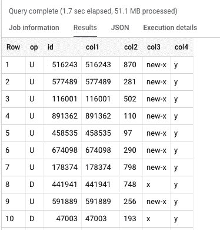

# BigQuery 表比较

> 原文：<https://medium.com/google-cloud/bigquery-table-comparison-cea802a3c64d?source=collection_archive---------0----------------------->

# 介绍

有时需要比较两个 BigQuery 表中的数据。您可能希望这样做(逐行匹配整行)，有时通过键进行比较。这比你想象的要容易得多！

# 抽样资料

注意:您需要这个 SQL 的**事务**数据集。

创建一个包含一百万行的 left_table。这将包含用于比较的基表。

```
CREATE OR REPLACE TABLE `transactions.left_table` AS
SELECT
  r AS id,
  CAST(r AS STRING) AS col1,
  CAST(FLOOR(RAND() * 1000) AS STRING) AS col2,
  'x' AS col3,
  'y' AS col4
FROM
  UNNEST(GENERATE_ARRAY(1, 1000000)) r;
```

用几乎相同的数据创建一个 right_table，但是有一些删除、更新和插入。有一个概率用于删除和更新，而 100 行只是简单地插入。

```
CREATE OR REPLACE TABLE `transactions.right_table` AS
WITH
  DataChanges AS (
    SELECT
      * EXCEPT (col3, col4),
      IF(RAND() < 0.001, 'new-x', col3) AS col3,
      col4
    FROM
      `transactions.left_table`
    WHERE
      RAND() > 0.001
  ),
  NewData AS (
    SELECT
      r AS id,
      CAST(r AS STRING) AS col1,
      CAST(FLOOR(RAND() * 1000) AS STRING) AS col2,
      'x' AS col3,
      'y' AS col4
    FROM
      UNNEST(GENERATE_ARRAY(1000000, 1000100)) r
  )
SELECT * FROM DataChanges
UNION ALL
SELECT * FROM NewData;
```

# 全表比较

整个表比较将在每行生成一个 FARM_FINGERPRINT。这将允许我们在这个散列上做一个完整的外部连接，并查看有哪些值存在于一端而不存在于另一端。

请注意，如果没有键，我们就无法判断一行是否已被更新。

```
WITH
  LeftData AS (
    SELECT
      a AS data,
      FARM_FINGERPRINT(FORMAT("%T", a)) AS h
    FROM
      `transactions.left_table` AS a
  ),
  RightData AS (
    SELECT
      b AS data,
      FARM_FINGERPRINT(FORMAT("%T", b)) AS h
    FROM
      `transactions.right_table` AS b
  )
SELECT
  IF(l.h IS NULL,"New on right","New on left") AS Change,
  IF(l.h IS NULL,r.data,l.data).*
FROM
  LeftData l
  FULL OUTER JOIN RightData r
  ON l.h = r.h
WHERE
  l.h IS NULL OR
  r.h IS NULL
```

上面的代码可以修改，这样它就可以用 GROUP BY 对行进行计数，而不是列出行。

# 逐键比较

我们希望逐行比较，而不只是比较整个表。所以我们将使用这个键来确定它是插入、更新还是删除。

```
SELECT
  CASE
    WHEN a.id IS NULL AND b.id IS NOT NULL THEN "I"
    WHEN a.id IS NOT NULL AND b.id IS NULL THEN "D"
    ELSE "U"
  END AS op,
  IF(b.id IS NULL, a, b).*
FROM
  `transactions.left_table` a
  FULL OUTER JOIN `transactions.right_table` b
  ON a.id = b.id
WHERE
  a.id IS NULL OR
  b.id IS NULL OR
  FARM_FINGERPRINT(FORMAT("%T", a)) <>
  FARM_FINGERPRINT(FORMAT("%T", b));
```

这将在 left_table 和 right_table 之间生成类似于更改数据捕获的日志。下面是运行这个的输出示例。



# 结论

BigQuery 可用于创建测试用例，验证您的数据，从快照生成 CDC 日志相当容易。这可以在没有显式的逐列比较的情况下完成。

*感谢* [*薄哈*](http://www.medium.com/@thinhha) *的比较查询。*