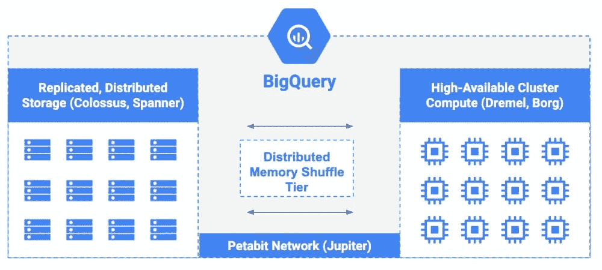
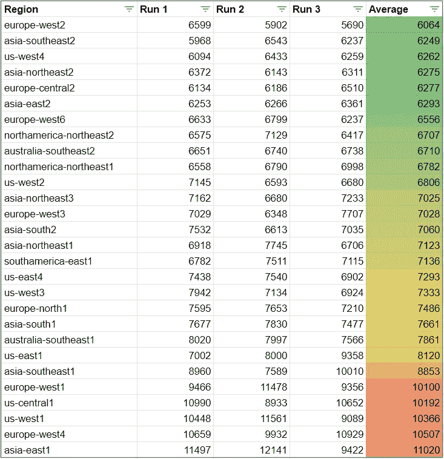
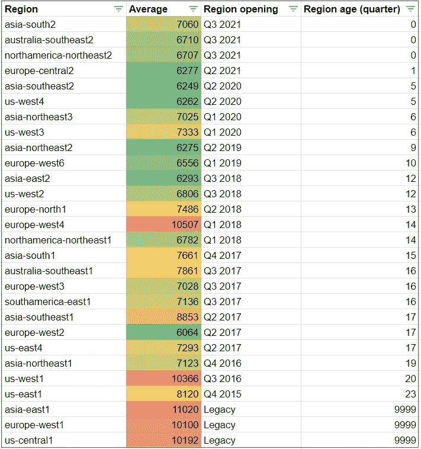
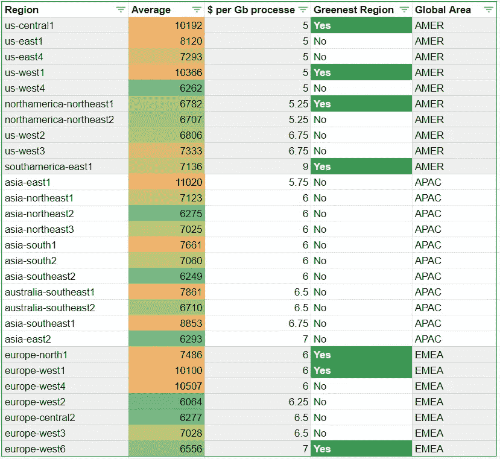

# 告诉我你的地区，我会告诉你你的速度！

> 原文：<https://medium.com/google-cloud/bigquery-tell-me-your-region-i-will-tell-you-your-speed-41dcf42b8cc?source=collection_archive---------0----------------------->

Google Cloud 作为任何云提供商，**都需要拓展**，**开辟新区域**(查看维基百科上的[历史)。今天，28 个地区已经启动并运行，任何 6 个地区都将启动。](https://en.wikipedia.org/wiki/Google_Cloud_Platform#Regions_and_zones)

新的数据中心**意味着新的硬件安装**和配置。然后，**硬件继续存在一段时间**，直到它被替换(过时)。
我的疑惑来了:

> 新区域部署了最新的硬件，旧区域部署了旧硬件。
> 
> 那么，所有地区的表现都一样吗？

尤其是当您不选择底层硬件时，例如无服务器产品。**用 BigQuery 测试一下吧！**

# 存储和处理分离

BigQuery 设计**将存储与处理**分开。处理单元叫做**“插槽”，是 CPU 和内存的一个切片。**

这里的目标是**测试插槽性能，而不是存储**吞吐量。

# 特性试验

为此，我选择**查询不到 10 Mb 的**(100 万个只有数字的行)，并选择**对每行的每个数字执行计算密集型数学运算** (cos、sin、tan、log、square、exp……)。

这个测试将在不同的数据集中部署相同的数据，每个区域一个，并运行相同的查询。最后，获取每个区域的查询持续时间并记录下来。

*你可以在我的* [*GitHub 资源库*](https://github.com/guillaumeblaquiere/serverless-perf-test/tree/main/bigquery) 中用代码自己找到并复制板凳

# 绩效结果

我在相同的数据上运行了 3 次查询，得到了如下所示的结果。
我在最新一列中添加了**平均加工时间，我将结果从最快到最慢的区域排序。*(持续时间单位为毫秒)***

如你所见，**有些地区比最快的地区慢 80%！**

# 性能和地区年龄

我的假设是**较老的地区有较老的硬件**(比最近的几代 CPU 落后几代)。让我们**添加区域开放信息。**
*此表提到了开馆日期，已知时间，以及从现在开始的年龄(2021 年第三季度)。按年龄排序*

*我注意到了* `*Legacy*` *我没有找到发布日期的地区。*

显然，数据中心的年龄和查询性能之间存在**相关性。**

> 越老越慢！

这个“规则”有两个例外**:**

*   **欧洲西部 2(伦敦)，于 2017 年在 Q2 开幕，并获得性能测试的最高成绩。
    *这样好的表现可以解释是因为*[****2018 年 Q4****](https://cloud.google.com/bigquery/docs/release-notes#October_10_2018)*在这个地区增加了 BigQuery***
*   ***欧洲-西欧 4(荷兰)，不算太老(3 年半)，成绩排名前 3。
    *我还没找到任何可能的原因。* ***请建议！******

# ***明智选择的额外洞察力***

***当然，性能是最重要的，但是每个地区的 [**成本**(按需分析成本)](https://cloud.google.com/bigquery/pricing#on_demand_pricing)和 [**CO2 影响**](https://cloud.google.com/bigquery/docs/locations#regional-locations) 会对你的决策产生影响。***

****我根据每 Gb 处理成本(按需分析)和每个地理区域对信息进行了分类****

******

***不存在**高成本导致性能缓慢的情况**。性能或多或少与成本相关。***

***但是，使用这个新表，可以做出一些有价值选择:***

*   ***在美国，us-west4(拉斯维加斯)显然是最快和最便宜的。如果你对最绿色的感兴趣，北美-东北 1(蒙特利尔)最适合你，即使它要贵 5%。***
*   ***在亚洲，没有绿色区域。
    对于北方来说，东北地区都提供了不错的性价比。对于南方来说，东南亚 2 号(雅加达)很有意思。***
*   ***在欧洲，europe-north1(芬兰)显然是成本、性能和二氧化碳影响之间的最佳平衡。***

# ***做出正确的选择***

***做出正确的选择总是困难的。必须考虑许多不同的参数:***

*   ***可用性(和多区域要求)***
*   ***数据驻留***
*   ***服务延迟(最接近用户)和跨区域流量，以便在最快的区域内移动数据进行分析***
*   ***成本(地区间流量，以及为获得更好的性能而产生的地区超额成本)***
*   ***低二氧化碳排放(绿色 IT)***
*   ***性能和时间敏感的查询。***

***然而，**时间就是金钱**，在某些情况下，如果您的查询在一个“慢”区域运行了 1 个小时，那么**通过简单地切换区域来节省 20 分钟是很有趣的！*****

***正确的选择**取决于你和你的背景**，但是这是你可以利用的额外的洞察力。***

## ****分析的极限****

****我不敢说* ***这个分析绝对正确*** *。我是用我的* ***个人账户*** *执行的，也许* ***公司账户有不同的资源配置。******

****另外，我只进行了一次* ***【按需分析】测试*** *。我还没有* ***预留槽，还是用 BigQuery ML*** *来执行类似的分析。****

****无论如何，如果你的查询是性能敏感的，这种方法是很有趣的****