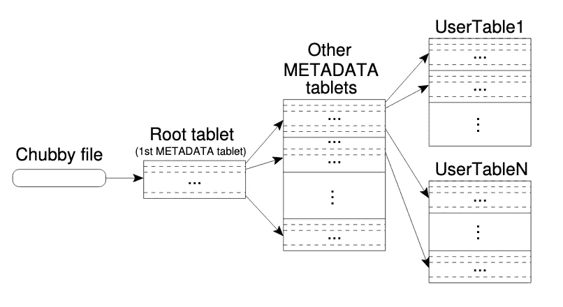

# 纵向扩展后防止 Bigtable 中的关键热点

> 原文：<https://medium.com/google-cloud/bigtable-warm-up-after-scale-up-f575ee4deaa2?source=collection_archive---------1----------------------->

Bigtable 是一个稀疏的、分布式的、持久的多维排序映射，由行键、列键和时间戳索引。

**性能和纵向扩展**

在纵向扩展过程中，性能不会线性增加，这是由于多个服务器配置的负载不平衡造成的，而负载不平衡通常是由进程争用 CPU 和网络造成的。BT 再平衡算法需要更多时间来采取行动有两个原因:

*   调节再平衡以减少平板电脑*移动的次数
*   随着基准测试的进行，负载会发生变化

您可以使用这个工具来监控您的[集群性能](https://cloud.google.com/bigtable/docs/monitoring-instance)。您还可以使用[键可视化工具](https://cloud.google.com/bigtable/docs/keyvis-getting-started)来识别表中可能导致 CPU 占用率峰值的热点。

更改群集中的节点数量后，可能需要 20 分钟才能看到群集性能的显著提高，这通常取决于如何扩展群集的大小。

*   Bigtable 通过行键按字典顺序维护数据。表的行范围是动态分区的。每个行范围称为一个**片，是分配和负载平衡的单位**。

Bigtable 非常依赖名为 Chubby 的分布式锁服务，该服务使用 Paxos 算法在出现故障时保持副本的一致性。Chubby 将提供包含目录和小文件的名称空间。每个目录或文件都可以用作锁，这样读写就可以以原子方式执行。Chubby 客户端库将提供一致的 Chubby 文件缓存。

Bigtable 使用 Chubby 执行各种任务:

*   确保任何时候最多有一个活动主机；
*   存储 Bigtabledata 的引导位置；
*   发现平板电脑服务器并最终确定平板电脑服务器死亡；
*   存储 Bigtable 模式信息(每个表的列族信息)；
*   并存储访问控制列表。



类似于 B+树的平板位置层次结构。

**平板电脑分配**

每台平板电脑一次分配给一台平板电脑服务器。主设备跟踪一组实时平板服务器，以及平板服务器的当前平板分配，包括未分配的平板。当平板电脑未分配，并且平板电脑服务器有足够的空间放置平板电脑时，主设备通过向平板电脑服务器发送平板电脑装载请求来分配平板电脑。Bigtable 使用 Chubby 来跟踪平板电脑服务器。关于平板电脑服务器的每个信息都将作为一个目录存储在 Chubby 中，包括它的创建时间、it 状态等信息。主人会监控这个保存在 Chubby 里面的目录。

在纵向扩展集群之后，可以进行一些负载测试，以确保密钥分布在集群中。源代码可以在:[https://github.com/irvifa/bigtable-load-test](https://github.com/irvifa/bigtable-load-test)找到。

```
./main -instance "$BT_INSTANCE" -project "$BT_PROJECT" -scratch_table "$BT_TABLE" -pool_size "$GRPC_POOL" -req_count "$REQ_COUNT" -run_for 0 -key_list "$KEY_LIST_FILE_PATH"
```

我们可以将行键列表存储在一个文件中，并将其作为参数传递。

如果您想使用部署来负载测试您的 Bigtable 集群，下面是这样做的示例代码:

*   建立并推广您的 Dockerimage:

```
**➜  bigtable-load-test** **git:(master)** cat DockerfileFROM golang:alpine AS builder# Git is required for fetching the dependencies.RUN apk update && apk add --no-cache git bashCOPY . .RUN go get -d -vRUN go build -ldflags="-w -s" -o /go/bin/mainCMD ["/bin/bash", "-c", "./run.sh"]
**➜  bigtable-load-test** **git:(master)** make docker_build \IMAGE_NAME=<your-image-name> IMAGE_TAG=<your-image-tag>**➜  bigtable-load-test** **git:(master)** make docker_push \IMAGE_NAME=<your-image-name> IMAGE_TAG=<your-image-tag>
```

*   配置映射:

```
apiVersion: v1
kind: ConfigMap
metadata:
  name: bt-load-test
  namespace: load-test
data:
  BT_INSTANCE: # your bigtable's instance id
  BT_TABLE: # your bigtable's table name
  BT_PROJECT: # your bigtable's project id
  GRPC_POOL: "10"
  REQ_COUNT: "2000"
```

*   部署:

```
apiVersion: apps/v1kind: Deployment
metadata:
  name: bt-load-test
  namespace: load-test
  labels:
    name: bt-load-test
    role: worker
spec:
  replicas: 15
  selector:
    matchLabels:
      name: bt-load-test
      role: worker
  template:
    metadata:
      labels:
        name: bt-load-test
        role: worker
    spec:
      containers:
        - name: bt-load-test
          image: # your bt-load-test imageenv:
            - name: "GOOGLE_APPLICATION_CREDENTIALS"
              value: # where is your service account's path
          envFrom:
            - configMapRef:
                name: bt-load-test
          volumeMounts:
            - name: "service-account"
              mountPath: # where you mount your service account
      volumes:
        - name: "service-account"
          secret:
            secretName: # where you save your service account
```

另一件需要理解的事情是阅读你的钥匙的[热图模式。](https://cloud.google.com/bigtable/docs/keyvis-patterns)

**参考文献:**

1.  Bigtable:一个用于结构化数据的分布式存储系统。
2.  [监控云 Bigtable 实例](https://cloud.google.com/bigtable/docs/monitoring-instance)
3.  [了解云 Bigtable 性能](https://cloud.google.com/bigtable/docs/performance)
4.  [热图模式](https://cloud.google.com/bigtable/docs/keyvis-patterns)