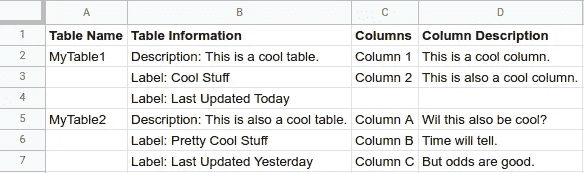
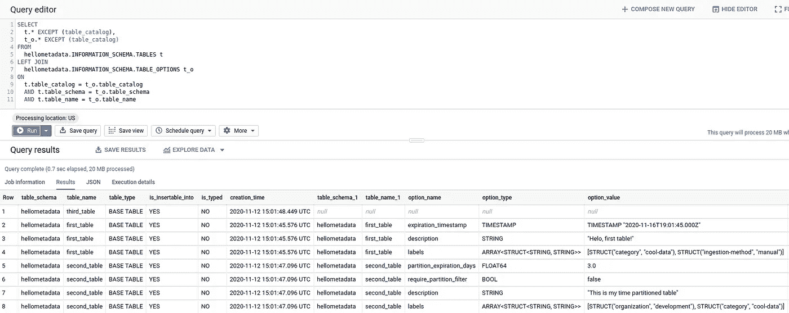
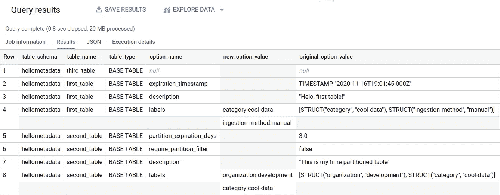
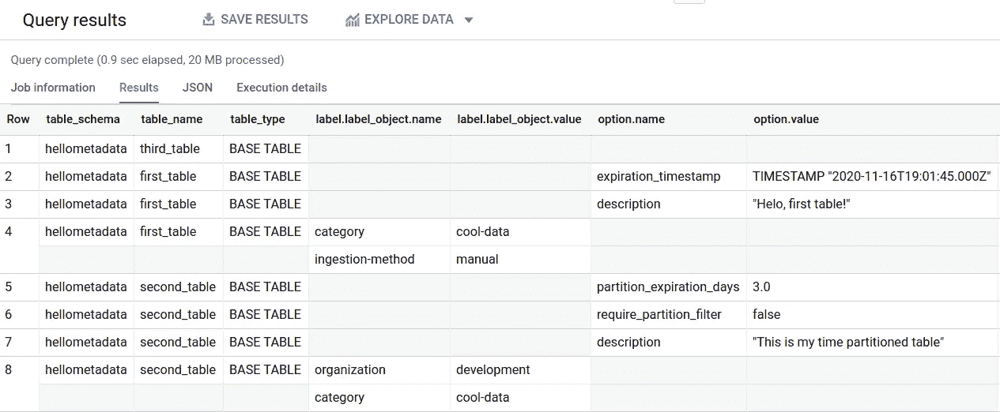
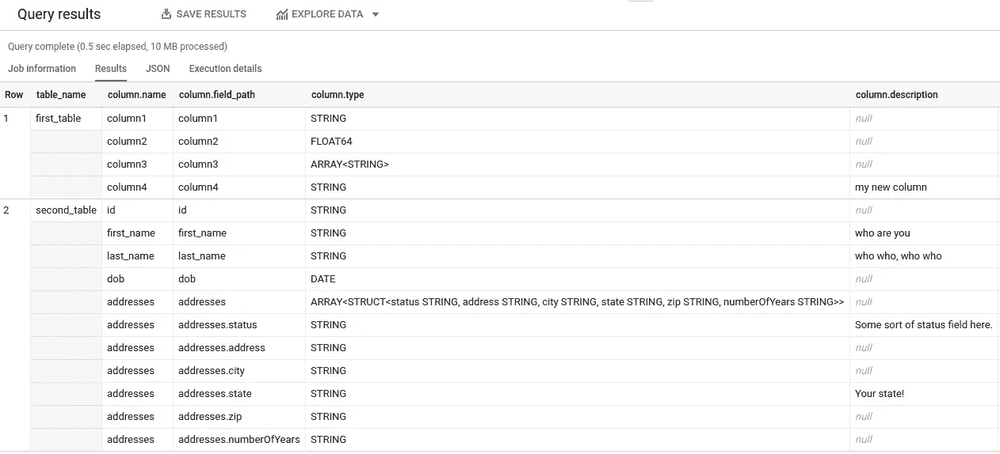
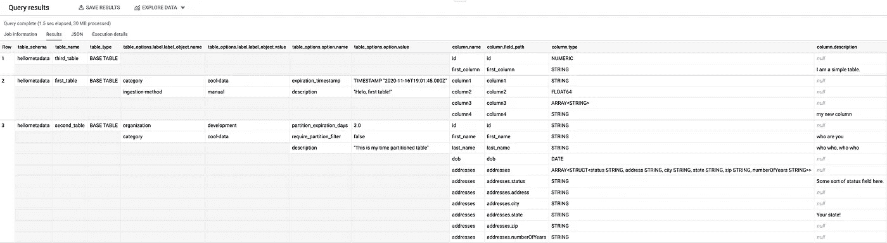
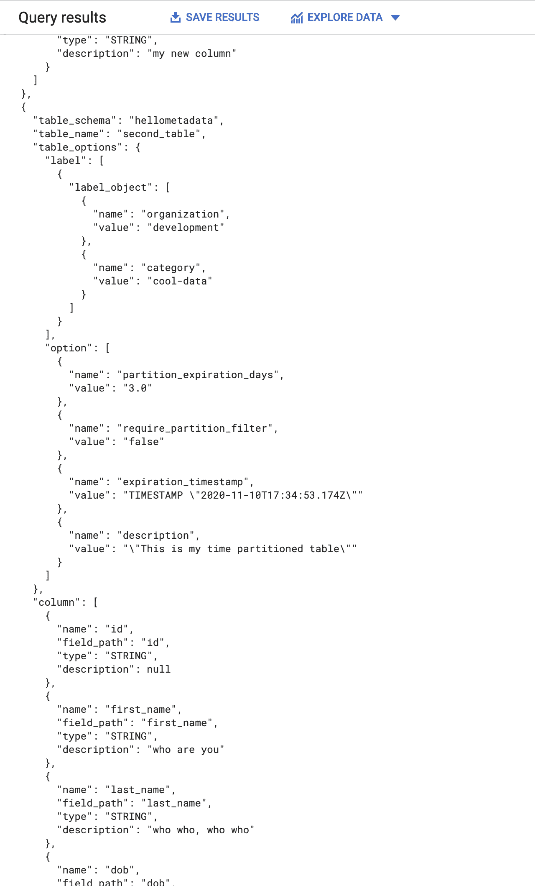

# big tips:big query 中的信息模式视图

> 原文：<https://medium.com/google-cloud/bigtips-information-schema-views-in-bigquery-2f0781766bb4?source=collection_archive---------1----------------------->

> 更新:我第一次去的时候犯了一个错误，忘记了加入基本的`INFORMATION_SCHEMA.TABLES`视图来获得没有选项的表和视图。查询和截图已更新，修复了此问题。

在使用和实现 BigQuery 时，有许多小问题我找不到文档或解决方案的工作示例。任何数据库偶尔都会发生这种情况。虽然这些可能不是要解决的突破性问题，但希望它能让某人的一天变得轻松一点。有时候，是一些小事。

BigTips:通过扁平化表格，让使用 BigQuery 的`INFORMATION_SCHEMA`变得更容易一点！

问题陈述:我只是想展平`INFORMATION_SCHEMA`视图，以便在单个结果中获得列和表级别的信息。有一个上游应用程序(想象一个元数据程序，一个数据库表的 web 目录，诸如此类的东西)只想要一个带有表信息的结果集，以及它的相关列。

如果您想跳到最后，只看到解包所有内容的查询，[转到这里](https://github.com/slagathorr/bigquery-tools/blob/main/information-schema-tools/show-table-and-column-details.sql)。但是，让我们更详细地了解一下这个模式是如何布局的，以及如何解决它的一些问题。

所以真的，我只是想要像这样的东西。



酷数据就是酷。

虽然这不是不可能得到的，但也不是最简单的事情。让我们试着一点一点地把它建立起来。

现在看来，有几件事是显而易见的。我们必须从`[TABLE_OPTIONS](https://cloud.google.com/bigquery/docs/information-schema-tables#table_options_view)`视图开始，并加入`[COLUMN_FIELD_PATHS](https://cloud.google.com/bigquery/docs/information-schema-tables#column_field_paths_view)`信息。选择这些是因为我要解决的用例是包含在这些表中的元数据，但是`INFORMATION_SCHEMA` [中有很多其他东西](https://cloud.google.com/bigquery/docs/information-schema-intro)，所以一定要找到你到底要解决什么。

另一个是，我们显然必须使用[重复和嵌套字段](https://cloud.google.com/bigquery/docs/nested-repeated)来获得我们正在寻找的那种输出结构。所以让我们试一试。

首先，继续[克隆我的库](https://github.com/slagathorr/bigquery-tools)以使生活变得更容易。

您必须创建一些示例表。请确保设置您的默认项目(我总是只做一个快速的`gcloud init`，因为我有多次登录，通常会忘记我登录了什么，但是做对您有用的事情)并运行`/information-schema-tools/runmefirst.sh`脚本。这将为您创建一个名为`hellometadata`的数据集，其中有三个附加了元数据的表。如果你愿意，你可以看看它正在运行的[脚本](https://github.com/slagathorr/bigquery-tools/blob/main/information-schema-tools/runmefirst.sh)，以及`[table](https://github.com/slagathorr/bigquery-tools/blob/main/information-schema-tools/table1_schema)`、`[table2](https://github.com/slagathorr/bigquery-tools/blob/main/information-schema-tools/table2_schema)`和`[table3](https://github.com/slagathorr/bigquery-tools/blob/main/information-schema-tools/table3_schema)`的表定义。现在你应该有一些对象来获取元数据了！

让我们从一个简单的查询开始，连接基本的`TABLES`和`TABLE_OPTIONS`表，看看什么是什么。

```
SELECT
  t.*,
  t_o.*
FROM
  hellometadata.INFORMATION_SCHEMA.TABLES t
LEFT JOIN
  hellometadata.INFORMATION_SCHEMA.TABLE_OPTIONS t_o
ON
  t.table_catalog = t_o.table_catalog
  AND t.table_schema = t_o.table_schema
  AND t.table_name = t_o.table_name
```



和我们预期的差不多。

酷，除了那个`option_value`栏。看起来对于`option_name`、`option_type`和`option_value`列，这些列对于多种类型的数据是重载的。而`option_value`是一个存放一切的字符串列。让我们来解析这个字段。在这里，我们将创建一个新列，如果`option_name`是“标签”,它将处理该字符串，这样我们就可以明确地将它们提取出来。



更干净的数据！

这很有帮助，但我们想对此进行更多的组织。转换成结构。所以我们想把这些拆分，重组，然后重新聚合。



我们有结构和重复的行！

这是更干净的工作，更容易查询。转到列信息，我们想确保我们能够从那里得到我们想要的东西。为此，我们期待从`[COLUMN_FIELD_PATHS](https://cloud.google.com/bigquery/docs/information-schema-tables#column_field_paths_view)`视图中得到我们需要的东西。



所有的栏目信息！

这里的最后一步是聚集所有的表标签和表选项，然后将它们与列信息连接起来。这应该让我们回到生成所有信息的[完整查询。很简单，对吧？](https://github.com/slagathorr/bigquery-tools/blob/main/information-schema-tools/show-table-and-column-details.sql)



所有信息都在一个地方！

还有，万岁！我们有我们想要的布局！将所有信息放在一个地方很有帮助，因为现在你可以将它发送到任何你需要的应用程序。特定于我的用例要求这些信息以 JSON 格式输出，这很容易从查询结果中直接得到。



快乐的小 JSONs。

这样，我们就能够在一个结果集中查询表和列元数据。希望这有所帮助，请务必在[谷歌云媒体频道](https://medium.com/google-cloud)查看更多 BigQuery 内容！查询愉快！