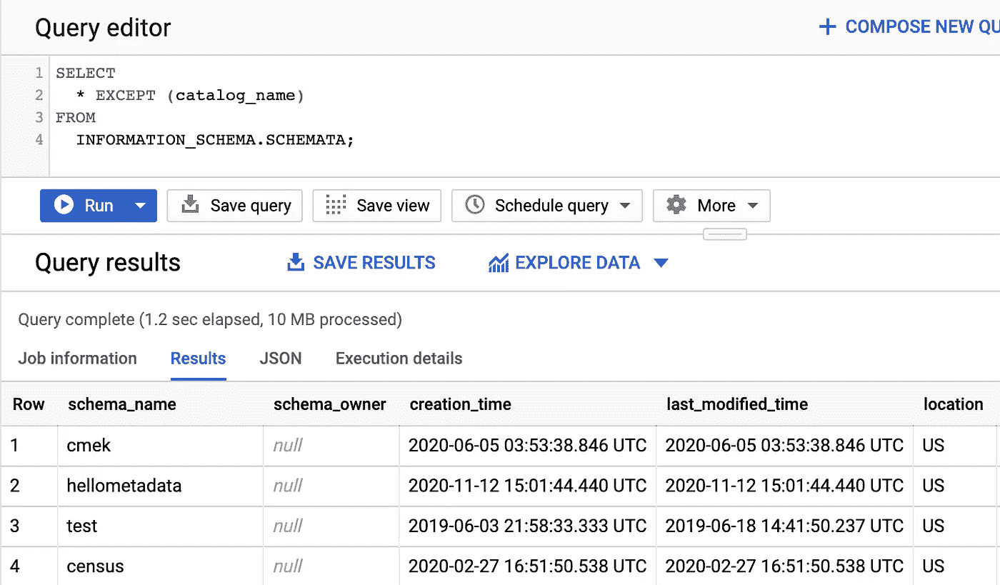
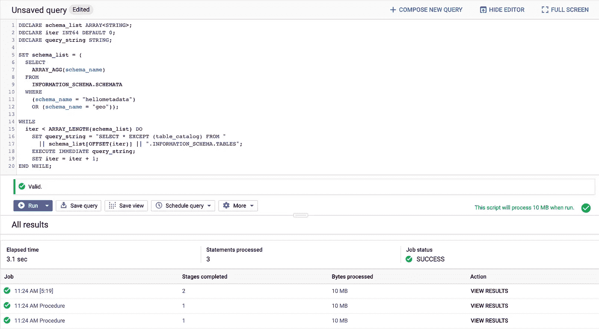
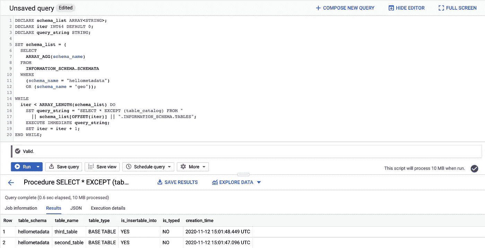
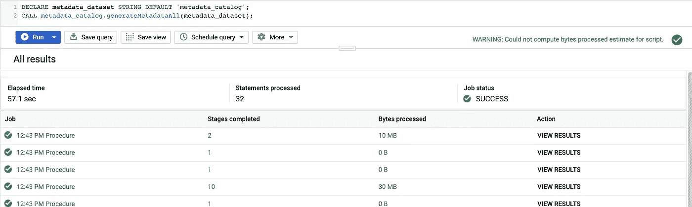
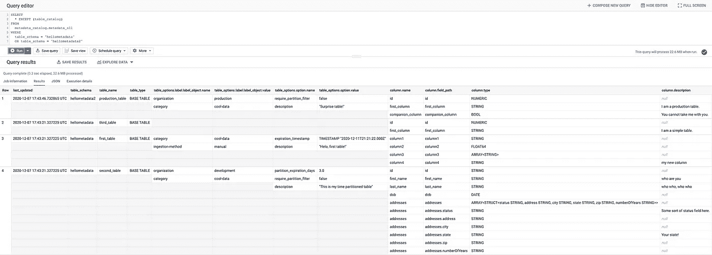

# big tips:big query 第 2 部分中的 INFORMATION_SCHEMA 视图，带有额外的脚本和过程！

> 原文：<https://medium.com/google-cloud/bigtips-information-schema-views-in-bigquery-part-2-with-extra-scripts-and-procedures-53893203e35?source=collection_archive---------0----------------------->

在使用和实现 BigQuery 时，有许多小问题我找不到文档或解决方案的工作示例。任何数据库偶尔都会发生这种情况。虽然这些可能不是要解决的突破性问题，但希望它能让某人的一天变得轻松一点。有时候，是一些小事。

BigTips:通过扁平化表格，让使用 BigQuery 的`INFORMATION_SCHEMA`变得更容易一点！

这是我之前关于扁平化视图以获得数据集元数据的统一视图的后续文章。请务必[阅读第一篇](/google-cloud/bigtips-information-schema-views-in-bigquery-2f0781766bb4)，因为这将假设您已经阅读了第一篇，并以此为基础。

在上一篇文章中，我们看到的视图加入了`TABLES`、`TABLE_OPTIONS`和`COLUMN_FIELD_PATHS`视图。虽然这很有帮助(或者至少我愿意这么认为)，但它的一个局限性是它只能在单个数据集的上下文中做到这一点。但是，当您希望创建一个元数据目录来收集整个项目中所有数据集和表的信息时，会发生什么情况呢？

这就是 [BigQuery 脚本和程序](https://cloud.google.com/blog/products/data-analytics/command-and-control-now-easier-in-bigquery-with-scripting-and-stored-procedures)以及我们的朋友`[EXECUTE IMMEDIATE](https://cloud.google.com/bigquery/docs/reference/standard-sql/scripting#execute_immediate)`命令派上用场的地方。我们要做的是创建一个收集所有要扫描的数据集的过程，动态构造收集每个数据集的元数据的查询字符串，并将结果存储在单个表中以供查询。

让我们做到这一点的是另一个叫做`SCHEMATA`的视图。这非常简单，它所做的只是返回一个项目中的数据集列表。这个可以用`SELECT * FROM INFORMATION_SCHEMA.SCHEMATA`查询。



这很简单。从这里，您可以选择`schema_name`列来获得数据集的列表，并从中构造动态查询。让我们来看一个简单的例子。

让我们把它分解一下。

```
DECLARE schema_list ARRAY<STRING>;
DECLARE iter INT64 DEFAULT 0;
DECLARE query_string STRING;
```

使用 BigQuery 脚本，无论在哪里使用，所有变量都必须在最开始声明。把所有东西都放在一个地方很好，这样你就不用寻找变量了，但是对于临时的上下文相关的东西，比如循环迭代器，它会变得混乱，特别是对于超长的脚本。有得有失。

```
SET schema_list = (
  SELECT
    ARRAY_AGG(schema_name)
  FROM
    INFORMATION_SCHEMA.SCHEMATA
  WHERE
    (schema_name = "hellometadata")
    OR (schema_name = "geo"));
```

这个很简单。我只是试图获得项目中所有数据集名称的列表，将它们聚合到一个数组中，并将该数组放入我们的变量中。在这里，只是为了说明的目的，我将它限制在我们的来自[前一篇](/google-cloud/bigtips-information-schema-views-in-bigquery-2f0781766bb4)的`hellometadata`数据集，以及我碰巧手头的另一个叫做`geo`的数据集。

```
WHILE
  iter < ARRAY_LENGTH(schema_list) DO
    SET query_string = "SELECT * EXCEPT (table_catalog) FROM "
      || schema_list[OFFSET(iter)] || ".INFORMATION_SCHEMA.TABLES";
    EXECUTE IMMEDIATE query_string;
    SET iter = iter + 1;
END WHILE;
```

该循环遍历数据集名称数组。对于每个数据集，它将构建我们的 SQL 查询的字符串文字，将数据集名称嵌入到一个从该数据集的`INFORMATION_SCHEMA.TABLES`视图获取所有信息的`SELECT`语句中。`EXECUTE IMMEDIATE`语句只是运行字符串中的任何内容。好的一面是这种语句组合允许您动态地创建 SQL 查询，对于这样的用例非常方便。它的缺点是在 BigQuery 控制台中没有直接的查询验证，因为它将查询视为字符串文字。



您将看到它运行了三个任务。第一个任务是它运行的设置`schema_list`变量的查询。接下来的两个是它运行的`EXECUTE IMMEDIATE`命令，每个数据集一个(本例中是两个)。



如果您为查询视图的一个作业单击“view results”按钮，您将看到关于该特定步骤发生了什么的元数据。这看起来很像普通查询的作业信息输出。您可以单击查询结果部分中的后退按钮，并单击其他查询的“查看结果”来查看它们的外观。

现在您有了一个如何动态创建查询字符串并按顺序运行它们的快速示例！

使用该方法，我们现在可以从上一篇文章中提取[查询，并将其与该脚本结合使用，以遍历所有数据集，并将元数据结果输出到单个表中进行查询！你可以在这里找到完整的查询](https://github.com/slagathorr/bigquery-tools/blob/main/information-schema-tools/show-table-and-column-details.sql)。

从概念上讲，它与我们的示例脚本相同。它只是从`INFORMATION_SCHEMA.SCHEMATA`视图中提取数据集列表，然后遍历该数组以查询单个数据集级别的`INFORMATION_SCHEMA`视图，然后将该信息写入单个表中进行存储。有几件事需要注意:

*   这个 SQL 查询创建了一个存储过程，您可以根据需要调用它来处理所有信息。
*   该脚本将把它写入一个名为`metadata_catalog`的数据集，但如果你想把它存储在其他地方，一定要更新它。
*   它会自动将所有内容存储在一个名为`metadata_all`的表中，并且每次运行时都会运行一个`CREATE OR REPLACE TABLE`，所以它总是有最新的数据，并且只有最新的数据。它不会保留模式更改的历史记录。

如果您想以此为例，只需遵循以下步骤。

*   再次拉动[库](https://github.com/slagathorr/bigquery-tools)以获取最新的脚本(或者如果您不想获取全部内容，只需从[这里](https://github.com/slagathorr/bigquery-tools/tree/main/information-schema-tools)手动下载所有文件)。
*   再次运行`./runmefirst.sh`。即使您最后一次运行它，其中一个表也设置了到期时间，因此它可能已经在您身上消失了。
*   运行`./runmesecond.sh`。这个脚本将生成第二个数据集，其中包含一个表，还将生成一个名为`metadata_catalog`的数据集。
*   运行`sproc_generate_Metadata_All.sql`查询。这将生成一个名为`metadata_catalog.generateMetadataAll`的存储过程。
*   在 BigQuery 控制台中，当您调出存储过程的详细信息时，单击“调用存储过程”按钮。这将自动用调用它的正确方式填充查询编辑器。它看起来会像:

```
DECLARE metadata_dataset STRING DEFAULT NULL;
CALL `[proj].metadata_catalog.generateMetadataAll`(metadata_dataset);
```

从这里，您可以将`NULL`更改为您的数据集，使其显示为`...STRING DEFAULT 'metadata_catalog';`,或者您可以删除该行，只需更改函数本身的输入参数，使`'metadata_catalog'`直接包含在其中。两种方式都可行。



根据您拥有的数据集数量，可能需要一分钟左右的时间来生成它，但是现在您应该有了一个崭新的表，您可以查询它和/或将其合并到其他流程中！



如果您使用它，请确保将它合并到您的部署工作流中，以便它定期更新或在您预计结构将发生变化时更新，这样您的表就具有最新的更新数据。希望这能让你在使用`INFORMATION_SCHEMA`的时候生活得更轻松一点，同时一定要在[谷歌云媒体频道](https://medium.com/google-cloud)查看更多 BigQuery 内容！查询愉快！