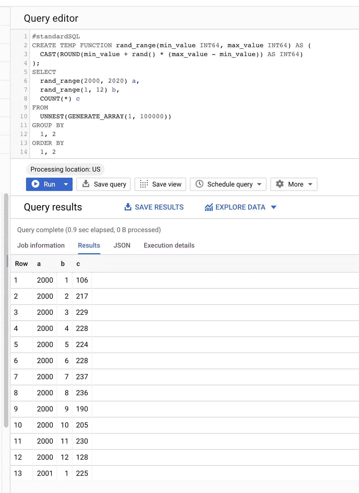
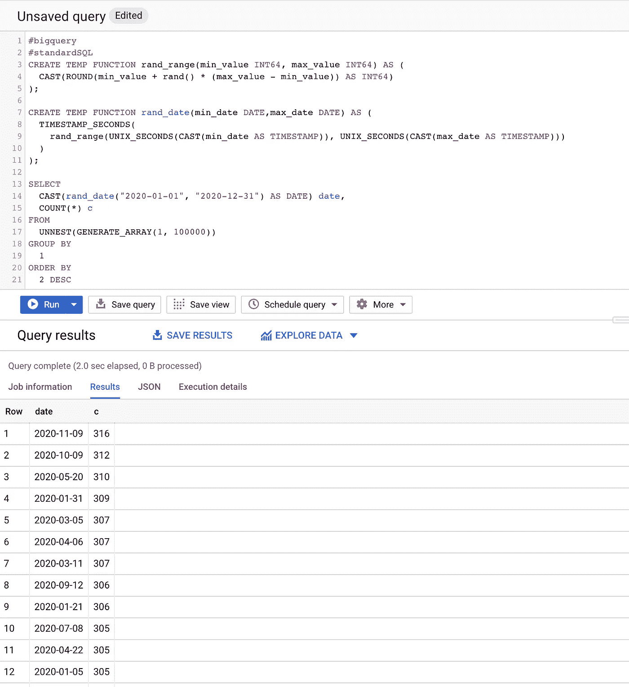

# 大提示:随机数和随机日期

> 原文：<https://medium.com/google-cloud/bigtips-random-numbers-and-random-dates-84da7c309c3d?source=collection_archive---------1----------------------->

在使用和实现 BigQuery 时，有许多小问题我找不到文档或解决方案的工作示例。任何数据库偶尔都会发生这种情况。虽然这些可能不是要解决的突破性问题，但希望它能让某人的一天变得轻松一点。有时候，是一些小事。

大提示:生成一个范围内的随机数和随机日期。

这个会很快，我会把它放在“为什么这个简单的东西不是一个东西？”

## 范围内的随机数

当我需要生成一些测试数据，并注意到 [BigQuery 的](https://cloud.google.com/bigquery/docs/reference/standard-sql/mathematical_functions#rand) `[RAND()](https://cloud.google.com/bigquery/docs/reference/standard-sql/mathematical_functions#rand)`函数没有上限和下限时，这一切才真正开始。这不是一件复杂的事情，但它是那些更容易从某个地方复制和粘贴的小事情之一，所以在这里你可以复制和粘贴它。

## 一个范围内的随机日期

这导致了我的下一个小麻烦，当我试图为某些东西生成测试日期时。非常简单的事情。如果你想在一个范围生成器中重用这个随机数，这非常简单，你可以在把所有东西都转换成 POSIX 时间后调用它。

在这个例子中，为了便于说明，我们将`rand_date()`函数的结果转换为日期类型。该函数将返回一个随机的`TIMESTAMP`，但是每个不同值的计数通常是 1 或 2，这看起来并不有趣。

如果你不需要随机数，只需要随机日期，并且不想花时间重做这个函数，那么就这样吧。

好了，这是一个快速提示，希望能让某人的 BigQuery 一天变得轻松一点！另外，请务必在[谷歌云媒体频道](https://medium.com/google-cloud)查看更多 BigQuery 内容！查询愉快！