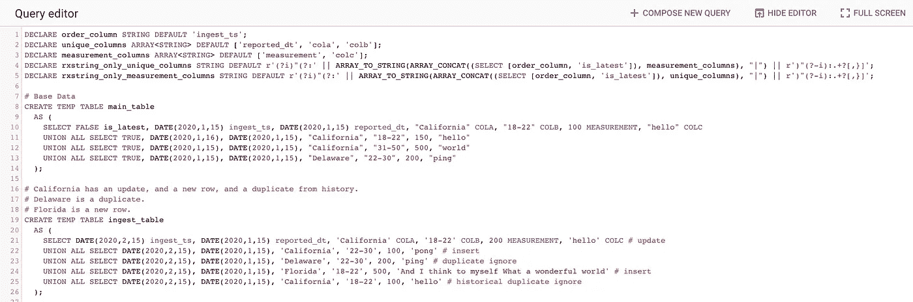

# 大提示:在维护行历史的同时删除重复项

> 原文：<https://medium.com/google-cloud/bigtips-removing-duplicates-while-maintaining-row-history-520f24706d63?source=collection_archive---------0----------------------->

在使用和实现 BigQuery 时，有许多小问题我找不到文档或解决方案的工作示例。任何数据库偶尔都会发生这种情况。虽然这些可能不是要解决的突破性问题，但希望它能让某人的一天变得轻松一点。有时候，是一些小事。

BigTips:删除具有混合静态和可变列的重复行，同时保留行版本历史！

# 我知道我需要什么，只要告诉我脚本就行了！

*   [主 GitHub 库](https://github.com/slagathorr/bigquery-tools)。
*   [范例剧本](https://github.com/slagathorr/bigquery-tools/blob/main/super-deduper/example_script_superDeduper.sql)。
*   [存储过程](https://github.com/slagathorr/bigquery-tools/blob/main/super-deduper/sproc_superDeduper.sql)。

# 问题陈述

分析数据中的一个老问题是如何处理迟到的数据。在接收数据时，这是一个相当常见的问题，尤其是在处理频繁事务的系统中。这也是系统经常对以前的数据进行修正的一个问题。

这里的挑战语句试图在 BigQuery 内部处理这个问题。像 Informatica PowerCenter、IBM DataStage 这样的 ETL 工具，以及它们通常的同类工具都有在它们的工具中处理这种情况的工具。虽然在运行 ETL 管道时这通常没问题，但是如果您想利用 BigQuery 的引擎来做这件事呢？

最初会想到一些想法。第一个，也是最明显的一个，就是发出一个`[SELECT DISTINCT *](https://cloud.google.com/bigquery/docs/reference/standard-sql/query-syntax#duplicate_row_handling)`语句来查找和处理所有重复的行。如果你要找的就是这个，那就可以了。它不处理对以前条目的更新，以及当一些列是维度，而其他列是度量时的更新。它会将一个更新视为一个新的不同的行，所以您不能轻易地将它们联系在一起。

另一种方法是使用`[MERGE](https://cloud.google.com/blog/products/gcp/performing-large-scale-mutations-in-bigquery)`语句。这适用于问题陈述，但不完全清楚我们如何处理数量可变的代理键列，以及如何排除不同的列。特别是如果我们想使这个通用的，并适用于一个未知的表。

当在文本描述中描述这些异议时，可能会令人困惑，但是让我们举一个例子来具体说明这一点。

假设我们有一个名为`main_table`的基础表，包含以下基础数据:

以下是这些列的含义:

*   `is_latest`是一个`BOOL`列，它告诉我们该行是否代表该数据的“当前”版本。
*   `ingest_ts`是一个列，它告诉我们该行何时被加载到表中。
*   `reported_dt`是一个告诉我们那一行中的数据代表什么日期的列。
*   `COLA`只是一些维度列，在本例中是一个状态。
*   `COLB`是另一个维度列，在本例中是一个年龄组。
*   `MEASUREMENT`只是对某物的某种度量。
*   `COLC`是另一个测量栏。这一列对数据没有任何特殊的意义，它只是另一个值可以改变的列。

这里我们有`ingest_ts`和`reported_dt`，所以数据是[双时态的](https://en.wikipedia.org/wiki/Bitemporal_Modeling)，我们可以测量“当源观察它时”和“当我们接收它时”的数据这里的想法是保存变更的运行历史记录(通过使用`ingest_ts`和`reported_dt`的组合)以及维护`is_latest`标志，这样您就可以轻松地发出查询`SELECT * FROM mytable WHERE is_latest = TRUE`来获取所有最新的数据。

在这个结构中，我们有三组柱子。

*   `is_latest`和`ingest_ts`是元数据列，帮助我们计算数据的新近性，但其本身并不是实际的数据。`is_latest`是一个需要维护的简单过滤标志。
*   `reported_dt`、`COLA`和`COLB`是三列，它们组合在一起可以告诉我们什么代表数据的唯一度量。这些可以作为我们的[代理键](https://en.wikipedia.org/wiki/Surrogate_key)。这些列的独特组合意味着它在某种意义上是一个“新行”。在本文中，我们将这些列称为“唯一列”
*   `MEASUREMENT`、`COLC`为我们的测量柱。对于代理键的每个唯一组合，这两个度量值都可能改变。下一个数据集将举例说明这是如何实现的。在本文中，我们将称之为“测量柱”。

现在我们有了基本数据表，让我们添加第二个表。这是我们的`ingest_table`它有一个相似的结构，但是这代表了“一个更晚的日期”到来的新数据

这只是同一表的后续数据加载，因此`is_latest`列不存在(这是我们需要计算的)，下面是一些数据复杂性的示例。

*   加利福尼亚有一个更新(对于 2020-1-15，加利福尼亚的 18-22 计数从 150 变为 200)，一个新行(对于 2020-1-15，加利福尼亚的 22-30 是一个新记录)，以及一个历史副本(对于 2020-1-15，加利福尼亚的 18-22 测量为 100，并且“hello”是历史副本)。
*   特拉华州的行(2020–1–15，特拉华州的 22–30 计数为 100/磅)是活动数据点的副本。
*   弗罗里达州的测量结果(2020-1-15，特拉华州的 22-30 计数为 200/平)是新的一排。

这就是为什么只匹配一列的策略并不总是有效，也不仅仅是在所有列中选择不同的。这有点棘手。而且，这在现实世界的系统中确实经常发生。如果您是零售商，可能会出现这样的情况:“我们的生产线出现了问题，上周二的批次实际上比我们最初记录的少了 100 台。”或者，如果您要在全国范围内汇总医疗数据，则可能需要在以下情况下更新数据:“三天前的测量结果实际上有所不同，因为加利福尼亚的一些医院因文书工作而延误，而我们刚刚收到了这些数据。”在您的日常生活中，想想您的信用卡账单吧，这一点更加明显。如果您经常观看，您会注意到交易结算时通常会有几个工作日的延迟期(至少在美国是这样，但我怀疑许多国家的操作都是类似的)，并且随着交易的结束，您在这些天的“截止”余额和“当前余额”可能会波动。这些都是这个问题开始发挥作用的例子。

让我们回到示例表。其中包含了最常见的延迟到达数据场景的示例:真正新的唯一数据、最新数据的更新、最新数据的副本以及先前历史数据的副本。这几乎是一个`[UPSERT](https://wiki.postgresql.org/wiki/UPSERT#.22UPSERT.22_definition)`。让我们去建造一些东西来处理它！

我们将一步一步地介绍如何构建它，并将它包装在一个存储过程中。如果您只想跳到最终结果，请到这里查看嵌入了数据的示例，到这里查看您可以部署的实际脚本。

我们知道我们的目标最终状态是什么，如果我们手动将接收表中的数据更改应用到主表，我们可以看到这就是我们想要的:

让我们设法到达那里。

对此我们将采取两种方法。[一个完全自包含的 BigQuery 脚本，包括样本数据](https://github.com/slagathorr/bigquery-tools/blob/main/super-deduper/example_script_superDeduper.sql)，还有一个版本，我们把所有这些都包装在一个[存储过程中，这样你就可以在任意表上调用它](https://github.com/slagathorr/bigquery-tools/blob/main/super-deduper/sproc_superDeduper.sql)。

# 伪代码

让我们先把我们的逻辑搞清楚，这样我们就知道我们在朝着什么方向努力了。基本的 psudeocode 如下所示:

让我们看看这个逻辑如何处理前面概述的四种数据场景:

*   对最新数据的更新:块 1 中的`WHERE`子句的前半部分解决了这个问题。它在`main_table`中寻找`is_latest`为真的行，唯一的列匹配表示它是相同的度量，但是具有新的度量。在块 2 中，我们将`main_table`中的相应数据标记为历史数据，然后在块 3 中加载新数据。
*   先前历史数据的副本:先前逻辑的问题是，如果传入的行有先前的历史度量，它仍然可以通过逻辑，因为它没有将它与历史值进行比较。Block 1 中的第二个子句是我们捕获这个异常的地方，在创建更新的临时表时忽略它。
*   最新数据的副本/真正新的唯一数据:块 4 处理这两者。这里，我们只合并唯一列和度量列都是新列的行。

# 与 JSON 比较

当进行这些比较以查看哪些列发生了变化，哪些没有发生变化时，我们通常必须在 where 子句中手工键入所有这些内容。这不仅对于非常宽的表来说是一种痛苦，而且对于一般的表来说也不灵活。处理通用表的想法我们将在后面的部分讨论，但是让我们引入 JSON 字符串来解决另一个问题。

我们可以在一个简单的语句中比较大量的列，而不是使用一堆比较操作符，其中一个技巧是将行序列化为 JSON 字符串，然后进行一次比较。您可以使用`TO_JSON_STRING()`函数轻松序列化 JSON 字符串。


这给了你一个字符串，你现在可以操作它。如果将它与正则表达式结合起来，现在就有了一种简单的方法来比较列值。假设我们只想连接两个表中的`cola`和`colb`，其中`colc`是相同的。


我们在这里所做的是创建一个正则表达式，它从字符串中删除了`cola`和`colb`的数据，所以现在 JSON 字符串只剩下`colc`了，现在比较它们非常简单。虽然这是一个简单的例子，但是您可以开始看到动态创建比较字符串的灵活性和简易性，尤其是当您有几十列甚至几百列宽的表时。

# 把它们放在一个剧本里

好吧，那这一切是怎么一起工作的？让我们一点一点地把它建造出来。如果你想知道它是如何构建的，请继续阅读，但是如果你想跟随整个脚本，它位于这里的。

## 变量和数据



下面两条语句非常简单，我们用我们的`main_table`和`ingest_table`数据创建了两个临时表。这是与上面的例子相同的数据。

在前三行中，我们创建变量来存储列名。一个是指出哪一列是我们的摄取时间列。一组用于存储我们唯一的列名，另一组用于存储测量列名。我们在第 4 行和第 5 行使用这些来预构建正则表达式字符串。在我们引入 JSON 字符串的简单例子中，我们在正则表达式中硬编码了`cola`和`colb`。这里我们使用列名数组来动态生成。第 4 行是我们删除测量列和摄取时间戳列的地方，因此我们将只有唯一的列值。第 5 行正好相反，所以我们只有测量列。这将有助于我们稍后的比较更加容易。

## 第一部分，识别真实更新


这里，我们正在构建 psudeocode 的模块 1。通过使用正则表达式字符串和比较被操纵的 JSON 字符串的技术，我们可以执行我们想要执行的逻辑。在我们的测试数据中，我们发现只有加利福尼亚州的 18–22 测量值是真正的更新，而加利福尼亚州的 22–30 测量值是历史重复值，我们可以看到，它正确地用这一行填充了 staging 表。

## 块二，使传出的更新行无效


在 psudeocode 的第 2 块中，我们只取了`main_table`中的值，这些值是最新的行，然后使那些与传入的更新相匹配的行无效。由于加州的 18–22 将从 150 变为 200，我们应该预料到`main_table`中的那一行将被无效，我们在上面的结果中看到它成功地工作。

## 块三，加载新的更新行


这是最简单的方法，简单地插入来自`update_staging`表的数据。我们在这里可以看到，加州新的 18–22 排 200 个 is 已经成功加载。

## 块四，加载真正的新行


最后，我们希望加载真正的新行。这里我们寻找匹配，然后在不匹配的时候插入。因为不能在 match 的`MERGE`语句中插入行，所以我们做了相反的事情。我们希望看到加州新的 22-30 行和佛罗里达州的 1-88 行被插入，我们看到它成功地做到了这一点。提醒一下，这是我们的预期输出。

万岁，成功了！

同样，[如果你想看的话，这里有整个脚本](https://github.com/slagathorr/bigquery-tools/blob/main/super-deduper/example_script_superDeduper.sql)的链接。

# 将这些放在一个存储过程中

所以这很酷。最终，我们希望将它包装成一个通用的存储过程，可以应用于任何表。

你可以在这里找到完成的剧本。

如果您查看一下脚本细节，就会发现它与上一节中的脚本只有几个主要的区别。

首先，因为这是一个通用的过程，我们没有定义任何列或测试数据。这些都将由用户在过程调用中提供。

第二个主要区别是，与直接调用不同，您会注意到 SQL 被设置为`STRING`对象，所有内容都在`EXECUTE IMMEDIATE`调用中被调用。这是为了让我们可以用过程调用提供的列动态地运行它们。

除此之外，它的核心逻辑很大程度上遵循了上一节脚本中的设计。所以让我们试一试。

如果您想要[克隆整个存储库](https://github.com/slagathorr/bigquery-tools)，这将是最简单的方法。你也会得到 BigTips 中包含的所有其他内容。如果你只是想要这些文件，你可以在这里看到它们[。](https://github.com/slagathorr/bigquery-tools/tree/main/super-deduper)

首先，确保在命令行中运行一个`gcloud auth`，这样您就有了正确的用户和项目集。

运行`[runmefirst.sh](https://github.com/slagathorr/bigquery-tools/blob/main/super-deduper/runmefirst.sh)`脚本。这将创建一个名为`dedup_stuff`的数据集，然后运行`[create_ingest_table.sql](https://github.com/slagathorr/bigquery-tools/blob/main/super-deduper/create_ingest_table.sql)`和`[create_main_table.sql](https://github.com/slagathorr/bigquery-tools/blob/main/super-deduper/create_main_table.sql)`脚本来生成与我们之前相同的测试数据。最后，它将运行`[sproc_superDeduper.sql](https://github.com/slagathorr/bigquery-tools/blob/main/super-deduper/sproc_superDeduper.sql)`文件，从而创建过程。这应该会给你一个新的快乐的小数据集。


快乐的桌子是最好的桌子。

如果您想在运行脚本之前感受一下所有对象的样子，请随意查看表格和脚本。准备好之后，继续使用以下参数在 BigQuery 中运行脚本。

```
CALL dedup_stuff.superDeduper(
  '`dedup_stuff.ingest_table`',
  '`dedup_stuff.main_table`',
  'ingest_ts',
  'is_latest',
  ['reported_dt', 'cola', 'colb'],
  ['measurement', 'colc']
);
```

运行之后，预览`main_table`，您将看到数据与我们预期的结果相匹配。


最幸福的桌子。

现在你知道了！这是一个较长的技巧，但是我想确保它背后的逻辑是清楚的，这样您就可以确切地知道它是如何工作的，因为阅读其他人的脚本/代码并不总是最容易的。希望这有助于让某人的大查询日稍微轻松一点！另外，请务必在[谷歌云媒体频道](https://medium.com/google-cloud)查看更多 BigQuery 内容！查询愉快！