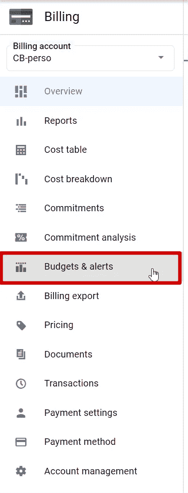
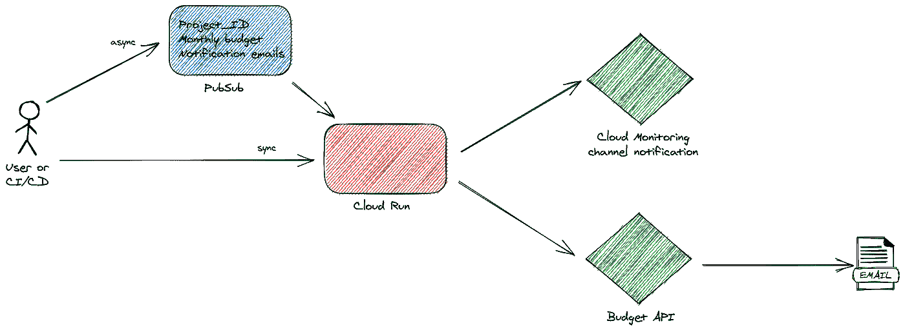

# 具有云监控通知通道的计费警报

> 原文：<https://medium.com/google-cloud/billing-alert-with-cloud-monitoring-notification-channel-c4cfa3588feb?source=collection_archive---------0----------------------->

云成本是最可怕的一个方面:你为你使用的东西付费！为了防止任何过度成本，最佳实践之一是粗略估计项目成本，并设置预算警报。

在谷歌云上，你可以在账单页面的预算和提醒部分实现这一点。



您需要拥有计费管理员角色才能访问它。在一个组织中，有不同的用户配置文件，但并非所有用户都是计费管理员:

*   云计费可能是敏感信息，计费管理员角色允许全面查看所有项目的所有计费。
*   计费管理员可以删除/关闭一个计费帐户，因此关闭所有附加的项目
*   对支付方式的访问可能是机密/敏感的。

> 那么，如何委派项目创建、计费帐户附件和计费警报设置呢？

# 记帐帐户用户角色问题

在只有一个计费账户和几十个子公司的大公司中，让他们自主创建项目是强制性的。此外，由于会定期对子公司进行内部重新计费，因此他们跟踪云资源消耗情况并获得提醒的能力至关重要。

子公司中的用户拥有计费帐户用户角色，可以将计费帐户附加到他们新创建的项目中。但是，因为他们没有计费帐户管理员角色，所以无法创建预算警报。

# 错误的解决方案

第一个*错误的*探索的解决方案之一是要求子公司向计费账户管理团队发送预算警报参数，以设置他们的项目。

除了这个团队的开销之外(可以通过开发自动创建来解决这个问题)，当发出警报时，会将其发送给计费帐户管理员用户，而不是直接发送给子公司的项目经理。
因此，将预算警报转发给正确的团队会产生额外的开销，以及由此引发的所有延迟、错误和遗忘。

# 收件人定制

去年(2020 年 5 月)发布的[功能允许将默认通知电子邮件收件人(计费帐户管理员用户)更改为云监控通知渠道中定义的自定义电子邮件。](https://cloud.google.com/billing/docs/release-notes#May_18_2020)

该功能解决了以前的问题:预算警报可以发送给正确的收件人，而不是错误的计费帐户管理员用户。为了自动和大规模地进行配置，我们设计了这个应用程序。



原则是用基本信息 *:* 创建一个消息(与直接 HTTP 调用同步或与发布/订阅消息异步)

*   要设置记帐警报的项目 ID
*   要设置的月度预算
*   要通知的电子邮件(用户或组)列表。

这很简单，你可以选择构建一些更加可定制和复杂的东西。

子公司触发发布/订阅*(将消息发布到发布/订阅主题)*或直接触发云运行*(云运行调用者)*所需的权限由 IAM 管理，不与计费账户关联；哪个更安全。

收到参数后，该过程分为两个部分:

1.  云监控通知通道管理
2.  计费警报管理

## 云监控通知通道 API

[这个 API](https://cloud.google.com/monitoring/api/ref_v3/rest/v3/projects.notificationChannels) 提出以编程方式管理通知通道。在这种情况下，流程如下

从电子邮件列表(用户电子邮件或组)中根据条目中的参数进行通知

*   检查通知渠道是否存在
*   如果存在，获取名称引用
*   如果没有，则创建它，并在创建后获取名称引用。

*请求者至少需要有* ***监控通知通道编辑角色***

```
https://monitoring.googleapis.com/v3/projects/gdglyon-cloudrun/notificationChannelsBy API , you can get the  notification channels like thatcurl -H "Authorization: Bearer $(gcloud auth print-access-token)" \
https://monitoring.googleapis.com/v3/projects/<PROJECT_ID>/notificationChannels
```

要创建通知通道，您可以发送以下请求

```
curl -H "Authorization: Bearer $(gcloud auth print-access-token)" \
  -H "content-type: application/json" \
  -X POST -d @notification-channel.json \ https://monitoring.googleapis.com/v3/projects/<PROJECT_ID>/notificationChannels
```

连同这个`notification-channel.json`数据结构

```
{
  "type": "email",
  "displayName": "<Human Readable Name>",
  "labels": {
    "email_address": "<EMAIL_ADDRESS>"
  }
}
```

在对 API 调用的响应中，您拥有创建的通道的`name`。得到它并保存它。我们将使用它来创建预算预警。

*你可以在这里查看 GO 实现*[](https://github.com/guillaumeblaquiere/multi-org-billing-alert/blob/main/internal/notification-channel.go)**与 Google API 库**

## *使用预算 API 的开单预警*

*[预算 API](https://cloud.google.com/billing/docs/reference/budget/rest/v1/billingAccounts.budgets) 仅允许管理计费账户上的预算。**计费账户管理员角色**需要使用此 API。*

*在此背景下，流程如下*

*   *如果不存在警报(基于我们自己的命名约定)，则使用月度预算、项目 ID 和通知渠道创建预算警报*
*   *否则，使用月度预算和通知渠道更新现有的预算预警。*

*要通过 API 创建预算预警，您可以执行此调用
*注意:您不能使用您的用户帐户来调用此 API。为此需要一个服务帐户。**

```
*curl -H "Authorization: Bearer $(gcloud auth print-access-token)" \
https://billingbudgets.googleapis.com/v1/billingAccounts/<BILLING_ACCOUNT>/budgets*
```

*这个用来获取现有的预算警报*

```
*curl -H "Authorization: Bearer $(gcloud auth print-access-token)" \
  -H "content-type: application/json" \
  -X POST -d @budget.json \
https://billingbudgets.googleapis.com/v1/billingAccounts/<BILLING_ACCOUNT>/budgets*
```

*有了这个`budget.json`数据结构*

```
*{
  "displayName": "<Human Readable Name (naming convention?)>",
  "budgetFilter": {
    "projects": [
      "<PROJECT_ID>"
    ],
    "calendarPeriod": "MONTH"
  },
  "amount": {
    "specifiedAmount": {
      "currencyCode": "EUR",
      "units": 10,
      "nanos": 10000000
    }
  },
  "thresholdRules": [
    {
      "thresholdPercent": 0.5
    },
    {
      "thresholdPercent": 0.9
    },
    {
      "thresholdPercent": 1.0
    }
  ],
  "notificationsRule": {
    "monitoringNotificationChannels": [
      "<Notification Channel Name got previously>"
    ],
    "disableDefaultIamRecipients": true
  }
}*
```

*更新更加棘手，因为您需要提供一个更新掩码*

```
*curl -H "Authorization: Bearer $(gcloud auth print-access-token)" \
  -H "content-type: application/json" \
  -X PATCH -d @budget-update.json \
https://billingbudgets.googleapis.com/v1/billingAccounts/<BILLING_ACCOUNT>/budgets/<BUDGET_ID>?updateMask=amount.specified_amount,notifications_rule*
```

*有了这个`budget-update.json`数据结构*

```
*{
  "amount": {
    "specifiedAmount": {
      "currencyCode": "EUR",
      "units": 80,
      "nanos": 10000000
    }
  },
  "notificationsRule": {
    "monitoringNotificationChannels": [
      "<Notification Channel Name got previously>"
    ]
  }
}*
```

**这个围棋实现是在* [*这个文件里*](https://github.com/guillaumeblaquiere/multi-org-billing-alert/blob/main/internal/billing-alert.go) *。**

# *每个人的预算警报*

*由于 Budget API 中的通知通道特性，现在可以在没有太多复杂性和开销的情况下通知任何人预算警报。*

*当然，该解决方案并不完美，因为用户没有 UI 来配置警报，也没有查看/浏览现有警报的能力。*

*然而，这总比拥有完全访问计费帐户的权限，或者没有预算警报，因此对项目的成本视而不见要好！*

*你可以在这里找到完整的开源项目。按照自述文件进行手动部署或使用 terraform。如你所愿更新和改编项目！
*如果需要，打开问题或功能请求。我很乐意帮忙。**