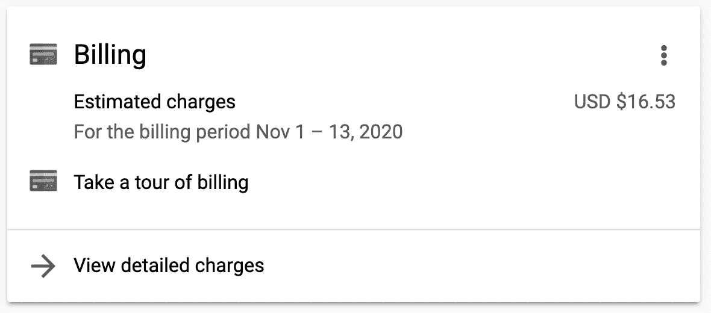
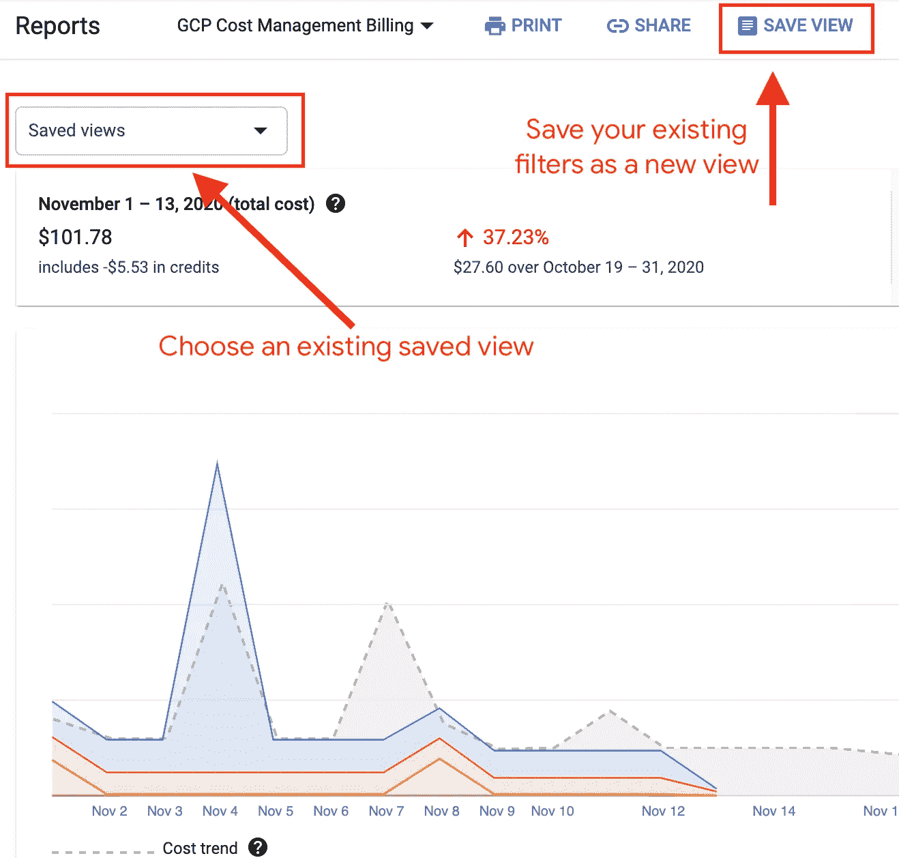
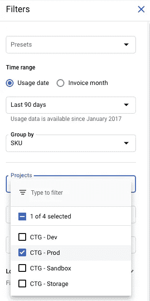
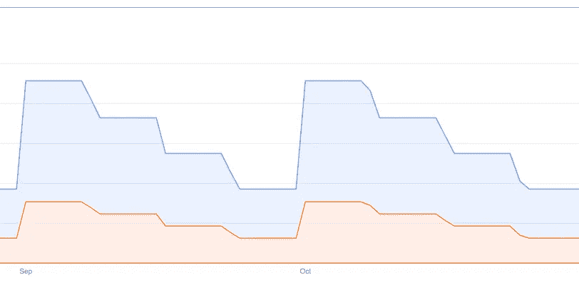
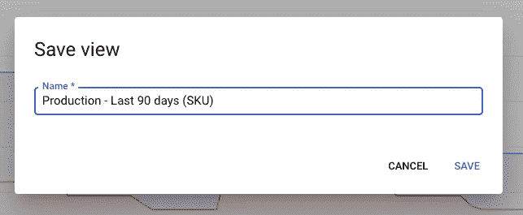
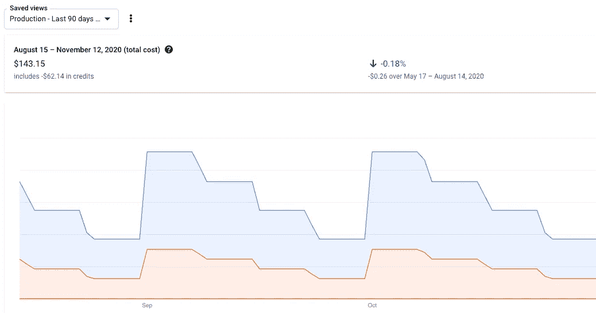

# 计费报告和保存的成本视图

> 原文：<https://medium.com/google-cloud/billing-reports-and-saved-cost-views-c40f3e849755?source=collection_archive---------2----------------------->

TL；DR-试用保存的成本视图，从 Google 云计费报告页面创建和共享自定义视图。

计费报告旨在了解您的成本

和 FinOps 有很多共同点，成本优化，成本效率等等。不同的公司和云提供商使用这些来描述各种各样的想法，这些想法有一个共同点:最大化您在云上的投资价值。虽然有许多方法可以优化您的投资，但如果不首先了解您的成本，没有一种方法是可行的。

哦，那些讨厌的费用！他们去哪里了？一定有更好的办法！

在 Google Cloud 中查看成本的第一个方法是使用账单报告页面。刚刚开始？尝试新的计费之旅，快速浏览控制台中可用的几种不同的报告。

您可以在项目仪表板页面上找到它

我还制作了一个视频，介绍如何使用计费报告和过滤器。这是从去年开始的，所以有一些更新，但想法仍然是一样的，界面也没有改变。

我将很快介绍查看您的成本的更详细的方法，但现在我想调用计费报告中的一个新功能:保存的成本视图。这是一个非常简单的特性，所以我将直接介绍如何使用它。

就是这么简单！

“保存视图”按钮就像它听起来一样:它将你当前正在查看的内容保存为一个你可以命名的新视图。当你发现自己经常寻找一些特定的信息时，这真的很方便。您可以设置一次过滤器，然后将它们保存为新视图，而不是每次都手动选择所有过滤器。

例如，我发现自己经常查看过去 90 天的生产项目，按 SKU 分组，只是为了确保一切看起来不错，我没有错过任何东西。设置的第一步是为我想看的内容设置过滤器。

你可以看出这是一个生产项目，因为上面写着“生产”。但实际上，使用标签

很简单，只需将使用日期改为最近 90 天，按 SKU 分组，然后选择我关心的项目。这些给了我一个漂亮的图表，所以我可以确保我最近的生产成本看起来像我期望的那样。

这些“阶梯”是谷歌云自动应用[持续使用折扣](https://cloud.google.com/compute/docs/sustained-use-discounts)的结果

这里的一切看起来都和我想要的一模一样，这太好了。但是我不想再回到报告上，一遍又一遍地设置相同的过滤器。一个简单的解决方法是给页面添加书签，因为过滤器是作为查询字符串参数添加的，但是随着更多视图和团队成员的添加，这就变得很麻烦了。所以，我就留着看风景吧。

似乎是个准确的名字

现在，任何有权访问该计费帐户的计费报告的人都可以从下拉列表中选择视图，他们将看到相同的数据！

我想知道当我发布这篇文章时，这张截图会有多旧

当然，这是一个非常简单的例子。您可以过滤更多信息，例如地区、标签和特定产品/SKU。如果您正在寻找一种简单的方法来快速切换几个报告，自己试试吧！

如果你想了解更多，[查看文档](https://cloud.google.com/billing/docs/how-to/reports#saving-views)。