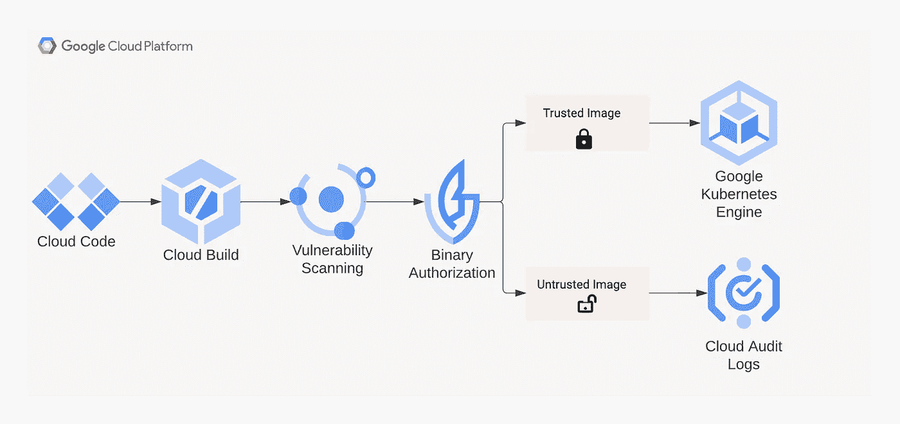
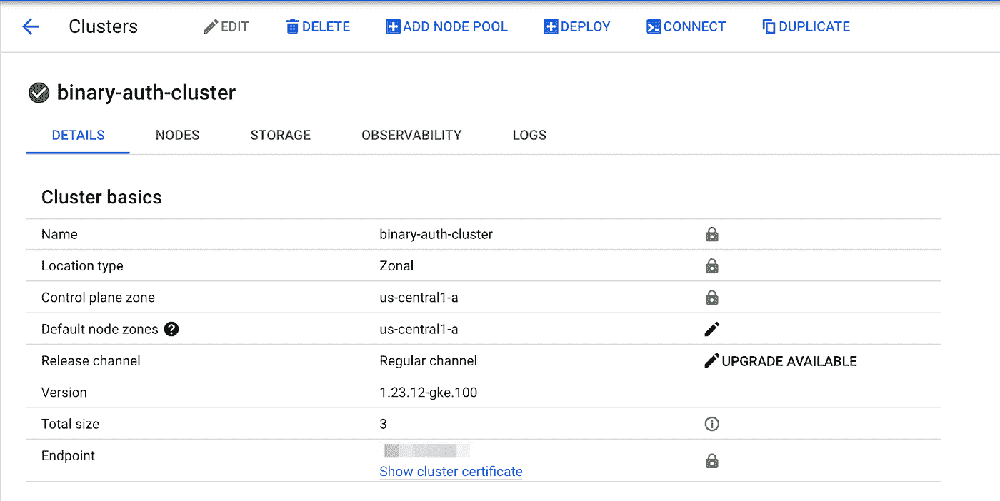
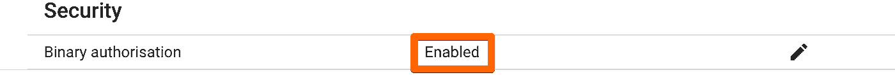
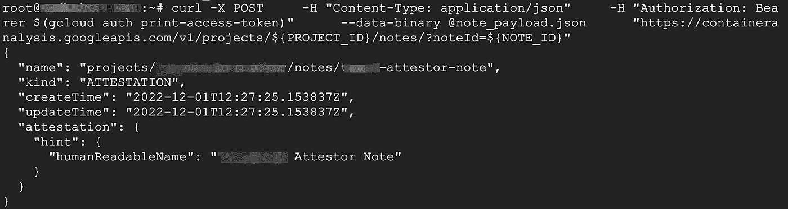
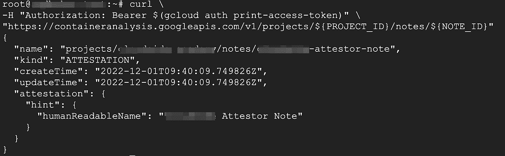
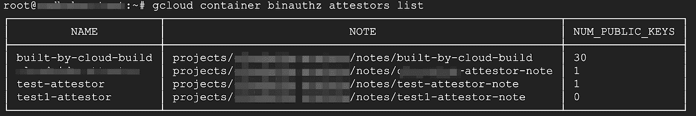
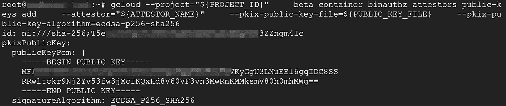
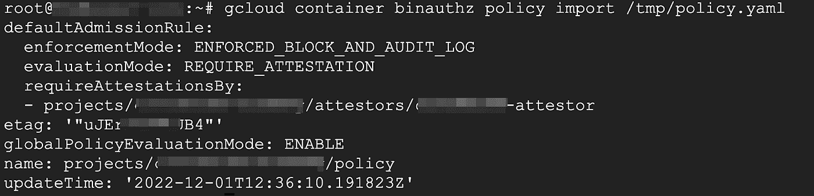
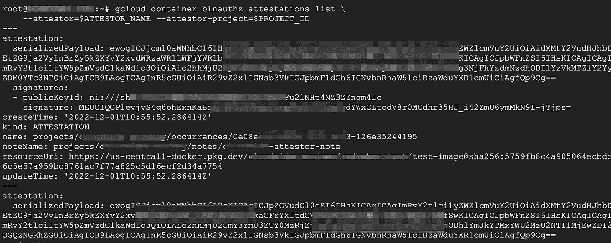
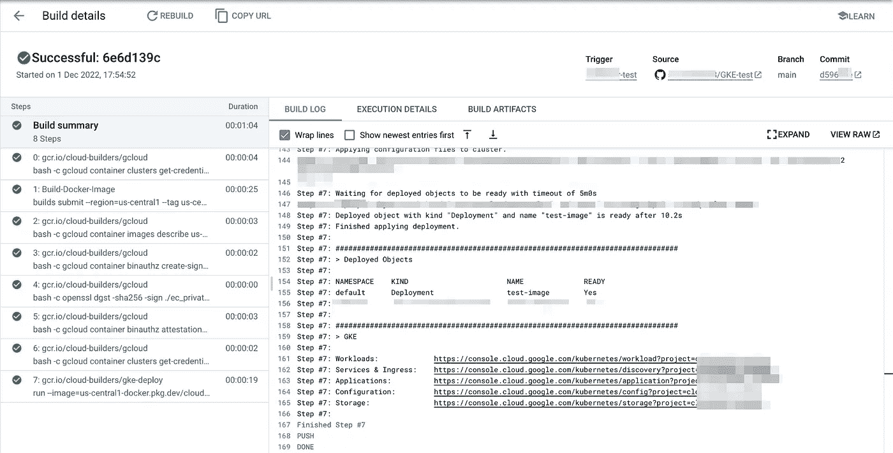

# 二进制授权|谷歌云

> 原文：<https://medium.com/google-cloud/binary-authorization-google-cloud-8bd96e6a3c4?source=collection_archive---------1----------------------->

# **二进制授权**

二进制授权是 Google Cloud 提供的一项服务，旨在确保只有授权的构建映像才会部署在 GKE 或 cloudrun 上。它有助于验证部署在容器环境中的映像，这些映像是由授权的团队来证明的。它通过确保只部署授权的映像来帮助开发运维团队。它帮助团队加强环境的安全态势，并与 GKE 和 Cloudrun 等谷歌云服务进行本机集成。

# **二进制授权的关键要求**

软件供应链安全是任何企业安全的关键要求之一，它旨在确保根据内部最佳实践采购、构建、测试和发布软件，以减少攻击面，并拥有安全的简化部署流程

随着团队转向完全分离的微服务架构，发布周期更短，并包括持续集成(CI)和持续部署(CD)，二进制授权有助于让安全团队证明部署，从而降低部署未经授权的易受攻击软件的风险

# **二进制授权的主要特点**

**政策执行**

二进制授权集成了容器注册表漏洞扫描和第三方工具。可以在项目、集群级别定义策略。团队可以为不同的环境创建不同的策略集。它还提供了在紧急情况下绕过策略的选项，并且策略提供了在实施前测试更改的试运行选项

**整合**

二进制授权可以与安全命令中心集成，为违反策略的情况提供单一窗口视图。将违规记录到审计日志中。与 KMS 整合为签名图像。还可以与云构建、GKE 和云运行相集成以进行部署。它还可以与第三方解决方案集成，如 Cloudbees、Palo Alto Networks 和 Terraform

**证明**

证明是确保映像已完成前一阶段的过程。可以将二进制授权配置为在允许部署映像之前检查特定证明。不同类型的证明包括:构建验证，其中二进制授权使用证明来检查映像是否由特定的构建系统构建

例如，漏洞扫描证明是一个过程，其中二进制授权检查映像是否通过容器分析检查，以及部署是否安全。也可以手动提供证明，例如 QA 检查特征并手动证明图像

二元授权流

# **二进制授权在起作用**

要启用和设置二进制授权，请遵循以下步骤:-

*   在项目中启用所需的 API
*   创建一个 Google Kubernetes 引擎(GKE)集群(启用二进制授权)
*   创建证明者
*   生成用于证明的密钥对
*   创建或配置自定义策略
*   测试策略
*   创建证明

**1。启用项目中所需的 APIs】**

我们需要为这个任务启用二进制授权 api 以及容器注册中心/工件注册中心和 Kubernetes 引擎 API。

**2。创建 Google Kubernetes 引擎(GKE)集群(启用二进制授权)**

我们将在区域 *us-central1-a* 中创建一个区域集群*二元认证集群*

配置或更新您的 kubectl 配置

**3。创建证明人**

证明者创建过程分为两步，首先创建证明者注释，然后创建证明者本身。然后，我们将证明者注释分配给新创建的证明者。证明者注释(也称为容器分析注释)用于存储授权过程中使用的可信元数据。

**a)创建证明人注释**

让我们定义证明者名称和节点 id。

b)在 *note_payload.json* 中创建一个描述证明者注释的 JSON 文件:

c)通过向容器分析 REST API 发送 HTTP 请求来创建注释:

d)验证是否创建了注释:

**e)创建证明人**

在二进制授权中创建证明者

**f)验证证明人**

我们已经创建了证明者，但是要使用证明者，我们需要将一个 PKIX 密钥对与其相关联。让我们创建一个 PKIX 密钥对并关联。

## 4.生成密钥对

二进制授权使用[密钥](https://cloud.google.com/binary-authorization/docs/key-concepts#cryptographic_keys)来安全地验证[签名者](https://cloud.google.com/binary-authorization/docs/key-concepts#signers)的身份。这确保了只能部署授权的容器映像。密钥对由一个私钥和一个公钥组成。[签名者](https://cloud.google.com/binary-authorization/docs/key-concepts#signers)使用私钥对容器映像摘要进行签名，生成一个签名，然后存储在[证明](https://cloud.google.com/binary-authorization/docs/key-concepts#attestations)中。公钥存储在[证明者](https://cloud.google.com/binary-authorization/docs/key-concepts#attestors)中。在部署时，二进制授权实施器使用证明者的公钥来验证证明中的签名，然后才允许部署容器。

a)创建私钥

b)从私钥中提取公钥

c)向证明者添加 ECDSA 公钥

d)保存公钥 ID

要保存公钥 ID，您可以从上面的 public-keys add 的输出中复制它。要在将证明者添加到证明者后查看其公钥 ID，请使用 gcloud container binauthz 证明者描述＄{证明者名称}

**5。创建和配置策略**

二进制授权中的[策略](https://cloud.google.com/binary-authorization/docs/key-concepts#policies)是一组控制容器映像部署的规则。每个项目可以有一个策略。默认策略被配置为允许部署所有容器映像。

我们将根据需要修改默认策略并应用。在我们的例子中，我们修改策略以允许 [Google 维护的系统映像](https://cloud.google.com/binary-authorization/docs/key-concepts#google-maintained_system_images)，将[评估模式](https://cloud.google.com/binary-authorization/docs/policy-yaml-reference#evaluationmode)设置为 REQUIRE _ establishment，并添加一个名为[requirementationsby](https://cloud.google.com/binary-authorization/docs/policy-yaml-reference#requireattestationsby)的节点，该节点引用您创建的证明者

将策略 YAML 文件导入二进制授权:

## 6.测试策略

您可以通过尝试将一个示例容器映像部署到集群来测试您上面配置的策略。该策略将阻止部署，因为尚未进行所需的证明。

将示例映像部署到集群

现在，验证二进制授权是否阻止了部署:

您可以获得关于部署的更多细节

让我们删除此部署，并部署一个新的部署，同时为映像分配证明。

现在，我们将使用已创建的证明者为要部署的映像分配证明。

## 7)创建证明

I)设置存储注册表路径和映像摘要的变量

ii)生成证明有效负载

iii)有效载荷 JSON 文件包含以下内容

iv)用您的 PKIX 私钥签署有效负载，并输出签名文件

v)创建和验证证明

其中，公钥 id 是您在上面的生成 PKI 密钥对中找到的公钥 ID。验证标志检查您在策略中配置的证明者是否可以验证该证明。

vi)验证证明已创建

# **重新测试策略**

同样，通过将示例容器映像部署到集群来测试策略。

要部署映像，请执行以下步骤:

验证映像是否已部署

该命令会打印类似以下内容的消息，表明部署成功

**在您的 Cloudbuild CI/CD 管道中集成二进制授权**

在 cloudbuild.yaml 下面是一个 CD 管道，它自动化了到 GKE 的映像部署的二进制授权过程。你可以参考 Cloudbuild 文档为 GKE [这里](https://cloud.google.com/build/docs/deploying-builds/deploy-gke) **设置 Cloudbuild。**

Cloudbuild 管道截图

这篇博客是由谷歌云的合作伙伴工程师普拉桑娜·巴斯卡兰·苏伦兰和联合创始人云边科技共同撰写的