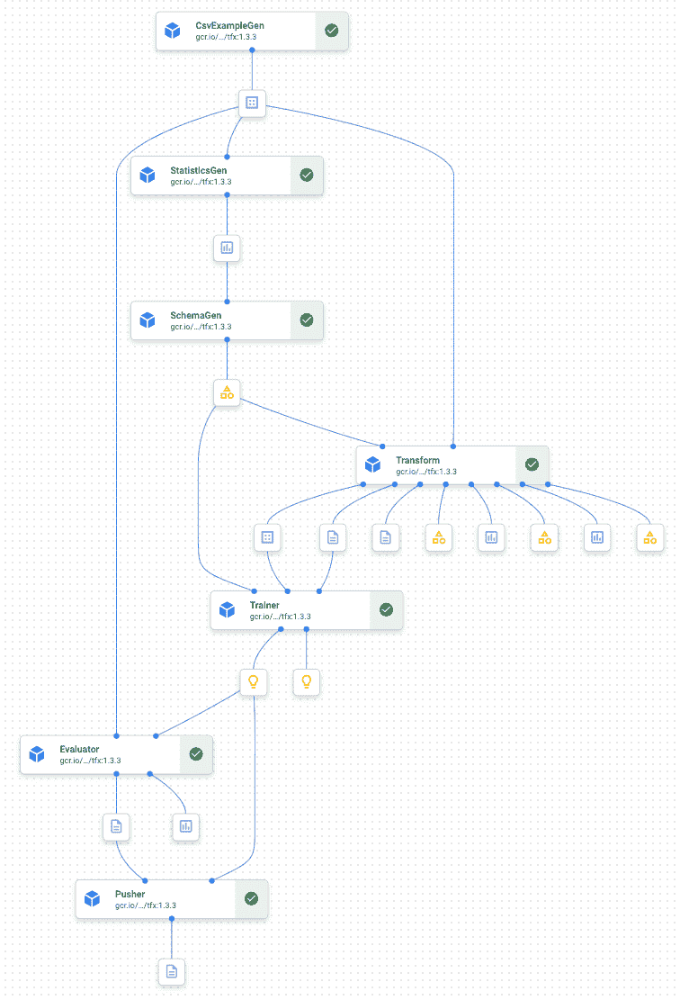

# 用对话流 CX，TFX 和顶点人工智能增强一个服务台聊天机器人

> 原文：<https://medium.com/google-cloud/boost-up-a-helpdesk-chatbot-with-dialogflow-cx-tfx-and-vertex-ai-4999c26eef13?source=collection_archive---------4----------------------->

*与* [合作撰写*加布里埃*合作撰写](https://medium.com/u/8f61f3a4e09c?source=post_page-----4999c26eef13--------------------------------)


图一。团队和文章的内容

## 好吧，你说，我听！

关于 Google Cloud 上的 [**数据科学你有什么想看的想法吗？请填写这张表格**](https://cloud.google.com/data-science) 让我知道。这将对我以后的博客帖子有所帮助=)

## 放弃

本文假设了一些关于 TFX、顶点人工智能和对话流的先验知识。我建议观看谷歌云开发人员宣传团队的这些视频，快速更新主要概念:

*   [这个 TFX 到底是什么东西？(TensorFlow Extended)](https://www.youtube.com/watch?v=Mxk4qmO_1B4&list=PLQY2H8rRoyvxR15n04JiW0ezF5HQRs_8F&index=3) 和[TFX 管道是如何工作的？(TensorFlow Extended)](https://www.youtube.com/watch?v=iVKa8SZQdPI&list=PLQY2H8rRoyvxR15n04JiW0ezF5HQRs_8F&index=3) 作者[罗伯特·克罗](https://twitter.com/robert_crowe?lang=en)
*   [MLOps 和顶点流水线介绍](https://www.youtube.com/watch?v=Jrh-QLrVCvM)和[什么是 Dialogflow CX？](https://www.youtube.com/watch?v=6_Gilug2QYw)作者[普里扬卡·韦尔加迪亚](https://twitter.com/pvergadia)

## 前提

最近，我和 Gabriele Randelli 讨论了将 Vertex AI 与谷歌云的其他服务整合的想法。我们都提出了不同的场景(我们希望在接下来的文章中讨论),但最终我们都提出了这个问题

> 用基于 Vertex AI 训练的 ML 模型来增强一个用 Dialogflow CX 构建的简单聊天机器人不是很棒吗？

在本文中，我们将说明如何形式化张量流模型训练，以便通过顶点管道上的 TFX 来运行它。然后，我们将使用 [Dialogflow CX](https://cloud.google.com/dialogflow/cx/docs/basics) 描述一个简单的聊天机器人，我们将学习如何将训练好的模型与它集成，以便在用户与聊天机器人交互时为他/她提供预测。

## 我们的场景

作为我在上一篇文章的[中描述的数据科学团队的成员之一，贵公司提供了一个云原生应用程序来帮助其客户。但是，过了一段时间，客户给了**不好的反馈，说要等很长时间才能得到呼叫中心的帮助。**](/google-cloud/sparkling-vertex-ai-pipeline-cfe6e19334f7)


图二。客户反馈

由于投资巨大，**公司决定释放更多资源，利用 ML 功能来改善客户服务**。特别是，他们认为聊天机器人和 NLP 技术已经达到了构建商业应用程序的成熟水平。这就是为什么他们最近雇佣了一名会话科学家和一名会话工程师。但是，与此同时，他们指望你用人工智能聊天机器人来建立一个概念证明。

**作为 KPI** ，**企业希望提高遏制率**，从而减少等待时间，改善整体客户服务。幸运的是，由于 Dialogflow 和 Vertex AI，您迁移到的云平台 Google Cloud 可以帮助他们锁定 KPI 目标。

通过 **Dialogflow CX，对话团队获得了一个设计、构建和测试聊天机器人和语音机器人的综合平台**。除了所有关键功能，他们还欣赏它具有可视化的流程构建器，并且集成了最新的基于 BERT 的自然语言理解(NLU)模型。通过这种方式，他们可以合作并专注于提供最佳的对话体验，因为这将是在更复杂的用例中准确有效地识别意图和上下文的模型。

同时，**您需要一个 ML 管道框架，允许您轻松地大规模部署高级 Tensorflow 模型**。 [**Tensorflow Extended** (简称 TFX)](https://www.tensorflow.org/tfx/guide)平台使您能够在测试和生产环境中部署自动化管道。它为常见步骤(如数据接收、数据验证和培训)提供了预构建的组件。每一步都有明确的定义，它有一组清晰的输入和输出，并且是专为可扩展的高性能机器学习任务而设计的。你知道吗，Vertex AI Pipeline 原生支持其 TFX SDK。您可以使用 Python 和 TFX 来定义 ML 管道，然后在 Vertex AI 上以无服务器的方式执行管道。

## 我们的数据集

**为了模拟场景**，我们决定使用**服务台问题**数据集。数据集由几个变量组成，如支持人员的资历和经验级别以及问题的类别或类型。目标变量由解决时间表示，即解决特定问题所需的时间。下面您可以看到我们使用的帮助台问题数据集的视图。

## 当 TFX 遇到对话流 CX:我们的 ML 系统的服务台聊天机器人

我们开始评估架构和组件，如果有人需要在现实生活中实现这样的系统，我们会使用这些组件。我们假设

*   **张量流模型不具备生产质量**

我们真的想重点了解数据科学家是否以及如何需要创建一个 TF 预处理和训练任务，以便在相应的 TFX 组件中使用它。

*   **TFX 管道将尽可能干燥**

我们假设 ML 工程师第一次采用该框架，我们真的希望在像这样的 POC 场景中保持简单。

*   **这个场景不是关于构建一个机器人。**

这就是为什么我们要重用[一个带有 Dialogflow 的帮助台聊天机器人& BigQuery ML](https://github.com/gmikels/cloud-dialogflow-bqml) Dialogflow 项目。但我们修改了履行代码，以便使用部署在顶点人工智能端点的模型生成的预测。

说到这里，让我们深入研究一下我们实现的 ML 系统的细节。

## 预处理。改造，训练。验证。用力。重复一遍。

正如我们之前提到的，我们实施的 TFX 管道具有关键组件:

*   an***example _ gen***消费 csv 文件，生成训练和评估拆分为 tf。基于我们设置的 output_config 的示例消息(⅔培训，⅓评估)。
*   A ***statistics_gen*** 生成训练和服务数据的特征统计，这允许我们验证样本的变量分布，并查看一些计算出的统计，以便进行数据处理和数据分析。


图 3。统计生成训练和评估样本的输出统计

*   ***schema_gen*** 使用 *statistics_gen* 组件的输出来推断模式，即与 dataset⁴.相关联的特征值、值范围和其他属性的数据类型
*   ***转换*** 允许我们应用缺失插补逻辑，生成词汇并将其应用于分类插补，并将数值变量缩放至范围[0，1]。为了做到这一点，我们需要提供一个用户定义的*预处理 _fn* 。这是两个组件中的一个(另一个是*训练器*)，数据科学家需要将他的实验代码调整到 TFX 组件所要求的格式。

```
def preprocessing_fn(inputs):
    """tf.transform's callback function for preprocessing inputs.
    We assume not using feature store in this example
  Args:
    inputs: map from feature keys to raw not-yet-transformed features.
  Returns:
    Map from string feature key to transformed feature operations.
  """

    outputs = {}

    # generate the vocabulary and apply it for categorical imputation
    for key in _CATEGORICAL_VARIABLES:
        outputs[key] = \
            tft.compute_and_apply_vocabulary(_fill_in_missing(inputs[key]))

    # scale numerical variables to have range [0,1]
    for key in _NUMERICAL_VARIABLES:
        outputs[key] = tft.scale_to_0_1(_fill_in_missing(inputs[key]))
```

*   与前面的组件一样， ***训练器*** 需要一个用户自定义的、符合组件需求的训练模块文件。例如，在我们的例子中，我们构建一个定制的 Keras 模型，并使用 *custom_executor_spec* 中的 *GenericExecutor* 在 TFX 内部对其进行本地训练。然后，[根据文档](https://www.tensorflow.org/tfx/guide/trainer)，需要一个 *run_fn* 函数。您可以在下面找到我们在培训模块中定义的内容:

```
# TFX will call this function
def run_fn(fn_args):
    """A function to train the model based on given args.
    Args:
      fn_args: training args as name/value pairs.
    """
    train_batch_size = 100
    eval_batch_size = 100

    # read the preprocessing data in order to speed up training process
    tf_transform_output = \
        tft.TFTransformOutput(fn_args.transform_output)

    # ingest the transformed data and prepare training and evaluation dataset
    train_input_fn = _input_fn(fn_args.train_files,
                               fn_args.data_accessor,      tf_transform_output,
                               batch_size=train_batch_size)  # pylint: disable=g-long-lambda

    eval_input_fn = _input_fn(fn_args.eval_files,
                              fn_args.data_accessor, tf_transform_output,
                              batch_size=eval_batch_size)  # pylint: disable=g-long-lambda

    # build the model
    model = _build_simple_dnn_regressor()

    # define callback for TensorBoard
    tensorboard_callback = tf.keras.callbacks.TensorBoard(
        log_dir=fn_args.model_run_dir, update_freq='batch')

    # fit the model
    model.fit(
        train_input_fn,
        steps_per_epoch=fn_args.train_steps,
        validation_data=eval_input_fn,
        validation_steps=fn_args.eval_steps,
        callbacks=[tensorboard_callback])

    # read the feature spec to integrate in the serving function
    feature_spec = tf_transform_output.raw_feature_spec()
    features_input_signature = {
        feature_name:
            tf.TensorSpec(
                shape=(None, 1), dtype=spec.dtype, name=feature_name
            )
        for feature_name, spec in feature_spec.items()
        if feature_name in _FEATURE_NAMES
    }
    # define the signature
    signatures = {
        'serving_default':
            _get_serve_tf_fn(model,
                             tf_transform_output).get_concrete_function(
                features_input_signature)
    }
    # save the model
    model.save(fn_args.serving_model_dir, save_format='tf', signatures=signatures)
```

在哪里

*   *_input_fn* 生成特征和标签
*   *_ build _ simple _ dnn _ regressor*定义特征列并建立模型
*   *_get_serve_tf_fn* 解析一个序列化的 tf。示例和应用 TFT

请注意

*   在训练过程中，我们使用预处理数据 *tf_transform_output* 来减少训练时间。
*   因为我们希望将模型提供给顶点端点，所以我们还提供了一个定制的 *serving_default* 签名，它将集成转换图，并允许模型正确得分。

最后，组件使用带有训练和评估示例的模块、训练参数和评估参数的 Protobuf 定义、由 *schema_gen* 组件创建的模式和由上游*转换*组件生成的转换图，并训练模型。

*   ***评估器*** 利用来自 *example_gen* 的数据、来自训练器的训练模型以及 *EvalConfig* 配置计算模型性能指标，并返回性能结果和验证结果。关于 *EvalConfig* ，我们明确了 *model_spec* 来表示目标变量和服务签名。我们还设置了 *metrics_specs* 在 Keras*mean _ absolute _ error*指标上设置了 *GenericValueThreshold* 。最后，我们将 *slicing_specs* 留空以考虑整个数据集。一旦您运行它，因为模型的准确性满足评估标准，模型是“受祝福的”,也就是说它可以被部署


图 4。该模型是“有福的”

*   ***推进器*** 是 TFX 管道的最后一步。它只是检查模型是否通过了验证，然后将模型导出到 *_serving_model_dir* 。

下面你可以看到我用 ***run*** 方法定义的 ***管道*** 类，它允许我在本地和顶点 AI 管道上运行它

```
class Pipeline:
    """
    The Pipeline class generalizes a pipeline definition in order to run it
    both on prem and on cloud.
    """

    def __init__(self,
                 runner: str,
                 pipeline_name: str,
                 pipeline_root: str,
                 data_root: str,
                 modules_path: str,
                 serving_model_dir: str,
                 metadata_path: str,
                 project_id=None,
                 region=None,
                 pipeline_definition=None):

        self.pipeline = None
        self.runner = runner
        self.pipeline_name = pipeline_name
        self.pipeline_root = pipeline_root
        self.data_root = data_root
        self.modules_path = modules_path
        self.serving_model_dir = serving_model_dir
        self.metadata_path = metadata_path
        self.transform_filepath = f'{self.modules_path}/{TRANSFORM_MODULE}'
        self.trainer_filepath = f'{self.modules_path}/{TRAINER_MODULE}'
        self.train_num_steps = 2000
        self.eval_num_steps = 1000
        self.components = []
        if self.runner == 'KubeflowRunner':
            self.project_id = project_id
            self.region = region
            self.pipeline_definition = pipeline_definition

        # ExampleGen
        example_gen = tfx.components.CsvExampleGen(input_base=self.data_root,
                                                   output_config=EXAMPLE_GEN_OUTPUT_CONFIG)

        # StatisticsGen
        statistics_gen = tfx.components.StatisticsGen(
            examples=example_gen.outputs['examples']
        )

        # SchemaGen
        schema_gen = tfx.components.SchemaGen(
            statistics=statistics_gen.outputs['statistics'],
            infer_feature_shape=True)

        # Transform
        transform = tfx.components.Transform(
            examples=example_gen.outputs['examples'],
            schema=schema_gen.outputs['schema'],
            module_file=self.transform_filepath)

        # Trainer
        trainer = tfx.components.Trainer(
            module_file=self.trainer_filepath,
            examples=transform.outputs['transformed_examples'],
            schema=schema_gen.outputs['schema'],
            transform_graph=transform.outputs['transform_graph'],
            train_args=tfx.proto.TrainArgs(num_steps=self.train_num_steps),
            eval_args=tfx.proto.EvalArgs(num_steps=self.eval_num_steps))

        # Evaluator
        evaluator = tfx.components.Evaluator(
            examples=example_gen.outputs['examples'],
            model=trainer.outputs['model'],
            eval_config=EVALUATOR_CONFIG)

        with conditional.Cond(evaluator.outputs['blessing'].future()
                              [0].custom_property('blessed') == 1):

            # Pusher
            pusher = tfx.components.Pusher(
                model=trainer.outputs['model'],
                model_blessing=evaluator.outputs['blessing'],
                push_destination=tfx.proto.PushDestination(
                    filesystem=tfx.proto.PushDestination.Filesystem(
                        base_directory=self.serving_model_dir)))

        # prepare components
        self.components = [example_gen,
                           statistics_gen,
                           schema_gen,
                           transform,
                           trainer,
                           evaluator,
                           pusher]

        # build pipeline
        if self.runner == 'KubeflowRunner':
            self.pipeline = tfx.dsl.Pipeline(
                pipeline_name=self.pipeline_name,
                pipeline_root=self.pipeline_root,
                components=self.components)
        else:
            self.pipeline = tfx.dsl.Pipeline(
                pipeline_name=self.pipeline_name,
                pipeline_root=self.pipeline_root,
                components=self.components,
                metadata_connection_config=tfx.orchestration.metadata
                    .sqlite_metadata_connection_config(self.metadata_path),
                beam_pipeline_args=BEAM_PIPELINE_ARGS_RUNNER[self.runner])

    def run(self):
        if self.runner == 'KubeflowRunner':
            self.runner_instance = tfx.orchestration.experimental.KubeflowV2DagRunner(
                config=tfx.orchestration.experimental.KubeflowV2DagRunnerConfig(),
                output_filename=self.pipeline_definition)
            _ = self.runner_instance.run(self.pipeline)
            vertex_ai.init(project=self.project_id, location=self.region)
            pipeline_job = vertex_ai.PipelineJob(
                          display_name=self.pipeline_name,
                          template_path=self.pipeline_definition,
                          pipeline_root=self.pipeline_root
                      )
            pipeline_job.run(sync=False)
        else:
            self.runner_instance = tfx.orchestration.LocalDagRunner()
            _ = self.runner_instance.run(self.pipeline)
```

这是当你把管道提交给顶点 AI 时，执行图的样子



图 5。顶点人工智能管道的执行图

最后，一旦我们训练了模型，我们可以使用 [Vertex Python SDK](https://cloud.google.com/vertex-ai/docs/predictions/deploy-model-api) 轻松部署。然后，它将能够对任何来源传递的实例进行评分，甚至包括来自 Dialogflow CX 聊天机器人的实例。

## “嗨，我有一个技术问题”


图 6。服务台聊天机器人

如前所述，本文的目的不是设计一个复杂和专业的虚拟代理，因此它的结构刻意保持简单。

**我们的虚拟代理代表了一个典型的面向客户的一级(L1)支持代理**，其范围是收集客户的支持请求，获取关于问题的基本描述，最终提交支持单并提供关于解决时间的估计。特别是，在这个特定的场景中，问题的类别是虚拟代理要求什么(例如，性能、计费、技术、认证)。

使用 Dialogflow CX，我们可以通过设计对话流来轻松构建企业级对话代理，每个对话流都由多个对话回合组成。客户的每一句话都被自动分类到一个可能的意图列表中，这些意图是在 Dialogflow CX GUI 中定义的，无需编写任何代码。

在我们的具体示例中，代理被构造为单个对话流，由以下几轮组成:

1.  问候(虚拟代理)和票证请求(客户)
2.  问题信息的收集。特别是，虚拟代理仅询问问题类别
3.  **确认收集的信息和提交的票据，并报告预计的解决时间。**
4.  对话结束

这听起来很容易，但是**虚拟代理如何推断估计的解决时间？**

为了满足这个请求，虚拟代理需要与我们的后端系统交互，以获得每个特定问题的估计解决时间，并将其返回给客户。**使用 Dialogflow CX，这是由**[**web hooks**](https://cloud.google.com/dialogflow/cx/docs/concept/webhook)**启用的。**

Webhooks 使用 Dialogflow CX 的自然语言处理提取的数据来生成动态响应，验证收集的数据，或触发后端的操作。简而言之，webhook 是一种向后端系统触发 HTTPS 请求的服务。


图 7。Dialogflow CX 中的 webhook 视图

**后端是如何通过 webhooks 处理来自 Dialogflow CX 的请求的？**

**一个直截了当的方法是用谷歌的** [**云功能**](https://cloud.google.com/functions) ，我们的功能即服务(FaaS)框架，实现所有的业务逻辑来服务推理阶段。这种架构的一个主要好处是确保业务逻辑本身和使用 Vertex AI 部署的机器学习服务之间的解耦。举个例子，将来我们可以增加相同的云功能，在不影响 ML 端点的情况下从我们的 CRM 系统获取额外的信息。

在所有支持的编程语言中，我们选择了 Node.js。做出这一选择的一个重要原因是 Vertex AI 提供了一个非常灵活的 Node.js API 。

**云功能的架构由**以下组件组成:

*   ***index . js***:*node . js 中的功能实现*
*   ****package.json*** :包装函数依赖关系的元数据文件，用 [*npm*](https://docs.npmjs.com/) 管理*

**package.json* 记录了我们的两个依赖项:Vertex AI，用于调用估计解析时间的预测；dialog flow CX，用于解析和管理来自虚拟代理的 webhook 的请求:*

```
*"dependencies": {
   "@google-cloud/dialogflow-cx": "^2.4.0",
   "@google-cloud/aiplatform": "^1.12.0"
 }*
```

*至于函数本身，有几个方面值得澄清:*

*   *为了保持虚拟代理的简单性，以及不要用多个问题来打扰客户，虚拟代理只收集问题类别(例如，技术、计费等)。ML 端点所需的所有其他特征(资历、优先级、经验等)都已硬编码。将来，最好的方法是通过查询公司的后端系统来获取这些附加功能*
*   *为了将请求提交给预测端点，我们依靠助手来正确格式化请求负载。帮助器对于摆脱表示转换非常有用，这在 Node.js 中可能很棘手*
*   *功能实现最重要的方面是负责在线预测和可解释请求的 [*预测服务*](https://cloud.google.com/vertex-ai/docs/reference/rpc/google.cloud.aiplatform.v1#predictionservice)*

*下面我们报告云函数实现的预测片段:*

```
*async function getPredictionRequest(category) {
    // Configure the parent resource
    const endpoint = `projects/${projectId}/locations/${location}/endpoints/${endpointId}`;
    // Set empty parameters 
    const parameters = {
      structValue: {// TODO
        // fields: {category: {stringValue: category}}} 
      },
    };// Set the instance value. For simplicity, we pass one input (category). 
    // In the real world, you can pass multiple inputs. 
    // In case of caller inputs, they would be collected from 
    // Bigtable. In case of ticket inputs, they would be passed by the Dialogflow agent.
    const instanceValue = {
      seniority: [12],
      experience: ['3-Advanced'],
      category: [category],
      type: ['Request'],
      impact: ['4-Critical'],
      priority: ['P1']
    };

    const instance = helpers.toValue(instanceValue);

    const instances = [instance];
    const request = {
      endpoint,
      instances,
      parameters,
    };

    return request;
}

async function getResolutionTime(request) {

    // Declare the ResolutionTime constant.
    var resolutionTime = 1;

    // Specifies the location of the api endpoint
    const clientOptions = {
        apiEndpoint: 'us-central1-aiplatform.googleapis.com',
    };

    // Instantiates a client
    const predictionServiceClient = new PredictionServiceClient(clientOptions);

    // Predict request
    const [response] = await predictionServiceClient.predict(request);

    console.log('Predict custom trained model response');
    console.log(`\tDeployed model id : ${response.deployedModelId}`);
    const predictions = response.predictions;
    console.log('\tPredictions :');
    for (const prediction of predictions) {
      resolutionTime = JSON.stringify(prediction.listValue.values[0].numberValue);
      console.log(`\t\tPrediction : ${resolutionTime}`);
    }
    return parseInt(resolutionTime);
  }*
```

*最后，在您成功部署完成后，虚拟代理将票据信息传递给端点，收集解决时间估计值并将其提供给客户。为了更好地理解，下面你会看到我们用 Dialogflow CX 模拟器模拟的一段对话。*

**

*图 8。Dialogflow CX 模拟器中的模拟对话*

## *MLOps 优势:通过简单的云构建管道实现模型服务自动化*

*在真实的场景中，一旦您用管道训练了模型，并将其版本化到模型注册中心，就应该部署它了。现在，**模型部署需要大量的测试和验证步骤，在模型到达服务环境之前需要一次又一次地重复**。出于这个原因，您将构建一个 **CI/CD 管道系统**。使用该系统，您可以验证、测试、集成模型和服务，并最终部署它们(运行时和模型)。*

**

*图 9。服务于 Process⁵.的模型的高级概述*

*也就是说，作为本文的额外部分，我实现了**一个具有云功能和云构建的 CI/CD 模型部署管道的简单示例。***

*特别是，云构建管道将*

1.  *从谷歌云存储中下载模型人工制品*
2.  *为测试构建运行时环境*
3.  *运行预测单元测试*
4.  *使用临时顶点 AI 端点运行集成*
5.  *将模型部署到目标顶点 AI 端点*

*请注意，为了简单起见，我使用 staging 作为生产环境。此外，这只是一个简单的例子，没有虚饰。正如“[MLOps 实践者指南:机器学习的连续交付和自动化框架](https://cloud.google.com/resources/mlops-whitepaper)中所述，这些 CI/CD 模式可能需要一个复杂的渐进交付过程来验证兼容性、延迟和吞吐量，这意味着还要进行几次测试。*

*下面你可以找到我创建的 get_build 函数，它使用[*Google-Cloud-Build*](https://googleapis.dev/python/cloudbuild/latest/index.html)Python SDK 来构建云构建的模型部署管道:*

```
*def get_build(project_id, region, bucket, source, model_uri, model_path, serving_signature, model_name, serving_image_uri,
endpoint_name, timeout):
    """
    An utility function to get a build object 
    Args:
        project_id: The name of the project
        region: The name of the region
        bucket: The name of the bucket
        source: The GCS uri of the source code 
        model_uri: The GCS uri of the model 
        model_path: The path of the model 
        serving_signature: The default signature to deploy the model
        model_name: The model name 
        serving_image_uri: The serving image uri
        endpoint_name: The name of endpoint
        timeout: The timeout of cloud build

    Returns: build object

    """
    build = cloudbuild_v1.Build()
    build.source = Source(storage_source=StorageSource(bucket=bucket,
                                                       object_=source))
    build.steps = [

        {"name": 'gcr.io/google.com/cloudsdktool/cloud-sdk',
         "args": ['gsutil', '-m', 'cp', '-r', '${_MODEL_URI}', '.'],
         "id": 'Download model'},

        {"name": 'gcr.io/deeplearning-platform-release/tf-cpu.2-7:latest',
         "entrypoint": "pip",
         "args": ["install", "-r", "build/deployment/requirements.txt", "--user"],
         "id": 'Install requirements',
         "wait_for": ['Download model']},

        {"name": 'gcr.io/deeplearning-platform-release/tf-cpu.2-7:latest',
         "entrypoint": "python",
         "args": ["-m", "pytest", 'build/deployment/src/test_model.py'],
         "env": ['MODEL_PATH=${_MODEL_PATH}', 'SERVING_SIGNATURE=${_SERVING_SIGNATURE}'],
         "id": 'Run unit test',
         "wait_for": ['Install requirements']
         },

        {
            "name": 'gcr.io/deeplearning-platform-release/tf-cpu.2-7:latest',
            "entrypoint": "python",
            "args": ["-m", "pytest", 'build/deployment/src/test_endpoint.py'],
            "env": ['PROJECT_ID=${_PROJECT_ID}', 'REGION=${_REGION}',
                    'MODEL_NAME=${_MODEL_NAME}', 'ARTIFACT_URI=${_MODEL_URI}',
                    'SERVING_IMAGE_URI=${_SERVING_IMAGE_URI}', 'ENDPOINT_NAME=${_ENDPOINT_NAME}'],
            "id": 'Run integration test',
            "wait_for": ['Run unit test']
        },

        {
            "name": 'gcr.io/deeplearning-platform-release/tf-cpu.2-7:latest',
            "entrypoint": "python",
            "args": ['build/deployment/src/deploy.py'],
            "env": ['PROJECT_ID=${_PROJECT_ID}', 'REGION=${_REGION}',
                    'MODEL_NAME=${_MODEL_NAME}', 'ARTIFACT_URI=${_MODEL_URI}',
                    'SERVING_IMAGE_URI=${_SERVING_IMAGE_URI}', 'ENDPOINT_NAME=${_ENDPOINT_NAME}'],
            "id": 'Deploy the validated model',
            "wait_for": ['Run integration test']
        }

    ]
    build.substitutions = {'_PROJECT_ID': project_id,
                           '_REGION': region,
                           '_MODEL_URI': model_uri,
                           '_MODEL_PATH': model_path,
                           '_SERVING_SIGNATURE': serving_signature,
                           '_MODEL_NAME': model_name,
                           '_SERVING_IMAGE_URI': serving_image_uri,
                           '_ENDPOINT_NAME': endpoint_name
                           }
    build.timeout = Duration(seconds=timeout)
    return build*
```

*然后，每次新的模型将被构建并存储在目标存储桶路径中时，云函数将触发一个新的构建管道实例。*

*下面您可以看到部署成功运行后的结果。*

**

*图 10。成功建模部署的云构建视图*

## *下一步是什么*

*在本文中，我们探索了如何使用顶点管道上训练的 ML 模型来增强用 Dialogflow CX 构建的简单聊天机器人。*

*出于学习目的，我们决定使用 Tensorflow 来训练模型，并使用 Tensorflow Extended(又名 TFX)框架来操作它。*

*我们都从这次经历中学到了很多。*

*首先，我们理解了在混合模式下工作的重要性，为了成功地交付一个模型，模型实验和模型工程需要合作。关于这个话题，你可以在这里找到一篇来自谷歌的有趣文章。*

*第二，我个人喜欢 TFX。我发现它是一致的，并体验了它在加速张量流模型的 MLOps 过程中的潜在价值。它与 Vertex AI 的集成几乎是免费的。因此，我将继续对它进行试验，以探索其他组件和功能。*

*第三，我们不知道 VertexAI NodeJS SDK。多亏了这个演示，我们现在=)*

***当然，这并不是故事的结尾**。正如你所想象的，这是一个完美的用例，可以实现一个可靠的再培训过程。*

> *您部署虚拟代理。它有效地支持客户节省时间和改善客户体验。收集请求所节省的时间会影响解决特定问题的时间，从而影响模型的性能。则因此需要触发新的模型训练管道。最后，一旦你得到这个模型，你将有一个从 A 版本到 B 版本的过渡期。*

*到目前为止，我的描述引发了许多问题，例如*

*   ***我们如何设计再培训管道流程？***
*   ***我们如何在模型服务中实现流量分割？***
*   ***我们如何衡量和管理** [**反馈循环效应**](https://developers.google.com/machine-learning/guides/rules-of-ml#rule_36_avoid_feedback_loops_with_positional_features) 的效果？*

*所有有趣的挑战都需要用适当的解决方案来解决。不是吗？*

*现在，我希望你喜欢这篇文章。如果有，就鼓掌或者留言评论。如果你想知道以上问题的答案，就在 [LinkedIn](https://www.linkedin.com/in/ivan-nardini/) 或 [Twitter](https://twitter.com/IlNardo92) 上告诉我们，让我们一起讨论。*

*直到下一个帖子…*

**感谢 Camus Ma 和 Hussain Chinoy 的宝贵反馈。**

## ***参考文献***

1.  *[https://www.tensorflow.org/guide](https://www.tensorflow.org/guide)*
2.  *[https://www.tensorflow.org/tfx/guide](https://www.tensorflow.org/tfx/guide)*
3.  *[https://cloud . Google . com/vertex-ai/docs/start/简介-统一-平台](https://cloud.google.com/vertex-ai/docs/start/introduction-unified-platform)*
4.  *[https://cloud.google.com/dialogflow/cx/docs/basics](https://cloud.google.com/dialogflow/cx/docs/basics)*

*我们决定使用张量流和 TFX 进行学习。当然，同样的方法可以推广到其他使用 KFP 的 ML 框架。*

**包容率是指与虚拟助手进行交互，但未与人工代理交谈就离开的用户的百分比。高容纳率是一件好事，因为“被容纳”的电话可以防止客户浪费时间，并节省客户服务的宝贵资源。**

**对于 https://www.tensorflow.org/tfx/guide 组件文档:*[](https://www.tensorflow.org/tfx/guide)*

***⁴Notice，您可以手动定义模式并添加关于您的数据集的信息。通过这种方式，您可以定义自己的数据验证策略。更多关于 TFDV 的信息，*[*https://www.tensorflow.org/tfx/guide/tfdv*](https://www.tensorflow.org/tfx/guide/tfdv)**

***⁵The 图像是 MLOps 实践者指南中数字 8 的个人再现:机器学习的连续交付和自动化的框架***