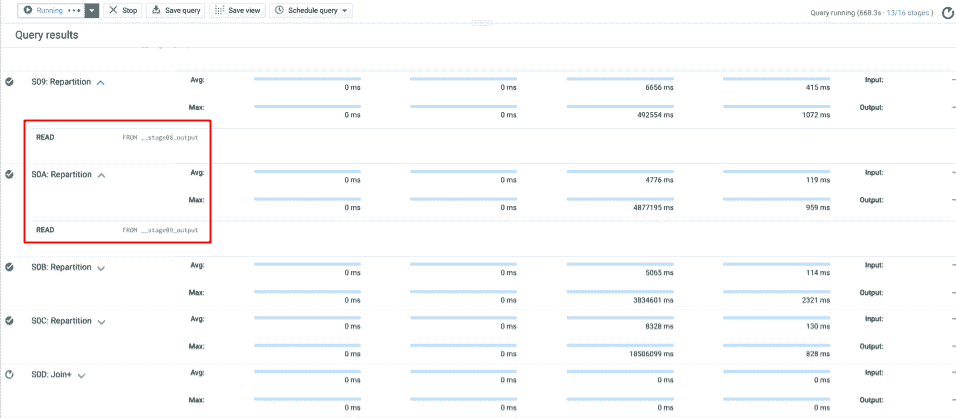
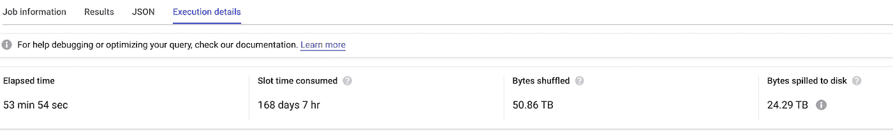
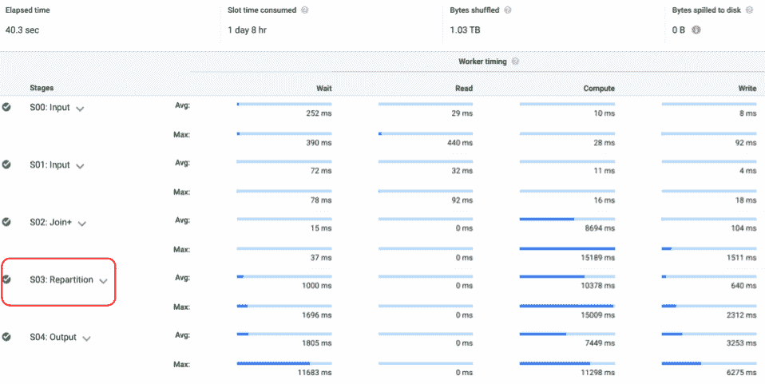
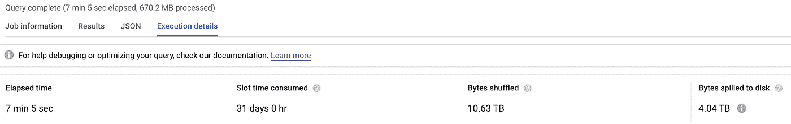

# 分解非常大的 BigQuery 作业

> 原文：<https://medium.com/google-cloud/breaking-up-very-large-bigquery-jobs-ea1ccc720a7?source=collection_archive---------1----------------------->

## 通过 BigQuery 脚本使用整数范围分区

我最近在处理一个 BigQuery 用例，它需要一个非常大的、[偏斜的、](https://cloud.google.com/bigquery/docs/best-practices-performance-patterns#data_skew)、多对多的连接，导致扇出超过 1800 亿条记录。受 2000 个[插槽](https://cloud.google.com/bigquery/docs/slots)限制的随需应变项目经常会在查询完成之前超时。[查询计划](https://cloud.google.com/bigquery/query-plan-explanation)将此问题识别为字节溢出到磁盘和流水线重新分区阶段，其中一个重新分区阶段的输出是另一个重新分区阶段的输入。



*流水线再分配:级 0A 读取级 09 的输出*

这里有一个关于如何解决这些问题的快速教程；使用 BigQuery 的[脚本](https://cloud.google.com/bigquery/docs/reference/standard-sql/scripting)和 i [整数范围分区](https://cloud.google.com/bigquery/docs/creating-integer-range-partitions)特性来有效地分解大型查询。

## **设置**

BigQuery 的 OpenStreetMap (OSM)公共数据集提供了一个方便的示例数据集来执行具有高扇出的昂贵连接，例如地理空间距离上的连接。为了使数据集更易于管理，我过滤了丹麦(国家代码:DK)节点上的数据，丹麦有高度集中的 OSM 节点条目。

```
CREATE TABLE `mydataset.osm_nodes_dk`
AS 
(
  SELECT *
  FROM `bigquery-public-data.geo_openstreetmap.planet_nodes`
  WHERE EXISTS (
    SELECT 1
    FROM unnest(all_tags)
    WHERE key = 'addr:country'
    AND value = 'DK'
  )
)
```

目标是将每个实体连接到数据集中所有相关的实体，这样服务就可以比较每个匹配对的内容。随着表大小的增加，用于相互比较的查询作业的规模呈指数增长。

*作者注:相似性搜索，以及他们创建的固有的* [*交叉连接*](https://cloud.google.com/bigquery/docs/best-practices-performance-patterns#cross_joins_cartesian_product) *，并不是地理空间数据所独有的，可以在零售、通过相关产品代码匹配销售或* [*模糊文本匹配*](/google-cloud/a-journey-into-bigquery-fuzzy-matching-1-of-1-soundex-b5b89087eae2) *等领域中看到。*

```
select
    a.id,
    a.geometry,
    a.all_tags,
    b.id as comp_id,
    b.geometry as comp_geo,
    b.all_tags as comp_tags
FROM
    `mydataset.osm_nodes_dk` a
INNER JOIN
    `mydataset.osm_nodes_dk` b
ON
    ST_DISTANCE(a.geometry, b.geometry) <= 5000
```



54 分钟和 24TB 的泄漏

这个基本查询适用于几百万条记录，但当表的大小增长到几十或几亿条记录时，这个查询就会失败。正如以这种方式查询完整的`bigquery-public-data.geo_openstreetmap.planet_nodes`表所看到的。

## 拆分大型查询作业

为了防止磁盘溢出，理想的做法是在与整个表集进行比较时，一次有效地寻址表的一块。寻址整数范围分区很容易编写脚本，并且在查询谓词中使用时可以立即删除记录。

BigQuery 表被限制在 [4000 个分区](https://cloud.google.com/bigquery/quotas#partitioned_tables)；该 DDL 语句将创建该表的分区版本。添加的 range_id 列将是一个介于 0 和 3999 之间的确定值，并且应该在数据允许的范围内均匀分布。下面使用的技术借用了这个[博客](/google-cloud/partition-on-any-field-with-bigquery-840f8aa1aaab)。

```
CREATE TABLE `mydataset.osm_dk_irp`
PARTITION BY RANGE_BUCKET(range_id, GENERATE_ARRAY(0, 3999, 1))
AS (
  SELECT *, 
      ABS(MOD(FARM_FINGERPRINT(CAST(id as STRING)), 4000)) range_id 
  FROM `mydataset.osm_nodes_dk`
)
```

作业代码在 [**中汇编全部结果，而**循环](https://cloud.google.com/bigquery/docs/reference/standard-sql/scripting#while)；其中每次迭代过滤一个由增量变量确定大小的分区块。在执行完整作业之前，应该测试增量大小，使其不小于避免溢出和深度流水线重分区所需的大小。

```
DECLARE max_partition int64 DEFAULT 3999;
DECLARE increment int64 DEFAULT 50;
DECLARE start int64 DEFAULT 0;CREATE OR REPLACE TABLE `mydataset.osm_irp_join`
(
  id INT64,
  geometry GEOGRAPHY,
  all_tags ARRAY<STRUCT<key STRING, value STRING>>,
  comp_id INT64,
  comp_geo GEOGRAPHY,
  comp_tags ARRAY<STRUCT<key STRING, value STRING>>
);WHILE start <= max_partition DO

  INSERT INTO mydataset.osm_irp_join
    SELECT
      a.id,
      a.geometry,
      a.all_tags,
      b.id as comp_id,
      b.geometry as comp_geo,
      b.all_tags as comp_tags
    FROM 
      `mydataset.osm_dk_irp` a
    INNER JOIN 
      `mydataset.osm_dk_irp` b    
      ON 
        ST_DISTANCE(a.geometry, b.geometry) <= 5000
    WHERE 
      a.range_id between start and start + increment - 1; SET start = start + increment;END WHILE;--SELECT * FROM `mydataset.osm_irp_join`
```


*脚本作业运行时间不到 14 分钟，速度提高 70%*

仔细查看其中一个子作业的结果，没有溢出任何字节，只有一个重新分区阶段。该作业只需重组数据一次，并且可以完全在内存中完成。



## **选择增量大小**

我建议您使用不同的增量大小运行一些测试，以了解增量大小将如何影响您的性能。这些屏幕截图比较了该作业中分区范围为 50、250 和 500 的单个查询。随着增量大小的增加，总吞吐量应该会增加，但当字节溢出到磁盘时，总吞吐量可能会大幅下降。

*提示:BigQuery on-demand 不是一个干净的房间，等待时间和* [*突发*](https://cloud.google.com/bigquery/docs/release-notes#December_10_2019) *等不可预测的因素会影响您的结果。*

*   50 分 36 秒(1.38 秒/秒)，溢出 0 个字节
*   250: 2 分钟(每秒 2.08 秒)，溢出 0 个字节
*   500 分钟:7 分钟(每秒 1.19 秒)，溢出 4.04 TB



*增量 500 (7 分钟)*

## **最终想法**

BigQuery 动态重分发数据的能力允许它完成非常复杂的查询，而不需要任何额外的用户努力。但是，在有些情况下，被打乱的数据量会淹没可用的片段，从而导致溢出、连续的重新分区和查询时间变慢。

这里描述的技术应该与重写大型查询一起考虑，以使用像[分析函数](https://cloud.google.com/bigquery/docs/reference/standard-sql/analytic-function-concepts)这样的特性，并调用[预留 API](https://cloud.google.com/bigquery/docs/reservations-workload-management#getting-started-with-bigquery-reservations) 来分配适当数量的专用槽。