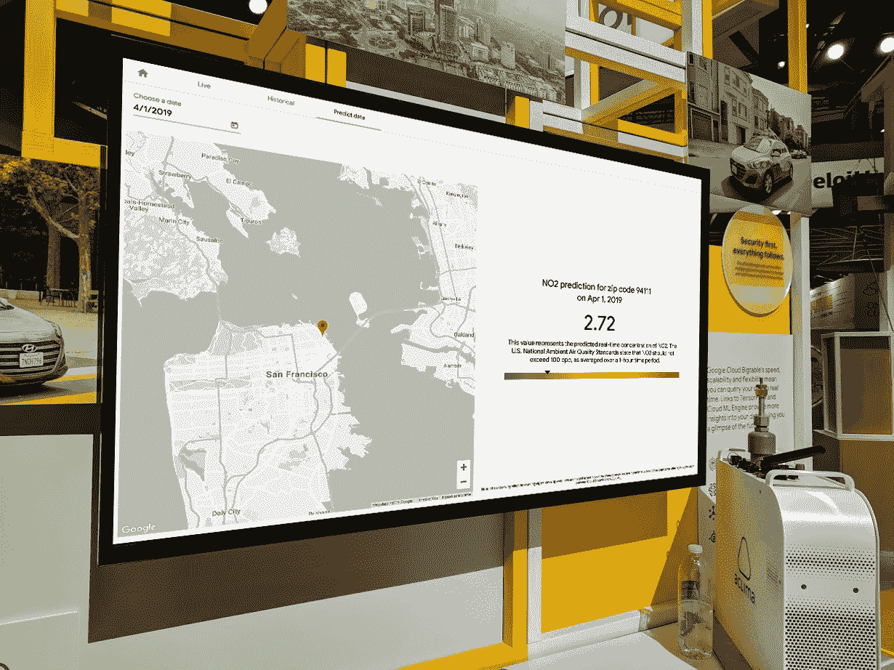
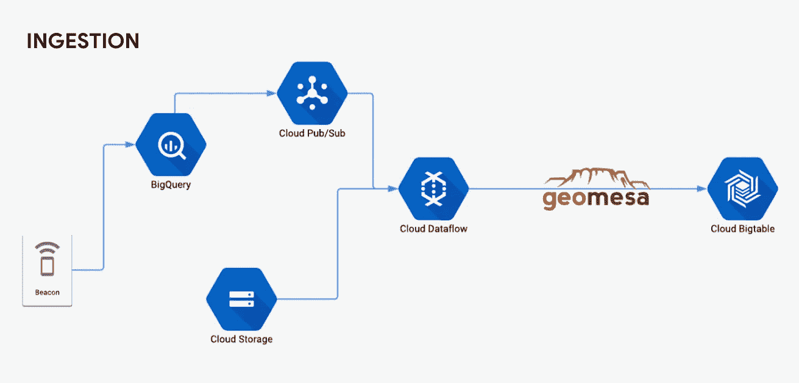
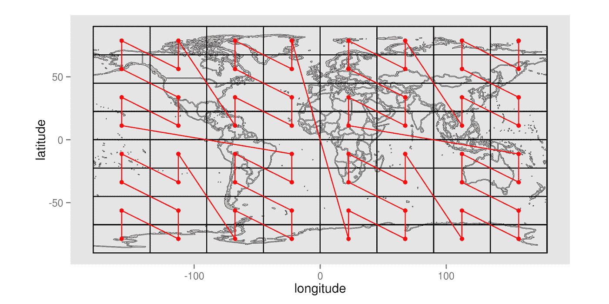
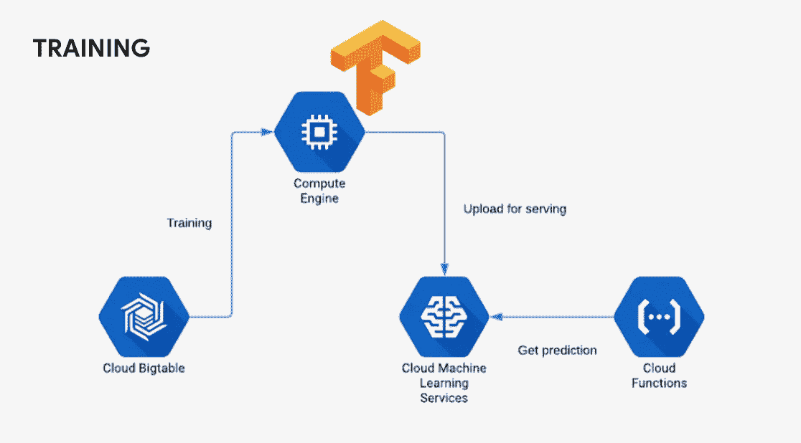
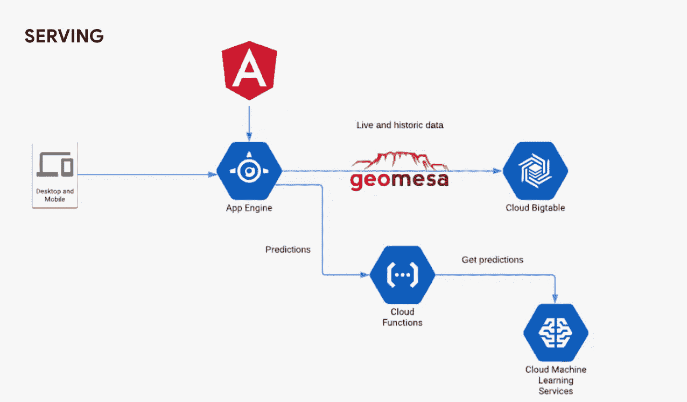
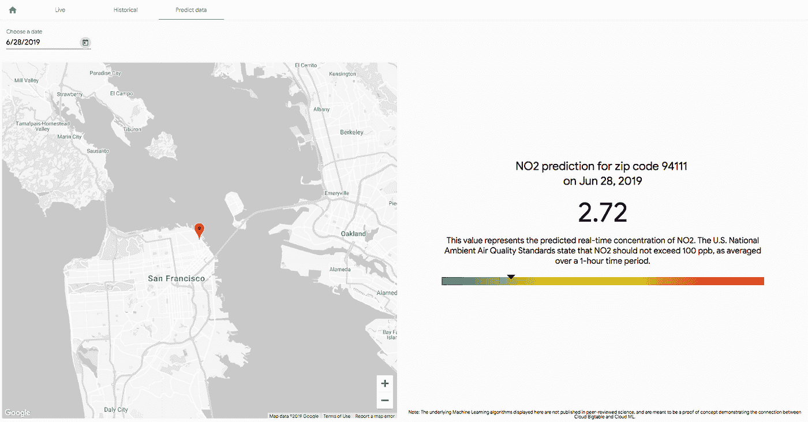

# 使用 Bigtable 轻松呼吸

> 原文：<https://medium.com/google-cloud/breathing-easy-with-bigtable-b58eb302cc1a?source=collection_archive---------1----------------------->

随着加州夏季野火季节正式开始(根据加州消防协会的说法，今年 5 月 20 日开始)，很难相信 2018 年营地火灾的破坏仅仅发生在六个月前。当时，空气质量非常糟糕，堪比世界上最严重的污染水平。鉴于最近物联网空气传感器的涌入，带有可怕的红色和紫色危险区域的实时空气质量地图在互联网上变得无处不在。

尽管这些传感器可能很精确，但它们中的大多数是静止的，位于建筑物的顶部。如果不在海湾地区(或任何其他有空气质量问题的地方)部署数百个传感器，肯定会有一些区域覆盖范围较小。如果有一种方法可以让这些传感器移动，实时处理数据，并在你工作时提供一些关于空气质量的历史和预测见解，那该多好。对吗？

这就是我们所做的。

在 Google Cloud NEXT 的前几个月，一些谷歌工程师与 [Aclima](https://cloud.google.com/customers/aclima/) 合作，利用他们的移动传感器网络设计了一个解决方案。认识到我们可以从根本上扩展我们现有的 [Airview 设置](https://sustainability.google/projects/airview/)，该设置将 Aclima 的空气监测设备放置在街景汽车中，我们使用他们的数据集进行实时历史和预测分析，这些分析被包装在一个交互式 web 应用程序中，并在 NEXT 上进行演示。我们是这样实现的。

*下一个展台展示 Aclima 传感器盒*

# 体系结构

Aclima 已经使用谷歌计算引擎(GCE)和 Kubernetes 将来自传感器的信息转化为数据点进行分析，并将其写入谷歌云存储和 BigQuery。但是对于我们心目中的实时分析解决方案，我们需要一些不同的东西。所以我们将目光投向了[云 Bigtable](https://cloud.google.com/bigtable/) ，这对于大型时序数据来说是理想的。我们知道 Bigtable 将能够轻松处理来自我们构建的应用程序的查询，以及来自 Aclima 传感器的写入，所有这些都在毫秒级延迟内。

我们的摄入管道相当简单。所有的传感器数据都由 Aclima 的管道进行校准，管道批量接收传感器数据，对其进行处理，并将其存储在 BigQuery 中。为此，我们附加了一个轻量级(又名，不是生产质量)程序，该程序将从 BigQuery 读取数据，并发布到 Pub/Sub 进行实时处理和可视化。从那里，我们的数据流管道从发布/订阅中提取数据，并将其发送到 HBase 集成的 [GeoMesa](https://www.geomesa.org/) 。处理完成后，数据将被写入 Bigtable。

摄入管道

从过去在 NEXT’17 上使用 GeoMesa [演示的经验，到我们为了](https://youtu.be/KaRbKdMInuc?t=2438)[帮助用户熟悉设计地理空间数据模式](https://codelabs.developers.google.com/codelabs/cloud-bigtable-intro-java/index.html#0)而建立的代码实验室，我们知道 GeoMesa 将有助于这种数据项目。由于标准的 Bigtable APIs 只允许按行(或某个范围的行)进行查询，因此创建更细微的查询需要计划、迭代和测试。然而，只需几行代码，GeoMesa 就可以将一个行 ID 系统设计成一个 Z 曲线，将纬度、经度和时间戳组合到您的数据集中，这样您就可以创建高性能的查询。

[*从几何图形中取样 Z 曲线*](https://www.geomesa.org/documentation/1.2.1/user/architecture.html?highlight=architecture%20overview)

在繁忙的日子里，我们的底层管道设置和每秒检索多达 50，000 个数据点，我们已经准备好构建一个前端应用程序。我们知道，我们希望能够在选定的时间框架内查看给定的区域。我们使用 [Angular Material](https://material.angular.io/) 和 Google Maps API 为实时数据和历史数据创建视图，因为它们以相同的方式存储和查询。虽然谷歌地图并不是一个真正的高保真数据可视化工具，但它确实使绘制图例和热图变得很容易。因此，我们决定只对数据的十分之一进行采样，以保留地图的完整结构，同时去除一些数据密度。即使有这些让步，该应用程序仍然提供街道级别的空气质量数据。

# 机器学习和分析

聚合实时数据并实时提供是一件非常简单的事情，但是我们想知道利用 Bigtable 的强大功能和旧金山湾区近三年的历史数据，我们还能做些什么。既然我们有了纬度、经度和日期的度量，我们是否能够预测未来某一天的空气质量？或者为没有现有数据的过去日期创建预测？

我们决定开始使用 Bigtable 中的数据在 TensorFlow 中训练一个机器学习模型。通常，张量流模型依赖于 GCS 中的数据。但是 Bigtable 的好处之一是其极快的读取速度，这意味着您可以训练模型，而不必将数据移出 Bigtable。如果你使用的是一个不断更新和学习的在线模型，这尤其有用。

我们最终在 GCE 上训练了我们的模型，因为我们需要 TensorFlow 1.11，这在当时的云机器学习引擎(CMLE)上不可用。如果我们今天重做这个实验，我们将能够使用 Bigtable 从 AI 平台执行[训练和服务。](https://cloud.google.com/ml-engine/docs/tensorflow/training-overview)

我们尝试了一些不同的模型，最终得到了一个线性回归模型，它使用了 NO、CO2、BC、一天中的小时、一月中的天、月和邮政编码等输入特征。该模型随后被托管在 CMLE 上，它提供了一个端点，从这里我们可以通过云功能提供在线预测。

训练 ML 模型

我们决定将实验重点放在 NO2 的预测上，因为我们有最多的 NO2 预测数据。云函数将为任何邮政编码和日期组合生成预测的 NO2 水平，并且随着新数据的摄入，整个系统可以继续更新。

服务架构

虽然不是惊天动地的消息，但我们发现繁忙的交通影响了 NO2 水平——海湾大桥周围的瓶颈以及机场和高速公路附近的区域显示出持续较高的 NO2 水平。我们还发现，对这一预测影响最大的特征是 NO 的存在。这是有道理的:NO 是从车辆尾气管等来源中发现的主要氮气污染物。它在不到一分钟的时间内氧化到大气中，这使它成为 NO2 形成的最常见方式之一。虽然二氧化碳是燃烧的另一个指标，但二氧化碳和一氧化氮的相对排放量取决于来源类型，因此二氧化碳和二氧化氮之间的相关性较小。

样本预测

# 越大越好

最终，这种街道级别的空气质量演示只是对使用 Bigtable 处理实时数据的方式进行概念验证。随着 Aclima 继续在世界各地增加更多的汽车和地区，关于空气质量的见解和模式也将增长。你可以想象在整个火灾季节跟踪(并预测)空气中污染物的峰值，或者其他环境因素。你可以想象用公共数据集来补充这些信息，比如来自环保局或其他地方的历史空气质量。或者也许你在想象一些完全不同的东西。无论您最大、最快的问题是什么，Bigtable 都可以处理。

**自行试用 Bigtable，查看** [**本 Codelab**](https://codelabs.developers.google.com/codelabs/cloud-bigtable-intro-java/index.html#0) **。**

*感谢* [*比利·雅各布森*](https://medium.com/u/61c26de0f09a?source=post_page-----b58eb302cc1a--------------------------------)*(*[*@比利·雅各布森*](https://twitter.com/BillyJacobson) *)，* [*丹尼尔·伯格奎斯特*](https://medium.com/u/7688200df3ef?source=post_page-----b58eb302cc1a--------------------------------)*(*[*@贝谢*](https://twitter.com/bexie) *)，以及* [*罗伯特·库比斯*](https://medium.com/u/57387f5314d0?source=post_page-----b58eb302cc1a--------------------------------)