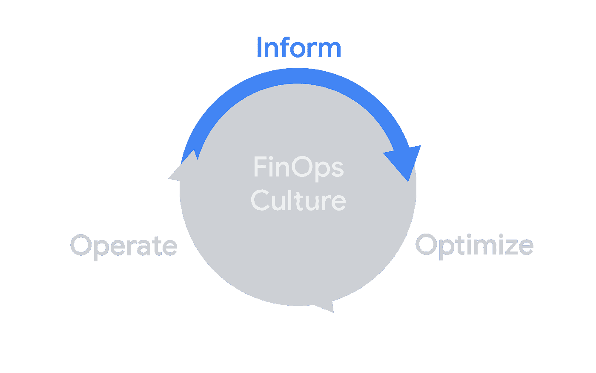
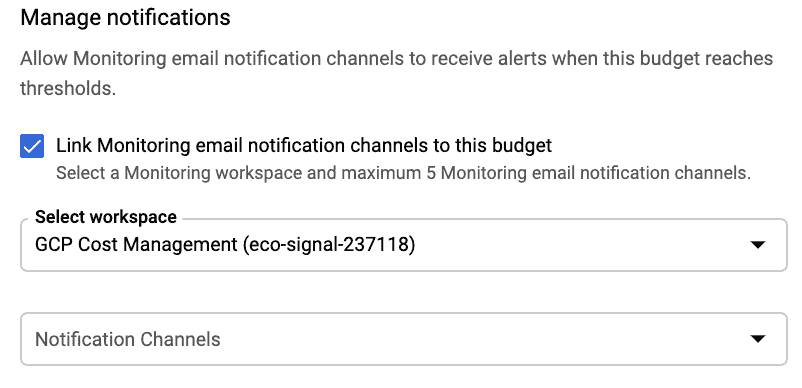
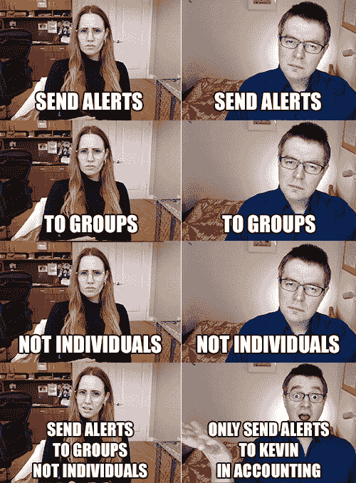

# 通过定制您的预算了解最新情况

> 原文：<https://medium.com/google-cloud/budgets-customizing-email-addresses-f7e7d9526bb7?source=collection_archive---------1----------------------->

TL；DR —默认情况下，预算警报仅发送给计费帐户管理员和计费帐户用户。通过使用云监控通道，您可以轻松添加多达 5 封自定义电子邮件。尽量发给团体，不要发给个人！

*预算和警报非常适合 FinOps 生命周期的通知阶段，以实现可见性*

[我的上一篇文章](https://cloud.google.com/blog/topics/developers-practitioners/protect-your-google-cloud-spending-budgets%5C)讲述了如何建立预算以及为什么你一定要建立预算(可能太详细了)。有预算肯定很重要，但是这些预算的提醒只发给计费帐户管理员和计费帐户用户。那么当你想让更多的人了解预算状况时会发生什么呢？

好吧，你可以把他们作为用户或管理员添加到付费帐户，但是这样他们可能会拥有比你想要的更多的权限。例如，用户可以将项目链接到一个计费帐户，而这可能不是你想让一群人去做的事情(最低权限等等)。相反，由于一个新的功能，您可以轻松地添加多达 5 个电子邮件地址，您指定获得提醒！所以，让我们从头到尾走一遍。

# 它基本上只是一个复选框

首先，你可以像[上一篇文章](https://cloud.google.com/blog/topics/developers-practitioners/protect-your-google-cloud-spending-budgets%5C)提到的那样建立一个预算，或者你可以修改一个现有的预算。当您完成设置预算时，您会看到此复选框。

*这就是我之前提到的复选框*

下一步应该很明显，所以继续检查那个框！现在，您必须选择一个包含您想要使用的通知通道的工作区。

这些工作区用于云监控(以前的 Stackdriver ),基本上是帮助您组织您所监控的内容的方法。你可以[在这里阅读更多关于工作区的信息](https://cloud.google.com/monitoring/workspaces/manage)但是我们并不需要知道更多关于工作区的细节来添加这些预算提醒邮件。如果您没有使用过云监控，那么您可能没有工作空间，所以让我们在这里暂停一下，去设置一个工作空间。

# 好吧，也许不止是一个复选框

这一部分也很简单，但是这里有一个重要的注意事项。工作空间附加到项目，而不是计费帐户，所以您需要有一个项目来使用它。我建议您创建一个新项目，在这个项目中，您是项目的所有者，并且您只是将它用于这些通知。我们将在未来看到一些需要项目的其他事情，这样您也可以对这些资产使用相同的项目！

如果你不确定如何创建新项目，请前往[控制台主屏幕](https://console.cloud.google.com)。在左上角，你会看到一个项目选择器，显示你当前选择的项目。点击它会弹出一些选项来选择一个项目或者创建一个新的项目。

如果您之前没有创建工作空间，只需使用左侧导航并单击 Operations 下的 Monitoring，即可为您当前的项目自动创建一个工作空间。

*创建一个工作空间可能需要一些时间，所以在你等待的时候喝一杯茶吧*

一旦你创建了一个新的工作空间，你可以回到创建/编辑预算，并再次选中该框！

*眼尖的人会注意到它还是同一个盒子*

万岁，你现在已经选择了一个工作区，但你仍然需要选择我们的电子邮件。如果您没有添加任何通知通道(尤其是如果这是一个新的工作区)，打开通知通道框将显示一个空列表，因此您需要遵循“管理通知通道”链接，这将有望在一个新窗口中打开。

# 嘿，这不仅仅是一个复选框

好吧，我很抱歉拖你来来回回，但我们几乎完成了！我还发现从预算方面进行交互要比在云监控界面上瞎逛容易一些。无论哪种方式，您都应该看到潜在渠道的列表，如 Slack、webhooks、电子邮件等等。继续并使用电子邮件旁边“添加新邮件”按钮，这将导致弹出此对话框。

*您添加的每封电子邮件都需要电子邮件和显示名称*

因此，完成这个过程，添加您希望发送预算提醒的电子邮件。值得注意的一个最佳实践是:

这让我很感激在办公室里有这么好的朋友

一般来说，您应该尽可能使用组而不是单个用户。无论是权限还是这些预算警报，很可能你的团队会随着时间的推移而改变，通过 G Suite 或任何其他界面管理一个团队要比不断回头更新预算容易得多。

同样值得注意的是，如果你向很多人发送预算提醒，没有人会在意这个预算提醒。所以，想想你的组织/团队中谁会真正关心这些警报。会不会是工程团队里能关闭资源的人？或者是财务团队中想要衡量支出的人？甚至可能是一个集中的 FinOps 团队？无论哪种方式，你都有权力选择对每个预算最有意义的东西！

浏览并添加几封电子邮件，一旦完成，回到你做预算的窗口。在选择器的底部有一个小的“刷新”图标，这样你就可以重新加载列表并添加你刚刚输入的电子邮件。

*通过使用群发邮件，你不必更新预算本身*

选择您希望收到通知的电子邮件，保存您的预算，就大功告成了！

# 还有一点

为了给你更多的控制，还有一个选项我想提一下。除了添加这些额外的电子邮件，您还可以选择是否要提醒付费帐户管理员和用户每个预算。

*默认情况下，这将被启用*

如果您只想向您手动设置的电子邮件发送提醒，请取消选中此选项。尤其是在创建大量预算时，让您的计费管理员和用户避免收到这些警报可能是有意义的。特定的预算，例如涵盖您公司的一个应用程序的预算，可能对应用程序团队更有用，而不是对记帐帐户上的每个人。

# 好吧，技术上是几个复选框

因此，如你所见，将更多的人添加到你的预算提醒中是相对简单的。最重要的是，您可以向工作区添加大量的通知渠道，然后根据您的预算选择合适的渠道。每个预算最多只能有 5 个频道，所以这是使用群发邮件的另一个好理由。

这是将更多人/组添加到您的预算提醒的简单方法，这使得预算更加有用。如果你想了解更多的细节，你可以在这里阅读[的完整文档。现在你可以高枕无忧了，知道正确的团队会收到关于你的预算的通知。](https://cloud.google.com/billing/docs/how-to/budgets-notification-recipients)

请继续关注下一篇文章，在那里我们将实现程序化预算通知的自动化！