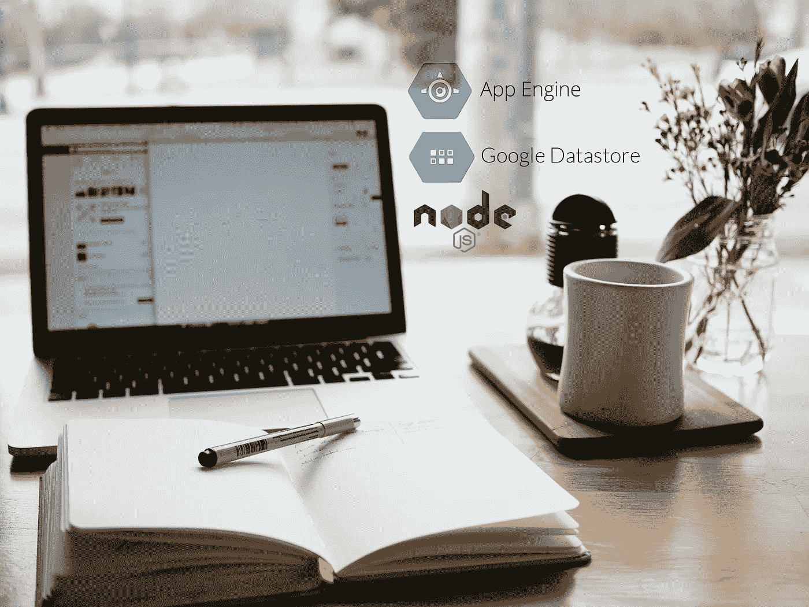

# 在 Google App Engine 上构建一个博客应用程序:设置(第 1 部分)

> 原文：<https://medium.com/google-cloud/build-a-blog-application-on-google-app-engine-setup-part-1-38dab981b779?source=collection_archive---------1----------------------->



去年 6 月，谷歌宣布在谷歌应用引擎标准环境上对 Node.js 8 的[支持。有了它，就有可能构建**高度可用的 Node.js 应用程序，而不必担心底层基础设施**。有了这个好消息，**我现在*不得不*写这个已经在我的待办清单上放了几个月的教程**！:)](https://cloudplatform.googleblog.com/2018/06/Now-you-can-deploy-your-Node-js-app-to-App-Engine-standard-environment.html)

在这个多部分教程中，我们将在 **Typescript** 中构建**一个博客应用程序，使用 **Google Datastore** 来存储我们的内容。数据存储是 Google **完全管理的**文档数据库，具有惊人的性能、巨大的可伸缩性和原子事务。我已经用它做了多个项目，我必须说我喜欢它！**

本教程分为以下 8 个部分:

*   设置(这一部分)
*   [应用架构](/@sebelga/build-a-blog-application-on-google-app-engine-architecture-part-2-1b7fb081bf3c)(第二部分)
*   [应用背景](/@sebelga/build-a-blog-application-on-google-app-engine-the-app-context-part-3-8a0f15c35166)(第三部分)
*   博客发布模块(第四部分)
*   管理模块(第五部分)
*   [图像模块](/@sebelga/build-a-blog-application-on-google-app-engine-image-module-part-6-f5eb3eeb49ee)(第六部分)
*   [评论模块](/@sebelga/build-a-blog-application-on-google-app-engine-comment-module-part-7-b18e907e3e38)(第七部分)
*   将应用程序部署到 Google Cloud (第 8 部分)

# 我们将会建造什么

在和我一起开始这段旅程之前，你会想先看看我们将要建造的东西…我不会期望更少！:)你可以在这里找到在谷歌应用引擎上运行的应用程序的现场演示:
[https://blog-nodejs.appspot.com](https://blog-nodejs.appspot.com)

# 我们的目标

本教程结束时，您将能够:

*   **阅读/创建/更新/删除**博客文章。
*   将特色图片附加到帖子上，然后**将其上传到 Google Storage** 。
*   让用户**对帖子**发表评论。
*   **自动**当我们从谷歌数据库中删除一篇文章时，删除与该文章相关的评论和特色图片。
*   **将应用程序**部署到 Google App Engine。

## 我们看不到的

为了将本教程的重点放在 **Node.js 和 Typescript** 上，我将不解释以下内容:

*   **客户端 javascript 代码**(保持最小化以“完成工作”)。
*   **萨斯造型**(大部分造型来自伟大的[布尔玛框架](https://bulma.io/))。
*   用 Pug 表达**视图模板(不太复杂，但如果有不清楚的地方，可以在评论中随意提问)。**

# 我们开始吧！

## **先决条件:**

**节点版本 8** :本项目要求节点版本 8 或更高版本。确保您已经安装了它(您可以通过在终端窗口中运行`node -v`来检查安装的节点版本)。
**Google Cloud SDK**(`gcloud`):如果您还没有安装，请[安装 SDK](https://cloud.google.com/sdk/) 并确保**您已经通过身份验证**。要对`gcloud`进行身份验证，请在终端中运行以下命令:

```
gcloud auth application-default login
```

然后，您可以通过以下方式检查您被验证的帐户:

```
gcloud config list
```

## 获取源代码

现在，让我们克隆存储库，检出起始分支，并安装项目依赖项。在终端中运行以下 4 个命令:

```
git clone [https://github.com/sebelga/google-datastore-blog-app](https://github.com/sebelga/google-datastore-blog-app)
cd google-datastore-blog-app
git checkout --track origin/tutorial-start
npm install (or yarn install)
```

很好，现在您已经安装了项目结构和依赖项。我们将大部分时间花在“ *src/server* ”文件夹中，在那里我们将放置我们的类型脚本代码。
让我们启动应用程序，确保一切运行正常:

```
npm run start-local
# or
yarn start-local
```

该命令将**编译类型脚本**代码，并开始**监视**客户端和服务器代码，如果需要，重新启动节点服务器。
打开浏览器窗口，导航至 [http://localhost:3000](http://localhost:3000) 。你应该看到`Hello!`印在屏幕上。

# gstore-node

您可能知道 Google Datastore 是一个 NoSQL 数据库。它是**无模式**，意思是它让你保存**任何形状**的文档(称为实体)并按实体*种类*对它们进行分组。这很好，因为它为我们保存非结构化数据提供了很大的灵活性。但这也意味着你可以有两个相同种类的实体，每个实体都有完全不同的属性。

这对于构建复杂的应用程序来说并不太好，因为那些**在它们管理的实体上总是有一个*隐式*模式**。也就是说，在针对 NoSQL 数据库构建应用程序时，没有所谓的*无模式*;当您从数据库中检索一个" *BlogPost* "实体时，应用程序**希望它总是有一个" title" 属性被转换成一个字符串**。这就是*模式*给我们的东西，**保证我们的实体*形状*总是一致的**。这就是为什么在构建像 Google Datastore 这样的 NoSQL 数据库的应用程序时，它们会有如此大的帮助。

用于管理数据存储实体的官方 google-cloud/datastore 包没有为**提供通过模式**对实体建模的方法。这就是我创建 [gstore-node](https://github.com/sebelga/gstore-node) 的原因。它**不会** **取代**谷歌数据存储库，但它是**之上的一层**。这意味着 Google datastore API 仍然可用，以备不时之需。

你会在这里找到 gstore-node 的完整文档。

正如您所想象的，我们将使用`gstore-node`来创建我们的博客应用程序，并且希望在使用数据存储构建 Node.js 应用程序时，您会看到它的好处。

说完这些，[让我们跳到下一节](/@sebelga/build-a-blog-application-on-google-app-engine-architecture-part-2-1b7fb081bf3c)，在这里我们将讨论**应用架构**，不同的**模块**，以及应用配置**。**