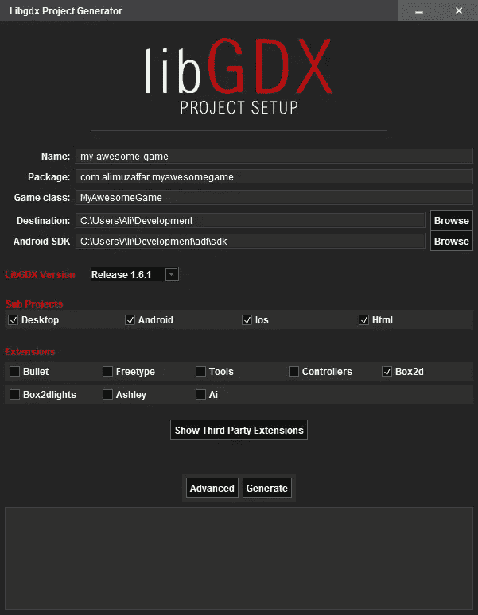
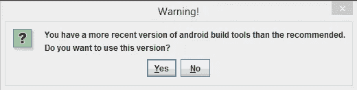
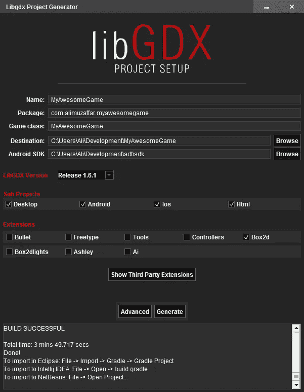
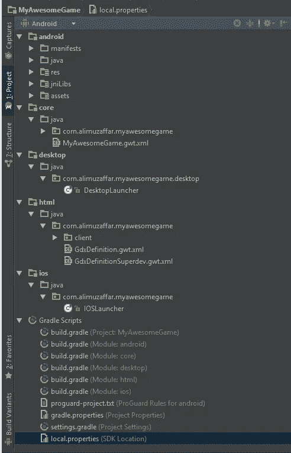
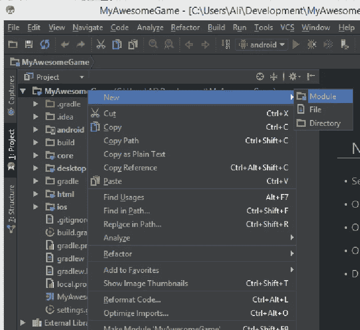
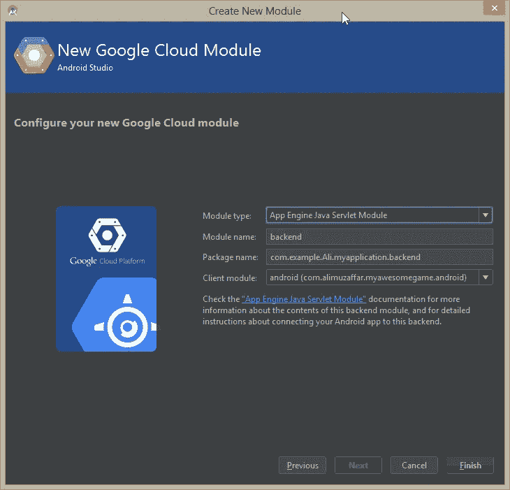
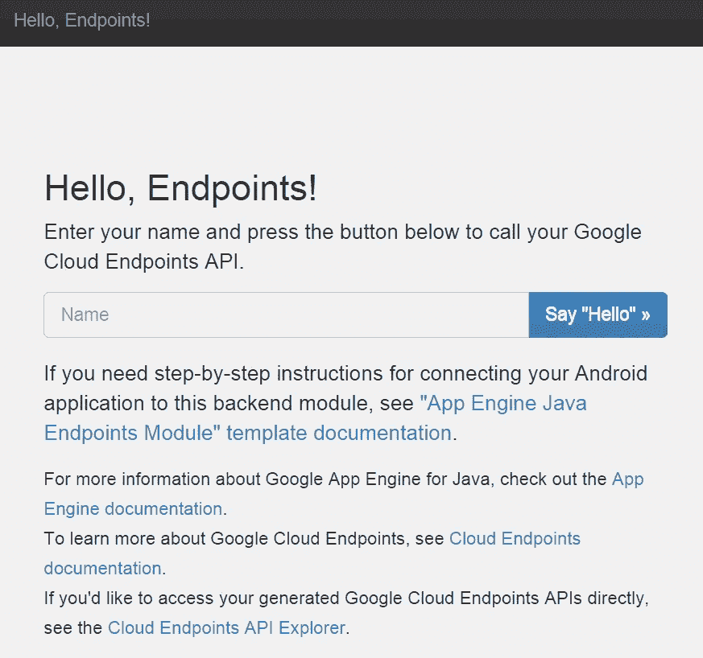

# 在 5 分钟内构建一个多平台游戏和后端 API

> 原文：<https://medium.com/google-cloud/build-a-multi-platform-game-and-backend-api-in-5-minutes-fa8b94017011?source=collection_archive---------2----------------------->


## 使用 Android Studio 和 Google App Engine，在 5 分钟内开始构建多平台游戏或具有后端 API 的 Android 应用程序！

**重要提示:**本文假设您已经安装了 Java、Android SDK 和 Android Studio，并且能够构建基本的 Android 应用程序。

如果你对开发游戏不感兴趣，只想为现有的 Android 应用程序开发一个后端，直接跳到“在几秒钟内为你的游戏或应用程序开发一个后端”一节。

# 在 5 分钟内开始构建一个多平台游戏

出于本文的目的，我们将使用 [LibGDX](http://libgdx.badlogicgames.com/) 来构建我们的多平台游戏框架。我们选择的原因很简单，它使用 Java 作为编程语言，并且支持 Gradle。更好的是，LibGDX 有一个使用 Gradle 的安装实用程序，它将为我们完成大部分繁重的工作。

## 设置 LibGDX 项目

要设置一个 LibGDX 项目，你需要前往 [LibGDX 下载页面](http://libgdx.badlogicgames.com/download.html)并下载设置应用。您下载的是一个可执行的 jar 文件。它很可能被命名为 *gdx-setup.jar* 。下载文件后，双击它启动安装程序，或者从命令行使用以下命令运行它:

```
java -jar gdx-setup.jar
```

运行安装程序后，您应该会看到如下屏幕:



LibGDX 设置

你需要填写名称，包，游戏类别，目的地路径和 Android SDK 路径。对于 LibGDX 版本，目前只有最新版本是可选的，从子项目中选择您希望您的应用程序运行的所有平台，然后单击**生成**。

如果您收到如下所示的警告，我会单击**是**并继续。我个人没有注意到在最新版本的 Android 构建工具上使用 LibGDX 有任何问题(Gradle 和 Google App Engine 有问题，但稍后会有更多)，但是，如果你想，你可以下载 20.0.0，这是推荐的版本。



LibGDX 1.6.1 推荐使用 Android 构建工具 v20.0.0

**注意事项**

*   就我个人而言，我会跳过“桌面”,它实际上给了你一个可以用来部署游戏的 jar，但是，如果你想部署到 Windows store 或 Apple store，请随意选择它。
*   对于 iOS，LibGDX 使用 RoboVM 来实现兼容性，如果您准备在 iOS 上部署或测试，您可以下载并设置 [RoboVM](http://robovm.com/) 。 [RoboVM](http://robovm.com/) 是一款面向 iOS 和 Android 的跨平台移动应用开发 SDK。它允许您使用 Java 构建具有完全硬件访问能力的本机 UI。
*   对于 HTML5 游戏，LibGDX 使用 [GWT](http://www.gwtproject.org/) 。

当您单击 Generate 时，安装实用程序将运行 Gradle 来下载所需的包并安装项目。完成后，您将会看到类似于下面屏幕的内容。



正如说明所暗示的，你现在需要做的就是启动 Android Studio，选择**文件>打开**，然后在上面的“**目的地**字段下你指定的目录下选择 **build.gradle** 文件。

选择 build.gradle 文件后，Android Studio 会花一些时间构建项目，并下载需要的依赖项。完成后，您应该会看到一个类似于下图的项目设置。



信不信由你，你可以在模拟器或手机上构建和运行 android 项目，你的多环境游戏已经有了一个起点！如果您构建并部署了游戏，您将看到以下内容。


## LibGDX 项目架构

当你看一个 LibGDX 项目时，很明显有一个“核心”项目保存着你所有的代码，其他项目，无论是 Android、iOS 还是 HTML，都只是将工作委托给核心项目。如前所述，iOS 使用 RoboVM，HTML 使用 GWT。

# 使用 Google App Engine 在几秒钟内为您的游戏或应用程序构建一个后端

这同样适用于我们上面构建的游戏或 Android 应用程序。有大量的云托管解决方案，谷歌的应用引擎，亚马逊 AWS 和微软的 Azure 等。然而，因为它与 Android Studio 惊人的集成，我们将使用谷歌应用引擎。这里有一个额外的好处，即不需要单独的开发环境和单独的 IDE 设置来进行后端开发。您可以在一个地方编写您的客户端代码并修改您的后端以适应它们。

只需右键单击您的项目名称，然后选择新建>模块



在新模块屏幕中，选择**谷歌云模块**并点击**下一步**，当你这样做时，你应该会看到下面的屏幕。



这些字段应预先填写。但是，如果您想更改您可以更改的任何字段，您应该熟悉**模块类型**和*下的选项，选择适合您的选项*。在屏幕底部，有一些链接指向解释每种模块类型的资源。简而言之:

*   **App Engine Java Servlet 模块**将为您建立一个优秀的老式 Servlet 项目。默认情况下，将包含很少甚至没有库和模块。
*   **App Engine Java 端点模块**构建于 Servlets 之上，采用 Google Cloud 端点从服务器端 Java 代码的非常简单的注释中定义 RESTful 后端 API。Google Cloud 端点还提供了自动化的 Java 对象到 JSON 的编组/解组，可以从 Android 应用程序调用的强类型客户端库的生成，内置的身份验证支持等等。
*   **与谷歌云消息的应用引擎后端-** 同上，但增加了谷歌云消息。

**模块类型推荐:**如果你有以前的后端 Java 经验，并且知道你想要构建的后端类型，那么我会选择 Java Servlet 模块，并在你认为合适的时候修改它。如果你不确定，那么就使用 **App Engine Java 端点模块**。变化是，这将提供您需要的所有功能，并利用谷歌的云引擎。*本教程的其余部分假设您正在使用 App Engine Java 端点模块*。

当你点击“完成”时，你会看到 Android Studio 正在构建你的新后端项目。完成所有工作后，后端模块应该添加到您的项目中。

当在 Windows 机器上这样做时，我的构建被破坏了。有两个原因:

1.  因为在 Android app**下> build.gradle** 文件末尾的右括号和单词“dependencies”之间没有空格。

```
//wrong
}dependencies {
    compile project(path: ':backend', configuration: 'android-endpoints')
}
//correct
}
dependencies {
    compile project(path: ':backend', configuration: 'android-endpoints')
}
```

2.其次，由于谷歌云插件的一些已知问题，你不能使用最新的 Gradle，除非你需要最新版本的 Gradle，你可以用 2.2.1。为了更改 gradle 版本，打开 **<项目>/Gradle/wrapper/Gradle-wrapper . properties**并更改您使用的 Gradle 版本。确保上面写着:

```
distributionUrl=http\://services.gradle.org/distributions/gradle-2.2.1-all.zip
```

当所有这些都完成后，项目应该再次构建，您应该能够像以前一样启动 android 应用程序。

## 运行后端

从“编辑配置”下拉列表中，选择“后端”,然后单击它旁边的“播放”按钮来运行后端。您应该会看到类似下面的日志输出

```
May 25, 2015 12:29:20 AM com.google.apphosting.utils.jetty.JettyLogger info
INFO: Started SelectChannelConnector@localhost:8080
May 25, 2015 12:29:20 AM com.google.appengine.tools.development.AbstractModule startup
INFO: Module instance default is running at [http://localhost:8080/](http://localhost:8080/)
May 25, 2015 12:29:20 AM com.google.appengine.tools.development.AbstractModule startup
INFO: The admin console is running at [http://localhost:8080/_ah/admin](http://localhost:8080/_ah/admin)
May 25, 2015 12:29:20 AM com.google.appengine.tools.development.DevAppServerImpl doStart
INFO: Dev App Server is now running
```

正如输出所示，如果您访问 localhost:8080，您应该会看到一个“Hello Endpoints”页面。



**就是这样！你有了游戏的起点和后端 api！多简单啊！**

## 从您的应用程序访问后端 API

为了测试你的应用程序的后端，以验证有一个后端 api 访问。你可以使用谷歌提供的一些代码。在您的 Android 项目中，创建一个 AsyncTask。

```
import android.content.Context;
import android.os.AsyncTask;
import android.util.Pair;
import android.widget.Toast;

import com.example.ali.myapplication.backend.myApi.MyApi;
import com.google.api.client.extensions.android.http.AndroidHttp;
import com.google.api.client.extensions.android.json.AndroidJsonFactory;
import com.google.api.client.googleapis.services.AbstractGoogleClientRequest;
import com.google.api.client.googleapis.services.GoogleClientRequestInitializer;

import java.io.IOException;

public class EndpointsAsyncTask extends AsyncTask<Pair<Context, String>, Void, String> {
    private static MyApi *myApiService* = null;
    private Context context;

    @Override
    protected String doInBackground(Pair<Context, String>... params) {
        if(*myApiService* == null) {  // Only do this once
            MyApi.Builder builder = new MyApi.Builder(AndroidHttp.*newCompatibleTransport*(),
                    new AndroidJsonFactory(), null)
                // options for running against local devappserver
                // - 10.0.2.2 is localhost's IP address in Android emulator
                // - turn off compression when running against local devappserver
                .setRootUrl("http://10.0.2.2:8080/_ah/api/")
                .setGoogleClientRequestInitializer(new GoogleClientRequestInitializer() {
                    @Override
                    public void initialize(AbstractGoogleClientRequest<?> abstractGoogleClientRequest) throws IOException {
                        abstractGoogleClientRequest.setDisableGZipContent(true);
                    }
                });
                // end options for devappserver

            *myApiService* = builder.build();
        }

        context = params[0].first;
        String name = params[0].second;

        try {
            return *myApiService*.sayHi(name).execute().getData();
        } catch (IOException e) {
            return e.getMessage();
        }
    }

    @Override
    protected void onPostExecute(String result) {
        Toast.*makeText*(context, result, Toast.*LENGTH_LONG*).show();
    }
}
```

然后在您的 **AndroidLauncher** 类中，在 **onCreate** 方法的末尾添加以下内容:

```
new EndpointsAsyncTask().execute(new Pair<Context, String>(this, "Manfred"));
```

当您在后端运行时运行应用程序，您应该会看到如下所示的提示消息:


**注意:**IP 地址 **10.0.2.2** 是 Android 模拟器用来访问你机器的 IP 地址。对于 Genymotion 用户，这个 IP 地址将是 **10.0.3.2** 。对于使用设备的人来说，他们必须使用他们开发机器的 IP 地址。

# 多简单啊！

比起 IntelliJ，我一直更喜欢 Eclipse，我的理由很简单，不是每个人都有能力让他们的机器保持最新或最近，Eclipse 的所有问题都是使用本机代码，只是运行得更快。

话虽如此，我对 Android Studio 作为一个开发环境所取得的成就印象深刻。有争议的是，这很大程度上要归功于 Gradle 及其背后不断增长的社区。我用 Eclipse 做了同样的设置，虽然它足够简单，但它甚至不如用 Gradle 和 Android Studio 的设置流畅。