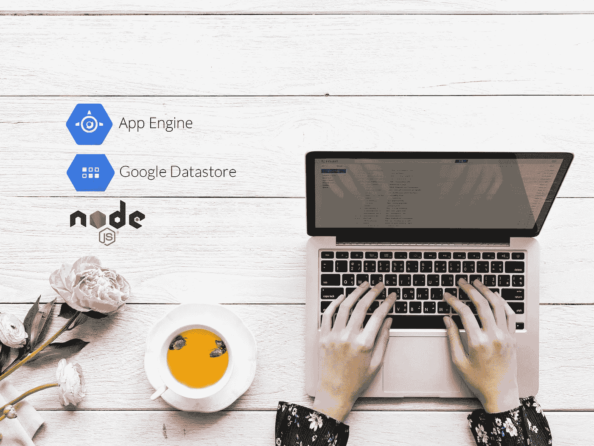

# 在 Google App Engine 上构建博客应用程序:部署到 Google Cloud(第 8 部分)

> 原文：<https://medium.com/google-cloud/build-a-node-js-app-on-google-datastore-deploy-to-google-cloud-part-8-e72a8eaed9f7?source=collection_archive---------2----------------------->



这是关于如何使用 **Google Datastore** 在 Node.js 中构建小型博客应用程序并将其部署到 **Google App Engine** 的系列教程的第八部分，也是最后一部分。如果你错过了开头，[跳到第一部分](/google-cloud/build-a-blog-application-on-google-app-engine-setup-part-1-38dab981b779)，在那里我解释了如何建立这个项目，在那里你可以找到教程其他部分的链接。

我们的小博客完成了，看起来棒极了！在这篇文章中，我们将**将应用程序部署到 Google App Engine** 。为此，我们将使用 Google 的`gcloud` CLI 工具，它使这个过程变得极其简单。如果您还没有在您的机器上安装它，[转到下载页面，首先安装](https://cloud.google.com/sdk/install)。

为了部署我们的应用程序，`gcloud`需要一个*描述符文件*。默认情况下，它是一个位于项目根目录下的`app.yaml`文件。在这里，我们将配置我们的应用程序，设置 Node.js 运行时版本，分配资源，缩放规则，声明环境变量等。您可以在这里找到所有可用选项的文档。

# 创建数据存储索引

到目前为止，**我们一直在本地数据存储模拟器**上运行我们的应用程序，它不需要声明索引来执行查询。云数据存储**确实要求我们配置索引**，因为它需要提前知道**应用程序将发出哪些查询**。关于索引以及我们为什么需要配置它们的更多信息，请阅读文档。

与此同时，我们正在构建应用程序，每次我们对本地数据存储模拟器执行查询时，**模拟器`WEB-INF`文件夹内的`index.yaml`文件中会自动为我们声明**需要配置的索引。如果您从项目 npm 脚本 ( `npm run local-datastore`)启动模拟器数据存储**，您应该在`<project-folder>/local-datastore/WEB-INF`文件夹中看到这个文件。为了简单起见，如果您的本地模拟器文件夹在不同的位置，这个文件的内容被复制到项目根目录下的" *index.yaml"* 文件中。**

执行以下命令来配置实时 Google Cloud 数据存储上的索引:

```
gcloud datastore create-indexes ./index.yaml
```

太好了！**我们现在准备将我们的应用程序**部署到 Google App Engine。

# 部署应用程序的 gcloud

下面是一些我们如何用`gcloud`部署应用程序的例子。

```
# This is as simple as it gets. gcloud will look for an "app.yaml" 
# at the root of the project, deploy the application and redirect 
# all the traffic to it. It will also give the application a random 
# "version" number.
gcloud app deploy# Here again, gcloud will look for an "app.yaml", deploy the 
# application, but it will not redirect the traffic (no-promote) to 
# it. We also manually set the version to "1-0-0"
gcloud app deploy -v 1-0-0 --no-promote# To specify a custom descriptor file, just pass it as last argument
gcloud app deploy -v dev --no-promote app.dev.yaml
```

在我们的例子中，我们不会直接使用`gcloud`，而是使用一个 **npm 脚本**。这允许我们挂钩其他 npm 脚本(在部署之前*构建*应用程序)，在部署过程中给予我们更多的灵活性。

# 部署应用程序

部署我们的应用程序并使其对我们的用户可用**将分两步完成**。首先，我们将在**语义版本化**之后部署到一个**独特的应用程序版本**。如果你没有听说过语义版本控制[，请在这里阅读。在这个阶段，我们不会让用户看到部署。这将允许我们首先测试运行在谷歌云上的应用程序，确保一切运行正常。](https://semver.org/)

一旦我们全面测试了应用程序，**第二步将是推广应用程序，并向其发送所有流量**。我们开始吧！

## 1.部署应用程序

```
npm run deploy -- -v 1-0-0
# or
yarn deploy -v 1-0-0
```

因为应用程序引擎不允许点“.”在应用程序版本中，我们使用“-”号代替。您将看到首先构建应用程序代码(服务器和客户端),然后从`gcloud`出现一个确认部署的提示。一旦部署了应用程序，您将有一个 URL 来测试应用程序，看起来类似于:

```
https://1[-0-0-dot-<your-google-appengine-project>.appspot.com](https://0-1-0-dot-blog-nodejs.appspot.com)
```

您现在可以测试应用程序，并确保它正常工作。如果您发现任何问题，请更正它们，并使用相同的版本重新运行上述命令。这将覆盖应用引擎中的版本。一旦你对应用程序进行了全面的测试，并且对它感到满意，你就可以**推广它了。**升级一个版本会将所有流量发送给它，让你的用户可以使用。

## 2.推广应用

```
npm run promote -- -v 1-0-0
# or
yarn promote -v 1-0-0
```

太好了！你现在应该已经有了一个运行在谷歌应用引擎上的完全正常的博客应用**！**

对于现实世界的应用程序，我们仍然需要改进一些东西。例如，我们需要保护认证系统后面的`Admin`路由，我们可能会[添加一个自定义域](https://cloud.google.com/appengine/docs/standard/python/mapping-custom-domains)。我把这个留给你做练习。

至此，我们完成了本教程。我希望你像我写这篇文章时一样喜欢它，并且你现在意识到在 Google Cloud 上启动你的下一个 Node.js 项目是多么容易。

像往常一样，如果你发现任何问题或者有什么不清楚的地方，请在评论中告诉我。

编码快乐！