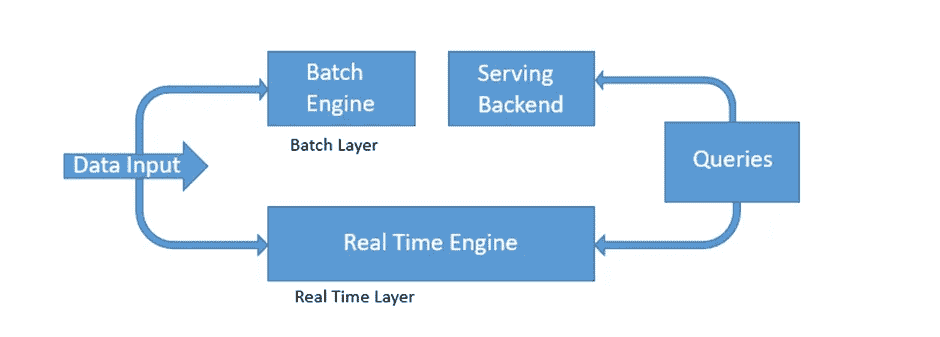
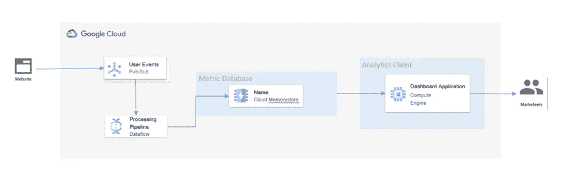
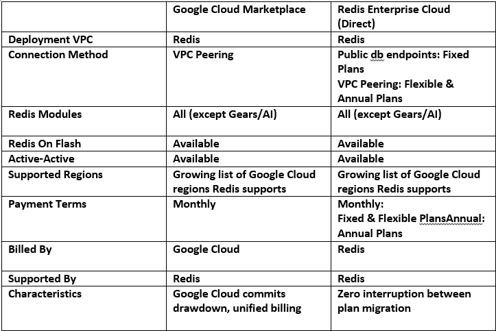

# 使用 Redis 构建实时分析

> 原文：<https://medium.com/google-cloud/build-a-real-time-analytics-with-redis-b94e502864f9?source=collection_archive---------1----------------------->

**1。** **什么是实时分析？**

实时分析允许企业检索数据，并立即或在数据进入系统后对数据采取措施。实时 app 统计秒答题。它们以高速和低响应时间处理大量数据。实时统计是指数据一进入网站就进行准备和测量的过程。换句话说，用户获得数据，或者他们可以在数据进入他们的系统之前(或更早)得出结论。实时统计使企业能够毫不延迟地做出响应。他们可以利用机会或防患于未然。

实时数学是一门学科，它使用数据中的智能和统计数据来提供信息，以便更快地做出更好的决策。在某些使用案例中，实时意味着计算在新数据到达后的几秒或几分钟内完成。所需的实时统计等待用户或系统请求查询并提交统计结果。持续的实时统计非常有效，可以在事件发生时提醒用户或触发响应。

**2。** **实时分析的重要性是什么？**

实时分析使企业能够毫不延迟地做出响应，快速检测和响应用户的行为模式，发掘潜在的机会，并在问题出现之前加以预防。

使用实时分析的实体显著降低了整个公司的风险，因为系统使用数据来预测结果并建议替代方案，而不是像历史数据分析那样依赖于基于过去事件或最近扫描的预测。实时统计数据提供了当前正在发生的事情的详细信息。

**实时统计的其他好处包括:**

**查看数据:**实时数据可以可视化，并在事件发生时反映整个公司的情况，而历史数据只能输入图表以传达完整的观点。

**提高竞争力:**使用实时统计数据的企业比仍然使用历史数据的竞争对手更快地识别趋势和基准。实时统计还允许企业快速查看合作伙伴和竞争对手的业绩报告。

**具体信息:**实时分析侧重于快速分析，这对于创建有针对性的结果总是有用的，有助于确保时间不会浪费在无用的数据收集上。

**低成本**:虽然实时技术可能很昂贵，但如果长期使用，它们的许多持续的好处使它们成为一个巨大的优势。此外，技术有助于防止使用资源或访问信息的延迟。

**快速结果:**

快速分离原始数据的能力允许查询收集相关数据并快速处理。这反过来允许更快和更好的趋势预测和决策。

速度是实时数据分析的一个关键优势。企业等待数据到达并被处理的时间越短，实体就可以越快地使用数据进行更改并做出重要决策。例如，分析生产线的监控数据有助于在设备出现故障之前及早进行干预。

同样，实时数据分析工具允许公司在产品发布时查看用户如何与产品交互，这意味着在了解用户行为以做出必要的改变方面没有延迟。

与标准计算相比，实时分析具有以下优势:

1.创建交互式分析工具。

2.在透明仪表板上共享信息。

3.定制你的行为。

4.根据需要进行调整。

5.使用机器学习。

其他好处和用途包括:

**本地数据管理** —帮助确定适当的本地数据集，以及需要更新什么以获得完整的本地智能。

**令人困惑的发现** —识别由安全漏洞和技术故障导致的统计数据。

**更好的营销** —获取人口统计和客户行为方面的信息，以提高广告和营销活动的效果。它有助于确定最佳定价策略和目标受众。

**3。** **为什么要用 Redis？**

功能统计仪表板有多种用途。他们允许你分享数据，并为你提供所有重要的信息，让你做出迅速改变游戏的决定。使用标准社交网站创建实时动态仪表板可能需要一系列复杂的问题。通过使用像 **Redis** 这样的 NoSQL 网站，你可以用少量的 **Redis** 命令创建一个强大的交互式动态仪表板。

**#什么是 Redis？**

Redis 是一个开源的(BSD 许可的)，内存中的**数据结构存储**用作数据库、缓存、消息代理和流引擎。

Redis Cache 提供亚毫秒级响应时间，允许在游戏、金融科技、广告科技、社交媒体、医疗保健和物联网等行业中实现快速而强大的实时应用。本教程展示了一个用 NodeJS (JavaScript)编写的基本数学仪表板应用程序，它使用 Redis 位图数据类型。

Redis 提供了数据结构，如[字符串](https://redis.io/topics/data-types-intro#strings)、[哈希](https://redis.io/topics/data-types-intro#hashes)、[列表](https://redis.io/topics/data-types-intro#lists)、[集合](https://redis.io/topics/data-types-intro#sets)、[排序集合](https://redis.io/topics/data-types-intro#sorted-sets)、位图[、](https://redis.io/topics/data-types-intro#bitmaps)、[超级日志](https://redis.io/topics/data-types-intro#hyperloglogs)、[地理空间索引](https://redis.io/commands/geoadd)和[流](https://redis.io/topics/streams-intro)。Redis 内置了[复制](https://redis.io/topics/replication)， [Lua 脚本](https://redis.io/commands/eval)， [LRU 驱逐](https://redis.io/topics/lru-cache)，[事务](https://redis.io/topics/transactions)，不同级别的[磁盘持久化](https://redis.io/topics/persistence)，通过 [Redis Sentinel](https://redis.io/topics/sentinel) 和 [Redis 集群](https://redis.io/topics/cluster-tutorial)自动分区提供高可用性。

**从谷歌云平台的角度实现这一点**

在当今快节奏的世界，重点是即时满足。常见的操作条件包括为其 KPI 提供实时指标的 SaaS 操作员，或营销人员对其产品性能或网站测试的快速数据的需求。

这个解决方案将向您展示如何在 GCP 建立一个实时网站统计仪表板。

**使用的谷歌云组件:**

**1。** **发布/订阅**

**2。** **数据流**

**3。** **Redis 企业**

**Pub/Sub** 使你能够创建事件生产者和消费者的系统，称为**发布者**和**订阅者**。发布者通过广播事件与订阅者异步通信，而不是通过同步远程过程调用(RPC)。

**Dataflow** 是一个托管服务，用于执行各种各样的数据处理模式。本网站上的文档向您展示了如何使用数据流部署批处理和流数据处理管道，包括使用服务功能的说明。

**Redis Enterprise**与 Google Cloud 集成，以两种主要的部署形式提供一流的[客户体验](https://redis.com/customers/inovonics/)，即全面管理的服务和自我管理的软件。Redis 作为一个关键值存储库运行，允许许多流行的使用情况，如缓存、会话管理，并作为实时应用程序的主站点充满信心地工作。它使许多不同的垂直行业，如营销、金融服务、在线游戏、社交媒体等，能够在 Google Cloud 上使用您的重要应用。

**#如何访问 Redis Enterprise？**

客户可以选择通过 Google Cloud Marketplace 或直接在 https://app.redislabs.com 的 Redis Enterprise Cloud 上订阅完全托管的服务。如果客户通过 Google Cloud Marketplace 进行购买，那么会有以下好处:

1.谷歌云承诺削减

2.谷歌云中的统一计费

**Google 云市场和 Redis 企业云的对比**

解决方案来了，

我们将从发布/订阅开始，发布/订阅是一种事件总线或消息总线，它从所有实时事件产生的时间开始获取这些事件。假设我们有一个生成所有这些事件的 web 应用程序或网站，我们正在该网站上运行实验，因此首先我们有一个 pub sub，它从网站后面获取所有事件，我们有一个数据流，它实际上会处理这些事件或处理这些事件，生成任何类型的指标。然后，我们不是将其放入传统数据库，而是放入 Redis Enterprise，这是我们数据库的托管版本。现在，为什么内存存储内存存储的原因是 Redis 允许我们做内置的操作，它可以做所有这些基数和集合操作，我不需要为它编码。

你将让这些事件通过消息总线发布。然后，它将进入数据流，提供实时流数据管道。这些数据将进入 Redis 内存存储，然后您将能够拥有一个有效地位于其上的实时仪表板。

要执行的步骤:

**创建发布/订阅主题**:发布/订阅是一个全局消息总线，支持以分离的方式轻松使用消息。创建发布/订阅主题以接收应用程序规范消息。

**创建 VPC 网络**:创建一个独立的 VPC 网络，用防火墙阻挡外部入口，为实例提供基本的安全性。

**启动分析管道:**分析指标管道将从发布/订阅中读取点击流消息，并实时更新 Redis 数据库中的指标。然后，可视化应用程序可以将 Redis 数据库用于仪表板。

**启动网站事件生成器:**事件生成器是一个 Python 可执行文件，需要保持运行，这可以通过在**单独的 shell 会话**中启动生成器来实现。

**运行可视化引擎:**使用位于 dashboard/ folder 中的简单报告应用程序，使用 SpringBoot 和简单的基于 HTML+JS 的 UI 构建。应用程序从 Redis 数据库中读取指标，并将其提供给仪表板 UI。应用服务器需要与 Redis 服务器位于同一个 VPC 网络上，为了实现这一点，出于演示目的，我们将使用一个代理虚拟机通过隧道将端口连接到云外壳虚拟机，因为它不在同一个网络上。

**参考文献:**

**1。**[**https://redis . com/blog/redis-enterprise-on-Google-cloud-five-deployment-scenarios/**](https://redis.com/blog/redis-enterprise-on-google-cloud-five-deployment-scenarios/)

**2。**[**https://github . com/Google cloud platform/redis-data flow-real time-analytics**](https://github.com/GoogleCloudPlatform/redis-dataflow-realtime-analytics)

**了解更多关于 Redis 的信息:**

[免费试用 Redis 云](https://redis.info/3NBGJRT)

[观看此视频，了解 Redis 云相对于其他 Redis 提供商的优势](https://redis.info/3Ga9YII)

如果可能，嵌入此视频

[Redis 开发者中心——关于 Redis 的工具、指南和教程](https://redis.info/3LC4GqB)

· [RedisInsight Desktop GUI](https://redis.info/3wMR7PR)