# 使用 Raspberry Pi 构建自动驾驶遥控汽车，使用 Google Colab 进行机器学习

> 原文：<https://medium.com/google-cloud/build-a-self-driving-rc-car-using-raspberry-pi-and-machine-learning-using-google-colab-8ca2b4ae547f?source=collection_archive---------1----------------------->

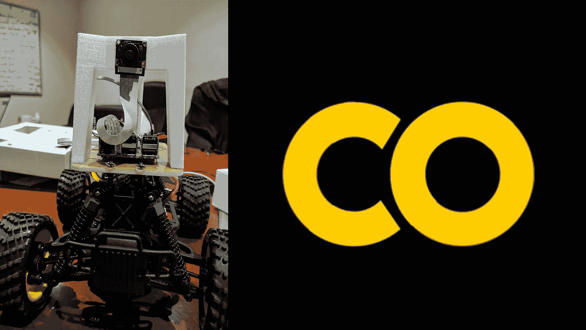

在本教程中，我们将学习如何使用 Raspberry Pi 和使用 Google Colab 的机器学习来构建自动驾驶的 RC 汽车。自从关于自动驾驶汽车的想法、讨论和宣传出现以来，我一直想自己造一辆。本教程是迈向这一现实的一小步，也将为你提供一些深入的分析和自动驾驶汽车的基础知识。本教程还将介绍如何使用 Google Colab 训练你的模型

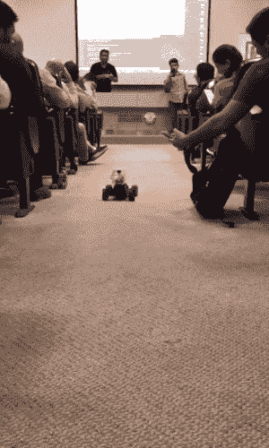

1.  驴车介绍
2.  需求和所需零件
3.  组装硬件
4.  软件安装
5.  校准你的汽车
6.  带它去兜一圈
7.  Google Colab 简介
8.  使用 Colab 训练自动驾驶仪
9.  尝试并享受乐趣
10.  结论
11.  参考

# 1.驴车介绍

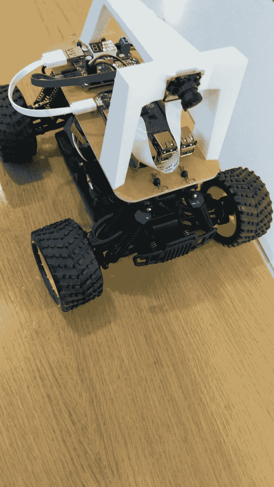

首先，经过一些研究，我遇到了驴车。Donkey 是用 Python 写的高级自动驾驶库。此外，它的开发侧重于实现快速实验和简单贡献。因此，这是我快速开始的关键。

# 2.需求和所需零件

# 2.1 购买零部件

我们有两种选择来建造我们的驴车。

## 选择 1:通过官方的驴店购买

有 2 个官方商店购买您的驴护理入门套件。

*   如果你在美国，你可以从[驴店](https://store.donkeycar.com/)购买。
*   如果你在亚洲地区和其他地区，你可以从 [Robocar 商店](https://www.robocarstore.com/products/donkey-car-starter-kit)购买。

## 选项 2:自下而上构建

如果你想自己买零件，想定制你的驴或住在美国，你可能会选择自下而上的建设。此外，在[文档](https://docs.donkeycar.com/guide/build_hardware/)中也提到了相关说明。

# 2.2 主要部件和零件

*   树莓 Pi 3
*   MicroSD 卡
*   遥控汽车
*   带微型 USB 电缆的 USB 电池
*   驴部分套件

# 3.组装硬件

初学者工具包包括入门所需的一切。它包括:

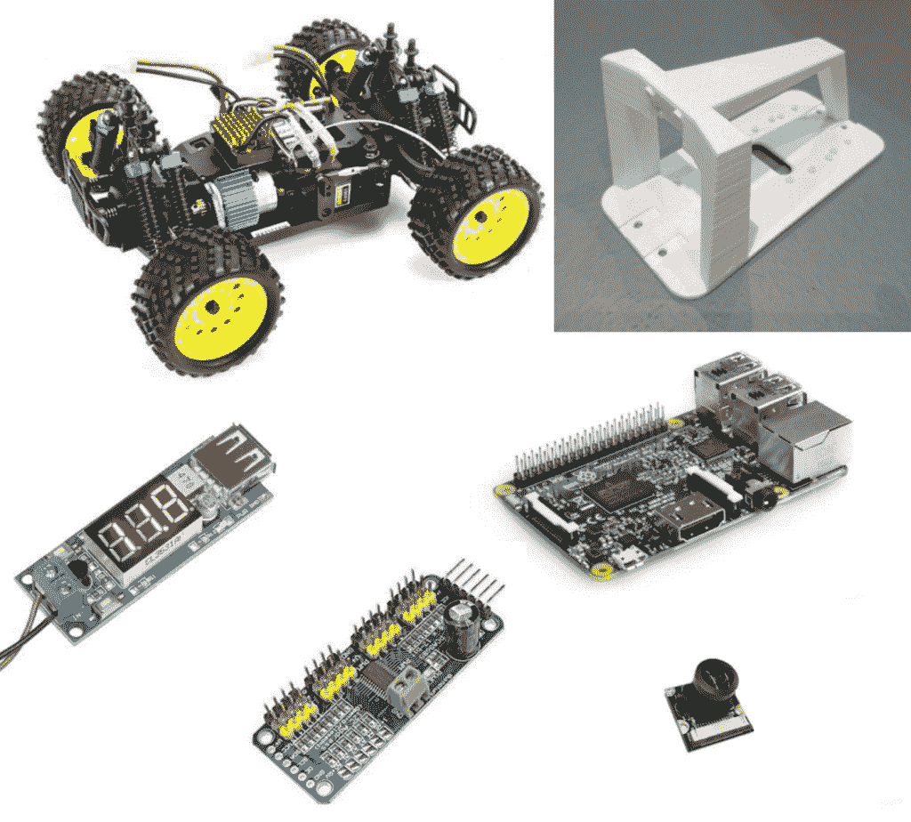

*   **HSP 94186 拉丝遥控车** 一辆经过驴车平台全面测试的遥控车
*   **3D 打印顶笼(白色或其他颜色)**
*   **激光切割基板(白色或透明)**
*   **树莓派 3B 或 3B+(视供货情况而定)** 自动驾驶遥控汽车的大脑
*   **广角树莓派摄像机**
    自动驾驶遥控汽车的眼睛
*   **16GB Micro SD 卡** 为驴车平台存储，足以容纳自动驾驶的训练数据
*   **伺服驱动器 PCA 9685** 控制遥控车的油门和转向
*   **DC-DC 5V/2A 电压转换器** 从 RC 车载电池向树莓派供电
*   **所有其他配件**电线和螺丝
    来建造驴车

此外，参考下面的驴车组装视频，按照详细的说明来组装所有的零件，并建立您的汽车。

# 4.软件安装

软件的安装和设置包括以下两个简单的步骤。此外，我们将创建我们的驴车应用程序。

## 步骤 1:在主机上安装软件

当通过行为克隆来控制你的驴子时，你需要设置一台主机来根据机器人上收集的数据训练你的机器学习模型。选择与您的电脑操作系统相匹配的设置。对我来说，那是一台苹果电脑。

## Mac 安装

```
mkdir projects cd projectsgit clone https://github.com/robocarstore/donkey cd donkeyconda update -n base -c defaults conda conda env remove -n donkeyconda env create -f envs/mac.yml source activate donkey pip install -e .pip install tensorflowpip install -e .[pc] donkey createcar --path ~/d2
```

## 步骤 2:设置树莓派

首先，我们需要给 micro SD 卡闪存一个操作系统。

*   下载 [Raspian Lite](https://downloads.raspberrypi.org/raspbian_lite_latest) (300MB)
*   下载 Etcher 工具将图像写入 SD 卡。
*   作为 SD 读卡器连接，SD 卡在其中。
*   打开 Etcher，从硬盘中选择您希望写入 SD 卡的树莓 Pi `.img`或`.zip`文件。
*   选择您希望写入图像的 SD 卡。
*   查看您的选择，点击“ **Flash** ”开始向 SD 卡写入数据。

## 第三步:设置树莓皮的无线首次启动。

打开文本编辑器或记事本，将以下代码复制粘贴到其中。

```
country=US
ctrl_interface=DIR=/var/run/wpa_supplicant GROUP=netdev
update_config=1

network={
    ssid="<your network name>"
    psk="<your password>"
}
```

用你的网络 ID 替换`<your network name>`。留下引号。用您的密码替换`<your password>`，用引号括起来。如果让您的密码不加密让您感到困扰，您可以在稍后更改[内容，一旦您让 pi 启动并登录。](https://unix.stackexchange.com/questions/278946/hiding-passwords-in-wpa-supplicant-conf-with-wpa-eap-and-mschap-v2)

将该文件保存到**引导**分区的根目录下，文件名为`wpa_supplicant.conf`。在第一次启动时，该文件将被移动到`/etc/wpa_supplicant/wpa_supplicant.conf`中，以后可以在那里进行编辑。如果您在 Windows 上使用记事本，请确保末尾没有. txt。

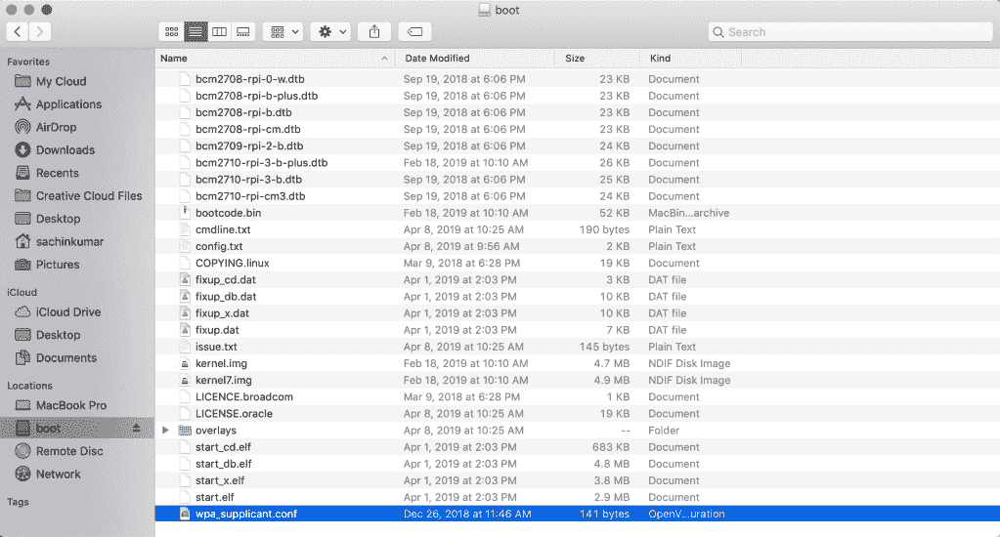

## 步骤 4: Raspberry Pi 的主机名

如果您的是网络中唯一的 Pi，您可以用下面的命令找到它。

```
ping d2.local
```

## 步骤 5:启动时启用 SSH

将一个名为 **ssh** 的文件放在您的**引导**分区的根目录下。

现在你的 SD 卡准备好了。将其从计算机中弹出，放入 Pi 并插入 Pi。

## 步骤 6:连接到 Pi

使用 HDMI 电缆将您的 raspberry pi 设备插入显示器，并将键盘连接到 raspberry pi。
初始引导完成后，系统会提示您输入登录凭据。

然后尝试下面的命令。这将显示树莓派的 IP 地址。

```
ifconfig wlan0
```

一旦我们知道了 IP 地址，并且启用了 SSH，我们就可以使用 mac 或计算机直接远程连接到 raspberry pi。打开终端，键入以下命令选项之一进行连接。

```
#option 1 ssh pi@d2.local #option 2 ssh pi@<ipaddress> #replace <ipaddress> with the one found in the previous step
```

通过 ssh 在 raspberry pi 中键入以下命令来更新和升级 pi。

```
sudo apt-get update sudo apt-get upgrade
```

## 步骤 8:配置树莓 Pi

```
sudo raspi-config
```

*   启用 I2c
*   启用摄像头
*   扩展文件系统
*   更改主机名
*   更改 pi 的默认密码

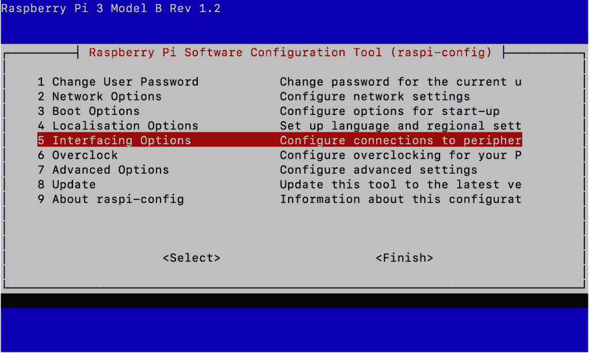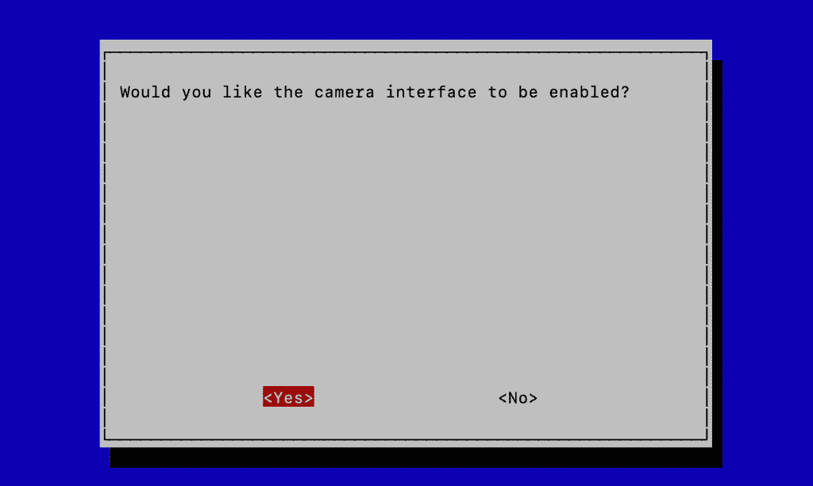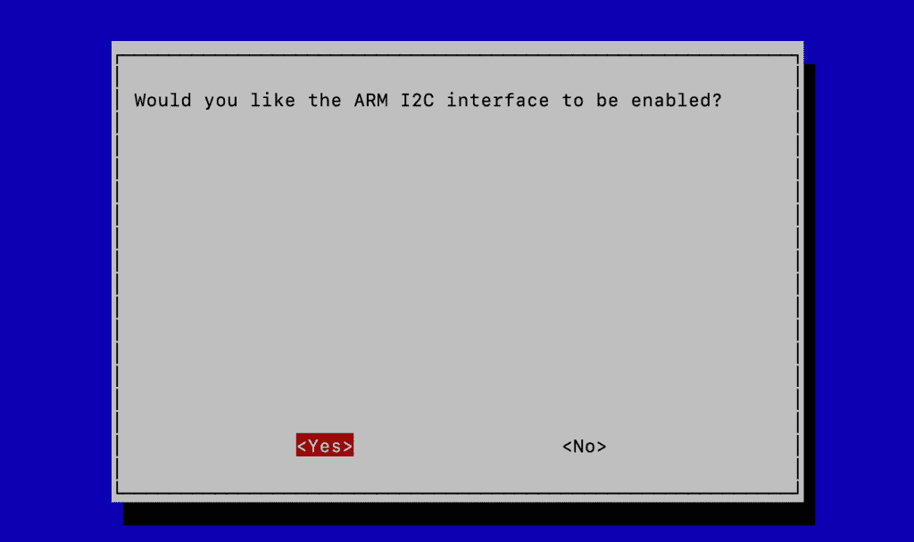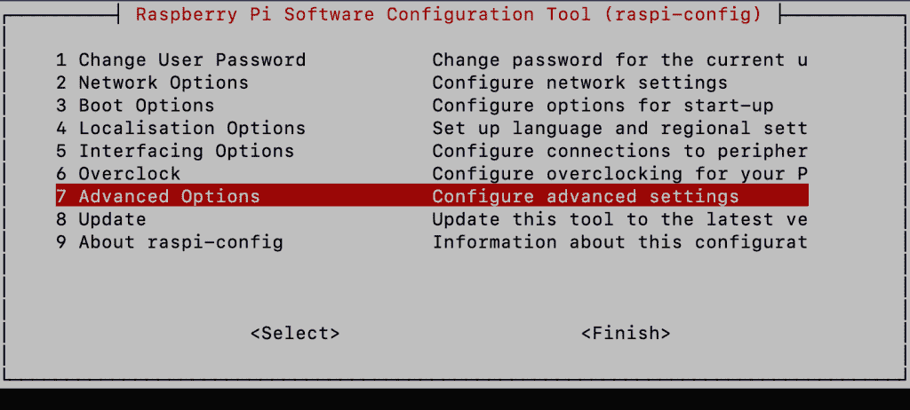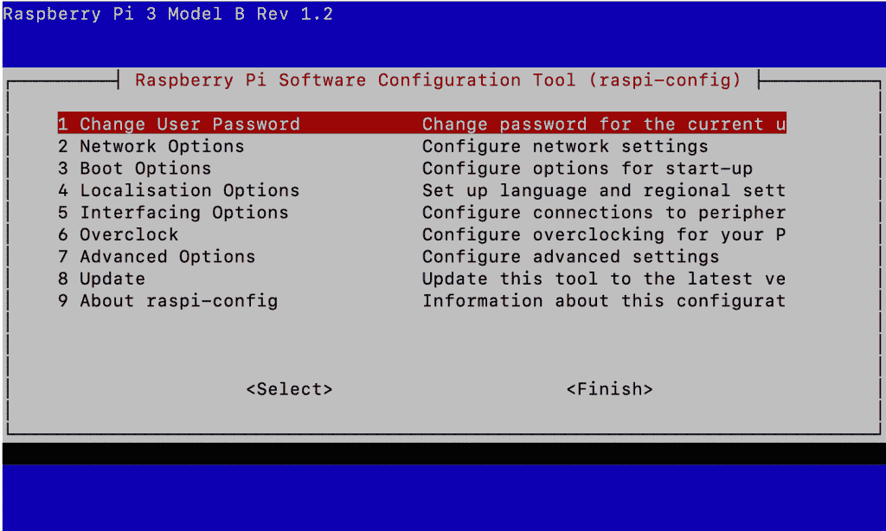

确保在更改配置后重新启动。

## 步骤 9:安装依赖项

```
sudo apt-get update sudo apt-get install build-essential python3 python3-dev python3-virtualenv python3-numpy python3-picamera python3-rpi.gpio i2c-tools avahi-utils joystick libopenjp2-7-dev libtiff5-dev gfortran libatlas-base-dev libopenblas-dev libhdf5-serial-dev git
```

## 步骤 10:安装可选的 OpenCV 依赖项

```
sudo apt-get install libilmbase-dev libopenexr-dev libgstreamer1.0-dev libjasper-dev libwebp-dev libatlas-base-dev libavcodec-dev libavformat-dev libswscale-dev libqtgui4 libqt4-test
```

## 步骤 11:设置虚拟环境

```
python3 -m virtualenv -p python3 env echo "source env/bin/activate" >> ~/.bashrc source ~/.bashrc
```

## 步骤 12:安装 Tensorflow

你可以查看[这个](https://github.com/lhelontra/tensorflow-on-arm/releases/)页面找到你喜欢的。或者安装这个:

```
wget https://github.com/lhelontra/tensorflow-on-arm/releases/download/v1.10.0/tensorflow-1.10.0-cp35-none-linux_armv7l.whl pip install tensorflow-1.10.0-cp35-none-linux_armv7l.whl
```

## 步骤 13:安装 Donkeycar Python 代码并安装

这将从 Tawn 的 fork 中提取最新信息:

```
git clone https://github.com/tawnkramer/donkey pip install -e donkey[pi]
```

## 步骤 14:创建您的汽车应用程序。

```
donkey createcar --path ~/d2
```

# 6.带它去兜一圈

发动你的车，是时候开车兜风了。如果你打算用手机来控制你的汽车，你可以在 config.py 文件下进行配置。

```
cd ~/d2 sudo nano config.py
```

更改脚本底部的下面一行。

```
USE_JOYSTICK_AS_DEFAULT = True
```

## 发动你的车，开车。

打开你的汽车文件夹，启动你的汽车。

```
cd ~/d2 python manage.py drive
```

这个脚本将在您的汽车中启动驱动循环，其中包括一个用于控制您的汽车的 web 服务器部分。您现在可以通过网址:`<your car's IP's address>:8887`的网络浏览器控制您的汽车

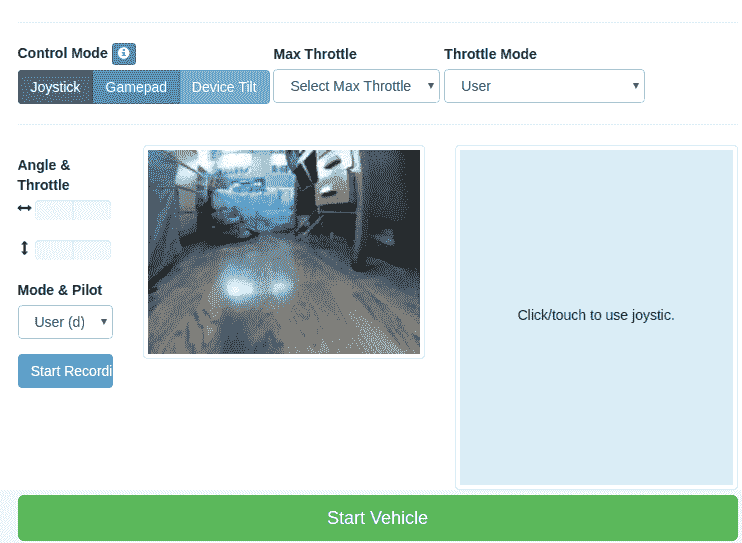

您可以在移动浏览器上加载 URL，远程控制您的车辆，或者使用桌面浏览器来控制设备。当你使用它前进时，汽车将自动开始记录，它将通过在 Raspberry Pi 的项目数据文件夹中创建一个 tub 文件夹来捕获必要的图像序列和 JSON 文件。

# 使用网络控制器驾驶

## 特征

*   记录—按记录数据开始记录图像、转向角度和油门值。
*   节流模式—将节流设置为常数的选项。这是在比赛中使用的，如果你有一个飞行员会驾驶，但不控制油门。
*   飞行员模式—如果飞行员应该控制角度和/或油门，选择此项。
*   最大节流—选择最大节流。

# 7.Google Colab 简介

现在我们已经能够成功驾驶我们的汽车，我们需要开始训练我们的模型，以便我们能够拥有一辆自动驾驶汽车。为了追求同样的目标，我开始在我的 Mac 上训练它，花了几个小时，我完全放弃了。然后作为一个替代方案，我在家里使用了我的游戏装备，规格相当高，花了大约 25-30 分钟来训练模型。如果我们想快速训练更多的模型，这是没有好处的，所以在我的研究中，我想使用云来快速完成工作，但你需要为此付费。最后偶然发现了 Google Colab，它不需要设置，运行在云中，完全免费。

Colaboratory 是一个免费的 Jupyter 笔记本环境，不需要设置，完全在云中运行。

借助 Colaboratory，您可以编写和执行代码、保存和共享您的分析，以及访问强大的计算资源，所有这些都可以从浏览器中免费获得。

# 8.使用 Colab 训练自动驾驶仪

使用 Google Colab 的加速硬件，我能够在几分钟或更短的时间内多次训练我们的模型。我们离拥有全功能自动驾驶遥控汽车只有一步之遥。

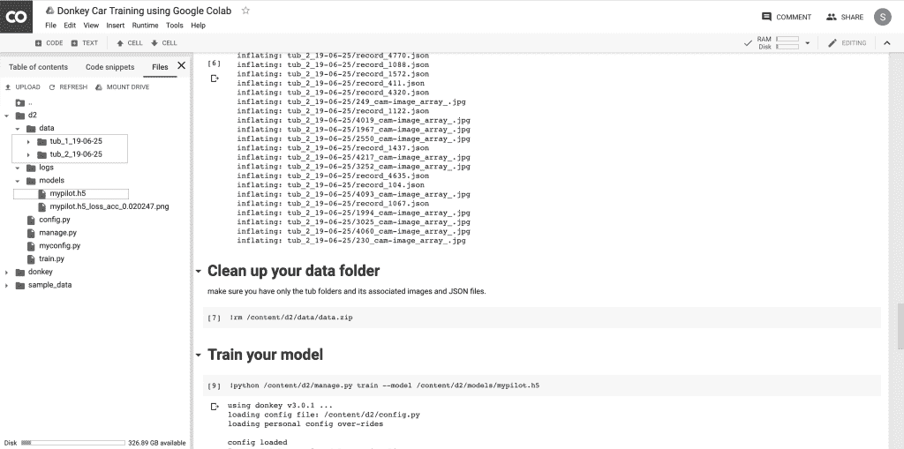

遵循 Github 存储库中显示的说明。

[https://github . com/sachindroid 8/自驾-用车-google-colab](https://github.com/sachindroid8/self-driving-car-using-google-colab)

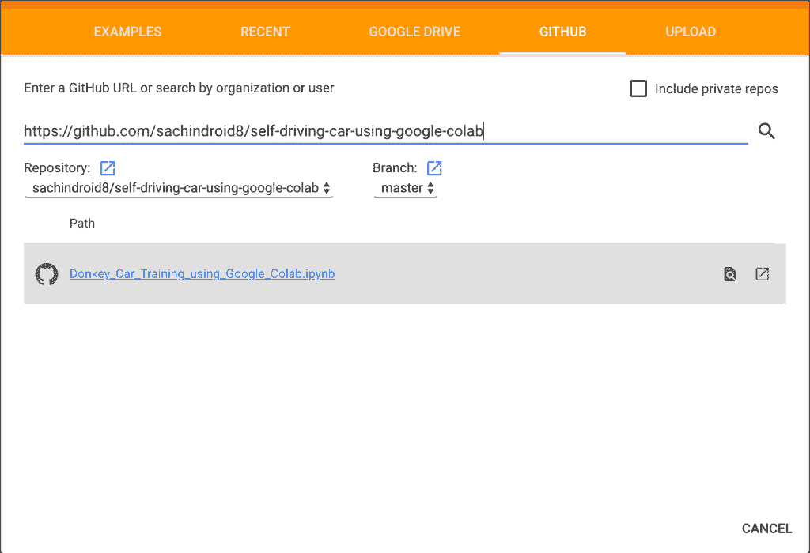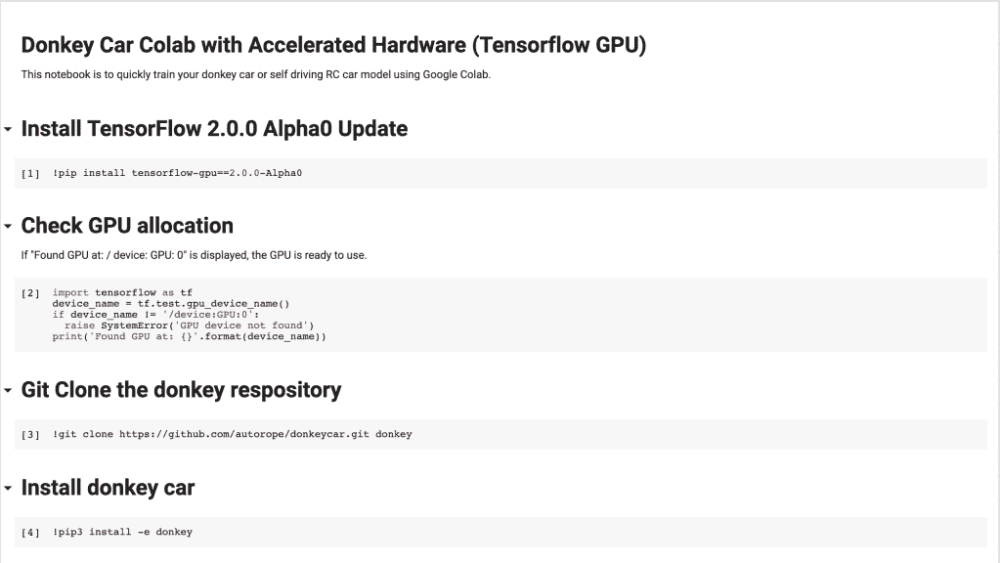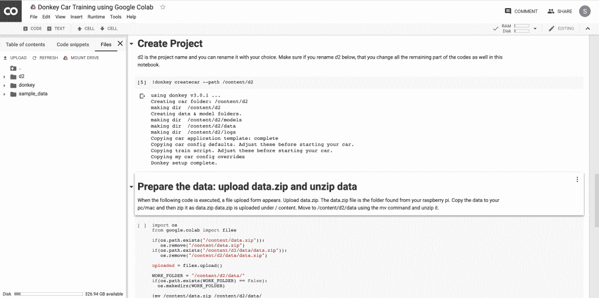

将生成的 mypilot.h5 文件复制到您的 Raspberry Pi 的以下位置。/home/pi/d2/models/mypilot.h5

在您的 Raspberry Pi 中执行以下命令。

```
cd ~/d2 python manage.py drive --model ~/d2/models/mypilot
```

# 使用 Raspberry Pi 构建自动驾驶遥控汽车，使用 Google Colab 进行机器学习

下图是我在 Google IO Extended 2019 的一次演讲中的演示。

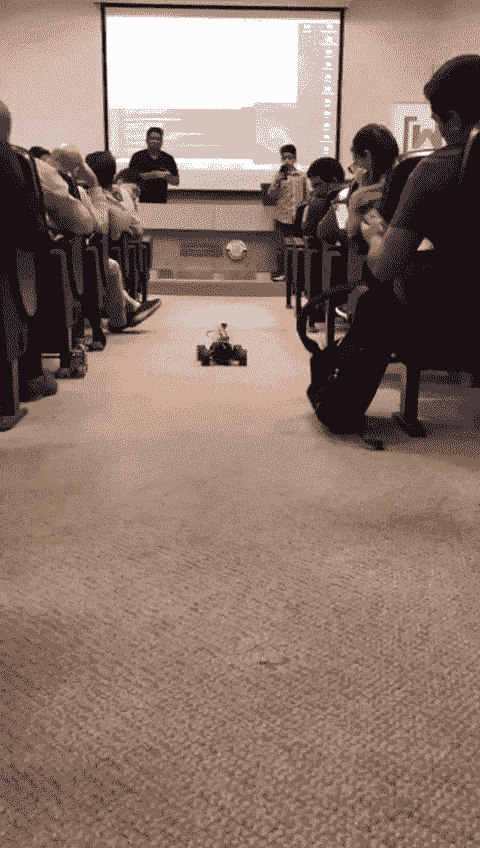

# 9.尝试并享受乐趣

# 培训提示:

Mode & Pilot:祝贺你走了这么远。运行上面的命令后，首先要注意的是查看模式和飞行员菜单中的选项。可能会很混乱。以下是不同选项的含义:

*   用户:正如你所猜测的，这是你控制方向盘和油门的地方。
*   局部角度:不太明显，但这是受过训练的模型(从上面看我的飞行员)控制转向的地方。本地指的是在 raspberry-pi 上本地托管的训练模型。
*   本地飞行员:这是训练有素的模型(我的飞行员)承担控制转向和油门。到目前为止，据说它不太可靠。一定要检查最大油门和油门模式选项，并尝试一些设置。对训练有很大帮助。

建造一个简单的赛道:这不是很好的证明，但是赛车应该(理论上)能够在任何类型的赛道上训练。首先，可能没有必要建造一条带条纹中心车道的双车道轨道。试着用一条没有中心线的单车道，或者只有一条构成一条赛道！至少，您将能够进行端到端的测试，并验证软件管道是否都正常工作。当然，作为下一步，你会想要创建一个更标准的轨道，并在离你最近的聚会上竞争！

寻求帮助:试着从一两个朋友那里寻求帮助。同样，这对于建造轨道有很大的帮助，因为独自建造一条双线轨道比看起来要困难得多！此外，通过使用功能区而不是磁带，您可以节省资源(和磁带)。它们仍然需要一些胶带来固定，但是你可以重复使用它们，并且可以更轻松地放下它们(尽管如果你在户外工作，风可能会使最初放下它们变得困难)。

# 10.结论

总结一下，我们已经成功地使用 Raspberry Pi 建造了一辆自动驾驶汽车，并使用 Tensorflow 和 Google Colab 建造了机器学习模型。我们可以使用相同的方法训练更多的模型，并且免费使用 Google Colab 训练更快。此外，看看我的一些其他教程。

[](/google-cloud/how-to-build-your-own-smart-speaker-google-assistant-google-cloud-actions-on-google-and-eec1169d9435) [## 如何打造自己的智能音箱——谷歌助手、谷歌云、谷歌上的动作和…

### 在本教程中，我们将学习如何使用谷歌助手、谷歌云、在…上的操作来构建自己的智能扬声器

medium.com](/google-cloud/how-to-build-your-own-smart-speaker-google-assistant-google-cloud-actions-on-google-and-eec1169d9435) [](/google-cloud/how-to-create-a-chatbot-using-dialogflow-enterprise-edition-and-dialogflow-api-v2-923f4a965176) [## 如何使用 Dialogflow 企业版和 Dialogflow API V2 创建聊天机器人

### 在本教程中，我们将学习如何使用 Dialogflow 企业版和 Dialogflow API V2 创建聊天机器人。这个…

medium.com](/google-cloud/how-to-create-a-chatbot-using-dialogflow-enterprise-edition-and-dialogflow-api-v2-923f4a965176) [](/google-cloud/how-to-build-an-app-for-google-assistant-using-dialogflow-enterprise-edition-and-actions-on-google-4413a61d2f2d) [## 如何在 Google 上使用 Dialogflow Enterprise Edition 和 Actions 为 Google Assistant 构建应用程序

### 用户在对话中使用 Google Assistant 来完成事情，比如购买食品杂货或预订乘车服务，或者在我们的…

medium.com](/google-cloud/how-to-build-an-app-for-google-assistant-using-dialogflow-enterprise-edition-and-actions-on-google-4413a61d2f2d) 

# 11.参考

*   [Google Colab](https://colab.research.google.com/)
*   [Robocarstore Docs](https://docs.robocarstore.com/)
*   [东卡文件](https://docs.donkeycar.com/)

*原载于 2019 年 6 月 29 日*[*https://techwithsach.com*](https://techwithsach.com/build-a-self-driving-rc-car-using-raspberry-pi-and-machine-learning-using-google-colab/)*。*