# 使用谷歌云物联网核心和 MongooseOS 构建气象站

> 原文：<https://medium.com/google-cloud/build-a-weather-station-using-google-cloud-iot-core-and-mongooseos-7a78b69822c5?source=collection_archive---------0----------------------->

## 使用托管的无服务器架构收集大量数据，这样您就不会在此过程中自寻烦恼。

好的，有很多教程教你如何建立一个气象站，因为有很多方法。这是一个简单的项目，所以我会努力专注于建立一个端到端的解决方案，从收集数据到对您的数据进行分析。所有这些都将使用托管的谷歌云服务，概述如何构建一个完整的物联网解决方案。最后，您可以基于您的数据构建报告，并通过 web 访问它。在这里你可以看到它的样子:

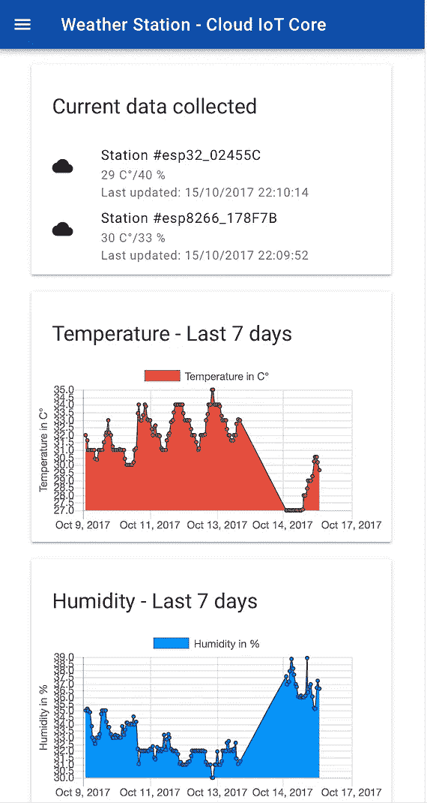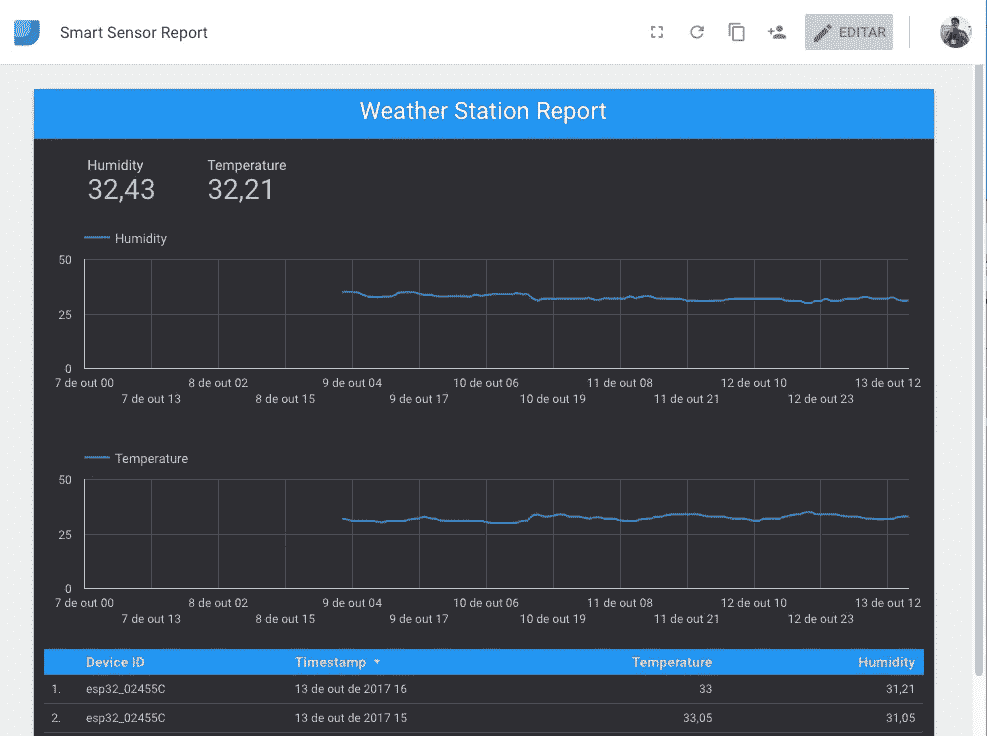

我们项目的最终外观

> 我们完成的 web app:[https://weather-station-iot-170004.firebaseapp.com](https://weather-station-iot-170004.firebaseapp.com)/
> 
> 数据工作室报道:[https://data Studio . Google . com/reporting/0 b 0 w5 dnm 9 BD 8 SD y1 or 1 lzq 0 l4 VMC](https://datastudio.google.com/reporting/0B0w5dnm9bD8sdy1OR1lZQ0l4Vmc)

在本教程中，我们将使用运行 **MongooseOS** 的 WiFi 微控制器构建一个气象站，它使用 MQTT 协议通过**云物联网核心**安全地发送数据，然后使用 **Firebase 云函数**以基于事件的方式处理数据，这些函数将原始数据保存在 **BigQuery** 中，并更新 **Firebase 实时数据库**中的设备当前状态。然后可以通过 **DataStudio** 和 **Firebase Hosting** 上托管的简单 WebApp 访问数据。有许多产品，但我将展示如何轻松地连接每一个产品，以部署一个按需扩展的产品。我们的架构将会是这样的:

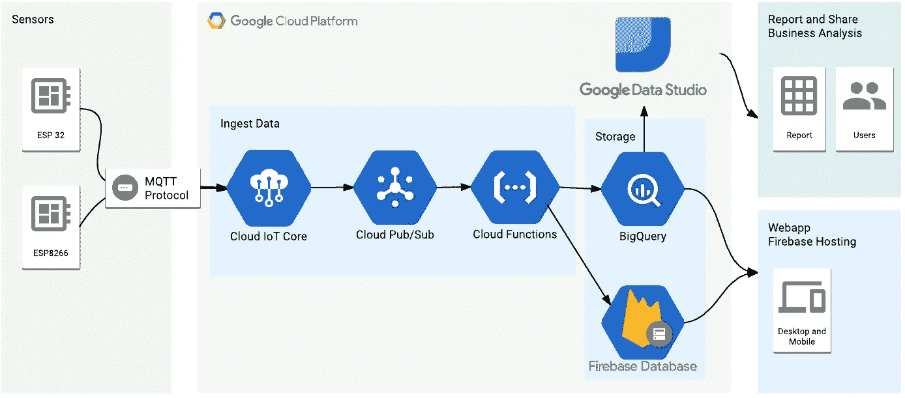

我们的项目架构

为了便于开发，我将使用 MongooseOS，它已经有一个用于云物联网核心的连接器，并有助于为设备提供证书、WiFi 配置和其他自定义配置的过程。

我们将学到什么:

*   创建云物联网核心设备注册表。
*   创建 PubSub 主题以接收和发送数据。
*   安装 MongooseOS 命令行工具— *mos。*
*   使用 *mos 对 ESP32/ESP8266 进行编程。*
*   为设备提供证书和 WiFi 配置。
*   设置 BigQuery 和 Firebase 来接收数据。
*   部署 Firebase 云功能来接收数据。
*   在 Firebase 托管中部署一个基本的 WebApp。
*   使用 Data Studio 在 BigQuery 中制作报表。

说得够多了，让我们开始吧🚀。

## 设置谷歌云项目和云物联网核心

谷歌最近公开推出了 beta Cloud IoT Core，这是一种托管服务，可以使用通用协议(MQTT 和 HTTP)安全地与物联网设备进行通信，并以简单的方式管理这些设备。基本上，有了这项服务，你可以插入许多其他谷歌服务来处理、存储和分析你的设备产生的所有数据。在这里，我们可以看到一个使用云物联网核心的推荐架构示例。

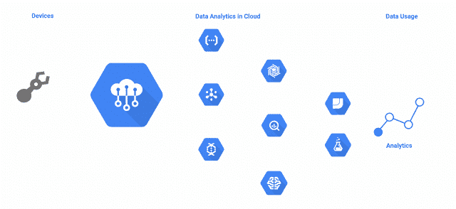

流经许多谷歌服务的数据。

云物联网核心有一个设备注册表的概念，在我们的项目中，我们将对一系列类似的设备进行分组，并与该注册表相关联。要开始使用谷歌云，你可以在云控制台 web 界面上做所有的事情，但命令行工具是一个更强大的工具，也是我选择在这个项目上使用的工具。

要使用`gcloud`命令行工具，[按照这里的说明下载并安装它](https://cloud.google.com/sdk/downloads)。

 [## 安装 Cloud SDK | Cloud SDK 文档| Google 云平台

### 编辑描述

cloud.google.com](https://cloud.google.com/sdk/downloads) 

安装 SDK 后，您应该安装测试版工具来访问云物联网核心命令。此外，在此之后，您应该验证并创建一个在本教程中使用的项目，将您的 _PROJECT_NAME 替换为您希望用于此项目的名称:

```
# Install beta components:
**gcloud components install beta** # Authenticate with Google Cloud:
**gcloud auth login** # Create cloud project — choose your unique project name:
**gcloud projects create YOUR_PROJECT_NAME** # Set current project **gcloud config set project YOUR_PROJECT_NAME**
```

现在在云物联网核心端，你首先应该配置一些与云物联网核心使用的主要组件之一 Cloud PubSub 相关的组件。在下面的命令中，您将执行以下操作:

1.  授予云物联网核心在 PubSub 上发布消息的权限。
2.  创建一个名为 *telemetry-topic、*的**主题**，这些消息将在这里发布。
3.  创建一个名为*遥测订阅*的**订阅**，我们稍后将使用它来读取主题中的一些消息。
4.  创建一个名为*weather-station-Registry*的**注册表**，我们的设备将在其中注册，以便能够连接到**云物联网核心**。这里我们联想到**主题**的创建。

```
# Add permissions for IoT Core **gcloud projects add-iam-policy-binding YOUR_PROJECT_NAME --member=serviceAccount:cloud-iot@system.gserviceaccount.com --role=roles/pubsub.publisher** # Create PubSub topic for device data:
**gcloud beta pubsub topics create telemetry-topic** # Create PubSub subscription for device data:
**gcloud beta pubsub subscriptions create --topic telemetry-topic telemetry-subscription** # Create device registry:
**gcloud beta iot registries create weather-station-registry --region us-central1 --event-pubsub-topic=telemetry-topic**
```

如果您访问 Google Cloud 控制台，您可以验证它已经创建并配置完毕。

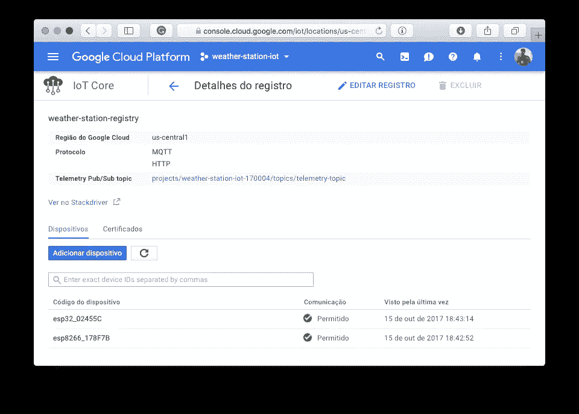

已创建并与发布订阅主题相关联的注册表

## 猫鼬操作系统和 ESP32/ESP8266

对于这个项目，我将使用最新的 ESP32 WiFi 微控制器，对于那些还不知道它的人来说，它是 ExpressIf 非常著名的 ESP8266 的继任者，但现在具有更多功能，如内置蓝牙 LE、时钟频率为 240MHz 的双核处理器、触摸传感器和对闪存加密的支持，所以没有人可以访问您的代码。一次升级。

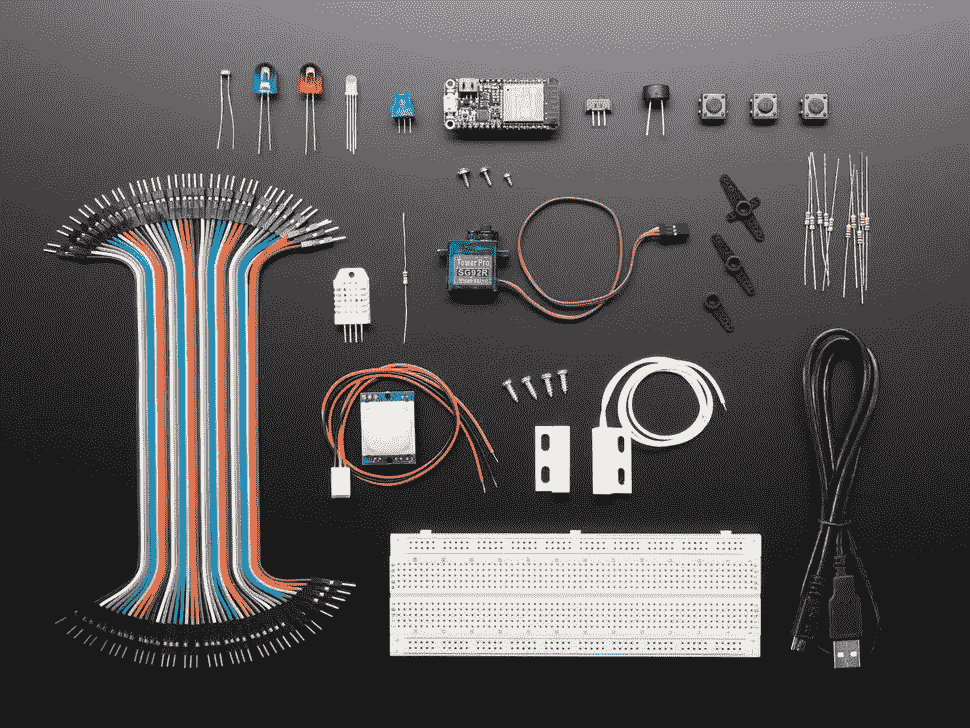

猫鼬操作系统和谷歌物联网核心包，带阿达果羽毛 huzzah 32—[https://www.adafruit.com/product/3606](https://www.adafruit.com/product/3606)

Adafruit 出售一个非常棒的工具包，可以开始使用 ESP32 和谷歌云，它包含了这个项目和许多其他项目所需的所有内容，所以如果你想走简单的路，你可以购买其中一个。(只是给你一个想法[阿达果工业](https://medium.com/u/c9914184139c?source=post_page-----7a78b69822c5--------------------------------)，我没有这些，只是说…)

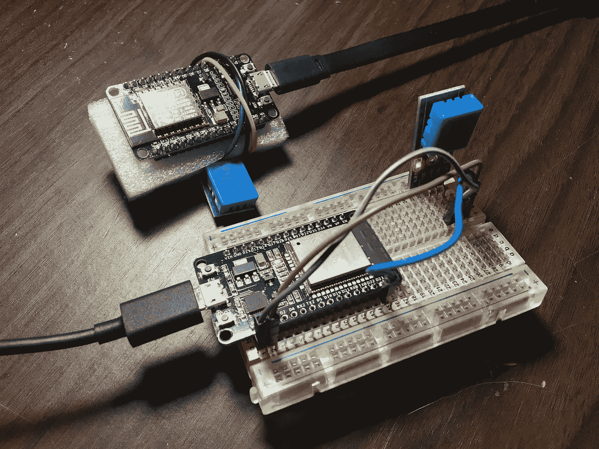

该项目采用 ESP 微控制器 ESP32 和 ESP8266。

这个项目也可以在 ESP8266 上运行，所以这里提供的代码和原理图可以在两个微控制器上运行。该项目的电路非常简单，只需将 DHT 传感器连接到 ESP32/ESP8266，如下图所示:

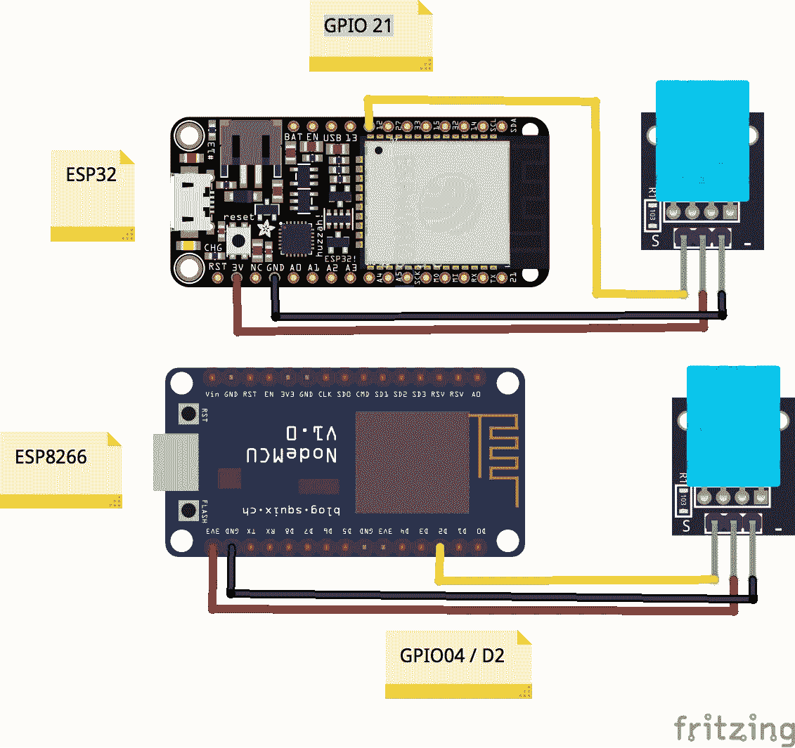

使用 ESP32 和 ESP8266 的项目原理图

为了对开发板进行编程，我们将使用 MongooseOS，这是一个为商业产品开发的操作系统，具有许多令人惊叹的功能。它支持一些微控制器，如 CC3200、ESP32 和 ESP8266。它的一个很酷的功能是可以使用 Javascript 快速原型化您的嵌入式应用，它有一个名为 *mos* 的工具，使编程、供应和配置在那些支持的板上变得非常容易。

要使用它，我们需要从官方网站下载并安装它。遵循[https://mongoose-os.com/docs/quickstart/setup.html](https://mongoose-os.com/docs/quickstart/setup.html)上的安装说明。

[](https://mongoose-os.com/docs/quickstart/setup.html) [## Mongoose 操作系统文档

### Mongoose 操作系统文档和用户指南

mongoose-os.com](https://mongoose-os.com/docs/quickstart/setup.html) 

## 硬件编程和设置我们的后端

安装好工具后，下载链接到这里的 [Github 库上的项目代码](https://github.com/alvarowolfx/weather-station-gcp-mongoose-os)，这样您就可以在设备上构建和部署它了。

[](https://github.com/alvarowolfx/weather-station-gcp-mongoose-os) [## alvarowolfx/气象站-GCP-mongose-OS

### 一个用 ESP32 制作的气象站，通过谷歌云物联网核心和…

github.com](https://github.com/alvarowolfx/weather-station-gcp-mongoose-os) 

知识库由 **3 个子项目**组成:

*   **固件**:运行在微控制器上的 MongooseOS 项目，收集传感器数据并通过云物联网核心发送
*   **功能**:将部署到 Firebase 上的云功能。这里我们有一个函数，它对 PubSub 上的新数据做出反应，然后发送到 BigQuery 和 Firebase 实时数据库。还有另一个功能，它基本上是一个 HTTP 端点，查询 BigQuery 以获取我们的 WebApp 要使用的最近 7 天的数据。
*   **public** :一个简单的 WebApp，将被部署在 Firebase 主机上，它参考我们的数据库来显示我们的传感器数据。

下面是对**固件**项目的一些描述:

*   fs :这里是我们的 Javascript 代码，它包含了所有收集数据的逻辑，并以固定的时间间隔通过 MQTT 发送。
*   src :我们本地 C 代码，basic 启动了 Google Cloud library，所以它自动配置我们的项目来连接 Google MQTT 服务器。
*   **mos.yml 和 mos_esp8266.yml** :我们的项目配置，这里我们声明我们的项目依赖项，这里是 GCP 库，DHT 传感器库和 mJS 库，最后一个增加了对 Javascript embedded 的支持。这里我们声明了一个名为 **app.dht 的自定义配置变量，**这样我们就可以通过更改这个配置来更改 dht 引脚，这可以在这个文件上进行，也可以通过 *mos* 工具进行。此外，这种配置在不同的微控制器之间也有所不同，增加了对具有相同代码的两个微控制器的支持。

要对硬件进行编程，请进入**固件**文件夹并运行以下指令来刷新固件、配置 WiFi 并在云物联网核心上配置设备:

*   根据所选硬件运行`mos build --arch esp32`或`mos build --arch esp8266`。这个命令构建我们硬件的固件。
*   通过 USB 连接硬件运行`mos flash`，刷新固件。
*   运行`mos wifi your_ssid your_pass`在您的设备上配置 WiFi。
*   运行以下命令在云 IoT 代码上注册此设备。该命令生成用于通信的公钥和私钥，将私钥放在设备上，将公钥发送到云物联网核心并注册设备，从 ESP 获取设备 Id。谢谢蒙古人❤.

```
mos gcp-iot-setup --gcp-project **YOUR_PROJECT_NAME** --gcp-region us-central1 --gcp-registry **YOUR_REGISTRY**
```

就是这样，你的设备将开始向云物联网核心发送数据。这些项目被配置为每分钟发送数据，但是您可以稍后在 **fs/init.js** 文件中更改这一点，或者您可以创建一个定制的配置变量来更改时间。我会把这个作为家庭作业。你可以使用`mos console`工具看到设备上发生了什么。你会看到它试图与 mqtt.googleapis.com 建立联系。

```
$ mos console
Using port /dev/cu.SLAB_USBtoUART
[Oct 15 18:17:47.230] pm open,type:2 0
[Oct 15 18:17:47.234] mgos_sntp_ev         SNTP reply from 192.99.2.8: time 1508102268.124028, local 15.317275, delta 1508102252.806753
[Oct 15 18:17:47.448] mgos_mqtt_ev         MQTT CONNACK 4
[Oct 15 18:17:47.455] mgos_mqtt_ev         MQTT Disconnect
[Oct 15 18:17:47.463] mqtt_global_reconnec MQTT connecting after 2017 ms
[Oct 15 18:17:48.167] Info: {"hum":34,"temp":30,"free_ram":35.593750,"total_ram":51.218750} 
[Oct 15 18:17:49.487] mgos_mqtt_global_con MQTT connecting to mqtt.googleapis.com:8883
```

要查看 PubSub 上的数据，您可以使用 gcloud 命令来查询我们创建的订阅:

```
$ gcloud beta pubsub subscriptions pull --auto-ack telemetry-subscription
┌───────────────────────────────────────────────────────────┬─────────────────┬─────────────────────────────────────────────────────────────────────────────────────────────────────────────────────────────────────────────────────────────────────────────────┐
│                            DATA                           │    MESSAGE_ID   │                                                                                    ATTRIBUTES                                                                                   │
├───────────────────────────────────────────────────────────┼─────────────────┼─────────────────────────────────────────────────────────────────────────────────────────────────────────────────────────────────────────────────────────────────────────────────┤
│ {"hum":35,"temp":32,"free_ram":167344,"total_ram":253928} │ 158362578982703 │ deviceId=esp32_02455C deviceNumId=2799497560622332 deviceRegistryId=weather-station-registry deviceRegistryLocation=us-central1 projectId=weather-station-iot-170004 subFolder= │
└───────────────────────────────────────────────────────────┴─────────────────┴─────────────────────────────────────────────────────────────────────────────────────────────────────────────────────────────────────────────────────────────────────────────────┘
```

如果你看到控制台上的数据，你可以开始庆祝，我们走在正确的道路上🎉🏆。

## 在 BigQuery 上存储数据

直接从官网获取定义:

> BigQuery 是 Google 的低成本、完全可管理的 Pb 级可扩展数据存储服务。BigQuery 是独立的，不需要管理基础设施，也不需要数据库管理员，因为它可以随数据扩展。

在这里，我们将使用它来存储我们收集的所有传感器数据，以运行一些查询，并在以后使用 Data Studio 构建报告。首先，让我们创建一个**数据集**和一个**表**来存储我们的数据。为此，[打开 BigQuery Web UI](https://bigquery.cloud.google.com/) ，并按照说明进行操作:

1.  单击向下箭头图标，然后单击“创建新数据集**”**。
2.  把你的**数据集**命名为“weather_station_iot **”。**
3.  使用以下字段和类型创建一个**表"** raw_data **"** :

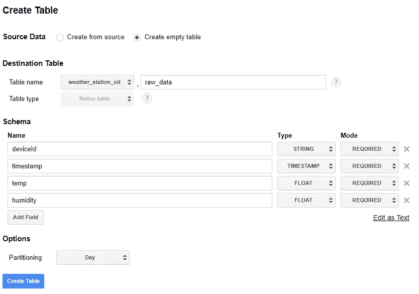

我们的 BigQuery 表来存储传感器数据。

## 部署 Firebase 数据库和云功能

现在，为了在 BigQuery 上插入数据，我们将使用 Firebase 云函数，这些函数可以配置为基于许多不同的触发器和事件来执行。其中一个触发器是插入到 PubSub 主题中的新数据，因此我们将侦听与我们的设备注册表相关联的主题，对于每个到达的数据，我们执行一个函数，将数据存储在 BigQuery 中，并在 Firebase 实时数据库中维护最新的设备数据。

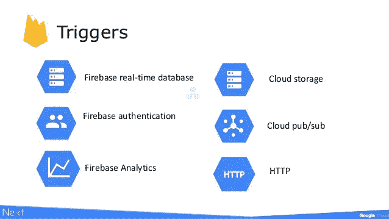

Firebase 云功能的触发因素— Google Cloud Next 2017

Firebase 实时数据库是一项非常有用的技术，可以维护实时数据，在所有连接的客户端之间提供免费的自动同步。[甚至谷歌也建议它保持物联网设备的实时状态，就像我们在这里看到的](https://cloud.google.com/solutions/iot-overview)。

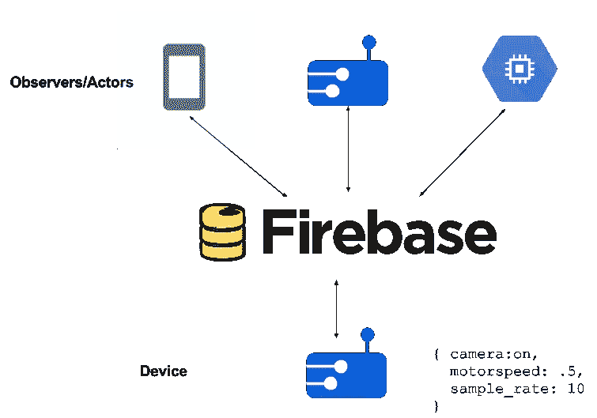

使用 Firebase 的物联网架构—【https://cloud.google.com/solutions/iot-overview 

我们的函数的代码可以在上面看到，它基本上对 PubSub 事件作出反应，并插入到 BigQuery 中，然后更新 Firebase 上的当前状态。

*Firebase 命令行工具*需要节点。js 和 npm [、](https://www.npmjs.org/)可以按照[https://Nodejs.org/.](https://nodejs.org/)安装 node 上的说明安装，JS 也会安装 npm。

安装节点和 NPM 后，运行以下命令安装 Firebase CLI。

```
npm install -g firebase-tools
```

现在，要用我们的项目配置 firebase 并部署功能，在项目根文件夹中，遵循上面的说明:

*   运行`firebase login`向 Google 认证并设置命令行工具
*   运行`firebase init`将本地项目与您的 Firebase 项目关联起来。
*   运行上面的代码来设置一些环境变量，指向我们的 BigQuery 数据集和表。

```
firebase functions:config:set bigquery.datasetname="weather_station_iot" bigquery.tablename="raw_data”
```

*   最后运行`firebase deploy`在公共文件夹上部署函数和 Webapp。

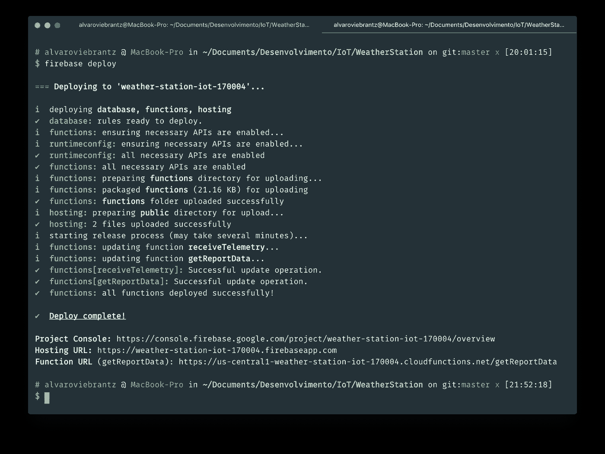

所有这些都可以通过 Firebase 轻松部署。

使用部署的功能，您可以接收设备发送的遥测数据，并存储在两个存储解决方案中。您可以在 Firebase 控制台上看到所有部署的资源。

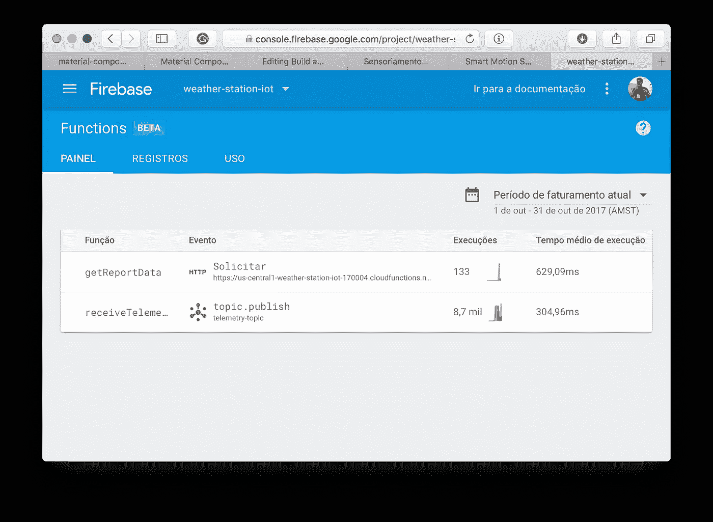

您可以看到在 Firebase 上运行的函数的执行和日志。

您可以看到上面函数的代码:

我们的云功能负责向 BigQuery 和 Firebase 实时数据库发送数据

*firebase-tools* 也有一个内置的服务器，你可以在运行 **firebase serve** 的项目文件夹上启动它，它会默认在端口 5000 上启动一个 web 服务器。


使用 Firebase 服务器运行本地

webapp 可以直接在 **public** 目录看到，逻辑在 **public/app.js** ，前端在 **public/index.html** 。挺基础的，就 Javascript， [Web 素材组件](http://material-components-web.appspot.com)和[图表。图表。](http://chartjs.org)

如果一切设置正确，那么你可以再次庆祝，因为你开发了一个端到端的物联网解决方案，而无需接触高级服务器设置。

## 最后一站，谷歌数据工作室

Data Studio 是一个非常直观的工具，我不会在这里探究它，所以本教程变得不太全面，但是为了让您知道，Data Studio 有一个 BigQuery 连接器，所以只需导入您的表并使用这个强大工具提供的不同可视化。去 datastudio.google.com 玩吧。

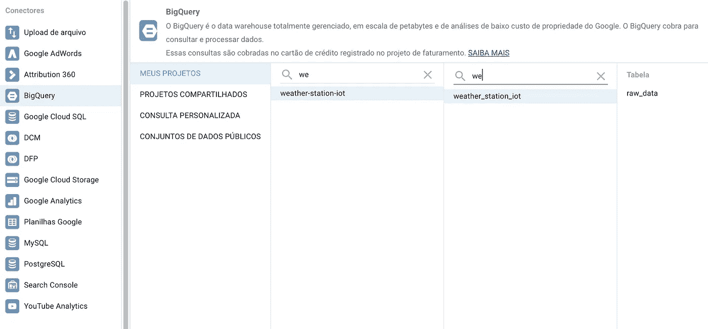

Data Studio BigQuery 连接器。


使用 Data Studio 的简单报告。

## 进一步阅读

这就是本教程，希望你对谷歌云物联网核心感兴趣，这是一个很棒的服务，你可以用它做强大的事情。这篇文章比我预期的要长一点，但我相信它很好地概述了谷歌云平台上的许多工具。

这个项目的代码可以在我的 Github 上找到，一些有趣的链接在下面的部分，稍后阅读:

[](https://github.com/alvarowolfx/weather-station-gcp-mongoose-os) [## alvarowolfx/气象站-GCP-mongose-OS

### 一个用 ESP32 制作的气象站，通过谷歌云物联网核心和…

github.com](https://github.com/alvarowolfx/weather-station-gcp-mongoose-os) 

*   [https://Cloud platform . Google blog . com/2017/09/announcing-Cloud-IoT-Core-public-beta . html](https://cloudplatform.googleblog.com/2017/09/announcing-Cloud-IoT-Core-public-beta.html)
*   http://mongoose-os.com/gcp
*   【https://cloud.google.com/iot/docs/quickstart 
*   [https://mongose-OS . com/docs/libraries/cloud _ integrations/GCP . html](https://mongoose-os.com/docs/libraries/cloud_integrations/gcp.html)
*   [https://www.adafruit.com/product/3606](https://www.adafruit.com/product/3606)
*   [https://github . com/alvarowolfx/weather-station-GCP-mongose-OS](https://github.com/alvarowolfx/weather-station-gcp-mongoose-os)

> 你喜欢这个帖子吗？所以不要忘了让你的拍手继续👏下面，推荐一下，分享给你的朋友。
> 
> 你用这个教程做了什么好事吗？显示在下面的评论部分。
> 
> 如果你有任何问题，请在评论中留言，我会尽力帮助你。