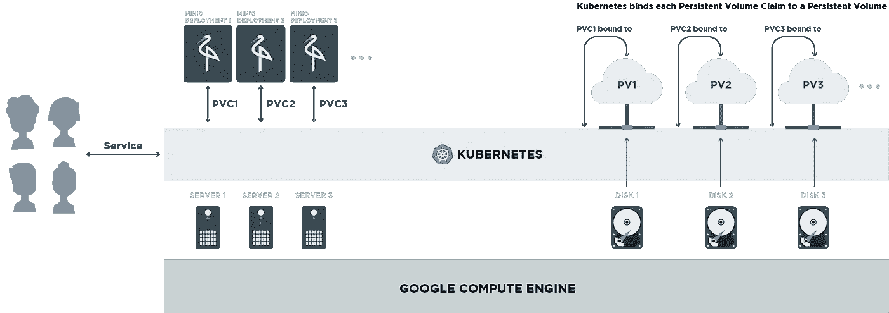
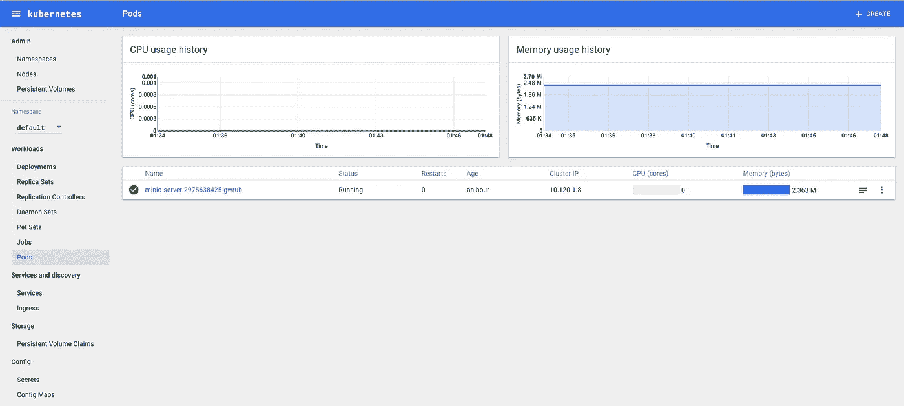

# 使用 Minio 和 Kubernetes 在 GCP 构建 AWS S3 兼容云存储

> 原文：<https://medium.com/google-cloud/build-aws-s3-compatible-cloud-storage-on-gcp-with-minio-and-kubernetes-2adc0a367f98?source=collection_archive---------0----------------------->

今天的应用程序[产生的数据比以往任何时候都多](https://blog.minio.io/object-storage-what-is-it-all-about-62920ca164ca#.qfa0ylbd1)，这种上升趋势[预计将在可预见的未来保持](https://www.emc.com/leadership/digital-universe/2014iview/executive-summary.htm)。您如何应对应用程序不断增长的存储需求？一个能够在您的应用程序运行的地方运行，并且能够以自动化的方式随之扩展的存储解决方案才是正确的选择。添加多租户功能，它变得近乎完美！

Minio 提供了一个可靠的轻量级对象存储服务。在像 Kubernetes 这样的编排平台上运行它，增加了自动化存储映射和多租户功能。这种设置具有清晰的关注点分离——可伸缩性的最重要参数之一。此外，在这种设置中很容易找到并隔离错误。

> 运行在 Kubernetes 等编排平台上的 Minio 是满足不断增长的存储需求的完美解决方案。

在本帖中，我们将看到如何用 Minio 和 Kubernetes 在 Google 云平台上构建 AWS S3 兼容的对象存储服务器。我们还将了解如何为多租户环境扩展这种设置。



运行在 GCE 上的 Kubernetes 集群上的 Minio 实例

## Minio 是什么？

Minio 是一个轻量级的、兼容 AWS S3 的对象存储服务器。它最适合存储照片、视频、日志文件、备份、虚拟机和容器映像等非结构化数据。对象的大小可以从几千字节到最大 5TB 不等。Minio 的突出特点包括

*   [用于 bitrot 保护的擦除编码](https://docs.minio.io/docs/minio-erasure-code-quickstart-guide)。
*   [Lambda 功能](https://docs.minio.io/docs/golang-client-api-reference#ListenBucketNotification)通过事件通知服务支持。
*   S3 版本 4 和 S3 V2 签名支持。
*   [分布式模式](https://github.com/minio/minio/tree/master/docs/distributed)。

## Kubernetes 术语

对于不了解 Kubernetes 术语的读者，我将快速浏览一下本文中使用的所有术语。

[**Pod**](http://kubernetes.io/docs/user-guide/pods/)**:**Pod 是 Kubernetes 中最小的计算单位。它是一组在共享上下文中运行的容器。

[**副本集**](https://kubernetes.io/docs/user-guide/replicasets/) **:** 副本集确保特定数量的 pod 副本始终启动并运行。虽然副本集是独立的实体，但它们主要由[部署](https://kubernetes.io/docs/user-guide/deployments/)用作协调 pod 创建、删除和更新的机制。

[**部署**](http://kubernetes.io/docs/user-guide/deployments/) **:** 一个部署可以被认为是一个包含 pod 和 ReplicaSet 的抽象。

[**服务**](http://kubernetes.io/docs/user-guide/services/) **:** 服务定义了一组逻辑单元和访问它们的策略。服务所针对的 pod 集由标签选择器决定(在服务的 yaml 文件中定义)。

[**持久卷**](http://kubernetes.io/docs/user-guide/persistent-volumes/#introduction) :持久卷(PV)是集群中的一块网络存储，抽象出了存储的具体细节。

[**持久卷声明**](http://kubernetes.io/docs/user-guide/persistent-volumes/#persistentvolumeclaims) :持久卷声明(PVC)是应用程序/pod 对存储的请求。

## Kubernetes 装置

首先，您需要一个运行在 Google Compute Engine (GCE)上的 Kubernetes 集群。按照这些[详细步骤](http://kubernetes.io/docs/getting-started-guides/gce/)在 GCE 上设置 Kubernetes 集群。

## 配置存储

通过持久卷(PV)和持久卷声明(PVC)，Kubernetes 可以非常轻松地从您的应用程序中提取物理存储细节。您可以使用集群中的物理存储创建 PVs，然后让您的应用程序通过 PVC 请求它需要的存储。由于存储请求是通过 PVC 发出的，Kubernetes 会自动将其映射到实际存储(PVs)。

让我们在 Google 计算引擎环境中进一步探讨这个问题。GCE 有[个磁盘](https://cloud.google.com/compute/docs/disks/add-persistent-disk#create_disk)，用作计算节点的物理存储。在 Kubernetes 上，您可以创建使用这些磁盘作为主干物理存储的 PV。

稍后，当您在 Kubernetes 集群上部署 Minio 时，您可以创建 PVC 来请求特定 Minio 实例所需的存储。Kubernetes 自动将匹配的 PV 绑定到 PVC。这在 Kubernetes 世界中被称为静态绑定，是的，也有动态绑定，但我们现在跳过它。点击阅读更多关于绑定[的信息。](http://kubernetes.io/docs/user-guide/persistent-volumes/#binding)

现在您已经清楚了事情是如何工作的，让我们从创建 GCE 磁盘开始。

```
$ gcloud compute disks create minio-1 --size=10GiB
```

这将创建一个名为`disk1`的磁盘，大小为`10GiB`。现在，基于我们刚刚创建的 GCE 磁盘创建一个 PV。

[minio-gce-pv.yaml](https://gist.github.com/NitishT/2f55d9bc3425b7e1679d3f52d9020df3) 文件

[下载](https://gist.githubusercontent.com/NitishT/2f55d9bc3425b7e1679d3f52d9020df3/raw/990febef8b3c321b9cde3cdac30258fc7bdd2ff1/minio-gce-pv.yaml)并将文件保存为 *minio-gce-pv.yaml* 。然后，您可以使用以下命令创建永久卷:

```
$ kubectl create -f minio-gce-pv.yaml
```

## 部署 Minio

部署封装了副本集和 pod，因此，如果一个 pod 关闭，副本集会确保另一个 pod 自动启动。这样你就不需要担心 pod 故障，并且有一个稳定的 Minio 服务可用。

但是在创建部署之前，我们需要创建一个持久卷声明(PVC)来为 Minio 实例请求存储。如上所述，Kubernetes 在集群中寻找与 PVC 请求匹配的 PV，并自动将其绑定到 PVC。

如果您需要一个具有不同存储需求的大规模多租户环境，这种自动化会非常方便。您可以加速每个租户的 Minio 部署(PVC 请求适当的存储)。Kubernetes 自动将 PVC 绑定到 PVs。这样，您就拥有了一个多租户的、稳定的、S3 兼容的对象存储服务器！

以下是如何创建运行 Minio Docker 映像的 PVC 和单 pod 部署。

[minio-独立-部署。*YAML*文件](https://gist.github.com/NitishT/d8a32eef314d8cb826c80ecab4ddc786)

[下载](https://gist.githubusercontent.com/NitishT/d8a32eef314d8cb826c80ecab4ddc786/raw/b04817715628f6f68a7bea543d80d60524442609/minio-standalone-deployment.yaml)并将文件保存为*minio-standalone-deployment . YAML*。请注意，我们首先创建 PVC，然后部署使用它作为其卷。然后，您可以使用以下命令部署 Minio:

```
$ kubectl create -f minio-standalone-deployment.yaml
```

## 将 Minio 作为服务公开

现在您已经有了一个正在运行的 Minio 部署，您可能希望在内部(在集群内)访问它，或者将它作为一个服务公开到一个外部(在集群之外，可能是公共互联网)IP 地址上，这取决于您的用例。

您可以使用*服务*来实现这一点。有 3 种主要的服务类型—默认类型是*集群 IP* ，它向集群内部的连接公开服务。*节点端口*和*负载平衡器*是向外部流量公开服务的两种类型。点击阅读更多关于服务[的信息。](http://kubernetes.io/docs/user-guide/services/#publishing-services---service-types)

下面的 yaml 文件为您的 Minio 部署配置了一个*负载平衡器*服务。

[迷你服务。*YAML*文件](https://gist.github.com/NitishT/23446d053bd4fbef1676dcaa8eed54f7)

[下载](https://gist.githubusercontent.com/NitishT/23446d053bd4fbef1676dcaa8eed54f7/raw/061eceef5dc166b7ab2e7345fba0ca8be09b6110/minio-standalone-service.yaml)并将该文件保存为 *minio-service.yaml* 并运行命令—

```
$ kubectl create -f minio-service.yaml
```

运行上述命令后，通常需要几分钟时间来创建服务的 IP 地址。您可以使用以下方法检查 IP 地址—

```
$ kubectl get services
```

一旦您有了可用的 IP 地址，您就可以通过该地址访问 Minio

http:// <service_ip_address>:9000/</service_ip_address>

访问密钥和秘密密钥保持与在*minio-standalone-deployment . YAML*中设置的环境变量相同。

> 请注意，只有当底层云提供商支持外部负载平衡时，负载平衡器才会工作。

## 监视

Kubernetes 附带一个整洁的仪表板。您可以通过仪表板轻松跟踪 Minio pod 的内存、CPU 使用情况和许多其他指标。

要访问仪表板，请执行以下命令—

```
$ kubectl cluster-info
```

访问 kubernetes-dashboard 中提到的 URL。这是我的仪表板的样子



需要帮助吗？我们在[懈怠](http://slack.minio.io)中闲逛。加入我们吧！