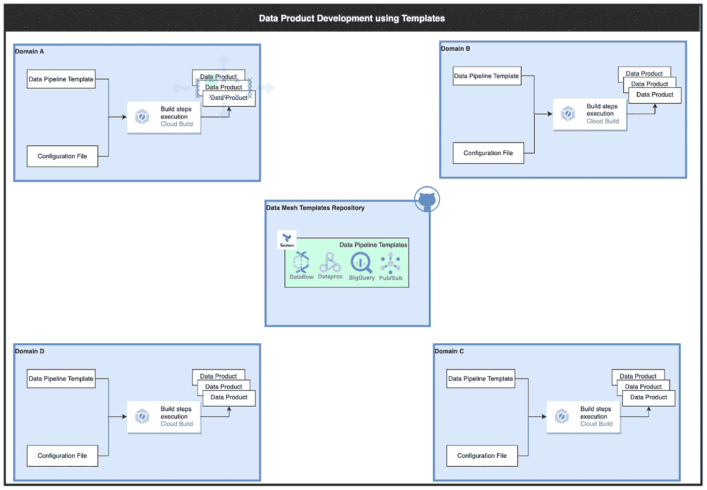

# 使用模板在数据网格中构建数据产品

> 原文：<https://medium.com/google-cloud/build-data-product-in-data-mesh-using-templates-e1bf5a38bf86?source=collection_archive---------2----------------------->

阿诺在 [Unsplash](https://unsplash.com/) 上的照片

# 数据网格概述

在数据分析领域，有各种各样的数据架构模式，这些模式是在过去几十年中逐渐发展起来的。

第一个是始于 20 世纪 80 年代末的数据仓库，它仍然是一种流行的体系结构模式。然后在 21 世纪后期出现了数据湖，我们看到了大数据的问题，需要分析系统来处理高速度、大容量和多种数据。随着云计算的出现，我们看到云数据平台或现代数据平台在 2010 年代中期开始流行。然后出现了数据湖之家，这是一个折衷的尝试，将两种模型(即数据仓库和数据湖)的优势结合在一起。

最新的是**数据网格架构**，它是面向领域的分散模式。数据网格是一种架构和组织框架，它将数据视为一种产品。在这种模式中，数据产品是由最了解数据的团队开发的，他们遵循组织范围内的一组数据治理标准。一旦数据产品被部署到数据网格中，组织中的分布式团队就可以更快、更有效地发现和访问与其需求相关的数据。本文重点关注使用模板 **或配方**构建**数据产品，但是在我们开始之前，让我们了解一下数据网格中各种原型的作用。**

# 数据网格团队原型

在数据网格中，可以存在许多原型或功能，但通常以下是最常见的关键原型:

*   **数据生产者团队:**他们是与业务单元一致的领域团队，负责创建和维护产生业务价值的数据产品。
*   **数据消费者团队:**他们是与业务单元一致的领域团队，负责消费各种分析应用程序的数据产品。他们还可以使用这些数据产品来创建自己的另一个数据产品。
*   **数据治理团队:**他们负责定义网格范围的数据策略和标准，以促进数据互操作性并确保数据保护。
*   **数据平台/支持团队:**他们负责提供自助式数据基础设施平台和模板/配方，以帮助自治领域团队开发、运行和管理数据产品。领域团队使用这些组件来构建和部署他们的数据产品。数据平台团队还推广最佳实践，并引入有助于在采用新技术时减少分布式团队认知负荷的工具和方法。

# 领域团队面临的挑战

在数据网格世界中，领域团队必须是跨职能的，他们将同时负责应用产品和数据产品。领域团队通常不具备深厚的数据工程专业知识。在采用数据网格之前，他们通常依赖中央数据工程团队，并且缺乏典型的数据技能。因此，现成的模板或配方可能非常有用。让我们在下一节更详细地讨论模板的好处。

# 模板的好处

模板对于数据网格架构模式的采用至关重要。这些通常被组织所忽视，但现在由于以下优势，它们正在受到重视:

*   **数据生产者:**使用模板构建&最重要的好处是，这将有助于领域团队通过弥补一些通常没有多少数据工程专业知识的技术差距来装载他们的数据。
*   **上市速度:**使用模板可以加快数据产品的开发过程。这些模板可以通过克隆代码、提供一些配置细节并执行它来帮助非常快速地创建数据产品。
*   数据产品:数据产品应该是一致的，并且在整个组织中遵循相同的标准。这种一致性对于确保数据产品的互操作性以及消费者能够正确使用它们也很重要。
*   **数据消费者:**由多个领域团队使用标准模板构建的数据产品将为其消费者提供和谐且明确的体验，因此消费和探索将会很方便。

# **数据网格中的模板或配方**

可能有各种各样的模板可以加速和标准化数据网格中的构建和消费过程。在本文中，我们将重点关注在 GCP 环境中构建的数据管道模板。

**数据管道模板:**该模板可通过使用各种数据分析服务构建，如 Dataflow、Dataproc、BigQuery、Pub/Sub 等，并可用于建立构建数据产品所需的源、目标和数据摄取管道。例如云扳手到大查询模板，GCS 到大查询模板，发布/订阅到大查询模板等

请参考 [Data Mesh Self Service —从 Spanner 到 BigQuery 的摄取模式](/google-cloud/mesh-self-service-data-ingestion-template-for-moving-data-from-spanner-to-bigquery-data-store-94186c0f13e5)，其中 [Sanchit Malhotra](https://medium.com/u/e5093bb3a99a?source=post_page-----e1bf5a38bf86--------------------------------) 已经解释了 Spanner 到 BigQuery 的数据摄取模式以及该模式的自助服务模板，不同的域可以使用该模板在 BigQuery 中构建数据产品。

可能还有其他模板，比如下面的，本文没有讨论。

*   基础设施供应模板。
*   数据管道编排模板。
*   数据产品可发现性和市场模板。
*   数据可观测性和控制平面模板。

# GCP 的参考建筑

以下是 GCP 使用**数据管道模板构建数据产品的参考架构。**

在 GCP 使用模板的数据产品

数据平台/支持团队在 git 存储库中发布包含模式和配方的生产模板。领域团队发现数据支持团队在自助服务环境中提供的模板/方法，并确定满足他们需求的模板。然后，领域团队将相关的数据管道模板复制到他们的项目中，并在更新配置文件中所需的配置后自动构建他们的摄取管道。

**请注意，所有这些模板都是定制的，必须按照组织要求进行构建。*

# 使用模板构建数据产品

领域团队使用这些模板的典型用户体验如下:

1.  探索并找出适合其用例的模板。理想情况下，这应该通过自助服务平台来完成，但也可能需要咨询数据平台/支持团队来验证。
2.  克隆所需的模板，该模板可能在版本控制工具中，例如 git。
3.  根据要求更新配置，并在其环境中部署解决方案。
4.  验证使用模板构建的数据管道。
5.  如果需要，自定义自动构建的解决方案。
6.  为相关数据消费者发布数据产品。

# 模板最佳实践

*   模板应该是可定制的，一个尺寸不适合所有。
*   模板应定期增强和更新。
*   模板应该有适当的文档，告诉领域团队哪些模板可以用于什么用例以及如何入门指南。
*   模板应该按照组织安全防护栏来构建。
*   数据平台团队应该提供从领域团队获得反馈的机制，并尽可能实现这些机制。例如，数据接收模板规定仅使用日期列执行 CDC 流程，但其他一些域希望使用序列号列。这应该成为数据平台团队的功能增强请求，以便为更广泛的受众临时制作模板。

# 摘要

在本文中，我们看到了在数据网格架构中使用模板的必要性和好处。我们还介绍了模板如何帮助在 GCP 以无缝的方式构建数据产品，以及模板的最佳实践。

# **参考文献:**

*   [数据网格中的架构和功能](https://cloud.google.com/architecture/data-mesh)
*   [为数据网格设计自助数据平台](https://cloud.google.com/architecture/design-self-service-data-platform-data-mesh)

有关如何在谷歌云上构建数据网格的更多信息，请参见[谷歌云数据网格白皮书](https://cloud.google.com/blog/products/data-analytics/build-a-data-mesh-on-google-cloud-with-dataplex-now-generally-available)。

希望这篇文章能帮助你理解一些关于数据网格和模板的关键概念。如果您觉得这有用，请提供您的反馈并分享。感谢阅读！

*声明:本文表达的观点仅代表我个人，不一定代表我的客户或谷歌的观点。*