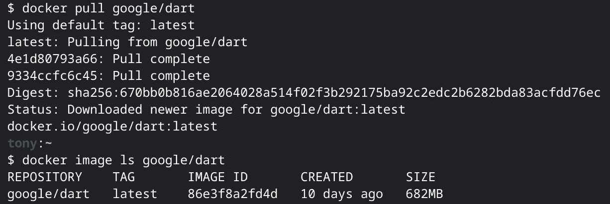

# 为 Dart 应用程序构建纤细的 Docker 图像

> 原文：<https://medium.com/google-cloud/build-slim-docker-images-for-dart-apps-ee98ea1d1cf7?source=collection_archive---------0----------------------->

如果你已经使用 Docker 在容器化的环境中运行你的 Dart 应用(比如[谷歌 Kubernetes 引擎](https://cloud.google.com/kubernetes-engine)或者[云运行](https://cloud.google.com/run)，你可能已经对 [**谷歌/dart**](https://hub.docker.com/r/google/dart/) 图像的分量感到惊讶。

基于 Debian 10“Buster”镜像， **google/dart** 是面向开发的——并没有针对大小进行优化——目前重量达到了 682 MB！



随着[的兴起](https://flutter.dev/)，谷歌的 UI 工具包继续流行，使用 Dart 实现后端功能的兴趣也增加了，该工具包用于从基于 Dart 的单一代码库为[移动](https://flutter.dev/docs)、[网络](https://flutter.dev/web)和[桌面](https://flutter.dev/desktop)构建本地编译的应用。

然而，由于侧重于客户端开发，关于如何为服务器端部署优化映像大小的指导很少。

在本文中，我将向您介绍 [dart-scratch](https://github.com/subfuzion/dart-scratch) ，这是一个基于 [scratch](https://hub.docker.com/_/scratch) 的轻量级图像，您可以使用它为您的 dart 应用程序容器构建尽可能薄的图像。

# 那么为什么优化图像尺寸很重要呢？

当您第一次在一些(物理或虚拟)机器上创建容器时，用于创建容器的映像必须从某处的映像存储库(例如，通常是像 [Docker Hub](https://hub.docker.com/) 或 [Google Artifact Registry](https://cloud.google.com/artifact-registry) 这样的注册表)通过网络传输。

传输大型映像时会有延迟，这对于长时间运行的服务器来说可能不是问题，但是在按需创建新机器实例的动态扩展环境中传输大型映像的性能负担可能是有害的。

然后，在构建容器时，从机器的图像缓存中读取图像层。较大的文件显然需要更多的时间来读取，这意味着在容器准备好工作之前会有更长的延迟。

同样，对于长时间运行的服务器，这可能不是一个重要的问题，但对于需要快速响应的应用程序，响应延迟会增加，用户可能会察觉到。消除这些延迟对于不消耗资源(从而降低成本)但必须快速启动和执行任务的零扩展工作负载尤为重要。

# JIT 与 AOT 绩效对比

最后，对启动时间有负面影响的另一件事是，当 Dart 代码在 Dart VM 上运行时，它是实时编译的(JIT)。启动服务器可能需要几秒钟才能准备好开始监听套接字。

如前所述，对于某些应用程序来说，这可能不是问题，但在动态、自动扩展的环境中，这可能是非常不可取的，因为响应能力非常重要。

为了解决这个问题，可以使用 [dart2native](https://dart.dev/tools/dart2native) 提前(AOT)将 Dart 应用程序编译成机器码。这大大缩短了启动时间。

不幸的是，有一个问题。目前 dart2native 不支持反射(它依赖于 [dart:mirrors](https://api.dart.dev/stable/2.10.2/dart-mirrors/dart-mirrors-library.html) )。例如，元数据注释在各种 web 服务器、数据建模、序列化和依赖注入框架和库中很流行。

对于代表典型的功能即服务工作负载的较短、更集中的应用程序类型，这可能根本不是问题。对于需要利用复杂框架的更大、更复杂类型的 web 应用程序，注释支持可能是不可或缺的。

> 如果你想了解更多关于 JIT 和 AOT 的性能和限制的细节，请参见这个 [FAQ](https://dart.dev/faq#q-which-is-faster--aot--or-jit-compiled-code) 和 [docs page](https://dart.dev/tools/dart2native#known-limitations) 。

# 对基于 AOT 或 JIT 的瘦图像使用 dart-scratch

如果您希望尽可能快地启动应用程序，并且不需要 Dart 反射(例如，为了注释支持)，那么使用如下所示的`dart-scratch`。这将使用 [dart2native](https://dart.dev/tools/dart2native) 构建你的应用。

最小的服务器应用程序映像大约为 25 MB，当创建一个容器时，应用程序将在亚秒时间内启动。这非常适合功能即服务和其他需要快速执行和扩展的工作类型。

*多阶段 Dockerfile 用 AOT 编译的 app 打造苗条形象:*

```
FROM google/dart
# uncomment next line to ensure latest Dart and root CA bundle
#RUN apt -y update && apt -y upgrade
WORKDIR /app
COPY pubspec.* .
RUN pub get
COPY . .
RUN pub get --offline
RUN dart2native /app/bin/server.dart -o /app/bin/serverFROM subfuzion/dart-scratch
COPY --from=0 /app/bin/server /app/bin/server
# COPY any other directories or files you may require at runtime, ex:
#COPY --from=0 /app/static/ /app/static/
EXPOSE 8080
ENTRYPOINT ["/app/bin/server"]
```

如前所述，如果您的应用程序依赖于`dart:mirrors`，那么您就不能使用`dart2native`，因此您将需要构建一个使用 Dart VM 的映像。

最小的服务器应用程序映像大约为 50 MB，当创建容器时，应用程序可能需要几秒钟才能准备好侦听套接字。由于启动时间增加，这更适合生命周期较长的应用程序、对作业启动时间不太敏感的应用程序或需要反射支持的应用程序(例如，对于注释)。

*用 JIT 编译的 app 构建苗条形象的多阶段 docker file:*

```
FROM google/dart
# uncomment next line to ensure latest Dart and root CA bundle
#RUN apt -y update && apt -y upgrade
WORKDIR /app
COPY pubspec.* .
RUN pub get
COPY . .
RUN pub get --offlineFROM subfuzion/dart-scratch
COPY --from=0 /usr/lib/dart/bin/dart /usr/lib/dart/bin/dart
COPY --from=0 /root/.pub-cache /root/.pub-cache
# Copy over the entire app...
COPY --from=0 /app /app
# ...or copy specific files and directories you require at runtime, ex:
#COPY --from=0 /app/bin/server.dart /app/bin/server.dart
#COPY --from=0 /app/lib/ /app/lib/
#COPY --from=0 /app/static/ /app/static/
EXPOSE 8080
ENTRYPOINT ["/usr/lib/dart/bin/dart", "/app/bin/server.dart"]
```

最后，我想提一下，这目前是实验性的，在我重复这个的时候，Google 还不支持。我计划接下来重点实现一个[构建包](https://buildpacks.io/)，它可以用来将 Dart 代码转换成可以在云无服务器环境中运行的映像。

如果这种尝试对您不起作用，或者如果您有想要分享的用例，请在 [repo](https://github.com/subfuzion/dart-scratch) 中的这里打开一个问题[。](https://github.com/subfuzion/dart-scratch/issues)