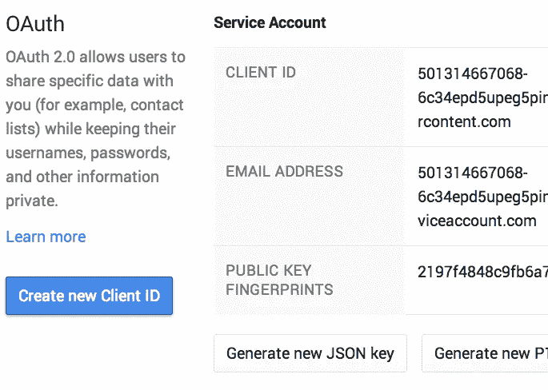

# 利用 RasPi 和 Google BigQuery 构建世界上最大的物联网

> 原文：<https://medium.com/google-cloud/build-the-world-s-largest-iot-with-raspi-and-google-bigquery-169b332d02b1?source=collection_archive---------2----------------------->

这是我用拉斯皮建造的气象站。我在周末只花了几个小时就建成了这个，但它已经能够部署世界上最大的物联网平台。为什么？因为它直接将指标发送给 [Google BigQuery](https://cloud.google.com/bigquery/) ，这个来自 Google 云平台的大规模并行查询引擎能够每秒收集**一百万行指标**，并在 10 秒内对**万亿字节的数据执行查询**。


所以，你现在就可以开始部署数百万个这样的盒子来收集世界各地的温度、湿度和大气压力(或者任何指标，如果你加上传感器的话)。我不需要再做任何事情来构建大型分布式前端、负载平衡器、应用服务器和超快速数据库集群，以及扩展、故障转移、复制等，这些都是构建大型生产物联网平台所需的复杂性。BigQuery 在谷歌最大的数据中心拥有谷歌的规模和质量。

RasPi box 运行一个简单的 [Python 代码](https://github.com/kazunori279/raspi/tree/master/weather_report)将指标发送给 BigQuery，big query 将汇总这些指标并在 Google 电子表格上显示为图形。


建造这个的总成本不到 100 美元。你只需要买 RasPi 盒子，买几个传感器就行了。谷歌电子表格是免费的。Google BigQuery 非常便宜:存储成本是 20 美分/ GB /月，每次查询 1 亿行的查询成本是几美分。最重要的是，这是一项完全托管的服务。你不必雇佣数十名高级工程师来构建和运营世界上最大的大数据集群。

让我们来看看你如何在周末建造这个盒子。

# 将传感器连接到 RasPi

以下是您需要购买的零件:

*   [RasPi](http://amzn.com/B00T2U7R7I) ， [NOOBS SD 卡](http://amzn.com/B00ELL7F1G)， [USB WiFi](http://amzn.com/B003MTTJOY)
*   RasPi 的 USB 电源
*   [DHT22](http://amzn.com/B00SK6940I) ，温湿度传感器
*   DHT 22 的电阻器(5K 至 10K 欧姆)
*   [LPS331](http://www.mouser.com/newproducts/newproductsmanufacturers.aspx?mfg=stmicroelectronics&virtualdir=stmlps331/) ，大气压力传感器
*   试验板和跳线

通过使用 NOOBS 的 SD 卡，它很容易设置 RasPi。USB WiFi 也应该很容易用操作系统的配置工具来设置。

要将传感器连接到 RasPi，请参考以下页面:

*   [树莓皮上的 DHT 湿度感应](https://learn.adafruit.com/dht-humidity-sensing-on-raspberry-pi-with-gdocs-logging/overview)


来自[树莓皮上的 DHT 湿度感应](https://learn.adafruit.com/dht-humidity-sensing-on-raspberry-pi-with-gdocs-logging/overview)

不需要特殊的电路。您可以用试验板将 RasPi 的 GPIO 引脚连接到传感器。一个警告是，你必须让 DHT22 远离 RasPi box，以避免来自 CPU 的热量。对于 LPS331，您可以使用能够连接到 RasPi 的任何其他压力传感器。

# 用 Ansible 安装驱动程序

为传感器编写驱动程序并不容易。尤其是 DHT22 需要一点努力。但是使用 RasPi 很酷的一点是你可以在 GitHub 上找到它们[。](https://learn.adafruit.com/dht-humidity-sensing-on-raspberry-pi-with-gdocs-logging/software-install-updated)

另一件很酷的事情是 RasPi 是一个 Linux。您可以使用如下的 Ansible Playbook 在 GitHub 上为传感器安装驱动程序。

```
 # Adafruit DHT drivers
    - git: repo=git@github.com:adafruit/Adafruit_Python_DHT.git
           dest={{ dht_dir }} accept_hostkey=yes
      sudo: no
    - command: python setup.py install chdir={{ dht_dir }}
```

尽管您可能需要等待一段时间才能完成行动手册的执行:)

# 用 Python 解码传感器值

LPS331 压力传感器使用 I2C 总线协议进行通信。使用 Python，可以使用 i2ctools 命令从传感器读取值。

```
def cmd_exec(cmd):
    p = subprocess.Popen(cmd, shell=True, stdout=subprocess.PIPE, stderr=subprocess.PIPE)
    stdout, stderr = p.communicate()
    if stderr != None and len(stderr.strip()) > 0:
        raise IOError("Error on executing cmd: " + stderr)
    return stdout.strip()

def i2cget(reg):
    return cmd_exec("i2cget -y 1 " + LPS331_ADRS + " " + reg)
```

该代码允许您将 i2cget 命令作为子进程执行。这样你就可以从 I2C 电阻器上读取数值来计算压力值。

```
def read_lps():

    # reading from LPS
    out0 = i2cget("0x28")
    out1 = i2cget("0x29")
    out2 = i2cget("0x2a")

    # decoding the value
    return (int(out0, 16) + (int(out1, 16) * 0x100) + (int(out2, 16) * 0x10000)) / 4096.0
```

使用 Adafruit Python 驱动程序可以轻松读取 DHT22 温度和湿度传感器。

```
# read humidity and temp from DHT 
humidity, temp = Adafruit_DHT.read_retry(Adafruit_DHT.DHT22, DHT22_GPIO)
```

# 使用 Fluentd 发送到 BigQuery

现在已经准备好将指标发送给 BigQuery 了。您可以使用流行的开源日志收集器 [Fluentd](https://cloud.google.com/solutions/real-time/fluentd-bigquery) 来完成这项工作。以下是安装 Fluentd 及其 BigQuery 插件的 Ansible 行动手册:

```
 # Fluentd
    - command: aptitude install ruby-dev
    - command: gem install fluentd

    # pip, fluent-logger-python, fluent-plugin-bigquery
    - command: aptitude install python-pip
    - command: pip install fluent-logger
    - command: fluent-gem install fluent-plugin-bigquery
```

在 fluentd.conf 上，可以添加以下配置来接收来自 fluent-logger-python 的事件日志，并将其转发给 fluent-plugin-bigquery。

```
<source>
  type forward 
  port 24224
</source>

<match weather.**>
  type bigquery

  method insert

  auth_method private_key
  email YOUR_SERVICE_ACCOUNT_EMAIL 
  private_key_path YOUR_PRIVATE_KEY_FILE_PATH 

  project YOUR_PROJECT_ID 
  dataset YOUR_DATASET 
  table YOUR_TABLE_NAME 

  time_format %s
  time_field time

  fetch_schema true
  field_integer time
</match>
```

在 Python 代码中，使用 fluent-logger-python API 将指标发送到 Fluentd。

```
 # write metrics to local fluentd
    event.Event("metrics", {
        "atmos": atmos,
        "hum": humidity,
        "temp": temp
    })
```

# 在 BigQuery 上创建一个表和键

接下来，设置 BigQuery 从 Fluentd 接收事件日志。如果这是你第一次开始使用查询服务，请看看[入门指南](https://cloud.google.com/bigquery/sign-up)准备一个 Google 云平台项目和 BigQuery 数据集。

对于这个演示，我创建了一个 BigQuery 表来接收指标。如果您想从多个设备收集指标，可能需要添加一个列来保存每个设备的 id。

```
[
  {
    "name": "time",
    "type": "INTEGER"
  },
  {
    "name": "hum",
    "type": "FLOAT"
  },
  {
    "name": "temp",
    "type": "FLOAT"
  },
  {
    "name": "atmos",
    "type": "FLOAT"
  }
]
```

通过使用 [bq 命令](https://cloud.google.com/bigquery/bq-command-line-tool)，执行下面一行来创建一个具有上述模式的表。

```
> bq mk -t <your-project-id>:<your_dataset>.weather_report wr_bqschema.json
```

然后，创建一个私钥，从 RasPi 框连接到 BigQuery。在 Google 开发者控制台，打开 API 和 auth 菜单，为服务帐户创建一个新的客户端 ID。



这将开始下载私钥。将密钥复制到 RasPi 框，并编辑 fluentd.conf 以将 private_key_path 字段设置为密钥文件的路径。此外，将电子邮件字段设置为服务帐户的电子邮件地址。

# 在 BigQuery 上执行查询

现在它准备尝试。在 RasPi 上，执行以下命令来启动 Fluentd。

```
> fluentd -c fluentd.conf
```

并打开另一个 shell 来执行 python 代码。

```
> sudo python weather_report.py
```

如果运行成功，您将在控制台上看到任何内容。转到 BigQuery 控制台并执行以下 SQL。

```
SELECT 
  LEFT(STRING(SEC_TO_TIMESTAMP(time)), 15) + '0:00' as time,   
  AVG(temp) as temp,
  AVG(hum) as hum, 
  AVG(atmos) as atmos 
FROM [YOUR_PROJ:YOUR_DATASET.weather_report] 
GROUP BY time 
ORDER BY time DESC
```


听起来很有效！这个查询聚集了 10 分钟的平均指标，并使用时间戳对它们进行排序。

因为它运行在 BigQuery 上，所以即使您收集了 1000 亿行指标，您也可以在 10 秒钟内获得这个查询的结果。请参见[这份白皮书](https://cloud.google.com/files/BigQueryTechnicalWP.pdf)，了解为什么这是可能的。简而言之，该服务为每一个查询并行运行**数千个服务器**。

现在，您可以将任意数量的物联网设备(电器、汽车、移动设备、工厂机械等中的传感器)的任何指标发送到 BigQuery，而无需担心可扩展性和可用性。

# 用谷歌电子表格绘制图表

通过使用 Google Spreadsheet 和它的 Google Apps 脚本，您可以从中执行 BigQuery 查询，并根据结果绘制图表。请查看[使用 Fluentd 和 BigQuery 的实时日志分析](https://cloud.google.com/solutions/real-time/fluentd-bigquery)来了解如何做到这一点。不需要自己写剧本。你只需复制文档中的工作表和脚本，并使用它来绘制这样的图形。


正如您在本文中看到的，使用 RasPi 非常有趣，尤其是当您将它与强大的云工具(如 BigQuery 和 Fluentd)连接起来时。即使这只是周末的一个爱好，你也可以在不花太多钱的情况下获得完全托管、高度可扩展和可用的物联网平台。

本演示的示例代码可在 [my GitHub repo](https://github.com/kazunori279/raspi/tree/master/weather_report) 上获得。

*原载于*[*qiita.com*](http://qiita.com/kazunori279/items/0f8d827ac9966c9804ab)*。*