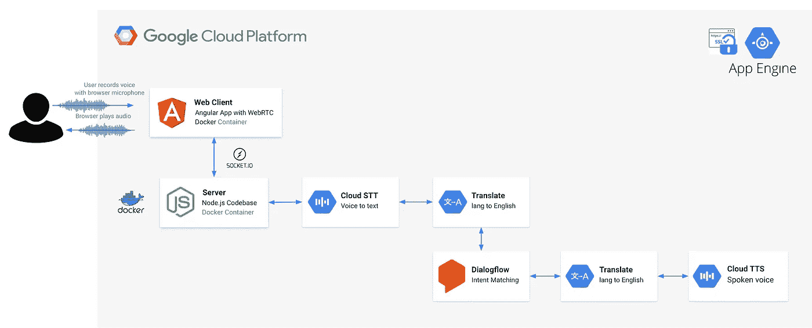
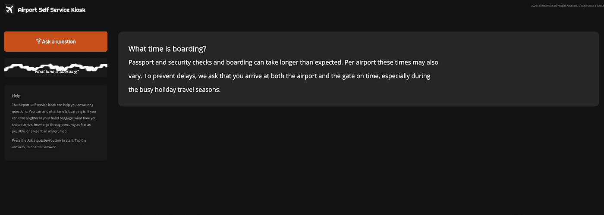

# 构建一个客户端 web 应用程序，将音频从浏览器麦克风传输到服务器。(第二部分)

> 原文：<https://medium.com/google-cloud/building-a-client-side-web-app-which-streams-audio-from-a-browser-microphone-to-a-server-part-ii-df20ddb47d4e?source=collection_archive---------0----------------------->

# **将音频从浏览器麦克风流式传输到 Dialogflow 的最佳实践&谷歌云语音转文本。**

这是该系列的第二篇博客:

**将音频从浏览器麦克风流式传输到 Dialogflow 的最佳实践&谷歌云语音转文本。**

[**在这第一篇博客中，我已经介绍了所有的对话组件，并解释了为什么客户会集成他们自己的对话式人工智能，而不是为谷歌助手**](/google-cloud/building-your-own-conversational-voice-ai-with-dialogflow-speech-to-text-in-web-apps-part-i-b92770bd8b47) **构建。**

今天，我将首先构建一个客户端 web 应用程序，它使用带有 WebRTC 的 HTML5 麦克风，将音频字节流传输到 Node.js 后端。

在这个博客系列的后面，我将向您展示如何使用 Google Cloud 对话式 AI APIs 来转录文本或通过文本到语音返回答案。

这些博客[包含简单的代码片段](https://github.com/dialogflow/selfservicekiosk-audio-streaming/tree/master/examples)和一个演示应用程序；[机场自助服务亭](https://github.com/dialogflow/selfservicekiosk-audio-streaming/)，将用作参考架构。

让我们从客户端 HTML & JavaScript 代码的创建开始。无论你是想把语音转录成文字(STT)，还是用语音触发一个聊天机器人代理来回答(Dialogflow)，客户端的代码库都是非常相似的。



# 客户端 WebRTC 实现

这里有一些代码片段，您可以运行它们来体验一下。

您可以通过克隆这个存储库来运行这些示例。[说明写在这里](https://github.com/dialogflow/selfservicekiosk-audio-streaming/tree/master/examples)。

*   [客户端代码:DetectIntent](https://github.com/dialogflow/selfservicekiosk-audio-streaming/tree/master/examples/example1.html) — Dialogflow
*   [客户端代码:转录](https://github.com/dialogflow/selfservicekiosk-audio-streaming/tree/master/examples/example4.html) — STT

这些示例利用了以下 JavaScript 库:

*   [Socket.io](https://www.npmjs.com/package/socket.io) — Socket。IO 支持基于事件的实时双向通信。
*   [Socket.io-Stream](https://www.npmjs.com/package/socket.io-stream) —用于通过 Socket.io 进行二进制流传输
*   [RecordRTC](https://github.com/muaz-khan/RecordRTC) — RecordRTC 是 WebRTC JavaScript 库，用于音频/视频以及屏幕活动记录。

在这些演示中，我使用了两个按钮，一个开始录制和一个停止录制按钮。

我还创建了一个 textarea 字段，稍后将显示结果。

```
<div><button id=”start-recording” disabled>Start Recording</button><button id=”stop-recording” disabled>Stop Recording</button></div><textarea id=”results” style=”width: 800px; height: 300px;”></textarea>
```

如果您想查看端到端示例，请查看[机场自助服务亭演示](https://github.com/dialogflow/selfservicekiosk-audio-streaming/tree/master/client/src)。这是一个有棱角的网络应用程序，它包含一个需要按一次的录制按钮，以录制音频流。它会在屏幕中间显示结果。



前端代码:机场自助服务亭演示

我写了一些 JavaScript 代码，嵌入在 HTML 简单示例中:

1.  首先，我将创建一些指向开始和停止按钮的指针。
2.  接下来，我将实例化 socket.io，并打开一个连接。
3.  我已经创建了两个事件监听器来开始和停止记录。开始按钮 onclick 事件，将禁用开始按钮，所以你不能按下按钮两次，因此记录音频两次。
4.  [navigator.getUserMedia()](https://www.html5rocks.com/en/tutorials/getusermedia/intro/) 是代码的重要组成部分。它是一组 WebRTC APIs 的一部分，提供了访问用户本地摄像头/麦克风流的方法。在我们的例子中，我们只使用麦克风( **audio: true** )。这给了我们进入溪流的机会。
5.  现在，我正在利用图书馆的记录。我本来可以选择自己写这部分代码的。但是 RecordRTC 解决了很多复杂的问题。比如转换缓冲区(从 Float32 到 Int16)，跨浏览器支持等。
6.  RecordRTC 有两个参数。第一个参数是来自 getUserMedia()调用的 MediaStream。第二个参数是一个配置对象，带有优化流的设置。我正在进行一些重要的设置，这些设置应该与您的设置一致，稍后在服务器端代码中(Dialogflow 中的 [InputAudioConfig](https://cloud.google.com/dialogflow/docs/reference/rpc/google.cloud.dialogflow.v2beta1#google.cloud.dialogflow.v2beta1.InputAudioConfig) 或 STT 的 [RecognitionConfig](https://cloud.google.com/speech-to-text/docs/reference/rpc/google.cloud.speech.v1?hl=nl#recognitionconfig) 的文档):

*   mimetype 设置为**AUDIO/webm**——当使用 **AUDIO_ENCODING_LINEAR_16** 或 **LINEAR16** 作为 Dialogflow 或 STT 中的音频编码配置时，这将是一个很好的设置。
*   采样率是输入采样频率，单位为赫兹。我将其重采样为 16000Hz (desiredSampleRate ),这样网络上的消息大小将会更小，并且与我的 Dialogflow 或 STT 调用中的 herz 设置样本相匹配。
*   此外，Dialogflow & STT 需要单声道声音，这意味着，我应该将音频通道的数量设置为 1。recorder type stereo audio recorder 允许我将音频通道的数量从 2 个改为 1 个。

# 记录单个话语

简短话语/探测意图。这意味着您的最终用户按下录音按钮，说话，当他们按下停止，我们收集音频流返回结果。在您的代码中，这意味着一旦客户端 web 应用程序收集了完整的音频记录，它就将其发送到服务器，这样服务器就可以调用 Dialogflow 或语音到文本 API。对于这个用例，神奇之处在于停止按钮 onclick 事件监听器:

1.  当你点击停止，它将首先重置按钮，然后停止录制。当停止记录时，在回调函数中，它将请求 audioDataURL，它是 [RecordRTC API](https://recordrtc.org/) 的一部分。这将返回一个字符串 dataURL，带有包含音频流的 Base64 字符串。这一长串是这样的:**数据:audio/wav；base64，uklgrirgagbxqvzfzm 10 ibaaaaaaaaaaearkwaa**
2.  我们可以从中创建一个对象，这个对象也设置了音频类型，然后我们正在把它发送给服务器，用 socket io:**socket io . emit(' message '，files)；**我们将设置一个名称。一旦服务器与这个套接字建立了连接，它将寻找“消息”事件名称，并对其进行响应。它将接收文件对象。
3.  一旦服务器调用 Dialogflow / Speech API 并对服务器进行 websockets 调用以返回结果，该脚本的最后一部分将运行。在这个例子中，我只是在一个文本框中打印结果。对于 Dialogflow， **fulfillmentText** 是 queryResult 的一部分。当使用 STT 时，您想要打印来自**备选项**数组的**副本**字符串。

# 录制音频流

记录流意味着您的最终用户按下记录按钮，说话，将看到结果的飞行。当使用 Dialogflow 检测意图时，这可能意味着一旦你说得更多，它将检测到更好的匹配，或者它可以收集多个结果。在您的代码中，这意味着客户端开始创建一个双向流，并将数据块传输到服务器，这样服务器就可以通过事件侦听器对传入的数据进行调用，因此它是实时的。

您可能会选择这种方法，因为您期望的音频很长。或者在 Dialogflow 的情况下，您可能希望在说话的同时在屏幕上实时显示中间结果。在这种情况下，您不需要 stopRecording 回调函数，它将 base64 URL 字符串发送到服务器。相反，它会将流实时发送到服务器！

看看下面的例子:

客户端代码: [DetectStreamingIntent](https://github.com/dialogflow/selfservicekiosk-audio-streaming/blob/master/examples/example2.html) —您可以通过克隆这个存储库来运行这些示例。[说明写在这里](https://github.com/dialogflow/selfservicekiosk-audio-streaming/tree/master/examples)。

本例中的神奇之处在于 RecordRTC 对象和 **ondataavailable** 事件监听器:

1.  首先，你需要设置一个**时间片。**时间片设定创建音频块的时间间隔。在 Dialogflow 的情况下，您可能不想每秒都检测意图(因为您可能没有说完一个句子)，而是内置一个计时器。timeSlice 设置为**毫秒**，所以我用的是 4000 (4 秒)。
2.  然后是 **ondataavailable** 事件监听器，一旦有数据就会被触发，它将包含大量的 blobs(音频缓冲区)，在我的例子中是每 4 秒一次。
3.  这就是 **socketio-stream** 的用武之地。我正在利用双向流(我每 4 秒发送一个包含块的流，但是我也可能希望在中间接收来自服务器的结果)。所以我正在创建流，它将临时存储在我的本地驱动器上。带 **ss(插座)。emit()** 我将它流式传输到服务器，在这样做的同时，我将音频缓冲区通过管道传输到流中。 **stream.pipe()** 的目的是将数据缓冲限制在可接受的水平，这样不同速度的源和目的地就不会淹没可用内存。

如果您想查看端到端示例，请查看[机场自助服务亭演示话筒课程](https://github.com/dialogflow/selfservicekiosk-audio-streaming/blob/master/client/src/app/microphone/microphone.component.ts)。它是用 TypeScript 编写的，实现了 HTML5 麦克风。

# 在 iOS 上运行您的应用

在 iOS 设备上运行应用程序时，您可能会遇到各种问题。首先，iOS 不支持除 Safari 之外的任何其他移动浏览器中的 JavaScript**getuser media**和 WebRTC 方法。

在我的应用程序中，[当它在 iOS 浏览器而不是 mobile Safari](https://github.com/dialogflow/selfservicekiosk-audio-streaming/blob/master/client/src/app/app.component.ts) 上打开时，我会显示一个弹出窗口。

要使用 getUserMedia() WebRTC 方法，您需要允许权限弹出窗口，它只在从 **HTTPS** 运行时才会出现。

iOS 仍然存在一个重要的限制:在用户激活之前，网络音频实际上是静音的。要在 iOS 中播放和录制音频，需要用户交互(如触摸开始)。

暂时就这样了。[在本系列的下一篇博客中，我将在服务器端接收音频字节，因此我可以使用它来使 Dialogflow 检测意图或语音到文本转录呼叫！](/google-cloud/building-a-web-server-which-receives-a-browser-microphone-stream-and-uses-dialogflow-or-the-speech-62b47499fc71)