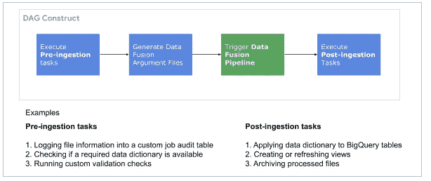
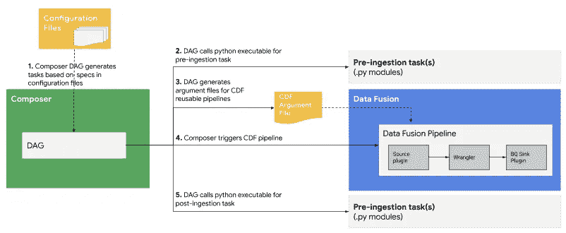
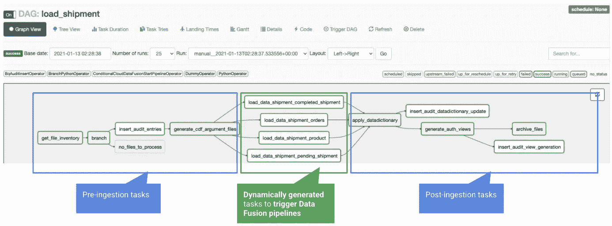
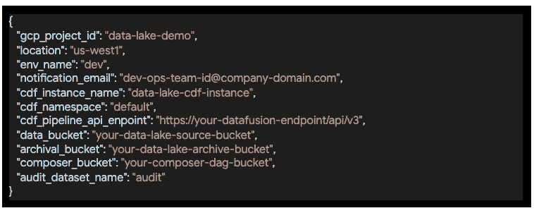
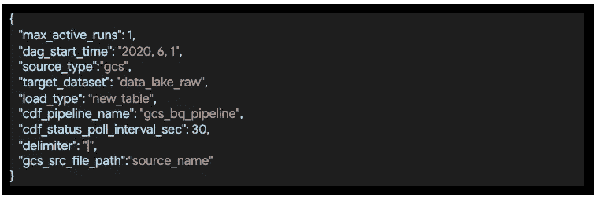
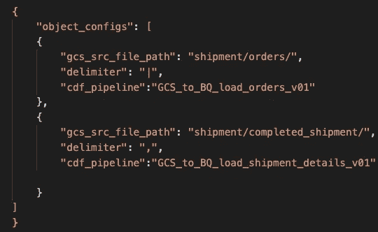
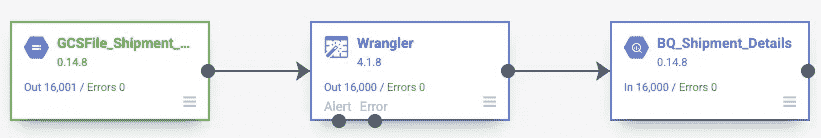
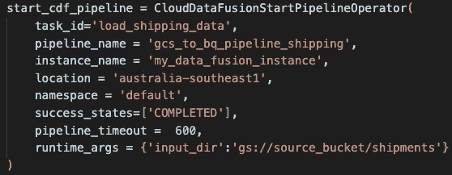
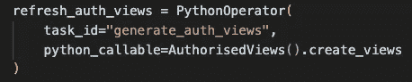

# 使用数据融合和 Composer 在 GCP 构建配置驱动的数据湖的框架

> 原文：<https://medium.com/google-cloud/building-a-data-lake-on-gcp-using-data-fusion-and-composer-49d1ba4b1d73?source=collection_archive---------2----------------------->

本系列的第一篇文章概述了使用数据融合进行数据集成和使用 Cloud Composer 进行编排的数据湖解决方案架构。

在本文中，我将概述基于该架构的详细解决方案设计。本文假设您对 GCP 数据融合和 Composer 有一些基本的了解。如果您是 GCP 的新手，您可以先阅读本系列的[上一篇文章](https://nehajo.medium.com/designing-a-data-lake-on-gcp-with-data-fusion-and-composer-e2ea0a753525),了解架构中使用的不同服务，然后再继续。

# 设计方法

这里描述的解决方案设计提供了一个框架，通过使用简单的配置来接收大量的源对象。一旦开发了框架，向数据湖摄取添加新的源/对象只需要为新的源添加新的配置。

我将在不久的将来发布这个框架的代码。请留意最新消息。

# 设计组件

解决方案设计包括 4 个主要部分。

*   [**数据融合**](https://cloud.google.com/data-fusion) **管道**进行数据移动
*   **定制摄取前**和**摄取后任务**
*   **配置**为可重用组件和任务提供输入
*   [**Composer**](https://cloud.google.com/composer)**DAGs**执行定制任务，根据配置调用数据融合管道

让我从编排解决方案所有部分的 Composer DAG 的高级视图开始，然后在接下来的部分中提供对解决方案不同部分的深入了解。

# Composer DAG 结构

Composer [DAG](https://nehajo.medium.com/designing-a-data-lake-on-gcp-with-data-fusion-and-composer-e2ea0a753525) 是工作流编排器。它可以大致包括下图所示的组件。

*作曲 DAG 的组件*

DAG 读取配置文件*(将在下一节中详细介绍)*以获取详细信息，例如源和目标详细信息*、*，并将该信息传递给接收前和接收后任务以及数据融合管道。下图描述了整个流程。

工作流程

*每个摄取前或摄取后任务都是 DAG 中不同的气流任务，并调用包含任务逻辑的 python 代码。下面是基于上述方法的 Composer DAG 的截图。*

基于上述流程，下面是一个示例 Composer DAG，包括摄取前和摄取后任务，以及对数据融合管道的调用。

# 摄入配置

此解决方案中的配置分为三个级别:

*样本环境配置*

**环境配置**GCP 项目 ID、数据融合实例、GCS 桶信息等信息。

*DAG 配置示例*

**DAG 配置**为每个源系统提供 DAG 所需的信息。

任务配置示例

**任务配置**指定数据融合管道的输入，例如源、定界符和要触发的管道。

## DAGs 中的动态任务生成

DAG 被编写为基于任务配置文件动态地生成 Composer 任务。以这种方式生成的每个任务将使用提供的源规范触发相应的数据融合管道。

# 数据融合管道和定制插件

下面显示的是一个从 GCS 加载文件到 BQ 的数据融合管道。*这是一个简单的例子，您可以根据自己对各种数据源的需求，使用额外的逻辑编写 UI 驱动的管道。*

上面的管道使用 Wrangler 插件来解析文件布局。您甚至可以更进一步，编写自己的* *定制插件，该插件可以读取多个文件，每个文件都有不同的布局，动态解析它们并一次性加载到各自的目标中。尽管编写定制插件需要 java 编程技能，但是当您在文件中发现新的场景时，编写通用的自动解析逻辑会变得很棘手。

** *数据融合提供了多种源、* [*和外挂*](https://cdap.atlassian.net/wiki/spaces/DOCS/pages/554434650/Data+Pipeline+Plugin+Types) *开箱即用。如果您需要执行某些非常符合您的需求且开箱即用的转换，您也可以* [*编写您自己的定制插件*](https://cdap.atlassian.net/wiki/spaces/DOCS/pages/480313897/Developing+Plugins+Guide) *并在您的管道中使用它们。*

# 从 Composer 调用数据融合管道

现在我们已经深入了解了数据融合管道和 Composer DAG 需要执行的任务，那么 Composer 如何调用数据融合管道呢？

[CloudDataFusionStartPipelineOperator](http://airflow.apache.org/docs/apache-airflow-providers-google/stable/operators/cloud/datafusion.html)允许从气流 DAG 触发数据融合管道。在这个 [GCP 的博客](https://cloud.google.com/blog/products/data-analytics/easier-management-for-cloud-etl-elt-pipelines)中有更多关于这个运营商的信息。

调用数据融合管道的示例气流任务

# 从 Composer 中调用 Python 可执行文件执行摄取前和摄取后任务

通常，有些定制任务需要在数据摄取工作流中执行，但是不属于或者不能在 ETL 工具中执行。一些典型的例子包括定制源文件的清理以去除数据中不兼容的特殊字符，更新目标表中的列描述以支持数据可发现性，基于某些条件归档处理过的文件，以及在前面示出的 DAG 中示出的每个任务结束时在定制审计表中定制记录工作流状态。

这些任务可以用 python 编码，然后可以在 Airflow [PythonOperator](https://airflow.apache.org/docs/apache-airflow/stable/_api/airflow/operators/python/index.html) 的帮助下从 Composer 内部调用。我不会深入讨论这个操作符的细节，因为已经有很多关于它的文章了。

用于执行自定义任务的 Python 运算符片段

# 关键要点

上述解决方案设计提供了一个框架，可以将混合生态系统中的数据接收到数据湖中。它通过使用简单的配置来提供关于环境、源和目标的细节，以及要执行的数据融合管道的细节。扩展数据湖以添加更多的源很容易，只需要为新的源对象添加配置。

为了将数据从源移动到目标，使用了数据融合管道。不属于 ETL 工具或不能在 ETL 工具中执行的自定义任务可以用 Python 编写，并集成到 Composer DAG 中，用于工作流的端到端编排。

# 接下来呢？

您可能已经在示例 DAG 屏幕截图中注意到了“应用数据字典”这一摄取后任务。该任务将业务元数据和列描述更新到加载到数据湖的表中。

确保数据的可发现性是获取数据湖中可用数据价值的一个重要方面，而业务元数据是实现这一目标的关键因素。在下一篇文章中，我将进一步详细介绍如何在 GCP 上实现数据平台的数据可发现性。