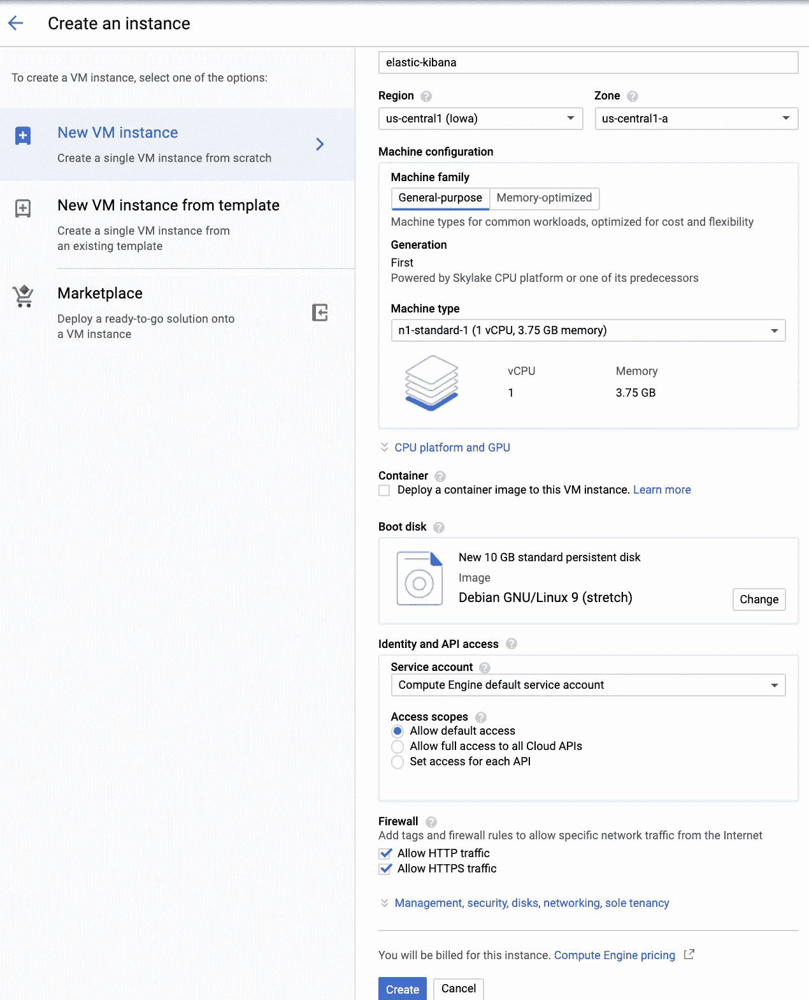
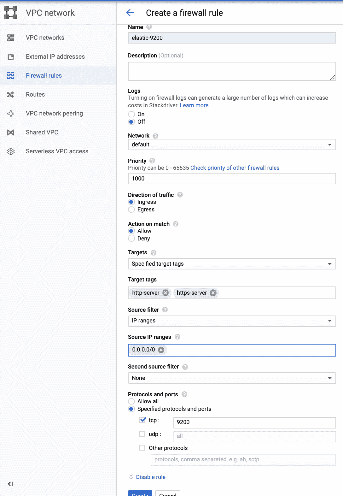
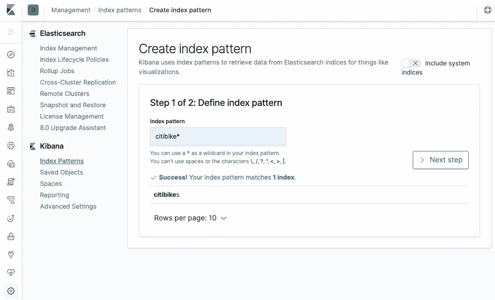

# 在 Google 云平台上用 Apache Beam 和 Elasticsearch (7.3 和 6.8)构建数据管道(第 1 部分)

> 原文：<https://medium.com/google-cloud/building-a-data-pipeline-with-apache-beam-and-elasticsearch-7-3-38c8604480ce?source=collection_archive---------0----------------------->


在 [Unsplash](https://unsplash.com?utm_source=medium&utm_medium=referral) 上由 [Rodion Kutsaev](https://unsplash.com/@frostroomhead?utm_source=medium&utm_medium=referral) 拍照

这是一个由三部分组成的系列，旨在帮助数据工程师开始使用 Apache Beam Java SDK 和 ElasticSearch 在 Google 云平台上构建数据管道。假设读者对 GCP 和创建数据管道的基本原理有所了解，但只是一名 Java 开发新手。

最终的管道将包含 **PubSub +数据流+弹性搜索+基巴纳。**也就是说，您将从 PubSub 获取消息，然后使用 DaraFlow 处理这些消息并将其插入 Elasticsearch，最后在 Kibana 中可视化数据。

在本系列的第一部分中，您将执行以下操作:

*   在 GCP 上安装 Elasticsearch 和 Kibana。
*   看看 Elasticsearch 7.3 和 6.8 以及它们的一些区别。

在第二部分，您将:

*   创建并构建一个 Apache Beam 管道。
*   安装并配置 IntelliJ，以便与 Beam Java SDK 一起使用，并使用 Maven 和 IntelliJ 来构建和运行管道。

最后，在本系列的第三部分中，您将研究管道源代码并了解它是如何工作的。

## 在虚拟机实例上安装 Elasticsearch 和 Kibana

虽然，对于 Elasticsearch，GCP 市场上有现成的解决方案，但您需要在虚拟机上手动安装 ElasticSearch 和 Kibana。在撰写本文时，有一个免费的 click do deploy Elasticsearch 集群，它建立了一个 kubernetes 集群并在其上安装了 Elasticsearch 6.3。但是，它是一个相对旧版本的 Elasticsearch，它需要一个旧版本的 Kibana，与最新版本相比，它的功能更弱，也更先进。

您将从创建一个新的 VM 实例开始。打开*计算引擎*选项卡，点击*创建实例*。默认设置对于这个简单的示例来说很好，但是在单击页面底部的 *Create* 之前，为新虚拟机启用 HTTP/HTTS 流量。这将向我们的 VM 添加两个网络标签: *http-server* 和 *https-server* 。



使用默认设置创建一个新的虚拟机实例，并启用 HTTP 和 HTTPS 流量

接下来，导航到 *VPC 网络，*选择*防火墙规则，*并创建两个防火墙规则以允许 TCP 流量进入 Elasticsearch 端口 9200 和 Kibana 端口 5601。要定义新规则适用的计算实例，您可以指定网络标记(在我们的示例中是 *http-server* 和 *https-server* )。为简单起见，通过将*源 IP 范围*设置为 0.0.0.0/0，允许来自所有实例的传入流量。下面的截图显示了如何定义第一个规则。对于第二个规则，只需将端口号更改为 5601。



创建防火墙规则以允许 TCP 流量进入 Elasticsearch 端口 9200

Elasticsearch 需要在我们的虚拟机上安装 Java。因此，在配置了虚拟机之后，对其进行 SSH 并安装 Java:

```
sudo apt-get update
sudo apt-get install default-jre
```

现在，你已经准备好安装 Elasticsearch 了。以下是如何安装 Elasticsearch [7.3](https://www.elastic.co/guide/en/elasticsearch/reference/current/deb.html) :

```
wget -qO — [https://artifacts.elastic.co/GPG-KEY-elasticsearch](https://artifacts.elastic.co/GPG-KEY-elasticsearch) | sudo apt-key add -sudo apt-get install apt-transport-httpsecho “deb [https://artifacts.elastic.co/packages/7.x/apt](https://artifacts.elastic.co/packages/7.x/apt) stable main” | sudo tee -a /etc/apt/sources.list.d/elastic-7.x.listsudo apt-get update && sudo apt-get install elasticsearch
```

[版本 6.x](https://www.elastic.co/guide/en/elasticsearch/reference/6.8/deb.html) 的安装步骤非常相似，只是将上面的第三个命令替换为以下命令:

```
echo “deb [https://artifacts.elastic.co/packages/6.x/apt](https://artifacts.elastic.co/packages/6.x/apt) stable main” | sudo tee -a /etc/apt/sources.list.d/elastic-6.x.list
```

接下来，配置 Elasticsearch:

```
sudo vi /etc/elasticsearch/elasticsearch.yml
```

取消注释并设置`network.host: 0.0.0.0`。如果你安装了 Elasticsearch 6.x，在 *elasticsearch.yml* 中的上述改变就足够了，但是对于 7.3 版本，还需要一件事。取消注释并设置`cluster.initial_master_nodes: node-1`

接下来，重启 Elasticsearch:

```
sudo service elasticsearch restart
```

稍等片刻，通过向 Elasticsearch 发送一个 HTTP 请求来测试它是否启动并运行:

```
curl localhost:9200
```

如果服务有效，响应应该包含*“你知道，为了搜索】*。如果没有看到，可以检查是否有进程监听 9200:

```
sudo netstat -a -p | grep 9200
```

检查 Elasticseach 是否正在运行:

```
ps aux | grep elastic*
```

看看日志:

```
sudo ls -l /var/log/elasticsearch/
```

例如，如果您忘记为 7.3 设置*cluster . initial _ master _ nodes*，您会在*/var/log/elastic search/elastic search . log*中看到类似这样的内容:

```
node validation exception
[1] bootstrap checks failed
[1]: the default discovery settings are unsuitable for production use; at least one of [discovery.seed_hosts, discovery.seed_providers, cluster.initial_master_nodes] must be configured
```

现在，您已经准备好在 Elasticsearch 中创建您的第一个索引，并用一个测试文档填充它。运行以下命令最简单的方法是使用 *GCP 云外壳*。首先，定义变量:

```
export ELASTIC_CLUSTER=http://x.x.x.x:9200
export ELASTIC_INDEX=citibikes
```

对于 6.8 版，您需要再添加一个变量:

```
export ELASTIC_TYPE=trips
```

这里的 *x.x.x.x* 是我们新创建的虚拟机的外部 IP 地址，从 GCP 云 shell 发出的`curl $ELASTIC_CLUSTER`将返回*“你知道，用于搜索”*。

**注意:**当您重新连接到 GCP 云 shell 时，您在过期会话中设置的环境变量不再存在，需要重新定义。如果你打算花些时间研究这篇文章中描述的例子，在你的本地机器上安装[谷歌云 sdk](https://cloud.google.com/sdk/install) 并从那里运行所有命令可能会更有优势。

正如本文开头提到的，管道将在 Elasticsearch 中存储消息。为此，您将使用一个名为 *$ELASTIC_INDEX* 的索引。这里是[7.0 版本引入的另一个区别](https://www.elastic.co/guide/en/elasticsearch/reference/master/removal-of-types.html)。从此版本开始，映射类型已被弃用。它改变了 API 调用，你将在本文后面看到。这就是为什么 *$ELASTIC_TYPE* 只为 6.x 版本定义的原因。

为了在 Kibana 中正确地可视化数据，您需要为索引定义一个模式。这可以通过在 Elasticsearch 中定义一个映射来实现。如果没有这一步，索引中的所有文档字段都将被 Elasticsearch 识别为字符串，并且不可用于聚合。在本例中，您将从公共 BigQuery 数据集*` big query-public-data . new _ York _ Citi bike . Citi bike _ trips `*获取消息。

使用以下 json 定义 7.x 的映射:

```
curl -X PUT "$ELASTIC_CLUSTER/$ELASTIC_INDEX" -H 'Content-Type: application/json' -d'
{
  "mappings": {
    "properties": {
      "tripduration":    { "type": "integer"  }, 
      "starttime": {"type": "date"}, 
      "stoptime": {"type": "date"},
      "start_station_id":      { "type": "integer" },
      "start_station_name":      { "type": "text" }, 
      "start_station_location":     { "type": "geo_point"  }, 
      "end_station_id":      { "type": "integer" }, 
      "end_station_name":      { "type": "text" }, 
      "end_station_location":     { "type": "geo_point"  },
      "bikeid":      { "type": "integer" }, 
      "usertype":      { "type": "keyword" }, 
      "birth_year": {"type": "integer"},
      "gender":      { "type": "keyword" }
    }
  }
}'
```

还有这个 6.x 的:

```
curl -X PUT "$ELASTIC_CLUSTER/$ELASTIC_INDEX" -H 'Content-Type: application/json' -d'
{
  "mappings": {
    "'$ELASTIC_TYPE'": { 
      "properties": {
        "tripduration":    { "type": "integer"  }, 
        "starttime": {"type": "date"}, 
        "stoptime": {"type": "date"},
        "start_station_id":      { "type": "integer" },
        "start_station_name":      { "type": "text" }, 
        "start_station_location":     { "type": "geo_point"  }, 
        "end_station_id":      { "type": "integer" }, 
        "end_station_name":      { "type": "text" }, 
        "end_station_location":     { "type": "geo_point"  },
        "bikeid":      { "type": "integer" }, 
        "usertype":      { "type": "keyword" }, 
        "birth_year": {"type": "integer"},
        "gender":      { "type": "keyword" }
      }
    }
  }
}'
```

定义为文本的字段将被索引并可用于全文搜索。注意 *$ELASTIC_TYPE* 变量的单引号。没有它们，shell 不会扩展变量。

## 测试弹性搜索

要检查 Elasticsearch 是否正常工作，您可以使用以下命令为 7.x 插入一条测试消息:

```
curl -X POST “$ELASTIC_CLUSTER/$ELASTIC_INDEX/_doc/” -H ‘Content-Type: application/json’ -d’{ “tripduration”: 202, “starttime”: “2015–08–06T10:20:39”, “stoptime”: “2015–08–06T10:21:41”, “start_station_id”: 520, “start_station_name”: “W 52 St & 5 Ave”, “start_station_location”: {“lat”: 40.85992262, “lon”: -73.87648516}, “end_station_id”: “520”, “end_station_name”: “W 52 St & 5 Ave”, “end_station_location”: {“lat”: 40.85992262, “lon”: -73.87648516}, “bikeid”: 200, “usertype”: “Customer”, “birth_year”: 1990, “gender”: “male” }’
```

对于 6.x，您需要提供 *$ELASTIC_TYPE* ，而不是 7.x 中的 *_doc* :

```
curl -X POST “$ELASTIC_CLUSTER/$ELASTIC_INDEX/$ELASTIC_TYPE/” -H ‘Content-Type: application/json’ -d’{ “tripduration”: 202, “starttime”: “2015–08–06T10:20:39”, “stoptime”: “2015–08–06T10:21:41”, “start_station_id”: 520, “start_station_name”: “W 52 St & 5 Ave”, “start_station_location”: {“lat”: 40.85992262, “lon”: -73.87648516}, “end_station_id”: “520”, “end_station_name”: “W 52 St & 5 Ave”, “end_station_location”: {“lat”: 40.85992262, “lon”: -73.87648516}, “bikeid”: 200, “usertype”: “Customer”, “birth_year”: 1990, “gender”: “male” }’
```

上述命令不提供文档 ID，因此它将由 Elasticsearch 自动设置。如果一切正常，这些命令的输出应该包含关于创建的文档和*“成功”:1* 条目的信息。

现在，当 Elasticsearch 工作时，您可以在同一个 VM 上安装 Kibana。注意，您已经安装了公共签名密钥 apt-transport-https，并在安装 Elasticsearch 的过程中保存了存储库定义。因此，剩下的步骤是 ssh 到虚拟机并运行:

```
sudo apt-get install kibana
```

接下来，配置 Kibana:

```
sudo vi /etc/kibana/kibana.yml
```

你需要在那里设置`*server.port: 5601*`和`server.host: “0.0.0.0”` 。接下来，重新启动服务:

```
sudo service kibana start
```

在您的浏览器中键入 *http://x.x.x.x:5601/* ，其中 *x.x.x.x* 是我们虚拟机的外部 IP 地址，您应该会看到 Kibana 欢迎页面。

接下来，您可以使用 Kibana 来查找在上一步中插入到 Elasticsearch 中的测试文档。为此，转到*管理*选项卡，然后*索引模式，*并点击*创建索引模式*。在这里，您可以指定想要在 Kibana 中浏览的索引。创建没有时间过滤器的 *citibikes** 模式。



在 Kibana 中创建索引模式 citibikes*

接下来，如果您进入 *Discover* 页面并选择索引模式，您应该会看到测试消息。

现在，当你有了 Elasticsearch 和 Kibana，你就可以开始这篇文章的下一部分了。第二部分将:

*   描述如何创建和构建 Apache Beam 管道。
*   演示如何安装和配置 IntelliJ 来使用 Beam Java SDK，并使用 Maven 和 IntelliJ 来构建和运行您的管道。