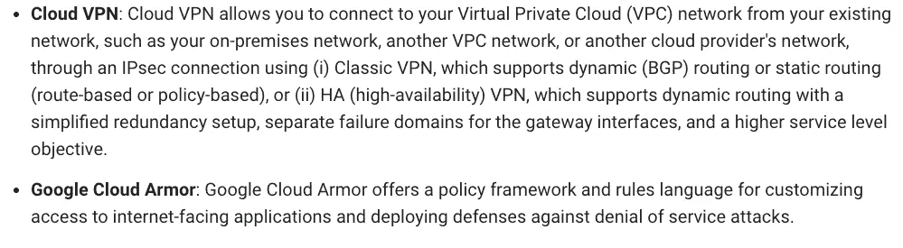
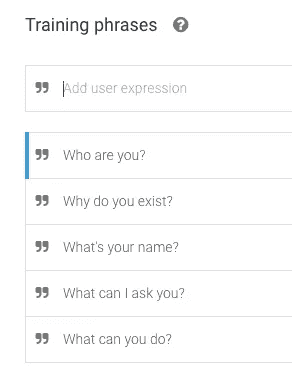
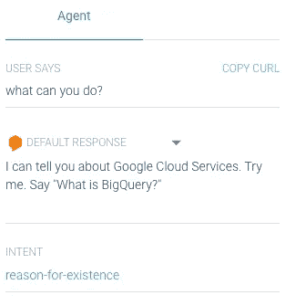
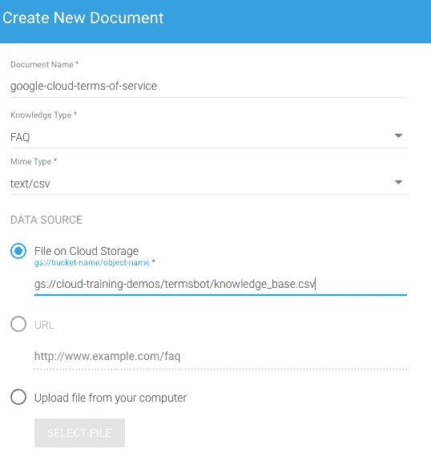
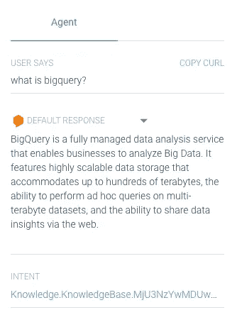

# 在 15 分钟内在 DialogFlow 中构建一个 FAQ bot

> 原文：<https://medium.com/google-cloud/building-a-faq-bot-in-dialogflow-in-15-minutes-bfcda2644abc?source=collection_archive---------0----------------------->

## 上传个知识库就行了！

我以前从未构建过 DialogFlow bot，因此决定需要对此进行补救。所以，我决定建造一个可以回答基本问题的聊天机器人。但是关于什么话题呢？

每个人都对[律师对谷歌云服务](https://cloud.google.com/terms/services)的描述着迷，所以我决定建造一个机器人，它将根据律师在服务条款中的描述来解释任何 GCP 服务:



所以，如果你问机器人“什么是云 VPN？”，它应该读出整个段落。让我们开始吧。

## 1.创建代理

首先要创建一个 DialogFlow 代理。转到 https://dialogflow.cloud.google.com/#/agents 的[并点击按钮创建一个新的代理。代理是一个机器人。](https://dialogflow.cloud.google.com/#/agents)

将机器人命名为“google-cloud-services”，接受其他默认设置，然后单击 Create。

在左侧菜单中，单击“设置”栏。确定几件事:

*   设置服务帐户。
*   您正在使用 V2 API。
*   打开测试版功能。我们将使用“知识库”,这是一个测试功能。

现在点击“保存”

## 2.创建一个意图

点击意向。你应该看到两个意图。据我所知，意图是问答配对。有一个“回退意图”，这是机器人在不理解某个问题时会回答的。和“欢迎意图”，这是机器人如何回答你好。

让我们添加一个真正的意图。假设用户问我们的机器人“你能做什么？”我们希望机器人能够告诉他们。

因此，点击“创建意图”。将这个意图命名为“存在的理由”。

然后，点击“添加培训阶段”,并添加用户可以提出此问题的几种方式:



现在，点击“添加响应”,输入你希望机器人回复的内容:

*我可以告诉你谷歌云服务。试试我。说“什么是 BigQuery？”*

现在，点击“保存”。

在右侧，您会看到一个“立即尝试”框。键入:“你能做什么？”您应该会看到:



## 3.创建知识库

我们可以到处输入问题和答案，但这会变得相当无聊。相反，让我们将知识库加载到 DialogFlow 中。

首先，我们必须将知识库创建为 CSV 文件。我只是将服务条款复制粘贴到一个名为 terms.txt 的文件中，然后运行以下 Python 代码:

```
#!/usr/bin/env python3
import pandas as pdquestions = []
answers = []
with open('terms.txt') as ifp:
    for line in ifp.readlines():
        pieces = line.strip().split(':')
        if len(pieces) >= 2:
            term = pieces[0]
            definition = ':'.join(pieces[1:]).strip()
            if len(definition) > 10:
                questions.append("What is {}?".format(term))
                answers.append(definition)df = pd.DataFrame.from_dict({
    'question': questions,
    'answer': answers
})df.to_csv('knowledge_base.csv', index=False, header=False)
```

这将创建一个名为 knowledge_base.csv 的文件，其中第一列是问题，第二列是答案。这并不完美，因为没有冒号的行将被跳过。但这是一个很好的开始，所以我们继续吧。

如果你没有 Python 或者不想运行上面的程序，我已经把文件放在谷歌云存储上了:

```
gs://cloud-training-demos/termsbot/knowledge_base.csv
```

## 4.加载知识库

在 DialogFlow 的左侧菜单中，单击“知识”并选择“创建知识库”。

将其命名为“services ”,然后单击 Save。然后，通过点击超链接“创建第一个”来创建一个新文档。

如下填写对话框(如果您实际运行了 Python 代码，请使用“从您的计算机上传文件”选项)。



这需要一分钟左右的时间。

现在，点击“添加响应”

默认情况下使用知识库中的答案。

点击“保存”。

## 4.试试机器人

键入“什么是 BigQuery？”在“立即尝试”框中，您应该会看到:



就这样了，伙计们。你有一个机器人，它将反刍任何术语表、问答、常见问题、静态信息等。

点击“在谷歌助手中看看它是如何工作的”，在模拟手机中试用一下。

## 5.部署服务…

这不是我干的。但是你应该！