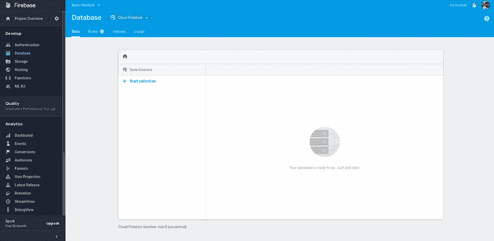

# 用 Cloud Firestore(Firebase)构建 Flask(Python) CRUD API 并部署在 Cloud Run 上。

> 原文：<https://medium.com/google-cloud/building-a-flask-python-crud-api-with-cloud-firestore-firebase-and-deploying-on-cloud-run-29a10c502877?source=collection_archive---------0----------------------->


> *在本教程中，您将使用 Flask(Python 的微框架)、Cloud Firestore(Firebase 的一个灵活、可扩展的移动、web 和服务器开发数据库)构建一个 CRUD(创建、读取、更新、删除)API 来管理* ***待办事项列表*** *，并将该 API 部署到* [*云运行*](https://cloud.google.com/run/) *(一个在 Google 云平台上运行容器的无服务器环境)。*

[Cloud Firestore](https://firebase.google.com/docs/firestore) 将数据存储为文档集合，它还具有比[实时数据库](https://firebase.google.com/docs/database)更丰富、更快速的查询和扩展功能。
你可以通过 API 管理不同字段的*待办事项*文档。

# 要求

*   [Python3.7](https://www.python.org/downloads/)
*   [烧瓶](https://github.com/pallets/flask)
*   [Firebase Admin Python SDK](https://github.com/firebase/firebase-admin-python)

# 开始之前

创建一个新的 Firebase 项目，或者使用一个现有的。

*   在云 Firestore 部分点击**数据库**和**创建数据库**。
*   设置您的[安全规则](https://firebase.google.com/docs/firestore/security/get-started)和[位置](https://firebase.google.com/docs/projects/locations)
*   您应该有一个类似于以下内容的初始屏幕:



下载您的 Firebase 服务帐户密钥

*   点击仪表盘顶部的**设置图标**
*   点击**服务账户**标签
*   为**管理 SDK 配置片段**选择 **Python** 选项，点击**生成新私钥**并保存为`**key.json**`


[创建一个新的谷歌云平台(GCP)项目](https://console.cloud.google.com/project?_ga=2.69989718.-735545701.1566156833)，或者使用一个现有的项目(你将需要它来部署到云运行)

*   安装[云 SDK](https://cloud.google.com/sdk/) 或者使用 Googl 上可用的云 Shell
*   (可选)设置持续部署检查[这个](https://fullstackgcp.com/simplified-continuous-deployment-on-google-cloud-platform-bc5b0a025c4e)
*   确保您可以在 shell 上运行`**gcloud -h**`。


# 源代码


是时候写些代码了。

```
# app.py# Required Imports
import os
from flask import Flask, request, jsonify
from firebase_admin import credentials, firestore, initialize_app# Initialize Flask App
app = Flask(__name__)# Initialize Firestore DB
cred = credentials.Certificate('key.json')
default_app = initialize_app(cred)
db = firestore.client()
todo_ref = db.collection('todos') @app.route('/add', methods=['POST'])
def create():
    """
        create() : Add document to Firestore collection with request body
        Ensure you pass a custom ID as part of json body in post request
        e.g. json={'id': '1', 'title': 'Write a blog post'}
    """
    try:
        id = request.json['id']
        todo_ref.document(id).set(request.json)
        return jsonify({"success": True}), 200
    except Exception as e:
        return f"An Error Occured: {e}" @app.route('/list', methods=['GET'])
def read():
    """
        read() : Fetches documents from Firestore collection as JSON
        todo : Return document that matches query ID
        all_todos : Return all documents """
    try:
        # Check if ID was passed to URL query
        todo_id = request.args.get('id')    
        if todo_id:
            todo = todo_ref.document(todo_id).get()
            return jsonify(todo.to_dict()), 200
        else:
            all_todos = [doc.to_dict() for doc in todo_ref.stream()]
            return jsonify(all_todos), 200
    except Exception as e:
        return f"An Error Occured: {e}" @app.route('/update', methods=['POST', 'PUT'])
def update():
    """
        update() : Update document in Firestore collection with request body
        Ensure you pass a custom ID as part of json body in post request
        e.g. json={'id': '1', 'title': 'Write a blog post today'}
    """
    try:
        id = request.json['id']
        todo_ref.document(id).update(request.json)
        return jsonify({"success": True}), 200
    except Exception as e:
        return f"An Error Occured: {e}" @app.route('/delete', methods=['GET', 'DELETE'])
def delete():
    """
        delete() : Delete a document from Firestore collection """
    try:
        # Check for ID in URL query
        todo_id = request.args.get('id')
        todo_ref.document(todo_id).delete()
        return jsonify({"success": True}), 200
    except Exception as e:
        return f"An Error Occured: {e}" port = int(os.environ.get('PORT', 8080))
if __name__ == '__main__':
    app.run(threaded=True, host='0.0.0.0', port=port)
```

API 执行的每个操作都有单独的方法和路线，您可以改进代码片段并添加更多功能来满足您的需求。对于每个 CRUD(创建、读取、更新、删除)操作，我们定义了路由及其对应的 [HTTP 方法](https://developer.mozilla.org/en-US/docs/Web/HTTP/Methods)。我们还尝试执行该操作并返回一个带有 200 状态代码的响应，如果某处有问题，我们将返回异常错误。

# 部署到云运行

我们将不得不为我们的 API 编写一个 **Dockerfile** ，以便能够将它构建为一个容器，并让它在 Cloud Run 上运行。

```
# Dockerfile
FROM python:3.7-stretch
RUN apt-get update -y
RUN apt-get install -y python-pip python-dev build-essential
COPY . /app
WORKDIR /app
RUN pip install -r requirements.txt
ENTRYPOINT ["python"]
CMD ["app.py"]
```

确保您有一个包含以下内容的 **requirements.txt** 文件。

```
# requirements.txt
flask
firebase_admin
```

最后，您将用来触发构建的 **cloudbuild.yaml** 文件需要创建如下。

```
# cloudbuild.yaml
steps:
  # build & push the container image
- name: "gcr.io/kaniko-project/executor:latest"
  args: ["--cache=true", "--cache-ttl=48h", "--destination=gcr.io/$PROJECT_ID/todo:latest"]
  # Deploy container image to Cloud Run
- name: "gcr.io/cloud-builders/gcloud"
  args: ['beta', 'run', 'deploy', 'todo', '--image', 'gcr.io/$PROJECT_ID/todo:latest', '--region', 'us-central1', '--allow-unauthenticated', '--platform', 'managed']
```

此外，您还可以将您的`**key.json**` Firebase 服务帐户文件导入到同一个目录中，因为不建议将其推送到您的源存储库。一种快速的方法是添加一个额外的云构建步骤，从一个私有位置(比如 Google 云存储桶)下载服务帐户。

# 在云外壳上执行构建和部署步骤

运行下面的命令来构建 Docker 容器，并按照 **cloudbuild.yaml** 文件中的指定推送到容器注册表。这还执行了部署到云运行的额外步骤。

```
gcloud builds submit --config cloudbuild.yaml .
```

# 使用云运行按钮部署

最近，Google Cloud 宣布了 [Cloud Run 按钮](https://cloud.google.com/blog/products/serverless/introducing-cloud-run-button-click-to-deploy-your-git-repos-to-google-cloud)，这是一个图片和链接，你可以将它添加到你的源代码库的 README 中，以允许其他人使用 Cloud Run 将你的应用程序部署到 Google Cloud 平台。将“云运行”按钮添加到存储库中的步骤如下:

*   复制并粘贴这个降价信息到你的`**README.md**`文件中

```
[](https://console.cloud.google.com/cloudshell/editor?shellonly=true&cloudshell_image=gcr.io/cloudrun/button&cloudshell_git_repo=YOUR_HTTP_GIT_URL)](https://storage.googleapis.com/cloudrun/button.svg)](https://console.cloud.google.com/cloudshell/editor?shellonly=true&cloudshell_image=gcr.io/cloudrun/button&cloudshell_git_repo=YOUR_HTTP_GIT_URL))
```

*   用您的 HTTP git URL 替换`**YOUR_HTTP_GIT_URL**`，比如:`[**https://github.com/Timtech4u/flask-firestore.git**](https://github.com/Timtech4u/flask-firestore.git)`
*   确保您的存储库有一个`**Dockerfile**`


# 清理

为了防止不必要的费用，请清理为本教程创建的资源，删除使用的资源或项目(如果您创建了新项目)。

# 有用的链接

*   [GitHub 上的源代码](https://github.com/Timtech4u/flask-firestore)
*   [烧瓶文件](https://flask.palletsprojects.com/en/1.1.x/)
*   [云 Firestore 文档](https://firebase.google.com/docs/firestore)
*   [云运行文档](https://cloud.google.com/run/docs/)
*   [云构建文档](https://cloud.google.com/cloud-build/docs/)

*感谢通读！如果我错过了任何步骤，如果有些事情不太适合你，或者如果这个指南有帮助，请告诉我。*

[最初发布于 FullStackGCP](https://fullstackgcp.com/building-a-flaskpython-crud-api-with-cloud-firestorefirebase-and-deploying-on-cloud-run-cjzwbwvid000fpxs10npcr2ps)