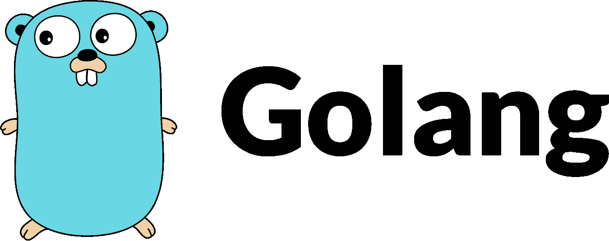

# 从零开始构建 Go Web 应用程序到部署在 Google Cloud 上|第 1 部分-从零开始构建一个简单的 Go Web 应用程序。

> 原文：<https://medium.com/google-cloud/building-a-go-web-app-from-scratch-to-deploying-on-google-cloud-part-1-building-a-simple-go-aee452a2e654?source=collection_archive---------0----------------------->

golang 的简称，是一种静态编译语言。它的语言结构类似于 C/C++的语言结构，非常强调简洁的语句，并去除了大多数旧语言所携带的样板文件。维基百科[文章](https://en.wikipedia.org/wiki/Go_(programming_language))描述了围棋背后的更多动机: