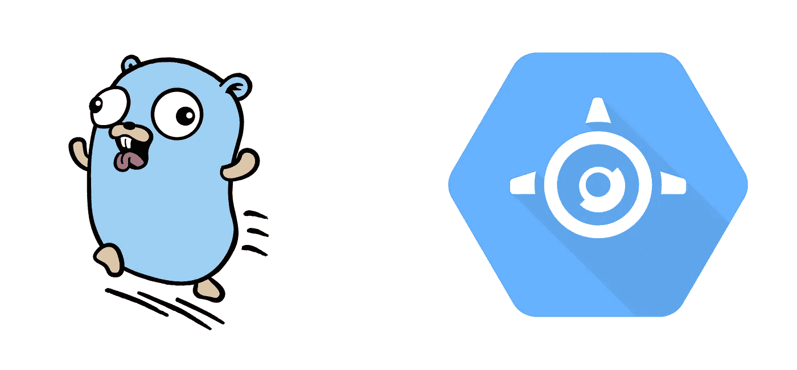

# 从零开始构建 Go Web 应用程序到在 Google Cloud 上部署|第 2 部分—在 Google App Engine (GAE)上部署我们的 Go 应用程序。

> 原文：<https://medium.com/google-cloud/building-a-go-web-app-from-scratch-to-deploying-on-google-cloud-part-2-deploying-our-go-app-on-a07285dfa6a9?source=collection_archive---------0----------------------->

在教程#1 中，我们创建了一个简单的 Go 应用程序来欢迎我们并显示时间。我们在本地运行应用程序，并且只能从我们的机器上与之交互。在本教程中，我们使用谷歌的应用引擎(GAE)向全世界分享我们心爱的欢迎应用。