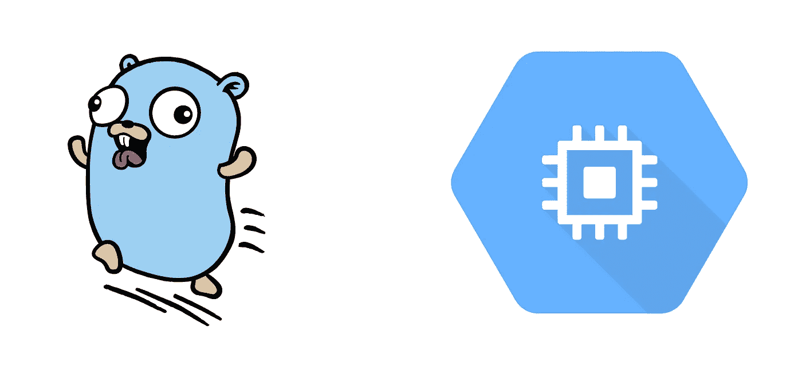

# 从零开始构建 Go Web 应用程序到在 Google Cloud 上部署|第 3a 部分—在 Google 计算引擎(GCE)上部署我们的 Go 应用程序

> 原文：<https://medium.com/google-cloud/building-a-go-web-app-from-scratch-to-deploying-on-google-cloud-part-3a-deploying-our-go-app-16f5a2f44634?source=collection_archive---------2----------------------->

在本系列的教程#1 中，我们创建了一个简单的 Go web 应用程序，它欢迎我们并在我们启动 web 服务器时告诉我们时间。在本教程中，我们将在 Google 计算引擎(GCE)上部署我们的应用程序。GCE 构成了谷歌云的最底层…