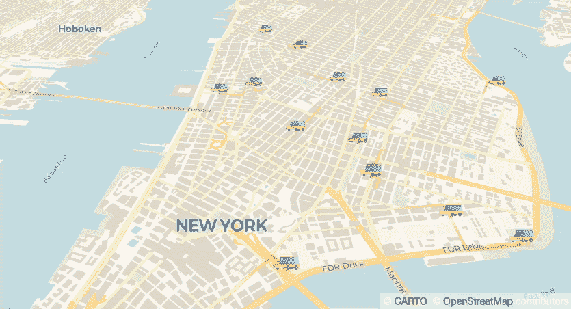

# 使用云运行和 Firestore 构建移动仪表板

> 原文：<https://medium.com/google-cloud/building-a-mobility-dashboard-with-cloud-run-and-firestore-dfa48d193ae1?source=collection_archive---------1----------------------->

可视化是理解海量数据的关键。今天，我们有 BigQuery 和 Looker 来分析 Pb 级数据，并以复杂的方式提取洞察力。但是如何监控每秒钟都在变化的数据呢？在本帖中，我们将介绍如何使用 Cloud Run 和 Firestore 构建实时仪表盘。

## 移动仪表板

实际上，构建一个每秒改变数据的仪表板是很容易的。与其做一个简单的演示，不如让我们做一些有趣和有用的东西..如果我们能实时监控道路上行驶的车辆的位置会怎么样？太好玩了！所以在这篇文章中，我们将制作一个仪表盘，实时监控地图上的车辆！

关于谷歌云博客的更多详情！