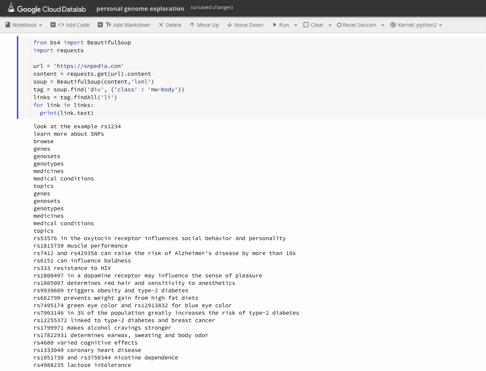

# 用谷歌云、23andMe 和家谱 DNA 构建个人基因组数据仓库

> 原文：<https://medium.com/google-cloud/building-a-personal-genome-data-warehouse-with-google-cloud-23andme-and-family-tree-dna-e9869d8dc7a0?source=collection_archive---------1----------------------->

*这是我 2017 年 5 月的帖子的后续我* [*用 Google Genomics 和 BigQuery*](/google-cloud/interpreting-23andme-raw-genome-data-with-google-genomics-bigquery-and-cloud-datalab-f8540b6b7ef9) *解读 23andMe 原始基因组数据。*

**TLDR** :在这篇文章中，我将使用 Cloud Dataprep 清理我的家谱 DNA 和 23andMe 原始数据，将这些原始数据导入 BigQuery 进行扩展基因组 SNP 识别，并导入 Cloud Datalab 处理我的基因组数据。理想情况下，我将更好地了解我的基因分型原始数据，并且我将有一个更强大的数据集，以便在未来了解更多关于我的 DNA 的信息。

# 概述/我这样做的原因

我们的基因组数据可以用来预测疾病风险、药物的副作用，并告诉我们更多关于我们是谁以及我们的未来可能会如何。在去年使用 23andMe 和 Google BigQuery 探索我的原始数据后，我想要更多的数据，并且能够用它做更多的事情。我想象了一个我的 DNA 的数据仓库，有多个原始数据源。通过这种方式，未来当我们对 DNA 标记(SNPs)了解更多时，我可以轻松地检查从多个服务机构获得的遗传数据，以验证我对自己健康的任何怀疑、风险或担忧。

在我之前的文章 [*用 Google Genomics 和 BigQuery 解读 23andMe 原始基因组数据*](/google-cloud/interpreting-23andme-raw-genome-data-with-google-genomics-bigquery-and-cloud-datalab-f8540b6b7ef9) 中，我将 23andMe 原始数据 txt 文件转换为 vcf，并使用 Google Genomics load variants 管道加载到 BigQuery 进行分析。在这篇文章中，我将准备 2 个不同的原始数据基因组(23andMe 和 FTDNA ),并直接复制到 BigQuery 进行分析。

有一项名为 [Promethease](https://promethease.com/) 的服务可以获取你的原始基因组数据，并将其与在[SNP media](https://www.snpedia.com/)上找到的 SNP 进行匹配，费用为 12 美元。如果你不想支付 12 美元，并且拥有一个你的基因组数据的个人数据仓库的想法很吸引你，你可以很容易地用谷歌云建立一个。

如果要建立一个个人基因组数据仓库，我需要更多关于我的 DNA 的数据。这次我尝试了家谱 DNA 的寻亲服务。有了第二组原始数据后，我就可以将我在 23andMe 原始数据中找到的任何数据与另一个数据源进行交叉引用，希望这能给我找到的任何数据增加信心。在未来，我会添加祖先原始数据，涵盖所有 3 个消费者定价的基因检测服务。理想情况下，这些数据可以让我更好地预测或计划未来可能发生的任何健康问题。这第二个来源会给我一个更准确的数据集吗？我也这么认为两种来源使用不同的排序:

[23andMe](https://www.snpedia.com/index.php/23andMe) —使用定制的 Illumina Omniexpress+阵列，包括约 600，000 个 SNP。

[家谱 DNA](https://www.snpedia.com/index.php/FamilyTreeDNA)Family finder——使用 Illumina OmniExpress 微阵列芯片。它包括总共 711，424 个 SNP。[其中只有大约 13，913 个在 SNPedia 中有注释。](https://www.snpedia.com/index.php/FamilyTreeDNA)

关于/r/23 和 me 的 SNP 覆盖率分析/比较的更多信息

一篇很好的文章，介绍了 DNA 分析的许多选项 [Neo.life 你的测序指南](/neodotlife/dna-analysis-and-sequencing-from-23andme-veritas-ancestry-human-longevity-arivale-family-tree-and-others-20f5ce7a0786)

# 家谱 DNA 原始数据下载

[FamilyTreeDNa 家庭探测器原始数据下载](https://www.familytreedna.com/my/family-finder/downloads)

家谱 DNA 以几种形式给你原始数据。可能会有点混乱。


但是哪一个最好呢？

# FTDNA 3 种原始数据类型

*   常染色体原始数据
*   x 染色体原始数据
*   原始数据串联

人体内的每一个细胞都有 DNA，它们被紧密地包装在称为染色体的结构中。有 23 对染色体，其中 22 对被称为常染色体，第 23 对被称为异体或性染色体。X 染色体跨越大约 1.55 亿个 DNA 碱基对，代表细胞中大约 5%的总 DNA([来源](https://ghr.nlm.nih.gov/chromosome/X))。

FamilyTree DNA 的串联文件结合了常染色体和 X 原始数据文件，因此如果您希望深入了解原始数据，您将需要使用串联文件。

# FTDNA 中的两个不同版本(版本 36 和版本 37)

build 是一个参考系统，用于描述一种典型的全序列人类基因组。构建 37 应该比构建 36 更准确地确定 SNP 的实际位置([来源](http://forums.familytreedna.com/showthread.php?t=33862))。构建是一个基因组组装，随着对人类基因组了解的加深，新的基因组组装被释放出来。

*   每个构建都是人类基因组参考的一个版本
*   更新构建微调 SNP 位置
*   如果手动比较两个原始数据文件，您需要确保它们使用相同的内部版本号
*   23andMe 原始数据是 build 37，因此要手动比较您的 FTDNA 原始数据文件，您应该使用您的 Build 37 原始数据

要将 FTDNA 与另一个原始数据源(如 23andMe)进行比较，您需要使用 Build 37 原始数据串联。

更多关于参考基因组和建立 37 [这里](https://en.wikipedia.org/wiki/Reference_genome)。

# 原始数据格式和大小

家谱 DNA 为您提供了一个带有 CSV 的 gzip，因此很容易加载到 BigQuery 中进行分析。我的家谱 DNA 原始数据是大约 6.5MB 压缩和大约 22MB 未压缩(CSV)。我的 23andMe 原始数据是 5MB 压缩的，大约 15MB 未压缩的(txt)。

从 23andMe 和家谱 DNA 下载您的原始数据，请点击此处:

*   [23andMe 原始数据下载](https://you.23andme.com/tools/data/download/)
*   [家谱 DNA 家族探索者原始数据下载](https://www.familytreedna.com/my/family-finder/downloads)

# 在 Google Cloud BigQuery 中使用这些数据

一旦有了原始数据的 CSV 文件，就可以直接导入 BigQuery。我将从导入家谱 DNA 原始数据开始。

您可以通过 BQ UI 或 bq CLI 工具来完成此操作

```
mikekahn@cloudshell:**~** (mikekahn-sandbox)$ bq --location=US load --source_format=CSV personalgenome.ftdna gs://pers-pixelbook/genome-ftdna.csv RSID:string,CHROMOSOME:string,POSITION:integer,RESULT:string
Waiting on bqjob_r53ef916ab2e7d062_000001642f40dac6_1 … (0s) Current status: DONE
BigQuery error in load operation: Error processing job ‘mikekahn-sandbox:bqjob_r53ef916ab2e7d062_000001642f40dac6_1’: Error while reading data, error message: CSV table encountered too many errors, giving up. Rows: 1;errors: 1\. 
Please look into the error stream for more details.Failure details:- gs://pers-pixelbook/genome-ftdna.csv: Error while reading data,error message: Could not parse ‘POSITION’ as int for field POSITION(position 2) starting at location 0
```

结果:无法导入位置字段为整数的 FTDNA CSV 数据集。这让我开始想我的数据有问题，位置行应该都是数字。

我继续将所有字段作为字符串数据类型导入，继续前进，看看这里发生了什么。

```
mikekahn@cloudshell:**~** (mikekahn-sandbox)$ bq --location=US load --source_format=CSV personalgenome.ftdna gs://pers-pixelbook/genome-ftdna.csv RSID:string,CHROMOSOME:string,POSITION:string,RESULT:string
Waiting on bqjob_r7ffb8f22a9f140ad_000001642f461ba5_1 … (6s) Current status: DONE
```

成功，但最终我不希望所有列都是字符串数据类型。所以让我们在 BigQuery 中探索一下数据。

我发现从家谱 DNA 提供的 CSV 有些问题，使它没有完全净化，需要一些改变。

1.  对于没有值的行，结果列有“—”


2.数据集中的最后 2 行有列名


为了清理这个数据集，并在我的 2 个不同的基因组数据集中标准化字段和列，我将使用 Cloud Dataprep。

# 通过 TRIFACTA 输入 Google Cloud Dataprep

由于需要删除一些重复的行以及这个数据集中的一些其他变化，我认为这将是使用 Google Cloud Dataprep 的好时机。因为我使用了两个不同的原始数据源，所以我应该确保它们具有相同的列、列类型和格式，这样查询两个数据源就更容易了。我可以在 Dataprep 中轻松处理这项工作。

# 创建流并添加数据集

Dataprep 中的第一步是创建一个流并添加一个数据集。这非常简单，给它一个名称，然后上传一个数据集，或者在 GCS 中导入一个数据集，或者在 BigQuery 中导入一个现有的表。我将在同一个流程中为我的 FTDNA 和 23andMe 原始数据添加数据集。


现在是我的第二个数据集(23andMe)


# 创建一个食谱

创建流程并导入数据集后，向其中一个数据集添加新配方。


现在你可以编辑你的食谱了


太好了。加载数据集需要一些时间。既然您的数据集已经导入，您的配方也已经启动，那么您可以稍微研究一下您的数据集，并向配方添加步骤或转换。


对于第一个数据集，我需要确保位置列是 INT 数据类型。我还可以通过将鼠标悬停在 Dataprep 中显示的类别上来浏览我的数据集。


这是我将在第一个 FTDNA 数据集上做的工作。

1.  删除所有列中的符号
2.  重命名列
3.  删除数据集顶部和底部的列名行
4.  对于结果中的空值，请更改为“不适用”

这是食谱的样子:


浏览包含配方的数据集，它看起来很干净:


点击下载 FTDNA wrangle 文件[。](https://storage.googleapis.com/pers-pixelbook/genome-ftdna.wrangle)

现在是运行作业并应用这些转换的时候了。


# 运行作业

如果您打算将这个清理后的数据集直接用于 BigQuery，那么您需要在这里修改一些默认配置。


让我们看看需要改变什么。单击铅笔，让我们编辑此作业。让我们更改以下内容:

1.  文件名
2.  每次运行时替换文件


在“更多选项”下的“每次运行时替换文件”


单个文件，以便我们可以轻松地导入新的。csv 转换成 BQ。

保存设置，然后返回到运行作业对话框。让我们运行作业。


这个转换应该需要几分钟来启动数据流作业并输出我们的新 CSV。


这里的好处是，我们根本不需要编写任何 apache beam 代码来清理这个数据集。Dataprep 基本上是云数据流之上的一层。当作业运行时，如果您愿意，您可以在数据流中查看它。


运行作业几分钟后(对于这个作业，大约 7 分钟)，转换应该完成。查看结果以确保您的数据是干净的。

# 查看结果


由于我们在此使用的原始数据具有我们的 X 染色体(X)和常染色体值(1–22 ),所以在此表中的染色体字段上有 1%的不匹配是可以的。

我觉得不错。

现在导出您的结果。


# 导出结果

验证您之前设置的位置，然后单击“创建”


检查您的云存储空间和新的。csv 应该在那里。


现在您可以下载。csv 或直接从 GCS 存储桶导入到 BQ。

# 将清理后的数据集导入 BQ

# 首先，我将删除具有错误数据类型的旧数据集:

```
mikekahn@cloudshell:**~** (mikekahn-sandbox)$ bq rm personalgenome.ftdna
rm: remove table ‘mikekahn-sandbox:personalgenome.ftdna’? (y/N) y
mikekahn@cloudshell:~ (mikekahn-sandbox)$
```

# 现在导入 dataprep 清理的数据集

```
mikekahn@cloudshell:**~** (mikekahn-sandbox)$ bq --location=US load --source_format=CSV personalgenome.ftdna gs://mikekahn-sandbox.appspot.com/jobrun/genome-ftdna-0623.csv RSID:string,CHROMOSOME:string,POSITION:integer,RESULT:string
Waiting on bqjob_r5b939bcc2a5a3afa_000001639a154b19_1 … (6s) Current status: DONE
```

成功！现在我的 FTDNA 数据集被导入到 BigQuery 中。接下来，让我们为 BQ 准备好 23andMe 数据集。

# 使用 Google Cloud Dataprep 进行 23andMe 文本文件数据转换

由于 23andMe 原始数据列与 FTDNA 列不匹配，所以您还需要清除 Dataprep 中的 23andMe 原始数据基因组 TXT 文件。将其作为数据源导入，并在您的配方中进行以下转换:


点击下载 23andMe Cloud Dataprep 争论文件[。](https://storage.googleapis.com/pers-pixelbook/genome-23andme.wrangle)

像我们在 FTDNA 数据集上做的那样运行作业，没有压缩，只有一个文件。


让我们来看看我们已完成的工作的结果，看看它是如何产生的:


这个数据集现在应该看起来类似于 Dataprep 清理的 FTDNA 数据集，并准备好导出到 CSV，然后与 FTDNA 表一起加载到 BigQuery 中。导出结果的方式与我之前导出 FTDNA 的方式相同。

运行作业并导出结果后，非常容易导入到 BQ。

```
mikekahn@cloudshell:**~** (mikekahn-sandbox)$ bq --location=US load --source_format=CSV personalgenome.23andme gs://mikekahn-sandbox.appspot.com/jobrun/genome-23andMe.csv RSID:string,CHROMOSOME:string,POSITION:integer,RESULT:string
Waiting on bqjob_r56a55846613e01c_000001639f213e24_1 … (6s) Current status: DONE
```

# 使用 BQ 探索您的基因组数据集

我的 BQ personalgenome 数据集包括 2 个表和 2 个不同的基因组。我有一个祖先测试等待结果，所以最终我会从独特的个人遗传提供者那里得到 3 个不同的基因组副本。这是我的个人 DNA 数据集:


# 找到两个基因组之间匹配的 SNPs

在 BQ 中，要查找总行数和匹配行，请使用以下查询:

```
#standardsql
SELECT COUNT(*) as totalrows, count(DISTINCT RSID) as rsidrowmatches
FROM `mikekahn-sandbox.personalgenome.*`
```


两个基因组总共有 1，322，236 行，其中 1，009，997 行是独特的。所以我有 312，259 个匹配行。我的 23andMe 和 FTDNA 基因组有 23.6%的匹配。

此外，尝试使用嵌套通配符查询来查找我的数据集中表之间匹配行的总数

```
#standardsql
SELECT COUNT(*) as totalcount
FROM (
 SELECT RSID from `mikekahn-sandbox.personalgenome.*` 
 GROUP BY RSID HAVING ( COUNT(RSID) > 1 )
) AS total
```


my 23andMe 和 FTDNA 原始数据之间有 312，259 个 RSID SNP 匹配

截至 2018 年 6 月 24 日，SNPedia 仅拥有 [108，485 个 SNPs](http://snpedia.com/index.php/SNPedia) 的详细信息。因此，不要期望对你的 DNA 有一些强有力的答案，而是一些可能的见解。

# 跨 Counsyl、23andMe、FTDNA 数据的 SNP 检查

我结婚前在一家名为 Counsyl 的公司做过携带者测试。不幸的是，Counsyl 没有提供与 23andMe 和 FTDNA 可比的数据，因为它们主要提供一份将你的 DNA 与你的配偶相匹配的报告。我试图从 Counsyl 获得我的原始数据，他们确实给了我一个 vcf，但它相当小，不包括参考基因组变异。关于 Counsyl vs 23andMe 的更多信息:

*couns yl Foresight screen 对数百种可能导致遗传性疾病的基因进行全新一代测序。这构成了大约 100 万个碱基对位置，对其进行检测以发现新的变异。VCF 主要表示具有罕见的非参考变量的位置，这给出了大约 1200 个条目的 VCF。*

*23andme by comparison 使用微阵列在大约 600，000 个已知常见祖先变异的位置进行基因分型。他们的 VCF 档案很可能包含每个位置的基因型，因此预计该档案会大 500 倍。*

我的验血结果显示，我是一种叫做[的先天性无巨核细胞血小板减少症](https://rarediseases.info.nih.gov/diseases/640/congenital-amegakaryocytic-thrombocytopenia)的携带者。我想验证在我基因组中发现的这种疾病的 SNP 也在 23andMe 和 FTDNA 的基因组中。


所以让我们在 BigQuery 中查询这些表。

# 第一步，找到 SNP。

谷歌搜索先天性无单核细胞血小板减少症 snp 返回一个 SNPedia 结果:

[rs12731981 —媒体](https://www.snpedia.com/index.php/Rs12731981)

现在我们在 BigQuery 中有了 23andMe 和 ftdna 数据集，让我们在我的个人基因组中检查这个 SNP

因为我已经使用 Dataprep 确保了两个表具有相同的列名，所以我可以在我的查询中使用一个[通配符表](https://cloud.google.com/bigquery/docs/querying-wildcard-tables)来查询 SNP 的数据集中的所有表。我将使用 _TABLE_SUFFIX 让我知道哪个原始数据源正在显示 SNP。


那个 SNP 在我所有的 3 个原始数据来源上都是匹配的，分别是 Counsyl(通过报告)、23andMe 和 ftdna。别担心，我的妻子也做了考恩西尔测试，她不是这种疾病的携带者，所以我们未来的孩子会没事的🙏🏼。

我刚刚做的是在三个不同的 DNA 测试服务中验证一个基因标记。这让我对我 DNA 上的基因标记有了很大的信心。相当酷。

# 更多探索——前列腺癌

在[SNP media](https://snpedia.com/index.php/Cancer)上随机检查癌症的 SNP

前列腺癌有一个确定的 SNP 与侵略性前列腺癌[此处](https://snpedia.com/index.php/Prostate_cancer):

*已经发现一个 SNP 不仅与一般的前列腺癌相关，而且还特别与侵袭性前列腺癌相关[*[*PMID 18073375*](https://www.ncbi.nlm.nih.gov/pubmed/18073375?dopt=Abstract)*]:*

*   [*rs1571801*](https://snpedia.com/index.php/Rs1571801)

在我的 FTDNA 和 23andMe 基因组中检查这个 SNP

```
#standardsql
SELECT rsid, chromosome, position, result, _TABLE_SUFFIX as table_id
FROM `mikekahn-sandbox.personalgenome.*` 
WHERE rsid = 'rs1571801'
```

出现在我的两个原始数据源上:


一些[研究](https://www.ncbi.nlm.nih.gov/pubmed/18073375?dopt=Abstract)已经证实了这一点:

## 方法:

*我们对 498 名患有侵袭性前列腺癌的男性和 494 名对照受试者进行了探索性全基因组关联扫描，这些受试者选自瑞典的一项基于人群的病例对照研究。我们将这次扫描的结果与公开的癌症易感性遗传标记(CGEMS)研究中侵袭性前列腺癌的结果结合起来。在两个由欧洲人或非裔美国人组成的独立研究人群中，使用单侧检验和与探索性研究中最低值相关的遗传模型(显性或加性),检验了基于双侧等位基因检验显示与侵袭性前列腺癌风险具有统计学显著相关性的单核苷酸多态性(SNPs)与侵袭性前列腺癌的相关性。*

# 在你紧张之前..

幸运的是，这个标记在[SNP media 上的等位基因(基因的变体)是 A；风险最高的 a](https://snpedia.com/index.php/Rs1571801)而我的等位基因好像是 G；t，所以希望我是清白的。但这向你展示了我们对 DNA 的了解。这项研究只在大约 500 名男性身上进行，SNPedia 说 A；一个变种患前列腺癌的风险是 1.36 倍。所以它不是很强或决定性的，但在另一种情况下对某人来说可能意味着什么。

# 数据实验室

接下来，我将使用 Google Cloud Datalab 为我的基因组数据仓库探索创建笔记本。

[云数据实验室快速入门](https://cloud.google.com/datalab/docs/quickstart)

使用云数据实验室，我可以使用%%bq query 在笔记本中运行 BigQuery 查询


在 Datalab 中，我可以编写 python 代码来进行分析。例如，在我的笔记本上，我用 BeautifulSoup 搜集了 snpedia.com 流行的 SNPs。



一旦我添加了更多的原始数据源(祖先)，我将编写一些东西来为在多个表中找到的匹配给出一个分数。

在这里下载这个云数据实验室 ipython 笔记本[。](https://storage.googleapis.com/pers-pixelbook/personal%2Bgenome%2Bexploration.ipynb)

# 结论

今天，我们可以以相对合理的成本从多个来源进行基因分型。23andMe、家谱 DNA 和祖先等服务是当今最受人们欢迎的进行祖先和健康数据探索的基因分型服务。这些数据可以帮助我们更好地了解我们的基因构成，了解疾病风险，并可能让人们更好地规划他们的生活方式。SNP 标记仍在鉴定中，在某些情况下可能不准确。利用您的基因分型原始数据和谷歌云平台，您可以轻松构建个人数据仓库，并更好地了解大型数据集，如您自己的 DNA。