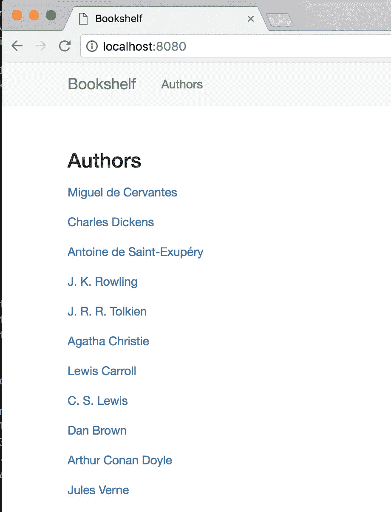
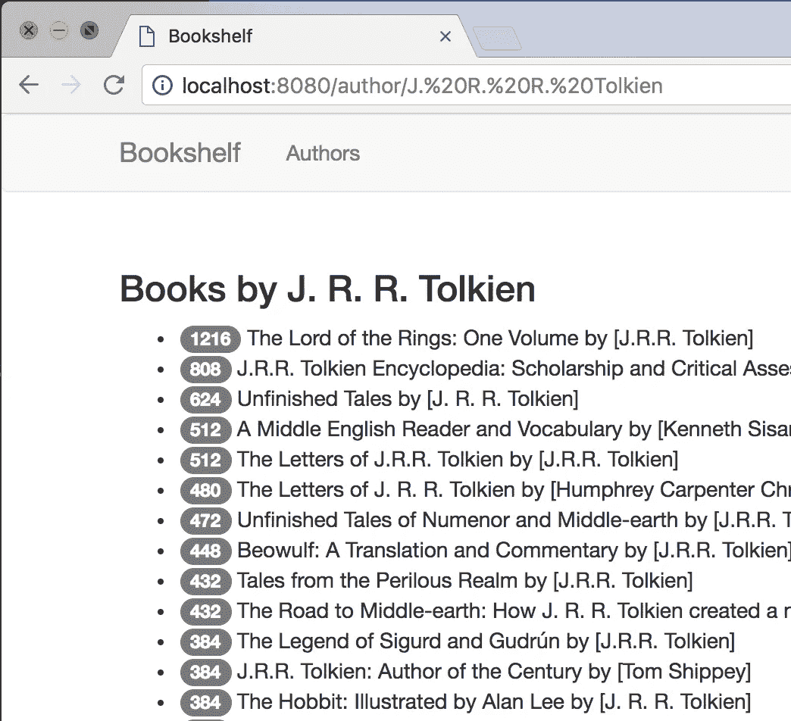
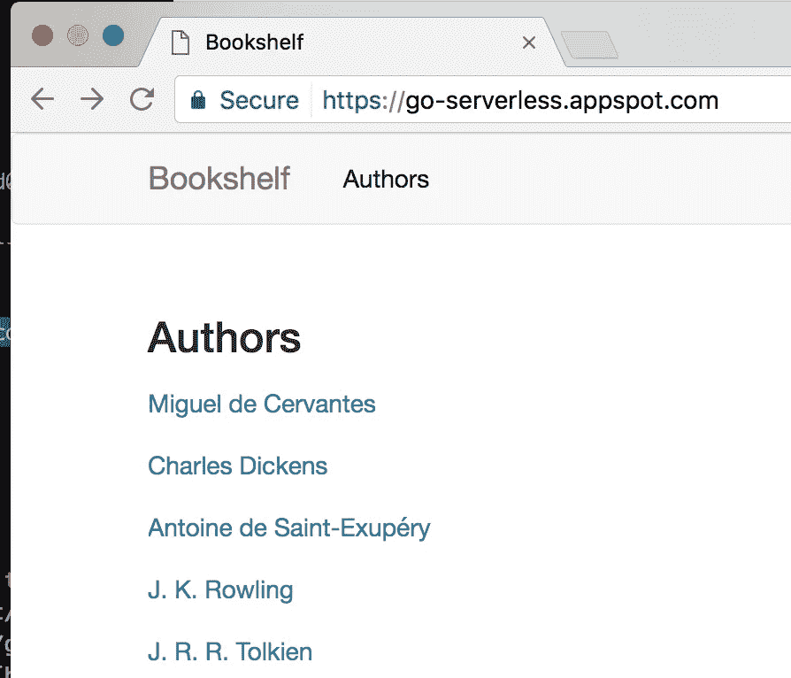

# 在谷歌云上构建无服务器 Go 应用

> 原文：<https://medium.com/google-cloud/building-a-serverless-go-app-on-google-cloud-90240fba9845?source=collection_archive---------1----------------------->

受 Laurent Picard 的[与 GCP](/google-cloud/building-a-serverless-python-app-in-minutes-with-gcp-5184d21a012f) 在几分钟内构建无服务器 Python 应用程序的启发，这是一组类似的步骤，但使用了 Go 应用程序和应用程序引擎的灵活环境。

网络应用列出了作者，并使用[谷歌图书 API](https://developers.google.com/books/docs/v1/reference/volumes)来搜索作者的出版作品。

## TL；博士；医生

下面将稍微详细介绍几个命令。

```
PROJECT=my-project-name
# create a project
# [cloud.google.com/sdk/gcloud/reference/alpha/projects/create](https://cloud.google.com/sdk/gcloud/reference/alpha/projects/create)
gcloud alpha projects create $PROJECT# set the project as default
gcloud config set core/project $PROJECT#
# write your code, test it locally
#
mkdir $GOPATH/src/github.com/you/$PROJECT
cd $GOPATH/src/github.com/you/$PROJECT# create an app.yaml to define deployment
# ref [cloud.google.com/appengine/docs/flexible/go/configuring-your-app-with-app-yaml](https://cloud.google.com/appengine/docs/flexible/go/configuring-your-app-with-app-yaml)
vi app.yaml# deploy!
gcloud app deploy
```

## 先决条件:安装 Google Cloud SDK cli

[安装 Google Cloud SDK 命令行工具](https://cloud.google.com/sdk/downloads)——这将贯穿始终。

## 创建一个谷歌云项目

使用 `[gcloud alpha create](https://cloud.google.com/sdk/gcloud/reference/alpha/projects/create)`命令，创建一个新项目。注意，这是一个“alpha release”命令，所以将来可能会改变。非 alpha 方式是使用基于 web 的云控制台:[https://console.cloud.google.com](https://console.cloud.google.com)。

```
$ gcloud alpha projects create go-serverless
Create in progress for [[https://cloudresourcemanager.googleapis.com/v1/projects/go-serverless](https://cloudresourcemanager.googleapis.com/v1/projects/go-serverless)].
Waiting for [operations/pc.7509198304344852511] to finish…done.
```

## 列出现有项目

如果这不是你的第一个谷歌云项目，你可能已经有多个项目了，所以这里有一个有用的命令来检查你有什么项目

```
$ gcloud projects list
PROJECT_ID NAME PROJECT_NUMBER
bespokemirrorapi bespokemirrorapi 811093430365
gdgnoco-fortune gdgnoco-fortune 861018601285
go-serverless go-serverless 49448245715
…
```

## 设置默认项目

后续的`gcloud`命令将与一个项目相关联，因此将默认项目设置为我们新创建的项目是很有用的。创建新项目不会自动将其设定为默认项目。

用`gcloud config list`列出当前所有项目配置，用`gcloud set …`设置一个配置项。

将`core/project`属性设置为`go-serverless`:

```
 $ gcloud config set core/project go-serverless
Updated property [core/project].
$ gcloud config list
[compute]
zone = us-central1-c
[core]
account = [ghchinoy@gmail.com](mailto:ghchinoy@gmail.com)
disable_usage_reporting = False
project = go-serverlessYour active configuration is: [default] 
```

## 在本地创建应用程序

*   创建项目目录
*   创建一个部署文件`app.yaml`

按照惯例，Go 项目放在`$GOPATH\src`下的一个文件夹中，通常与一个存储库相关联。在这里，我使用我的 github 作为路径创建一个项目，并切换到创建的目录:

```
 $ mkdir -p $GOPATH/src/github.com/ghchinoy/go-serverless
$ cd $GOPATH/src/github.com/ghchinoy/go-serverless 
```

添加一个名为`app.yaml`的新文件，该文件定义了在 App Engine 的灵活环境中的部署(参见[AE flex 的 App . YAML](https://cloud.google.com/appengine/docs/flexible/go/configuring-your-app-with-app-yaml))

```
 runtime: go
env: flex
api_version: 1skip_files:
- README.md 
```

添加代码，`main.go`的片段(完整代码见[来源](https://github.com/ghchinoy/go-serverless)

## 本地测试

在本地运行应用程序；在[查看 http://localhost:8080](http://localhost:8080)

```
 $ go run main.go template.go
2017/03/30 15:55:21 booklist
127.0.0.1 — — [30/Mar/2017:15:55:24 -0600] “GET / HTTP/1.1” 200 1584 “” “Mozilla/5.0 (Macintosh; Intel Mac OS X 10_12_4) AppleWebKit/537.36 (KHTML, like Gecko) Chrome/59.0.3056.0 Safari/537.36”
… 
```



## 部署

确保项目已配置为计费，在浏览器中访问[https://console . developers . Google . com/project/go-server less/settings](https://console.developers.google.com/project/go-serverless/settings`)，用您自己的名称替换项目名称`go-serverless`。

```
 $ gcloud app deploy
You are creating an app for project [go-serverless].
WARNING: Creating an App Engine application for a project is irreversible and the region
cannot be changed. More information about regions is at
[https://cloud.google.com/appengine/docs/locations](https://cloud.google.com/appengine/docs/locations).Please choose the region where you want your App Engine application
located:[1] europe-west (supports standard and flexible)
 [2] us-east1 (supports standard and flexible)
 [3] us-central (supports standard and flexible)
 [4] asia-northeast1 (supports standard and flexible)
 [5] cancel
Please enter your numeric choice: 3Creating App Engine application in project [go-serverless] and region [us-central]….done.
You are about to deploy the following services:
 — go-serverless/default/20170330t205543 (from [/Users/ghc/dev/go/src/github.com/ghchinoy/go-serverless/app.yaml])
 Deploying to URL: [[https://go-serverless.appspot.com](https://go-serverless.appspot.com)]Do you want to continue (Y/n)? YIf this is your first deployment, this may take a while…done.Beginning deployment of service [default]…
Building and pushing image for service [default]
Some files were skipped. Pass ` — verbosity=info` to see which ones…Updating service [default]…done.
Deployed service [default] to [[https://go-serverless.appspot.com](https://go-serverless.appspot.com)]You can stream logs from the command line by running:
 $ gcloud app logs tail -s defaultTo view your application in the web browser run:
 $ gcloud app browse
```

部署完毕！

[https://go-serverless.appspot.com/](https://go-serverless.appspot.com/)



*   [https://github.com/ghchinoy/go-serverless](https://github.com/ghchinoy/go-serverless)
*   [https://go-serverless.appspot.com/](https://go-serverless.appspot.com/)