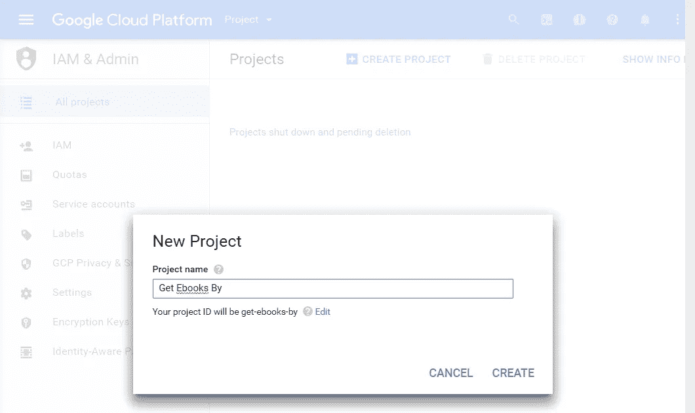
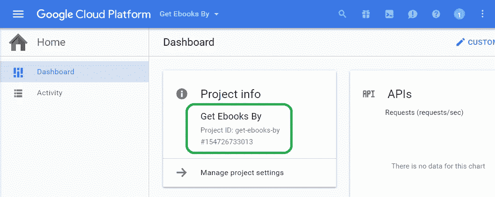
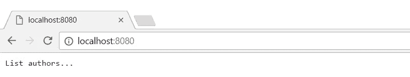
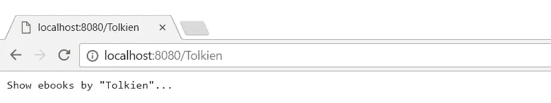
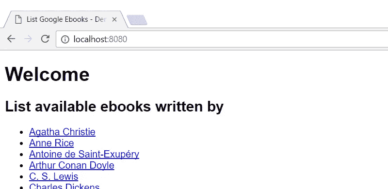
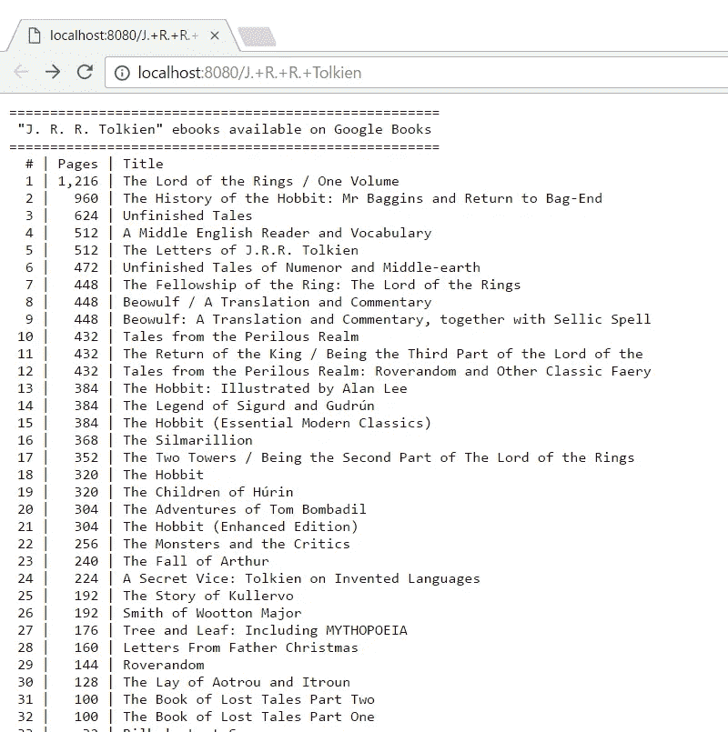
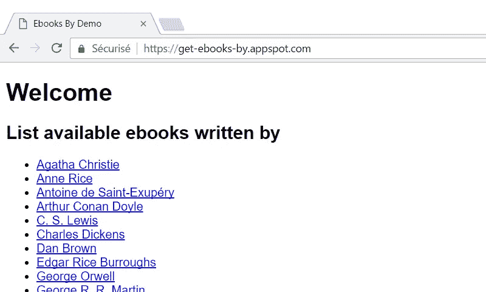
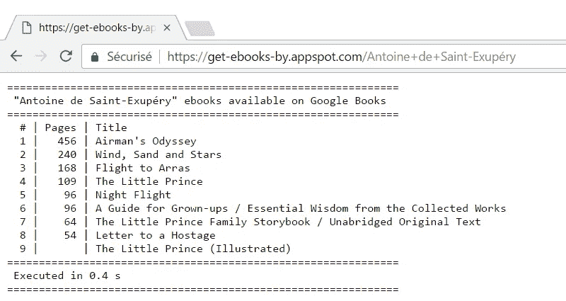

# 用 GCP 在几分钟内构建一个无服务器的 Python 应用程序

> 原文：<https://medium.com/google-cloud/building-a-serverless-python-app-in-minutes-with-gcp-5184d21a012f?source=collection_archive---------0----------------------->

更新:Python 3 现已推出。这篇文章将尽快重写。你可以看看“[用 GCP 在几分钟内部署一个 Python 无服务器功能](/@PicardParis/deploying-a-python-serverless-function-in-minutes-with-gcp-19dd07e19824)”来获得一篇更新的文章。

在让 Python“Hello World”与应用程序引擎一起运行之后(见前面的中的[，部署一个实际的应用程序应该很容易。让我们创建一个应用程序，返回给定作者的可用电子书。](/@PicardParis/deploying-a-serverless-env-in-minutes-with-gcp-22008c42dfa4)

## 创建新项目

首先，让我们在 GCP 控制台中创建一个新项目([IAM&Admin/All projects](https://console.cloud.google.com/iam-admin/projects)):



让我们称这个项目为“获取电子书”。项目 ID 变为“get-ebooks-by”。这将是 appspot.com 子域。



新项目不到 30 秒就准备好了

GCP web 控制台中可见的当前项目不一定对应于 gcloud 控制台中的默认项目。换句话说，从 web 控制台创建的新项目不会是 gcloud 控制台中的默认项目。

## 检查项目列表

```
$ **gcloud projects list** PROJECT_ID            NAME                  PROJECT_NUMBER
get-ebooks-by         Get Ebooks By         154726733013
yet-another-gcp-test  Yet Another GCP Test  539486276394
...
```

非常有用的快速可视化您的不同项目和他们的 id。遗憾的是，它没有指明当前的默认项目。

## 检查默认项目

```
$ **gcloud config list**
Your active configuration is: [default][core]
...
project = yet-another-gcp-test
```

默认项目不是新项目。默认情况下，所有的`gcloud`命令将应用于另一个项目，这在这里是不希望的。

## 更改默认项目

```
$ **gcloud config set project** **get-ebooks-by** Updated property [core/project].
```

如果你正在编写不同的命令，同时处理不同的项目(例如持续集成)，或者只是不希望改变默认项目，可以使用`--project`标志(部署时请参见下面的注释):`gcloud COMMAND --project PROJECT_ID`。

## 准备源代码

在您的本地计算机上:

*   创建目录`get_ebooks_by`
*   将当前目录更改为`get_ebooks_by`
*   添加部署文件`app.yaml`

*   添加 Python 存根文件`main.py`，并将文件编码设置为`UTF-8-BOM`。如果您的编辑器不支持，请在`UTF-8`(无 BOM)中编码您的源代码，并将`# -*- coding: utf-8 -*-`添加为第一行。

## 定义入口点

让我们为 web 应用程序定义两个入口点:

1.  主页面`/`会列出畅销书作家
2.  子页`/author`将列出该作者所有可用的电子书

相应地修改 Python 存根文件:

注意:第二个条目“author”参数是 URL 编码的，必须去掉引号才能返回纯文本。

## 本地测试

```
$ **dev_appserver.py app.yaml**
```



[主页](http://localhost:8080/)



[子页面](http://localhost:8080/Tolkien)

## 显示作者页面

改编`ListAuthors`类以显示(任意)畅销书作者列表:



当 main.py 更新后，只需刷新本地页面

## 检索电子书数据

通过 Google Books API 可以检索到某个作者写的电子书，使用 [HTTP GET 请求](https://developers.google.com/books/docs/v1/reference/volumes/list)可以查询/测试。以下函数获取预期电子书的列表:

## 打印电子书数据

以下函数以纯文本格式打印电子书列表:

## 显示电子书页面

改编`ListEbooksByAuthor`类以显示可用电子书的列表:



[http://localhost:8080/j .+r .+r .+托尔金](http://localhost:8080/J.+R.+R.+Tolkien)

## 部署到生产环境

```
$ **gcloud app deploy**
```

注意，如果你的 GCP 项目不是默认项目，你需要完全明确:`gcloud app deploy --project PROJECT_ID`



[https://get-ebooks-by.appspot.com/](https://get-ebooks-by.appspot.com/)



[https://get-ebooks-by.appspot.com/Antoine+de+Saint-Exupéry](https://get-ebooks-by.appspot.com/Antoine+de+Saint-Exup%C3%A9ry)

## 关卡完成！

*   该应用程序已经启动并运行！[https://get-ebooks-by.appspot.com/](https://get-ebooks-by.appspot.com/)
*   知识库:[https://github.com/PicardParis/get_ebooks_by](https://github.com/PicardParis/get_ebooks_by)
*   这个应用程序主要依赖于谷歌图书 API 的网络连接，绝对不是一个 CPU 压力。与在本地 900 Mbps-下载/200 Mbps-上传网络上的测试相比，在 GCP 上的性能是相似的(或者更好)。

## 接下来…

敬请期待