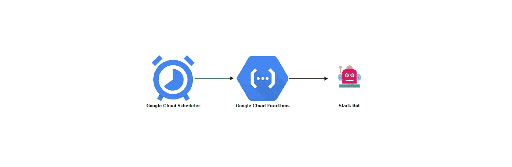
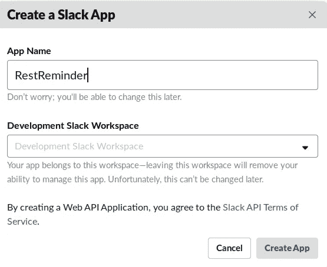
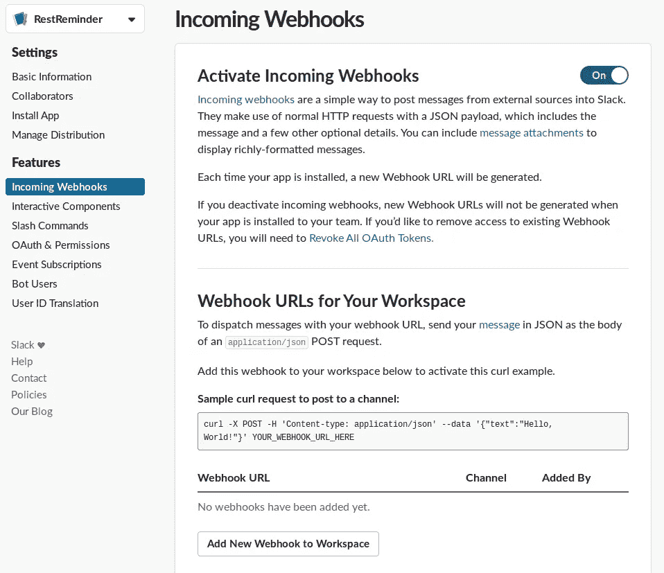
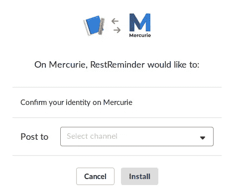
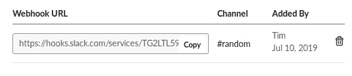
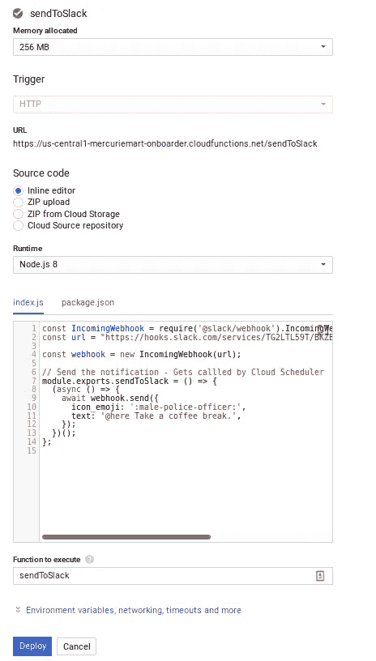
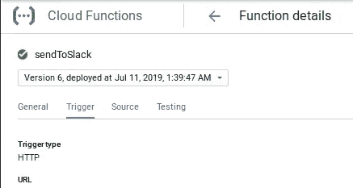
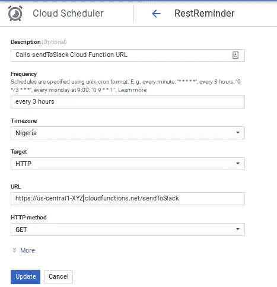

# 构建时差提醒应用程序🤖与谷歌云功能⚡和谷歌云调度⏰

> 原文：<https://medium.com/google-cloud/building-a-slack-reminder-app-with-google-cloud-functions-and-google-cloud-scheduler-4046f4c9c19?source=collection_archive---------0----------------------->

谷歌云平台提供了非常棒的工具来帮助工程师轻松实现自动化。

> 在本文中，我们将构建和部署一个无服务器的应用程序，通过利用 Google Cloud 功能向 Slack 发送消息。我们还将使用 Google Cloud Scheduler 以 3 小时为间隔定期运行我们的应用程序。

我们的最终结果。

# 谷歌云功能

Google Cloud Functions 是一个轻量级计算解决方案，开发人员可以创建单一用途的独立功能来响应云事件，而无需管理服务器或运行时环境。

Google Cloud 函数可以用 Node.js、Python、Go 编写，在特定语言的运行时执行。

云函数可以与特定的触发器相关联。触发器类型决定了函数执行的方式和时间。云函数支持以下本机触发机制:

*   HTTP 触发器
*   云发布/订阅触发器
*   云存储触发器
*   直接触发器
*   云 Firestore
*   Firebase 分析
*   Firebase 实时数据库
*   Firebase 认证

Google Stackdriver 提供了一套监控工具，帮助您了解您的云功能中发生了什么。云函数的日志可以在 Stackdriver 日志记录 UI 中查看。

云功能可用于多种情况，如无服务器应用后端、实时数据处理系统或人工智能应用。

# 云调度程序

Google Cloud Scheduler 是一个完全受管的、可扩展的、容错的 cron 作业调度程序，它允许工程师在一个地方自动执行他们所有的计划任务。

Google Cloud Scheduler 允许你设置*完全管理的*预定工作单元，在规定的时间或固定的时间间隔执行，支持 Unix cron 格式*。*

云调度程序可以与以下任一目标相关联:

*   HTTP/S 端点
*   云发布/订阅主题
*   App Engine 应用程序

此外，Stackdriver 与云调度程序集成，提供了*强大的日志记录*，以提高作业执行和性能的透明度。

云调度器可以用于多种情况，例如每天发送一封报告电子邮件，每 10 分钟更新一些缓存数据，或者向一个端点发出请求。

# 设置松弛时间

登录到您的 Slack 工作区，然后[创建一个新的 Slack 应用程序](https://api.slack.com/apps?new_app=1)，如下所示:

*   选择应用的名称和你的 Slack 团队。单击创建。
*   单击传入网页挂钩。
*   启用传入 webhooks。

*   点击添加新的网页挂钩到团队。将打开一个授权页面。
*   从下拉菜单中，选择您希望向其发送通知的渠道。我们将使用#随机频道
*   单击授权。

*   已经为您的 Slack 应用程序创建了 webhook。复制 webhook 并保存以备后用。

# 设置云功能

访问[云功能](https://console.cloud.google.com/functions/)和*创建功能*

*   输入您的函数名
*   设置*分配的内存* : 256MB
*   设置*触发器* : HTTP
*   *认证*:检查—允许未经认证的调用
*   *源代码* : Select —行内编辑器
*   *运行时* : Node.js 8(以后可以随意修改以适应您的选择)
*   *执行*的功能:sendToSlack

将下面的代码片段粘贴到内联编辑器中，并从 Slack 中将 **url** 的值替换到您的 Webhook 中，然后部署您的函数。

代码片段

完成后，您可以访问您的云功能页面上的 URL 进行测试。

# 设置云调度程序

访问(云调度程序)[[console.cloud.google.com/cloudscheduler]](https://hashnode.com/util/redirect?url=https://console.cloud.google.com/cloudscheduler])和*创建作业*

*   输入作业名称
*   设置*频率*:每 3 小时一次
*   *目标*:选择 HTTP
*   设置 *URL* :(使用您部署的云功能 URL)
*   *HTTP 方法*:选择 GET

太好了！你应该每 3 个小时从你的 Slack 频道上的 RestReminder Bot 得到以下消息。

## 额外资源

*   [谷歌云功能](https://cloud.google.com/functions)
*   [谷歌云调度器](https://cloud.google.com/scheduler)
*   [fire base 的云函数](https://firebase.google.com/docs/functions)
*   [fire base 的预定云功能](https://firebase.google.com/docs/functions/schedule-functions)
*   [谷歌云平台牛逼榜单](https://github.com/GoogleCloudPlatform/awesome-google-cloud)

*感谢通读！如果我错过了任何步骤，如果有些事情不太适合你，或者如果这个指南有帮助，请告诉我。*