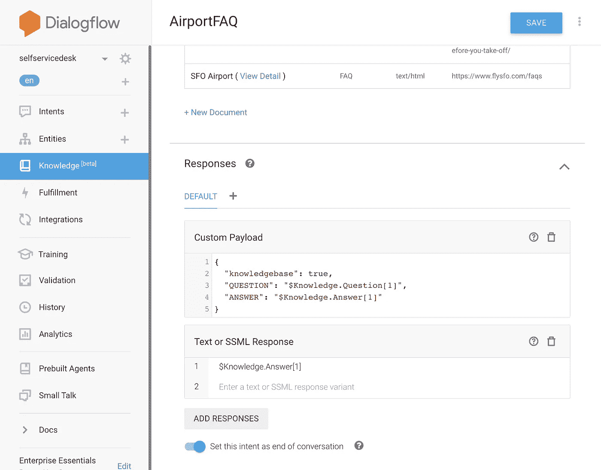

# 构建 web 服务器，该服务器接收浏览器麦克风流并使用 Dialogflow 或语音到文本 API 来检索文本结果。(第三部分)

> 原文：<https://medium.com/google-cloud/building-a-web-server-which-receives-a-browser-microphone-stream-and-uses-dialogflow-or-the-speech-62b47499fc71?source=collection_archive---------0----------------------->

这是该系列的第三篇博客:

**将音频从浏览器麦克风流式传输到 Dialogflow 的最佳实践& Google Cloud 语音转文本。**

如果你没有看过其他的博客，我推荐你浏览这些博客:

*   [**博客 1:介绍 GCP 对话式 AI 组件，并在 web app**](/@ladysign/building-your-own-conversational-voice-ai-with-dialogflow-speech-to-text-in-web-apps-part-i-b92770bd8b47) **中集成自己的语音 AI。**
*   [**博客 2:构建一个客户端 web 应用程序，将音频从浏览器麦克风传输到服务器。**](/@ladysign/building-a-client-side-web-app-which-streams-audio-from-a-browser-microphone-to-a-server-part-ii-df20ddb47d4e)

在本系列的下一篇博客中，我将从服务器端的浏览器麦克风接收音频字节，因此我可以使用它来使 Dialogflow 检测意图或语音到文本转录呼叫！

这些博客[包含简单的代码片段](https://github.com/dialogflow/selfservicekiosk-audio-streaming/tree/master/examples)和一个演示应用程序；[机场自助服务亭](https://github.com/dialogflow/selfservicekiosk-audio-streaming)，将用作参考架构。

# 服务器端实现


下面是创建 Node.js Express 应用程序的步骤，该应用程序集成了 Google APIs，如 Dialogflow、Speech to Text 和 Text to Speech。

您将需要一个工作的前端应用程序，如前一篇博客所述，以便从 HTML5 麦克风获得音频缓冲区。在继续之前，请确保您已经阅读了博客 2。

在编写任何 Node.js 服务器代码之前，让我们快速预览一下配置和我正在使用的 NPM 库:

## 我的应用程序配置:。包封/包围（动词 envelop 的简写）

在我的代码库中；对于简单的例子，对于端到端的机场自助服务亭，我将所有的语音配置存储在项目之外。因此，不用浏览所有代码，就可以轻松地进行设置。这就是为什么我创建了一个**。env** 系统环境文件。

在我的应用程序代码的后面，我可以使用 npm 库 [dotenv](https://www.npmjs.com/package/dotenv) 。它将环境变量从一个. env 文件加载到 [process.env](https://nodejs.org/docs/latest/api/process.html#process_process_env) 中。如果我稍后在容器中部署我的应用程序，或者使用 App Engine 灵活的环境，我可以在 **GKE 配置图**或 **app.yaml.** 中指定这些环境变量

下面是我的**。env** 文件看起来像:

```
PROJECT_ID=gcp-project-idLANGUAGE_CODE=en-USENCODING=AUDIO_ENCODING_LINEAR_16SAMPLE_RATE_HERZ=16000SINGLE_UTTERANCE=falseSPEECH_ENCODING=LINEAR16SSML_GENDER=FEMALE
```

对于 Dialogflow，作为 [DetectIntentRequest](https://cloud.google.com/dialogflow/docs/reference/rpc/google.cloud.dialogflow.v2beta1#detectintentrequest) 一部分的 AudioConfig 是必不可少的。它指示语音识别器如何处理语音音频。检查所有可能的[配置](https://cloud.google.com/dialogflow/docs/reference/rpc/google.cloud.dialogflow.v2#google.cloud.dialogflow.v2.InputAudioConfig)的 RPC 参考。

对于语音转文本，将[识别配置](https://cloud.google.com/speech-to-text/docs/reference/rpc/google.cloud.speech.v1#google.cloud.speech.v1.RecognitionConfig)和[识别音频](https://cloud.google.com/speech-to-text/docs/reference/rpc/google.cloud.speech.v1#google.cloud.speech.v1.RecognitionAudio)传递给[识别请求](https://cloud.google.com/speech-to-text/docs/reference/rpc/google.cloud.speech.v1#google.cloud.speech.v1.RecognizeRequest)很重要。

**识别音频**包含在**识别配置**中指定编码的音频数据。必须提供**内容**或 **uri** 。

**RecognitionConfig** 向识别器提供指定如何处理请求的信息。

对于文本到语音，以下配置对于进行 [SynthesizeSpeechRequest](https://cloud.google.com/text-to-speech/docs/reference/rpc/google.cloud.texttospeech.v1#synthesizespeechrequest) 调用非常重要。[合成输入](https://cloud.google.com/text-to-speech/docs/reference/rpc/google.cloud.texttospeech.v1#google.cloud.texttospeech.v1.SynthesisInput)(可以是文本或 SSML)[语音选择参数](https://cloud.google.com/text-to-speech/docs/reference/rpc/google.cloud.texttospeech.v1#google.cloud.texttospeech.v1.VoiceSelectionParams)(描述使用哪种语音)和一个[音频配置](https://cloud.google.com/text-to-speech/docs/reference/rpc/google.cloud.texttospeech.v1#google.cloud.texttospeech.v1.AudioConfig)(描述要合成的音频数据)。

## 我正在使用的 NPM 库:package.json

因为我的示例应用程序使用了 Node.js 和 NPM，所以我需要下载外部节点库。在这里可以找到 [my package.json](https://github.com/dialogflow/selfservicekiosk-audio-streaming/blob/master/examples/package.json) 。

对构建语音集成很重要的 npm 包:

*   [dialogflow](https://www.npmjs.com/package/dialogflow) :与 dialogflow 交互，进行意图匹配(针对语音)
*   [@google-cloud/speech](https://www.npmjs.com/package/@google-cloud/speech) :与 STT 互动，转录语音
*   [@ Google-cloud/text-to-speech](https://www.npmjs.com/package/@google-cloud/text-to-speech):与 TTS 交互，合成文本

以下软件包也派上了用场:

*   [pb-util](https://www.npmjs.com/package/pb-util) :用于处理常见 protobuf 类型的实用程序。它可以与 Dialogflow 意向响应一起使用。
*   [流](https://www.npmjs.com/package/stream)、[实用程序](https://www.npmjs.com/package/util)、[至 2](https://www.npmjs.com/package/through2) :用于处理流。如果其中一条关闭了，就把它们全部摧毁。
*   [recordrtc](https://www.npmjs.com/package/recordrtc) :音频+视频+屏幕+画布录制的 WebRTC JavaScript 库。我在服务器端不需要它，但是它在我的 package.json 文件中，所以我可以在本地托管这个库(而不是从 CDN)。
*   [socket.io](https://www.npmjs.com/package/socket.io) : Socket。IO 支持基于事件的实时双向通信。
*   [socket.io-stream](https://www.npmjs.com/package/socket.io-stream) :这是通过 socket.io 与 Stream API 进行双向二进制数据传输的模块
*   [uuid](https://www.npmjs.com/package/uuid) :生成通用的唯一标识符

## 设置对话流

导航至:[http://console.dialogflow.com](http://console.dialogflow.com/)并创建一个新代理。确保您已经在设置中启用了**测试版功能**，因为我们将利用**知识库连接器**来导入基于网络的常见问题，并且该功能目前处于测试阶段。

一旦启用，我们就可以创建一个新的**知识库 FAQ** ，用 **text/html** 作为 **mime-type** 。对于机场自助服务亭演示，我将从一个实时网站[https://www.flysfo.com/faqs](https://www.flysfo.com/faqs)将旧金山机场的问题和答案加载到我的代理中

FAQ 导入后，您将看到 Dialogflow 中列出的所有问题和答案。我们现在需要指定文本的答案和 SSML 的回应: **$Knowledge。答案【1】**

Dialogflow 将使用这个响应(知识库 Q 和 A 的第一个回答)合成为一个 AudioBuffer。



**注:**

在我的机场自助服务亭演示中，我还在 Angular web 应用程序中将问题和答案显示为可读文本。我是怎么做到的？通过在文本&旁边创建一个**自定义有效载荷**SSML 响应:

```
{“knowledgebase”: true,“QUESTION”: “$Knowledge.Question[1]”,“ANSWER”: “$Knowledge.Answer[1]”}
```

## 编写服务器代码

通常，服务器端代码将由以下部分组成:

*   导入所有必需的库
*   加载环境变量
*   用套接字设置 Express 服务器。IO 侦听器
*   Google Cloud API 调用:Dialogflow 音频检测意图&检测流调用、语音到文本识别&流识别调用、文本到语音合成调用

出于演示目的，我不会讨论如何用 express 服务器设置 Node.js 应用程序。但是作为参考，你可以看看我的[简单服务器代码](https://github.com/dialogflow/selfservicekiosk-audio-streaming/blob/master/examples/simpleserver.js)，它已经被用于简单的[客户端示例](https://github.com/dialogflow/selfservicekiosk-audio-streaming/tree/master/examples)。你也可以看看[机场自助服务亭](https://github.com/dialogflow/selfservicekiosk-audio-streaming/tree/master/server)的代码，一个端到端的例子。这个例子使用了云语音转文本[流识别](https://cloud.google.com/speech-to-text/docs/reference/rpc/google.cloud.speech.v1#google.cloud.speech.v1.Speech.StreamingRecognize)，对话流[检测意图](https://cloud.google.com/dialogflow/docs/reference/rpc/google.cloud.dialogflow.v2#google.cloud.dialogflow.v2.Sessions.DetectIntent)，以及文本转语音[合成语音](https://cloud.google.com/text-to-speech/docs/reference/rpc/google.cloud.texttospeech.v1?hl=fi#google.cloud.texttospeech.v1.TextToSpeech.SynthesizeSpeech)。

当您浏览这些代码片段时，您将能够看到 Express 服务器。它们都通过 Socket.io 进行通信，如下所示:

1.  通过实例化 Socket.io，我可以监听连接发出。一旦 Socket.io 客户端连接到服务器，这段代码就会执行。
2.  当连接到套接字，并且客户端触发了“消息”事件时，执行以下代码。它将检索停止 WebRTC 记录器时设置的数据。回想一下我以前的博客，我创建了一个带有子对象的对象，它包含 mime-type ( **audio/webm** )和 **audioDataURL** ，后者是包含音频记录的 Base64 字符串。让我们将 Base64 字符串转换成 Node.js 文件缓冲区。
3.  有了那个 **fileBuffer** ，我就可以调用我的自定义 dialog flow**detect intent**实现，本文稍后会解释:

```
const results = await detectIntent(fileBuffer);client.emit(‘results’, results);
```

或者，我可以将我的自定义语音到文本识别实现称为语音到文本识别实现，这将在本文后面解释:

```
const results = await transcribeAudio(fileBuffer);client.emit(‘results’, results);
```

这两个调用都是异步的，并返回一个带有结果的承诺。这些结果将被发送到客户端应用程序。

客户端可以监听套接字发出的消息，如下所示:

```
socketio.on(‘results’, function (data) { console.log(data);});
```

4.这是客户端触发的第二个事件的例子。在这种情况下是流事件。现在，我将在 WebRTC 记录器在 **ondataavailable** 监听器中传输大块音频数据时检索数据。注意，客户端套接字用 **socket.io-stream** 包装，用于流式二进制数据传输。

我正在检索音频块，以及额外的数据，比如流名(一个字符串)。这可以用来在服务器上存储一个临时音频文件，我可以通过管道将音频流传输到这个文件中。它被用作一个支架，激活我的自定义对话流或语音到文本的实现。

5.就像本文后面解释的 DetectIntentStreaming 实现一样:

```
detectIntentStream(stream, function(results){ client.emit(‘results’, results);});
```

或语音到文本流识别实现，本文稍后将对此进行解释:

```
transcribeAudioStream(stream, function(results){ client.emit(‘results’, results);});
```

这两个调用都在流中传递，还有一个回调函数在结果出来后执行。这些结果将被发送到客户端应用程序。

客户端可以监听套接字发出的消息，如下所示:

```
socketio.on(‘results’, function (data) { console.log(data);});
```

## 对 Dialogflow 的 API 调用

Dialogflow 是一款人工智能工具，用于构建基于文本和语音的对话界面，如聊天机器人和语音应用。它使用自然语言理解等机器学习模型来检测对话的意图。

对话流意图检测的工作方式是，它首先尝试理解用户话语。然后，它将根据训练短语检查包含意图(聊天流)的 Dialogflow 代理。具有最佳匹配(最高置信度得分)的意图将返回答案，该答案可以是文本响应、音频响应或通过履行来自系统的响应。

我将使用 Dialogflow Node.js 客户端 SDK，根据完成的音频缓冲区和传入的音频流，手动检测意图。

```
const df = require(‘dialogflow’);
```

让我们首先准备客户端和请求。稍后，我可以通过添加音频输入来修改请求:

1.  Dialogflow 将需要一个会话 ID。让我们使用 UUID 来生成一个随机的[https://www.ietf.org/rfc/rfc4122.txt](https://www.ietf.org/rfc/rfc4122.txt)RFC 4122 id，格式如下:' 1 B9 D6 BCD-bbfd-4b2d-9b5d-ab 8d FBD 4 bed '。
2.  之后，让我们创建一个 Dialogflow 会话路径。会话路径可以从 Dialogflow 会话客户端对象创建。它需要一个会话 ID 来使每个 Dialogflow 会话都是唯一的。它需要 GCP 项目 id，该 id 指向一个 GCP 项目，该项目有一个工作的 Dialogflow 代理。**注意:**每个 Google 云平台项目只能有一个 Dialogflow 代理。以防您的 Dialogflow 代理需要测试和开发版本。您也可以利用 Dialogflow 中的[版本](https://cloud.google.com/dialogflow/docs/agents-versions)特性。或者您可以创建更多的 GCP 项目，一个用于测试代理，一个用于开发代理。
3.  让我们已经设置了一个请求对象，它将用于每个 Dialogflow API 调用。如果在流式传输音频时将使用该请求，则该请求将被用作初始请求。这意味着它首先在没有音频流的情况下连接到 SDK，但是用它可以使用的音频配置来准备 API。之后，音频块将流入。它需要有一个 sessionPath(现在将指向一个客户端会话和一个特定的 Dialogflow 代理)。即使没有音频输入，我也已经可以设置**查询输入**。
4.  因为我的应用程序支持语音，所以我需要设置 [**音频配置**](https://cloud.google.com/dialogflow/docs/reference/rpc/google.cloud.dialogflow.v2#google.cloud.dialogflow.v2.InputAudioConfig) 对象。 **audioConfig** 对象需要一个采样率赫兹(这个数字必须与客户端代码中的 **desiredSampleRateHerz** 相同)。它需要包含口语文本语言的 languageCode，并且它应该是在 Dialogflow 中设置的语言。它需要有一个编码，也需要与客户端使用的编码相同。在我的代码演示中，我使用了来自**的配置。env** 文件。

现在让我们来看看这两个调用， [DetectIntent](https://cloud.google.com/dialogflow/docs/reference/rpc/google.cloud.dialogflow.v2#google.cloud.dialogflow.v2.Sessions.DetectIntent) 和 [StreamingDetectIntent](https://cloud.google.com/dialogflow/docs/reference/rpc/google.cloud.dialogflow.v2#google.cloud.dialogflow.v2.Sessions.StreamingDetectIntent) 。

## 检测意图

DetectIntent 它在所有音频发送和处理后接收意图匹配结果。我正在创建一个异步函数，它获取音频缓冲区并将其添加到请求中。接下来，我通过传入请求来调用 detectIntent。它返回一个可链接的承诺:

```
async function detectIntent(audio){ request.inputAudio = audio; const responses = await sessionClient.detectIntent(request); return responses;}
```

下面是响应的样子: [DetectIntentResponse](https://cloud.google.com/dialogflow/docs/reference/rpc/google.cloud.dialogflow.v2#google.cloud.dialogflow.v2.DetectIntentResponse) 。您可能会对**查询结果**感兴趣。如果您在 **DetectIntentRequest** 中传递了一个输出音频配置，您将能够检索基于在**query result . fulfillmentmessages**字段中找到的默认平台文本响应的值生成的音频数据字节。如果存在多个默认文本响应，它们将在生成音频时连接在一起。如果不存在默认的平台文本响应，则生成的音频内容将为空。

## 流检测内容

StreamingDetectIntent 执行双向流意图检测:在发送音频的同时接收结果。这个方法只能通过 gRPC API 使用(不能通过 REST)。

1.  我正在创建一个异步函数，它获取音频缓冲区并将其添加到请求中，以及回调函数的名称，一旦 API 获取结果，该函数将执行结果。
2.  执行 **streamingDetectIntent()** 调用。
3.  有一个**on(‘data’)**事件监听器，一旦音频块流入就执行。您可以在这里创建一些条件逻辑，以防在响应中有一个 **data.recognitionResult** ，然后中间的抄本被识别。否则，可能已经检测到意图(或者在不匹配的情况下触发了后退意图)。我通过执行回调函数来返回结果。
4.  当请求出错时，您还可以监听**错误**事件。或者您可以在停止向 Dialogflow 发送流时，侦听 **end** 事件。
5.  其工作方式是，首先我们将让 Dialogflow API 知道将有一个 **streamingDetectIntent** 调用，其中包含所有可以从请求中检索到的 **queryInput** 和**audio config**。之后，所有其他将进入的消息将包含通过**输入音频**的音频流。
6.  让我们使用一个名为 **pump** 的小节点模块，它通过管道将流连接在一起，如果其中一个关闭，它就会销毁所有流。
7.  这里，我将转换流，因此请求现在也将包含带有音频缓冲区流的 **inputAudio** 。

下面是响应的样子。[streamingdetectintententresponse](https://cloud.google.com/dialogflow/docs/reference/rpc/google.cloud.dialogflow.v2#google.cloud.dialogflow.v2.StreamingDetectIntentResponse)。您可能会对查询结果感兴趣。如果您传入了**streamingdetectintententrequest**并输出音频配置，您将能够检索基于在**query result . fulfillmentmessages**字段中找到的默认平台文本响应的值生成的音频数据字节。如果存在多个默认文本响应，它们将在生成音频时连接在一起。如果不存在默认的平台文本响应，则生成的音频内容将为空。

下面是它在实际生产应用程序中的样子，使用 TypeScript:[https://github . com/dialog flow/self service kiosk-audio-streaming/blob/master/server/dialog flow . ts](https://github.com/dialogflow/selfservicekiosk-audio-streaming/blob/master/server/dialogflow.ts)

# 语音转文本的 API 调用

语音到文本 API 将口语单词转录为书面文本。当你想在视频中生成字幕，从会议中生成文字记录等时，这是非常有用的。你也可以将它与聊天机器人(从文本中检测意图)结合起来，合成聊天机器人的答案。

语音转文本功能非常强大，因为 API 调用响应将返回具有最高置信度得分的书面文本，还会返回一个包含可选文本选项的数组。还可以通过向 API 发送短语提示来偏向识别器。

在这里，我将使用 Speech Node.js 客户端 SDK 将语音转录为书面文本。

```
const speech = require('@google-cloud/speech');
```

让我们首先准备客户端和请求。稍后，我可以通过添加音频输入来修改请求:

1.  首先，让我们实例化语音客户端。
2.  这里我将描述请求对象。由于我们的应用程序处理语音，我们将需要设置识别 [**配置**](https://cloud.google.com/speech-to-text/docs/reference/rpc/google.cloud.speech.v1#google.cloud.speech.v1.RecognitionConfig) 对象。**配置**对象需要一个采样率赫兹(这个数字必须与客户端代码中的 desiredSampleRateHerz 相同)。它需要包含口语文本语言的 languageCode。它需要一种编码，这种编码也需要与客户端中使用的编码相同。在我的代码演示中，我使用了来自**的配置。env** 文件。

现在让我们来看看这两个调用，[识别](https://cloud.google.com/speech-to-text/docs/reference/rpc/google.cloud.speech.v1#google.cloud.speech.v1.Speech.Recognize)和[流识别](https://cloud.google.com/speech-to-text/docs/reference/rpc/google.cloud.speech.v1#google.cloud.speech.v1.Speech.StreamingRecognize)。

## 承认

识别呼叫执行同步语音识别。它在所有音频发送和处理后接收结果。

我正在创建一个异步函数，它获取音频缓冲区并将其添加到[请求](https://cloud.google.com/speech-to-text/docs/reference/rpc/google.cloud.speech.v1#google.cloud.speech.v1.RecognitionAudio)中。接下来；我通过传入请求，从语音客户端调用**识别**方法。它返回一个可链接的承诺:

```
async function transcribeAudio(audio){ request.audio = { content: audio }; const responses = await speechClient.recognize(request); return responses;}
```

下面是响应的样子:[识别器响应](https://cloud.google.com/speech-to-text/docs/reference/rpc/google.cloud.speech.v1#google.cloud.speech.v1.RecognizeResponse)。它将返回[SpeechRecognitionResults](https://cloud.google.com/speech-to-text/docs/reference/rpc/google.cloud.speech.v1#google.cloud.speech.v1.SpeechRecognitionResult)，其中将包含一个包含[个备选项](https://cloud.google.com/speech-to-text/docs/reference/rpc/google.cloud.speech.v1#google.cloud.speech.v1.SpeechRecognitionAlternative)的数组。每个备选项包含转录本、置信度得分(置信度估计值在 0.0 和 1.0 之间。数字越大，表示识别出的单词正确的可能性越大。)和一个包含所有单词的数组。备选方案按可信度排序，可信度最高的排在第一位。

## 流识别

StreamingRecognize 执行双向流式语音识别:在发送音频的同时接收结果。这个方法只能通过 gRPC API 使用(不能通过 REST)。

1.  我正在创建一个异步函数，它获取音频缓冲区并将其添加到请求中，以及需要返回结果的回调函数的名称。
2.  通过传入语音请求来执行 streamingRecognize()调用。
3.  有一个 on(“数据”)事件监听器，它在音频块流入时执行。我通过执行回调函数来返回结果。
4.  当请求出错时，您还可以监听**错误**事件。或者您可以在停止向 Dialogflow 发送流时，侦听 **end** 事件。
5.  最后，我们将识别流与传入的音频一起通过管道传输。

下面是响应的样子:[StreamingRecognizeResponse](https://cloud.google.com/speech-to-text/docs/reference/rpc/google.cloud.speech.v1#google.cloud.speech.v1.StreamingRecognizeResponse)。它将返回[StreamingRecognitionResult](https://cloud.google.com/speech-to-text/docs/reference/rpc/google.cloud.speech.v1#google.cloud.speech.v1.StreamingRecognitionResult)，其中将包含一个带有[选项](https://cloud.google.com/speech-to-text/docs/reference/rpc/google.cloud.speech.v1#google.cloud.speech.v1.SpeechRecognitionAlternative)的数组。每个备选项包含转录本、置信度得分(置信度估计值在 0.0 和 1.0 之间。数字越大，表示识别出的单词正确的可能性越大。)和一个包含所有单词的数组。备选方案按可信度排序，可信度最高的排在第一位。

到目前为止，您已经看到了如何构建一个 web 应用程序，该应用程序通过浏览器将音频从本地设备上的麦克风流式传输到后端应用程序，并将 Google Cloud Speech 的结果提取到文本或 Dialogflow 中，并在用户界面中显示出来。

如果浏览器可以播放音频流，那就更好了。这就是下一篇博客的内容！