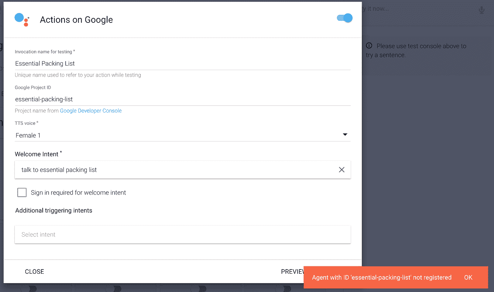

# 不用代码就能为谷歌助手构建动作

> 原文：<https://medium.com/google-cloud/building-actions-for-the-google-assistant-with-no-code-35ad5adb7448?source=collection_archive---------4----------------------->

注意:我是一名负责谷歌助手的产品经理，很高兴看到开发者们开始在谷歌上构建动作。

但不仅仅是开发人员，每个人都是某方面的专家，现在你可以在 Google Home 上通过 Google Assistant 和 API 分享这些专业知识。AI 不需要编码！绝对免费，不到 1 小时。

有三个步骤:

1.  **设计**对话式体验
2.  **开发**API 中的动作。AI(记住，我承诺过，不需要编码，你可以做到这一点！)
3.  **通过谷歌动作控制台发布**动作

让我们开始吧。

点击[https://developers.google.com/actions/develop/conversation](https://developers.google.com/actions/develop/conversation)查看完整文档

# 第一步:设计

首先决定你能与世界分享什么知识、激情或经验。只有几个很适合这种形式的想法:

猫的事实，振奋人心的报价，莎士比亚的侮辱，育儿技巧，律师笑话，历史事实，乐高事实，励志报价，一天的补充，节税提示，海洋的声音，电影报价，算命，股市预测，名人八卦，科学事实，天空是极限…

我们将在这篇文章中探讨的对话格式是一种“一次性”模式。在一次性模式中，最终用户与你的行为对话，你立即带着用户需要的东西返回。当然是 API。AI 支持的远不止这些，但是让我们从简单的开始吧。

我将使用我略知一二的东西作为我们的例子:道格拉斯·亚当斯的《银河系漫游指南》。用户要求从系列图书中随机引用一段话，我的操作返回一段话。因此，对话框看起来像这样:

显然，这是一个非常简单的流程。用户通过说“好吧，谷歌，让我谈谈大多数无害的报价”来访问他们的谷歌主页。然后谷歌助手会向他们介绍你的行动。每次用户谈到这个行动，他们将得到一个不同的报价。

# 第二步:发展

## **转到**[**https://api.ai/**](https://eap.api.ai/)**，创建一个账号，并创建大部分无害的代理。**

现在我们需要一个意图。意图将用户所说的映射到一个动作。默认情况下，我们有两个意图:

**欢迎意向** —当我们的代理被调用时将做出响应

默认回退意图——如果用户说了不被任何其他意图处理的话，将会做出响应

接下来我们需要给出一个用户可以说什么的例子。我们将暂时在用户声明行中明确添加这一点，稍后我们将在谷歌集成上用一些特定的操作来替换这一点。

最后，在删除默认报价后，我们可以在此意向表底部输入我们的第一个报价方式。

现在点击保存，在右边的测试控制台中测试一下。你可以看到，当用户说“与大多数无害的报价交谈”时，他们得到了我们的答案。您甚至可以单击“播放”来听听它的声音。

好，再补充几个例子。我的建议是至少给 10。这些回答是随机给用户的，所以用户每次都有可能得到不同的答案。

这是我添加了几个引号后的意图。

额外收获:想加点音效？和 SSML 打交道很容易。你可以阅读[完整的文档](https://developers.google.com/actions/reference/ssml)，但是，这里有一个在引用的结尾添加一些很酷的声音效果的例子。你也可以让整个响应无非是播放一个声音。

如果你需要帮助将声音文件存储在一个公共场所，请查看[谷歌云存储](https://cloud.google.com/storage/docs/how-to)。

现在我们只需要准备好与谷歌助手集成的意图。为此，请转到“集成”选项卡，并在 Google 上启用操作。

然后我们在 google 元数据上填写动作。我们可以从给出一个调用名(用户将对 google assistant 说什么来与这个动作对话)开始，并将 welcome-intent 设置为我们唯一的意图，方便地命名为 welcome-intent。

现在，有一个小问题要解决。在 welcome intent 的底部，有一个复选框，在我们说出其中一个表达式后，就可以结束对话。(您可能需要点击 Google 上的操作来显示该选项)。

现在只需授权，通过权限流程。然后点击预览，看看这将是什么样子的谷歌主页。

在这一点上，如果你有一个用同样的 Google 身份登录的 Google Home，你可以简单地说:“Ok Google talk to most unless quotes”然后你应该会听到你的一个引用！

你也可以看看网络模拟器。

在这一点上，它看起来很棒！我们应该出版它！

# 第三步:分发

## 你已经建立了一个伟大的行动，是时候确保全世界都能找到它了(至少是拥有 Google Home 的人的世界)。

去 console.developers.google.com[创建一个新项目](https://console.developers.google.com)

给项目取一个有意义的名字，注意项目 ID 对于可读性来说是最重要的，编辑它使之易于输入和记忆。另外，请注意，系统会提示我们输入一个账单账户。这是不需要的。无论你的交通流量有多大，步行都是免费的！

项目创建完成后(大约需要 1 分钟)，你会看到一个很大的 API 列表。您正在寻找“操作 API”。

然后只需点击启用:

切换到目录列表选项卡显示如下:

现在你只需要填写这张表格。这是最终用户发现您的行为的方式。所以花一分钟让它看起来不错。这是我为我的例子想到的。

现在我们只需要公布我们的行动。只需获取项目 ID

并将项目 ID 粘贴到 API 中 Google 项目 ID 字段。你创建的 AI 项目。

然后单击部署！现在你都准备好了。只需等待您的行动被审查和部署。(可能需要几天)。

希望你有乐趣建立一个行动！请给我写信，告诉我你建造了什么。

# 解决纷争

## ID 为“[项目 id]”的代理未注册

为了解决这个问题:

1.  验证您已经从[开发人员控制台准确复制了项目 ID。](https://support.google.com/cloud/answer/6158840?hl=en)

—或者—

1.  确保在目录列表中保存(而不仅仅是输入)列表信息。确保保存/注册时没有错误。您应该会在左下方看到“目录列表已保存”的通知。