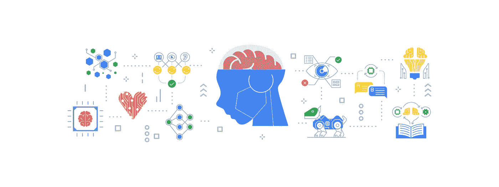

# 培养人工智能人才，加速您的业务发展

> 原文：<https://medium.com/google-cloud/building-ai-talent-to-accelerate-your-business-d66fced7a355?source=collection_archive---------1----------------------->

*(这些见解的所有功劳归于* [*【彼得·格拉博斯基】*](https://www.linkedin.com/in/peter-grabowski-11643334/) *、谷歌奥斯汀网站领导、企业人工智能)*

过去几年，我们在谷歌建立了一个横向人工智能团队，专注于企业应用的机器学习(ML)。这并不容易，但它产生了巨大的影响。通过这一过程，我们发现了拥有一个集中式 ML 团队的多种好处，包括更好地获得人才和提高工程师保留率，更可重用的组织范围的解决方案，以及平衡突发 ML 项目的增强能力。

但是首先——什么是横向人工智能团队，你如何建立一个？

> **为什么是集中的团队？**

数据堆积很容易淹没分析师和产品团队，但也带来了一个机会:如果我们可以利用所有这些数据，使用机器学习来解决一些棘手的大规模问题(如专利分类或标记不适当的内容)，会怎么样？一个专注于将 AI/ML 技术应用于公司范围内问题的中心团队让我们从一个用例中获得经验(帮助法律部门处理大量专利)，并将其带到另一个用例中(为职业发展找到正确的学习课程)。

> **什么是横向 AI 团队？**

横向人工智能团队是一个集中的小组，致力于帮助组织负责任地和富有成效地利用机器学习。我们通过考虑公平性、隐私性和可解释性等因素，帮助确保整个谷歌的业务团队遵守企业机器学习的最佳实践。我们与谷歌研究院合作，将机器学习的最新进展应用于谷歌最重要的商业挑战。最后，我们向全公司的业务领导人建议机器学习最适合他们路线图的地方，帮助他们优先考虑最有影响力的应用。

> **你是如何建立团队的？**

我们的团队是由两个垂直排列的职能 ML 组合并而成的。在这些领域取得显著成功后，我们的职权范围扩大到了谷歌所有的内部企业职能。我们的团队是大型企业基础架构的一部分，为设施、营销、财务和其他职能部门提供支持。

为这个团队招聘人才很有挑战性——这个团队不同于我组建的任何其他团队。传统的 ML 团队通常有一个核心竞争力。例如，你可能有一个团队专门研究自然语言或者主要研究计算机视觉。鉴于我们的广泛职权范围，我们的团队接触到机器学习的所有领域，也包括优化、时间序列分析和异常检测等领域。

因此，我们不得不改变招聘方式。没有一个候选人是我们涵盖的所有领域的专家。我们首先寻找具有强大的应用数学背景和学习新技术历史的候选人。从那里，我们选择在某些领域有经验的候选人，特别是那些我们目前没有专长的领域。招聘后，我们非常重视技术设计审查，这将有效地促进整个团队的知识共享。我们还经常从谷歌内部和外部引入外部演讲者，以确保团队掌握最新最棒的技术。

> **记住三件事**

在建立谷歌首个企业人工智能团队的过程中，我们学到了很多东西——以下是从我们的经历中获得的三个关键收获

> **1:影响是关键**

当你第一次组建团队时，你可能会有很多感兴趣的客户。他们向你推销的一些想法会很棒，而另一些则不太实际。为了帮助整理不可避免的长列表，关注优先级是很重要的。在我们的团队中，我们根据项目可能产生的影响(无论是节省的资金或时间、降低的风险，还是用户满意度的提高)来确定项目的优先级(当然，权衡这些因素本身就是一篇文章！)

> **2:教育，教育，教育**

我们已经开设了一系列广泛的课程，侧重于员工教育，这些课程是为招聘人员、产品经理、工程师和领导设计的。这些课程的价值怎么强调都不为过。帮助人们学习机器学习的基础知识可以让他们更有效地为新项目产生想法。我们发现，当提案来自接受过一定程度的 ML 教育的团体时，我们收到的提案的质量明显更高。

这是有道理的——我们合作的团队都是各自领域的专家，因此他们最有能力突出他们领域中的适当问题。作为一个额外的奖励，机器学习在最近几年变得更加容易接近，所以许多精通技术的团队可能能够在问题框架和工具(如 [AutoML](https://cloud.google.com/automl/docs) )的指导下解决他们自己的问题，让你和你的团队专注于更复杂的问题。

> **3:小心使用人员数据**

最有趣的挑战之一来自于使用人员数据。这些数据特别重要，但也特别敏感，需要格外小心。我们已经确定了各种机器学习的三个关键领域:隐私、公平和可解释性。这些在处理由人产生的数据时尤其重要。像[集成梯度](https://arxiv.org/abs/1703.01365)、[差分隐私](https://developers.googleblog.com/2019/09/enabling-developers-and-organizations.html)、[联合学习](https://ai.googleblog.com/2017/04/federated-learning-collaborative.html)和 [mindiff](https://arxiv.org/pdf/1910.11779.pdf) 这样的技术可以帮助解决这些问题

> 如何开始

走上这条道路可能会很棘手，许多团队都在纠结如何开始。我们努力让所有类型的开发人员和工程师都可以使用我们的云人工智能产品，所以你可以在没有太多准备时间的情况下测试人工智能工具。开始使用 ML 最棘手的事情之一是超参数调整和模型训练可能非常困难。

至少，对人类来说很难。

所以我们设置我们的人工智能来解决这个问题，现在你可以自己在语言、图像、视频或结构化数据集中使用这些产品。尝试 [AutoML](https://cloud.google.com/automl) 并训练你自己的私人模型，这些模型基于谷歌在结构化数据和自调整模型方面的工作。