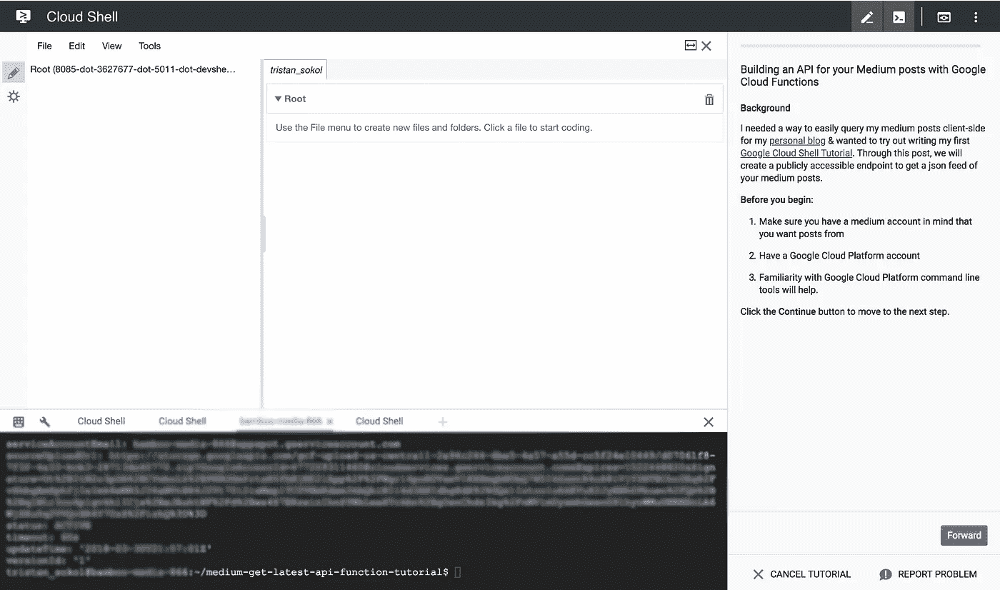

# 用谷歌云功能为你的中型文章建立一个 API

> 原文：<https://medium.com/google-cloud/building-an-api-for-your-medium-posts-with-google-cloud-functions-cafdd32359df?source=collection_archive---------0----------------------->

## 我需要一种方法来轻松地在客户端查询我的个人博客&中的帖子，我想尝试编写我的第一个 [Google Cloud Shell 教程](https://cloud.google.com/shell/docs/tutorials)。通过这篇文章，我们将创建一个可公开访问的端点来获取您的中型文章的 json 提要。

这篇文章是最好的谷歌云外壳教程:

[](https://console.cloud.google.com/cloudshell/open?git_repo=https://github.com/tristansokol/medium-get-latest-api-function-tutorial&page=editor&tutorial=tutorial.md)

**开始之前** :
*确保你有一个中型账户，你想从
发帖*有一个谷歌云平台账户
*熟悉谷歌云平台命令行工具会有帮助。



## Medium 不是已经有 API 了吗？

是啊！Medium 有一个 API ,似乎主要是为了让你发布帖子而设计的。这对我获取内容没有太大帮助。真正有用的是未记录的`json`格式，你可以在任何一个媒体页面上申请。您所需要做的就是将`?format=json`追加到您的请求中。对我来说，我的最新帖子列在了`[https://medium.com/@tristansokol/latest](https://medium.com/@tristansokol/latest)`上，而`[https://medium.com/@tristansokol/latest?format=json](https://medium.com/@tristansokol/latest?format=json)`以一种有点方便的`json`格式保存了所有这些信息。我没有把它放入我的页面的唯一原因是 Medium 在 json ( `). Oh well, nobo` dy 可以停止 determination & javascript)前添加了明确的预防措施！

## 设置 Google 云

首先，您需要设定当前的云项目。

```
gcloud config set project YOUR_PROJECT_NAME
```

接下来，使用如下命令查看您的项目是否启用了云功能:

```
gcloud functions list
```

如果不是，您应该会得到这样的回应

```
API [cloudfunctions.googleapis.com] not enabled on project
[single-cirrus-142722]. Would you like to enable and retry? (y/N)?
```

一个简单的`y`将启用适当的 API。

## 代码

看一看`index.js`。

你可以使用云壳的内置文本编辑器编辑存储在云壳中的文件，这不是很棒吗？代码非常简单，基本上是一个包装单个请求的包装器，去掉了跨站点防护。

```
exports.getLatest = (req, res) => {
 let username = ‘yourusername’;
 request(‘[https://medium.com/@'](/@') + username + ‘/latest?format=json’, function(error, response, body) {
 res.send(JSON.parse(body.substring(16)));
 });
};
```

将用户名编辑为您的中型用户名！

## 部署功能

将用户名保存到`index.js`后，使用以下命令部署您的功能:

```
gcloud functions deploy getLatest — trigger-http
```

大 G 通过读取`package.json`来处理你所有的依赖项，所以你不必担心上传任何其他东西。

## 调用您的新 API！

部署完成后，您应该会看到类似如下的输出

```
httpsTrigger:
 url: [https://us-central1-super-burrito-212121.cloudfunctions.net/getLatest](https://us-central1-super-burrito-212121.cloudfunctions.net/getLatest)
```

然后您可以尝试您的新 API:

```
curl [https://us-central1-super-burrito-212121.cloudfunctions.net/getLatest](https://us-central1-super-burrito-212121.cloudfunctions.net/getLatest)
```

你应该会得到一堆关于你在 Medium 上的最新帖子的 json。