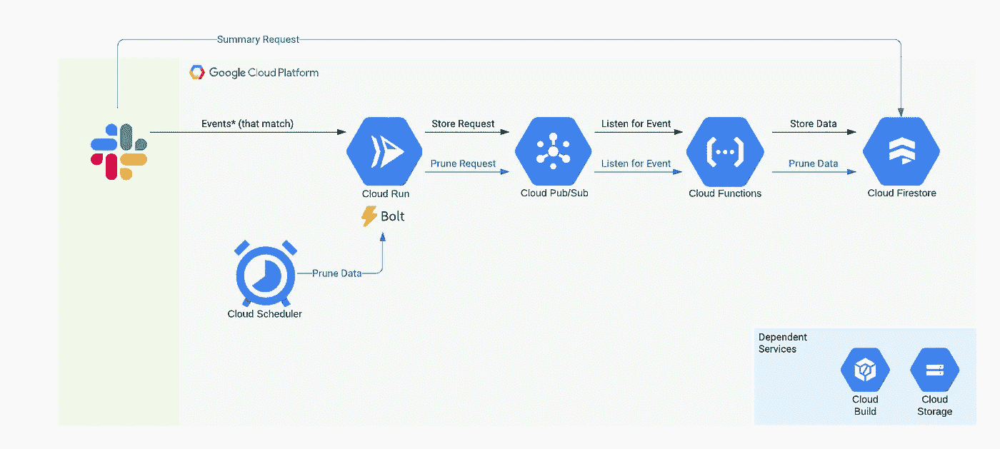

# 在 GCP 上构建一个异步事件驱动的 Slack Bot 用于工程支持

> 原文：<https://medium.com/google-cloud/building-an-async-event-driven-slack-bot-on-gcp-for-engineering-support-d84ecf5243da?source=collection_archive---------0----------------------->

从创意到发布在 Slack 的应用目录中，只需几个步骤。

*这假设合理熟悉*[*Bolt*](https://slack.dev/bolt-js/tutorial/getting-started)*(Slack 的 JavaScript 框架)和 Slack 中的工程支持渠道。*

# 我们将建造什么

架构总结

# 背景