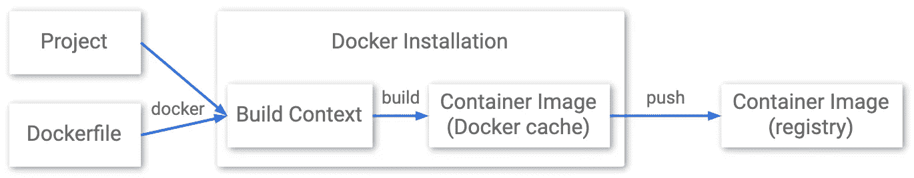
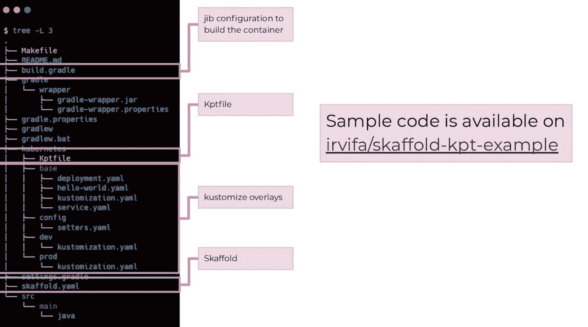
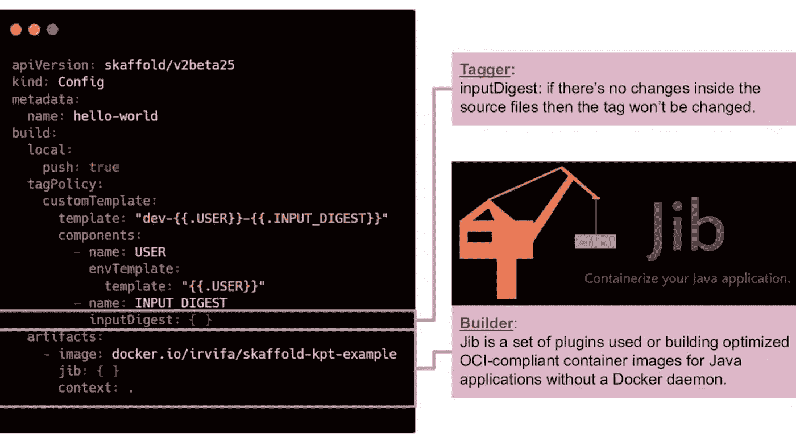
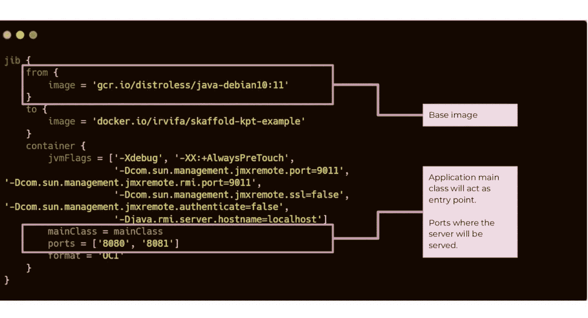
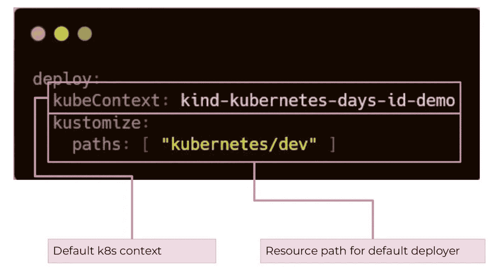
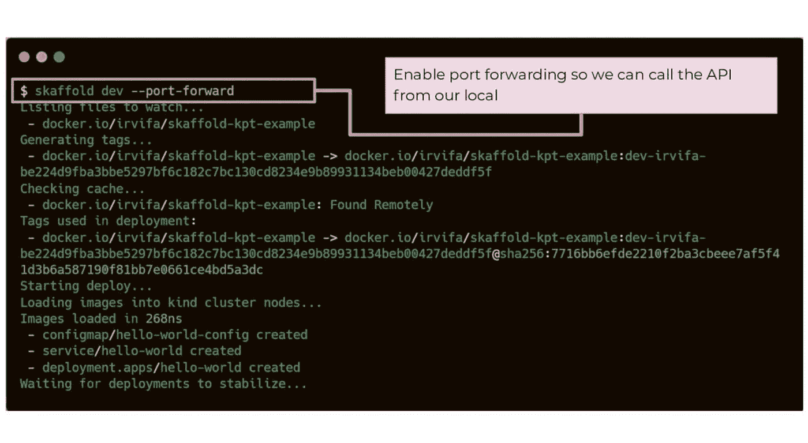
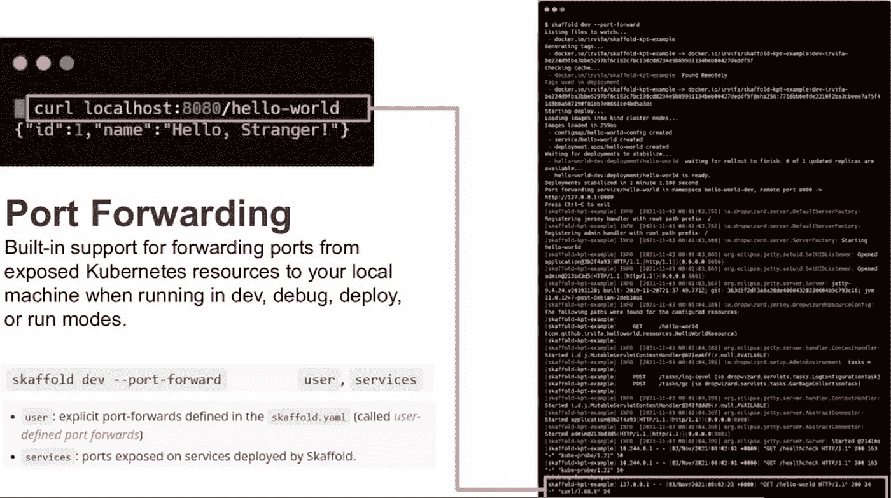
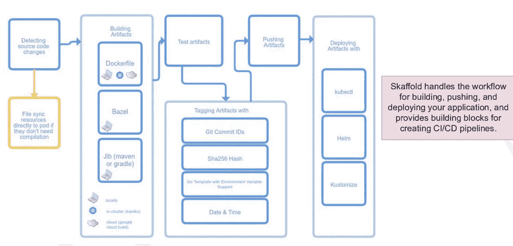

# 使用 Jib 和 Skaffold 在 Kubernetes 上构建和部署容器化的应用程序

> 原文：<https://medium.com/google-cloud/building-and-deploying-containerized-application-to-kubernetes-using-jib-and-skaffold-80305363a8fd?source=collection_archive---------0----------------------->

Jib 允许 Java/Kotlin 开发人员通过在构建脚本上添加插件，使用他们选择的工具(如 Maven 或 Gradle)来集成容器化步骤。Jib 基本上处理将应用程序打包到 Dockerimage 中的所有步骤，而不使用 Dockerfile🎉。



上图:Docker 工作流程。下图:Jib 工作流程[1]

那么 Jib 到底是怎么做的呢？

Jib 创建了一组文件系统层，其中包含 Java 运行时、应用程序及其所有依赖项，以及容器引擎用来了解如何启动 Java 虚拟机(JVM)的元数据。当使用 Jib 构建容器时，我们可以看到下面的层:

*   构建脚本中定义的库依赖项(mvn 或 gradle)。该层包含将所有的`.jar`文件添加到`/app/libs`文件夹。
*   资源文件。我们可以从资源文件夹中看到`/app/resources`和所有相关的文件。
*   编译后的应用程序代码中的类文件。来自编译阶段的`.class`文件位于`/app/classes`下的这一层。
*   Java JVM 参数文件。

取决于你如何定制你的构建文件，Jib 生成的库也可以有其他层，见 [Jib 常见问题](https://github.com/GoogleContainerTools/jib/blob/master/docs/faq.md#how-are-jib-applications-layered)。

在这篇文章中，我想分享我们如何使用 Dropwizard、Gradle、Jib 和 Skaffold 创建 Java 应用程序。



项目的目录设置。

对于这个项目，我们将在工件部分定义构建图像所需的所有配置。除此之外，skaffold 还支持许多您可以使用标记机制，例如我们将在示例中使用的 INPUT_DIGEST。



部署的 Skaffold 配置。



build.gradle 脚本的内容。当我们仔细查看它时，我们会注意到它实际上与 docker 文件中需要编写的所有内容非常相似。

请注意，为了能够将图像推送到注册表，我们可以使用一个助手方法，如 [Jib 常见问题解答中所述。](https://github.com/GoogleContainerTools/jib/blob/master/docs/faq.md)默认情况下，Jib 会查看以下位置，以在将映像推入容器注册表之前查看可用的凭据:

*   Docker 凭证文件(由 docker 登录或 podman 登录生成),位于:

```
$XDG_RUNTIME_DIR/containers/auth.json, $XDG_CONFIG_HOME/containers/auth.json or $HOME/.config/containers/auth.json$DOCKER_CONFIG/config.json$HOME/.docker/config.json.
```

这是 docker 或 podman 命令行工具的配置文件之一。有关如何配置 auth，请参见配置文件文档、凭据存储和凭据帮助器部分。例如，您可以进行 docker 登录以在 config.json 中保存 auth，但是通常建议配置一个凭据帮助器(也可以在 config.json 中配置)。

如果 Jib 能够从 Docker 凭证文件中检索 auth 信息，您应该会看到类似于使用 Docker 配置中的凭证(/home/myuser/)的日志消息。docker/config.json)，您可以在这里验证 Jib 选择了哪个凭证文件。

*   悬臂配置

```
Configuring credential helpers: <from/to><credHelper> (Maven) / from/to.credHelper (Gradle)
 Specific credentials (not recommend): <from/to><auth><username>/<password> or in settings.xml (Maven) / from/to.auth.username/password (Gradle)
 These parameters can also be set through properties: Maven / Gradle
```



在 skaffold.yaml 上定义我们想要部署清单的 k8s 上下文

在开发我们的应用程序时，我们也可以运行下面的命令来测试是否使用 Skaffold 正确地进行了更改



使用端口转发运行清单



斯卡福德建筑

使用 skaffold，我们还可以为我们拥有的每个环境定义不同的构建步骤。例如，对于开发和生产环境，我们有不同的清单，我们可以将其定义如下:

```
deploy:
  kubeContext: kind-kubernetes-days-id-demo
  kustomize:
    paths: [ "kubernetes/dev" ]
profiles:
  - name: prod
    deploy:
      kustomize:
        paths: [ "kubernetes/prod" ]
    patches:
      - op: replace
        path: /build/tagPolicy
        value:
          inputDigest: { }
      - op: remove
        path: /build/artifacts/0/hooks
```

参考资料:

[1]谷歌。(未注明)。*用 jib | google cloud* 构建 java 容器。谷歌。检索于 2022 年 8 月 18 日，发自 https://cloud.google.com/java/getting-started/jib

[2] *建筑与设计*。斯卡福德。(未注明)。于 2022 年 8 月 18 日从[https://skaffold.dev/docs/design/](https://skaffold.dev/docs/design/)检索

[3]谷歌。(未注明)。*介绍 jib —更好地构建 Java Docker 映像|谷歌云博客*。谷歌。2022 年 8 月 18 日检索，来自[https://cloud . Google . com/blog/products/application-development/introducing-jib-build-Java-docker-images-better](https://cloud.google.com/blog/products/application-development/introducing-jib-build-java-docker-images-better)