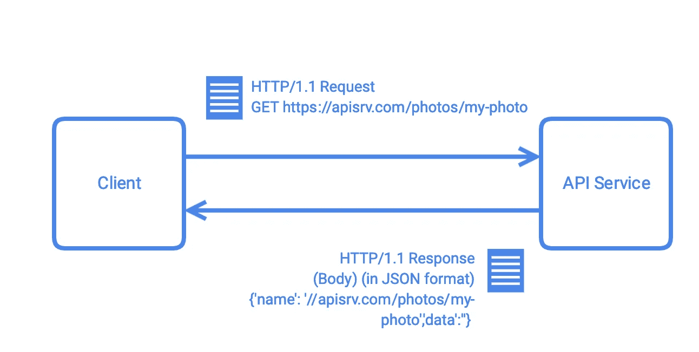
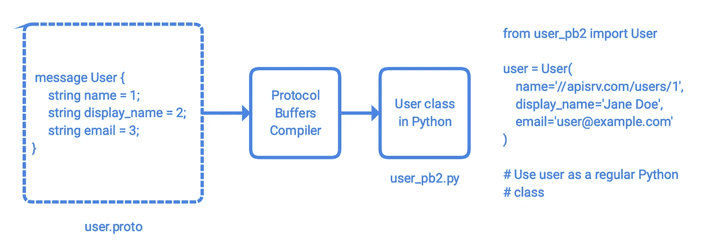
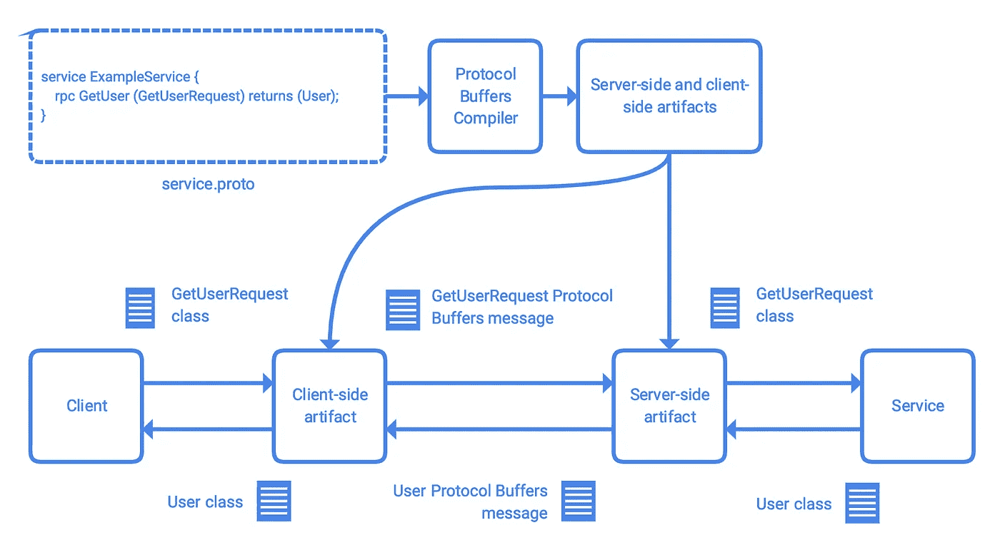

# 构建 API 服务:初学者指南

> 原文：<https://medium.com/google-cloud/building-api-services-a-beginners-guide-7274ae4c547f?source=collection_archive---------0----------------------->

> 最后更新:2019 年 2 月 25 日

本文概述了构建 HTTP RESTful 和/或 gRPC API 服务的一般实践和技术。它是[构建 API 服务:初学者指南](/@ratrosy/building-api-services-a-beginners-guide-7274ae4c547f)教程系列的开篇。

# 入门指南

*API*是一组促进软件组件之间通信的方法，允许系统检索信息或指示另一个软件执行某些操作。例如，当您打开此页面时，您正在使用的浏览器会调用大量操作系统 API，以便它可以连接到网络，处理 HTML 源代码并将其显示在屏幕上。由于移动计算和云技术的日益普及，如今当人们谈论 API 时，他们通常指的是*联网 API*，即跨设备网络运行的 API，如[谷歌定制搜索](https://developers.google.com/custom-search/docs/tutorial/introduction)。在本教程系列中，术语 *API* 和*网络 API* 可以互换使用。

听起来可能很复杂，但创建一个基本的 API 服务实际上非常容易。下面的代码片段使用 [Python](https://www.python.org/) 和 [Flask](http://flask.pocoo.org/) 定义了一个 API 服务，允许每个人检索预定义的用户列表:

如果您只是在进行原型开发，这样一个基本的 API 服务就足够了。然而，构建一个生产就绪的 API 服务需要更多的工程工作。一般来说，您需要:

*   设计 API 时要考虑简单性、一致性、可发现性和可用性
*   准备服务器端(和客户端)应用程序和库，最好使用自动化工作流
*   设置授权和身份验证

此外，您应该:

*   将您的 API 服务部署到一个安全、可伸缩且高度可用的平台上
*   设置日志记录、监控和跟踪，以保持 API 服务正常运行
*   设置配额和流量管理策略来控制溢出
*   设置数据分析以收集使用情况洞察
*   提供易于理解的文档和支持材料

本系列教程主要关注构建 API 服务。我们将在另一个时间更多地讨论 API 服务部署和管理。

# 技术

有许多协议、工具和框架可以用来创建 API 服务。在本系列教程中，您将了解两种主要类型的 API，HTTP REST APIs 和 gPRC APIs，以及可以帮助您构建它们的工具。

## REST、HTTP RESTful APIs 和 OpenAPI

*具象状态转移* (REST)是一种描述 web 交互模型的架构风格。它遵循*面向资源的设计*，将服务分解为一组资源和一组可用于操作资源的方法(动词)。每个资源都被分配了一个资源名称，并以开发人员选择的格式表示。例如，要检索一张照片，客户机可以在请求中指定一个资源名称和一个方法(GET ),并将请求发送给服务器；然后，服务器将以指定的格式将请求的资源返回给客户端:

符合 *REST* 并使用 HTTP 协议(通常是 HTTP/1.1)的 API 是 HTTP RESTful APIs。开发人员经常使用数据格式 [JSON](https://www.json.org/) (JavaScript 对象符号)和/或 [XML](https://en.wikipedia.org/wiki/XML) (可扩展标记语言)在 HTTP REST APIs 中传输数据。你可以使用任何 web 框架来构建 HTTP REST API 服务，流行的选择包括 [flask](http://flask.pocoo.org/) (Python)和[express . js](https://expressjs.com/)(Javascript/node . js)。

您可以像开发 web 应用程序一样一点一点地构建 HTTP RESTful API 服务；然而，许多开发人员发现将任务留给计算机更容易。有了 API 服务的规范，许多工具可以自动为您准备服务器端和客户端代码。这种方法极大地减少了开发工作量，也有助于客户更好地使用您的 API。在本教程中，您将使用 [OpenAPI 3.0](https://www.openapis.org/) 来指定您的 API，并使用 [OpenAPI 生成器](https://github.com/OpenAPITools/openapi-generator)来准备代码。

OpenAPI 是机器可读的 HTTP RESTful APIs 的规范，允许开发者用 YAML 或 JSON 描述他们的 API。它由 [OpenAPI Initiative](https://www.openapis.org/about) 管理，这是 Linux 基金会下的一个开源合作项目。OpenAPI Generator 是一个社区驱动的开源工具，它读取您的 OpenAPI 规范，并为您准备服务器端和客户端工件。

## gRPC 和协议缓冲区

[gRPC](https://grpc.io/) 是 Google 开发的开源 RPC 框架。它使用 HTTP/2 进行传输，并提供许多有用的功能，如双向流和集成认证。使用 gRPC 框架的 API 就是 gRPC APIs。建议 gRPC APIs 也采用面向资源的设计作为架构风格。

gRPC APIs 通常利用[协议缓冲区](https://developers.google.com/protocol-buffers/)来交换数据。Protocol Buffers 类似于 JSON 和 XML，是 Google 开发的用于数据序列化的开源机制。序列化过程要求您首先使用协议缓冲语言(`.proto`文件语法)在`.proto`文件中指定数据的结构；这一步也称为定义协议缓冲区消息类型。Protocol Buffers compiler 然后可以读取`.proto`文件，并用您选择的语言将您的数据结构编译成一个类，您可以用它来以编程方式操作您的数据。

gRPC 为 Protocol Buffers compiler 提供了一个特殊的插件，除了数据类之外，它还可以进一步将`.proto`文件编译成 gRPC API 服务的服务器端和客户端构件。要使用这个插件，您需要将服务定义添加到您的`.proto`文件中，它描述了您的 gRPC APIs。每个 gRPC API 将一种协议缓冲区消息类型作为输入(请求)，将另一种协议缓冲区消息类型作为输出(响应)。

## 我应该使用哪些技术？

HTTP RESTful API 非常受欢迎，因为它几乎可以在所有环境中很好地工作:只要环境能够连接到 API 端点并发出 HTTP 请求，它就可以使用 API 服务。然而，HTTP/1.1 的特性严重限制了 HTTP RESTful APIs 的性能:如果您计划流式传输一些媒体内容，HTTP REST API 几乎不是一个好的选择。

另一方面，gRPC APIs 通常比 HTTP RESTful APIs 性能好得多，并且提供了许多附加特性，比如流和可扩展认证。但是，gRPC 框架可能无法在您的目标环境中工作，并且运行 API 服务的平台可能不支持传入的 gRPC 连接。

如果您选择在您的项目中使用 gRPC，只需付出一点额外的努力，您就可以享受 gRPC APIs 的高性能和 HTTP RESTful APIs 的兼容性。gRPC 社区提供了一个网关解决方案，能够同时将标准的 HTTP RESTful API 请求转换为 gRPC 请求。启用 [gRPC 网关](https://github.com/grpc-ecosystem/grpc-gateway)后，您可以在服务中提供对 HTTP RESTful APIs 和 gRPC APIs 的支持。

# 下一步是什么

本系列包含一系列指南和教程。请参见下面的主题列表:

*   [设计 API](/@ratrosy/designing-apis-4eed43409f93)
*   [API 服务中的授权和认证](/@ratrosy/authorization-and-authentication-in-api-services-9b4db295a35b)

## 带 OpenAPI 的 HTTP RESTful APIs

*   [用 OpenAPI 构建 API](/@ratrosy/building-apis-with-openapi-ac3c24e33ee3)
*   [使用 OpenAPI 构建 API:续](/@ratrosy/building-apis-with-openapi-continued-5d0faaed32eb)
*   用 OpenAPI 构建 API:认证*(进行中)*
*   用 OpenAPI 构建 API:版本控制*(进行中)*

## gRPC APIs

*   [使用 gRPC 构建 API](/@ratrosy/building-apis-with-grpc-50842234aec8)
*   [使用 gRPC 构建 API:续](/@ratrosy/building-apis-with-grpc-continued-f53b5a5ab850)
*   使用 gRPC 构建 API:认证*(进行中)*
*   用 gRPC 构建 API:版本控制*(进行中)*