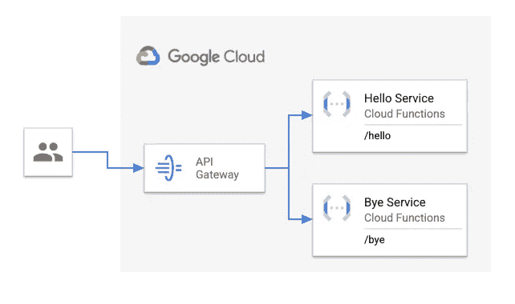

# 使用云功能和 API 网关构建 API

> 原文：<https://medium.com/google-cloud/building-apis-with-cloud-functions-and-api-gateway-3892e1301cb4?source=collection_archive---------1----------------------->

# 使用云运行构建 API

如果我想构建一个 API，我通常会使用云运行。在云运行中，您运行一个容器，在该容器中，您运行一个处理以下格式的基本 URL 的 web 服务器:

```
https://<service-name>-<hash>-<region>.a.run.app
```

然后，您可以让 web 服务器处理该基本 URL 下的任何路径，例如:

```
https://<service-name>-<hash>-<region>.a.run.app/hello https://<service-name>-<hash>-<region>.a.run.app/bye
```

# 构建具有云功能的 API

在云函数中，您只能访问一个函数(没有 web 服务器),并且该函数只能处理基本路径:

```
https://<region>-<project>.cloudfunctions.net/<function>
```

该基本路径下不能有其他路径。这是**一任务一功能**设计的云功能。

这是否意味着不能使用云函数构建多路径 API？不一定。

# 变通办法

[我们的云 GDE Guillaume Blaquiere](https://twitter.com/gblaquiere)讲述了 Python 中的几个变通方法，并继续讲述了如何在云函数中处理多个路径:

*   [在云函数、Python 和 Flask 中使用多路径](/google-cloud/use-multiple-paths-in-cloud-functions-python-and-flask-fc6780e560d3)
*   [Hack:使用云功能作为 Golang 的网络服务器](/google-cloud/hack-use-cloud-functions-as-a-webserver-with-golang-42edc7935247)

我的同事 [Guillaume Laforge](https://twitter.com/glaforge) 也谈到了如何在 Node.js/Express 应用和云功能中实现多路径:

*   [无服务器提示#7 —创建具有云功能和快速路由的迷你 API](https://glaforge.appspot.com/article/serverless-tip-7-create-mini-apis-with-cloud-functions-and-express-routing)

如果你想在一个单一的云功能中找到一个简单的解决方案，这些可能是可行的，但是它们只是权宜之计，有点违背云功能的设计。

# API 网关

更好的方法是使用 [API 网关](https://cloud.google.com/api-gateway)。您让每个云函数处理单个路径，并让 API Gateway 根据您定义的规则路由子路径:



你可以查看我的[cloud-functions-API](https://github.com/meteatamel/cloud-functions-api)repo，了解如何设置的细节，但它涉及 4 个步骤:

1.  部署两个功能`helloWorld`和`byeWorld`。
2.  创建一个 API。
3.  使用 OpenAPI 规范创建 API 配置，以定义哪个路径指向哪个函数。
4.  将 API 配置部署到网关。

API 配置文件[open API 2-functions . YAML](https://github.com/meteatamel/cloud-functions-api/blob/main/openapi2-functions.yaml)定义路径如下:

```
paths:
  /hello:
    get:
      summary: Greet a user
      operationId: hello
      x-google-backend:
        address: [https://REGION-PROJECT_ID.cloudfunctions.net/helloWorld](https://REGION-PROJECT_ID.cloudfunctions.net/helloWorld)
      responses:
        '200':
          description: A successful response
          schema:
            type: string
  /bye:
    get:
      summary: Greet a user
      operationId: bye
      x-google-backend:
        address: [https://REGION-PROJECT_ID.cloudfunctions.net/byeWorld](https://REGION-PROJECT_ID.cloudfunctions.net/byeWorld)
      responses:
        '200':
          description: A successful response
          schema:
            type: string
```

有了这个设置，您就有了一个由两个云功能支持的 API，并由 API 网关提供支持:

```
# Test hello
curl [https://greeter-gateway-5abbajef.ew.gateway.dev/hello](https://greeter-gateway-5abbajef.ew.gateway.dev/hello)
Hello, World# Test bye
curl [https://greeter-gateway-5abbajef.ew.gateway.dev/bye](https://greeter-gateway-5abbajef.ew.gateway.dev/bye)
Bye, World
```

如有任何问题/反馈，请随时通过 Twitter [@meteatamel](https://twitter.com/meteatamel) 联系我。

*最初发布于*[*https://atamel . dev*](https://atamel.dev/posts/2022/02-10_cloud_functions_api_gateway/)*。*